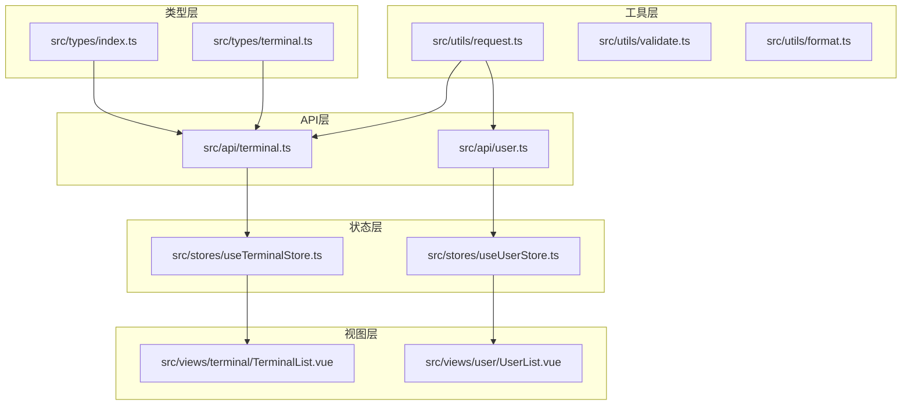
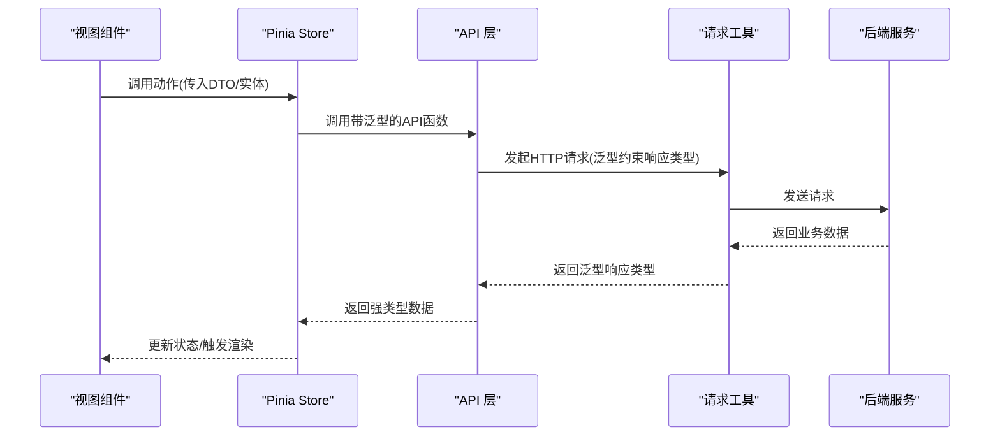
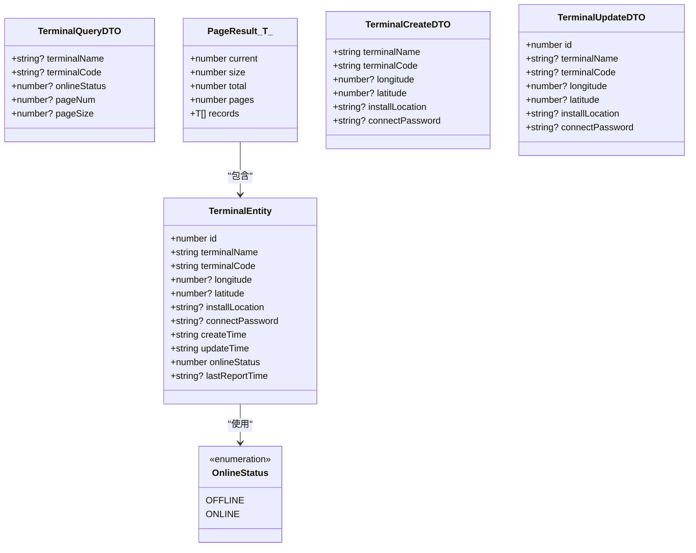
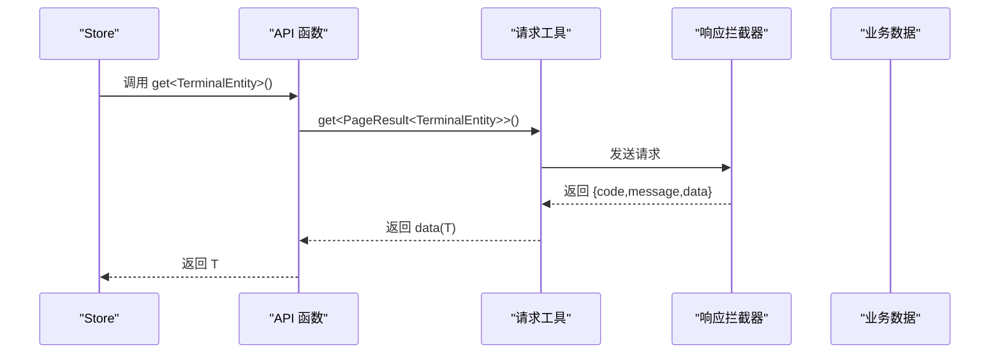
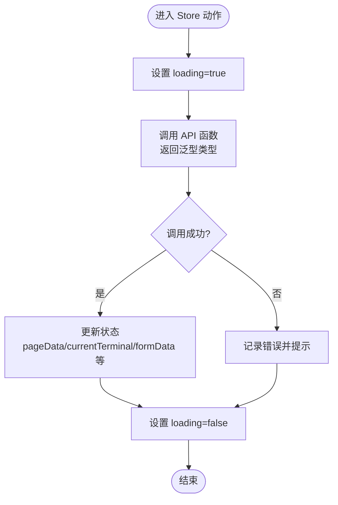
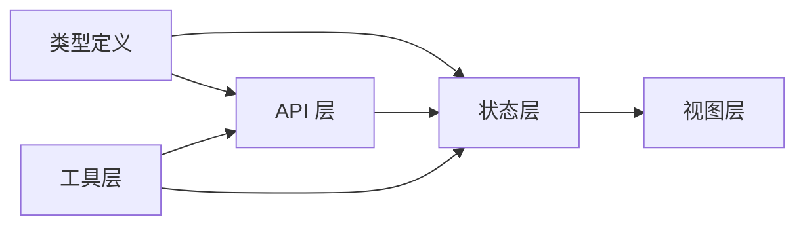

# 类型安全设计

<cite>
**本文档引用的文件**
- [src/types/index.ts](file://src/types/index.ts)
- [src/types/terminal.ts](file://src/types/terminal.ts)
- [src/api/terminal.ts](file://src/api/terminal.ts)
- [src/api/user.ts](file://src/api/user.ts)
- [src/stores/useTerminalStore.ts](file://src/stores/useTerminalStore.ts)
- [src/stores/useUserStore.ts](file://src/stores/useUserStore.ts)
- [src/utils/request.ts](file://src/utils/request.ts)
- [src/utils/validate.ts](file://src/utils/validate.ts)
- [src/utils/format.ts](file://src/utils/format.ts)
- [src/views/terminal/TerminalList.vue](file://src/views/terminal/TerminalList.vue)
- [src/views/user/UserList.vue](file://src/views/user/UserList.vue)
- [tsconfig.json](file://tsconfig.json)
</cite>

## 目录
1. [简介](#简介)
2. [项目结构](#项目结构)
3. [核心组件](#核心组件)
4. [架构总览](#架构总览)
5. [详细组件分析](#详细组件分析)
6. [依赖关系分析](#依赖关系分析)
7. [性能考虑](#性能考虑)
8. [故障排除指南](#故障排除指南)
9. [结论](#结论)
10. [附录](#附录)

## 简介
本文件系统性阐述 Hydro Monitor 前端项目的类型安全设计，重点覆盖 TypeScript 类型的组织结构、设计原则、核心类型定义（用户实体、终端设备、API 响应等）、最佳实践与命名约定、泛型类型使用、类型推断与类型守卫、类型断言的安全实践、以及通过类型系统提升代码质量与开发效率的方法论。同时提供维护指南、扩展方案与版本升级中的类型兼容性策略。

## 项目结构
项目采用分层与按功能域划分的类型组织方式：
- 类型定义集中于 `src/types/`，包含通用响应、枚举、主题配置以及终端实体类型等。
- API 层位于 `src/api/`，统一导出 DTO 与响应类型，并通过泛型约束确保请求/响应一致性。
- 状态管理层位于 `src/stores/`，使用 Pinia Store 将类型注入到状态与动作中，保证跨模块的数据一致性。
- 工具层位于 `src/utils/`，提供类型安全的通用工具函数，如防抖、节流、深拷贝等。
- 视图层位于 `src/views/`，通过模板与类型注解确保组件交互的类型安全。

图表来源
- [src/types/index.ts:1-51](file://src/types/index.ts#L1-L51)
- [src/types/terminal.ts:1-84](file://src/types/terminal.ts#L1-L84)
- [src/api/terminal.ts:1-59](file://src/api/terminal.ts#L1-L59)
- [src/api/user.ts:1-179](file://src/api/user.ts#L1-L179)
- [src/stores/useTerminalStore.ts:1-294](file://src/stores/useTerminalStore.ts#L1-L294)
- [src/stores/useUserStore.ts:1-200](file://src/stores/useUserStore.ts#L1-L200)
- [src/utils/request.ts:1-180](file://src/utils/request.ts#L1-L180)
- [src/views/terminal/TerminalList.vue:1-200](file://src/views/terminal/TerminalList.vue#L1-L200)
- [src/views/user/UserList.vue:1-200](file://src/views/user/UserList.vue#L1-L200)

章节来源
- [src/types/index.ts:1-51](file://src/types/index.ts#L1-L51)
- [src/types/terminal.ts:1-84](file://src/types/terminal.ts#L1-L84)
- [src/api/terminal.ts:1-59](file://src/api/terminal.ts#L1-L59)
- [src/api/user.ts:1-179](file://src/api/user.ts#L1-L179)
- [src/stores/useTerminalStore.ts:1-294](file://src/stores/useTerminalStore.ts#L1-L294)
- [src/stores/useUserStore.ts:1-200](file://src/stores/useUserStore.ts#L1-L200)
- [src/utils/request.ts:1-180](file://src/utils/request.ts#L1-L180)
- [src/views/terminal/TerminalList.vue:1-200](file://src/views/terminal/TerminalList.vue#L1-L200)
- [src/views/user/UserList.vue:1-200](file://src/views/user/UserList.vue#L1-L200)

## 核心组件
本节聚焦类型系统的三大核心领域：通用响应与分页、实体模型与查询 DTO、枚举与配置。

- 通用响应与分页
  - 通用响应接口封装业务状态码、消息与数据体，便于统一处理与类型推断。
  - 分页参数与分页响应接口保持一致的字段语义，避免跨模块的字段错配。
- 实体模型与查询 DTO
  - 终端实体与用户实体分别定义完整信息、查询参数、创建/更新 DTO，确保 API 交互的强类型约束。
  - 在线状态、用户状态、角色等枚举统一管理，减少魔法值。
- 枚举与配置
  - 主题风格枚举与主题配置接口分离，便于主题切换与样式管理。

章节来源
- [src/types/index.ts:1-51](file://src/types/index.ts#L1-L51)
- [src/types/terminal.ts:1-84](file://src/types/terminal.ts#L1-L84)

## 架构总览
类型安全贯穿“类型定义 → API 层 → 状态层 → 视图层”的全链路，形成闭环的类型约束与校验机制。

图表来源
- [src/stores/useTerminalStore.ts:69-136](file://src/stores/useTerminalStore.ts#L69-L136)
- [src/api/terminal.ts:16-38](file://src/api/terminal.ts#L16-L38)
- [src/utils/request.ts:155-177](file://src/utils/request.ts#L155-L177)

## 详细组件分析

### 通用响应与分页类型
- 通用响应接口
  - 设计要点：统一 code/message/data 结构，泛型承载具体数据类型，便于上层直接消费业务数据。
  - 使用场景：API 层通过泛型约束返回类型，状态层直接接收业务数据，避免重复解包。
- 分页参数与分页响应
  - 设计要点：分页参数与分页响应字段对齐，支持前后端一致的分页协议。
  - 使用场景：列表页面统一使用分页类型，确保排序、筛选、跳页逻辑的类型安全。

章节来源
- [src/types/index.ts:1-20](file://src/types/index.ts#L1-L20)
- [src/utils/request.ts:5-10](file://src/utils/request.ts#L5-L10)

### 终端实体与查询类型
- 终端实体
  - 设计要点：必填字段明确，可选字段标注可空，时间戳字段统一为字符串，避免时区与解析差异。
  - 使用场景：列表展示、详情查看、创建/更新表单绑定。
- 查询参数与分页结果
  - 设计要点：查询参数与后端 API 文档严格对齐；分页结果包含 current/size/total/pages/records，便于 UI 组件直接消费。
- 创建/更新 DTO
  - 设计要点：创建 DTO 强制必填字段，更新 DTO 支持部分字段更新；通过联合类型与可选字段实现灵活约束。
- 在线状态枚举
  - 设计要点：离线/在线两种状态，配合 UI 标签与状态切换控件使用。

图表来源
- [src/types/terminal.ts:6-83](file://src/types/terminal.ts#L6-L83)

章节来源
- [src/types/terminal.ts:1-84](file://src/types/terminal.ts#L1-L84)

### 用户实体与认证类型
- 用户实体与 VO
  - 设计要点：UserEntity 包含密码字段（仅后端返回），UserVO 用于列表展示，避免敏感信息泄露。
  - 大整数处理：id 使用 string|number 兼容后端 int64，避免精度丢失。
- 登录请求与响应
  - 设计要点：LoginRequest/LoginResponse 明确认证流程的输入输出类型。
- 查询与分页
  - 设计要点：UserQueryDTO 与 PageResult<UserVO> 保持与 API 文档一致，确保列表页类型安全。
- 创建/更新 DTO
  - 设计要点：UserCreateDTO/UserUpdateDTO 明确必填与可选字段，支持部分更新。

章节来源
- [src/api/user.ts:1-179](file://src/api/user.ts#L1-L179)

### API 层与类型约束
- 泛型约束
  - API 函数通过泛型约束返回类型，确保调用方获得精确的业务数据类型。
  - 例如：get<T>()、post<T>()、put<T>()、del<T>() 直接返回 T，避免重复解包。
- 响应拦截器
  - 响应拦截器统一返回 res.data，API 层无需再次解包，简化调用链。
- 错误处理
  - 业务状态码与 HTTP 状态码分别处理，统一错误提示与 Token 失效处理。

图表来源
- [src/api/terminal.ts:16-38](file://src/api/terminal.ts#L16-L38)
- [src/utils/request.ts:96-116](file://src/utils/request.ts#L96-L116)

章节来源
- [src/api/terminal.ts:1-59](file://src/api/terminal.ts#L1-L59)
- [src/api/user.ts:1-179](file://src/api/user.ts#L1-L179)
- [src/utils/request.ts:1-180](file://src/utils/request.ts#L1-L180)

### 状态层与类型注入
- 终端 Store
  - 设计要点：将类型注入到状态（reactive/ref）、动作参数与返回值，确保状态变更与 API 调用的类型一致性。
  - 查询参数与分页数据使用泛型 PageResult<TerminalEntity>，UI 组件直接消费。
- 用户 Store
  - 设计要点：UserInfo 与 UserEntity 的区分，避免敏感信息进入本地存储；token 解析与默认用户信息设置增强健壮性。

图表来源
- [src/stores/useTerminalStore.ts:72-93](file://src/stores/useTerminalStore.ts#L72-L93)
- [src/stores/useUserStore.ts:61-83](file://src/stores/useUserStore.ts#L61-L83)

章节来源
- [src/stores/useTerminalStore.ts:1-294](file://src/stores/useTerminalStore.ts#L1-L294)
- [src/stores/useUserStore.ts:1-200](file://src/stores/useUserStore.ts#L1-L200)

### 视图层与类型注解
- 终端列表
  - 设计要点：查询参数与表单数据绑定到类型化的 store 状态；表格列直接消费实体字段，确保类型安全。
- 用户列表
  - 设计要点：用户 VO 与状态绑定，开关状态与分页逻辑类型明确；表单提交时使用 DTO 类型约束。

章节来源
- [src/views/terminal/TerminalList.vue:1-200](file://src/views/terminal/TerminalList.vue#L1-L200)
- [src/views/user/UserList.vue:1-200](file://src/views/user/UserList.vue#L1-L200)

### 工具层与类型安全
- 请求工具
  - 设计要点：预处理大整数避免精度丢失；统一响应拦截器返回业务数据；泛型约束确保返回类型精确。
- 验证工具
  - 设计要点：邮箱、手机号、密码强度与空值验证，返回布尔值，便于条件渲染与表单校验。
- 格式化工具
  - 设计要点：防抖/节流使用泛型保留函数签名；深拷贝支持任意类型；日期时间格式化统一输出字符串。

章节来源
- [src/utils/request.ts:1-180](file://src/utils/request.ts#L1-L180)
- [src/utils/validate.ts:1-36](file://src/utils/validate.ts#L1-L36)
- [src/utils/format.ts:1-102](file://src/utils/format.ts#L1-L102)

## 依赖关系分析
类型系统在各层之间的耦合与协作如下：
- 类型层为 API 层与状态层提供契约，API 层通过泛型约束返回类型，状态层通过类型注入保证状态一致性。
- 工具层对类型进行预处理与转换，确保跨层数据的一致性与安全性。
- 视图层通过模板与类型注解，将状态与事件处理绑定到类型化的数据结构。

图表来源
- [src/types/index.ts:1-51](file://src/types/index.ts#L1-L51)
- [src/types/terminal.ts:1-84](file://src/types/terminal.ts#L1-L84)
- [src/api/terminal.ts:1-59](file://src/api/terminal.ts#L1-L59)
- [src/api/user.ts:1-179](file://src/api/user.ts#L1-L179)
- [src/stores/useTerminalStore.ts:1-294](file://src/stores/useTerminalStore.ts#L1-L294)
- [src/stores/useUserStore.ts:1-200](file://src/stores/useUserStore.ts#L1-L200)
- [src/utils/request.ts:1-180](file://src/utils/request.ts#L1-L180)
- [src/views/terminal/TerminalList.vue:1-200](file://src/views/terminal/TerminalList.vue#L1-L200)
- [src/views/user/UserList.vue:1-200](file://src/views/user/UserList.vue#L1-L200)

## 性能考虑
- 类型推断与编译期优化：严格的类型约束有助于编译器进行更激进的优化，减少运行时类型检查成本。
- 泛型使用：在 API 层广泛使用泛型，避免中间层的类型转换与解包，降低内存与 CPU 开销。
- 工具函数：防抖/节流与深拷贝在高频交互场景下显著降低重绘与重复计算。

## 故障排除指南
- 常见类型错误
  - 未正确导入类型：检查类型文件路径与导出/导入是否一致。
  - 泛型类型不匹配：确认 API 返回类型与调用处的泛型约束一致。
  - 可选字段访问：在访问可能为空的字段前进行判空或使用可选链。
- 响应拦截器异常
  - 检查响应拦截器是否正确返回 res.data；若后端返回结构变化，需同步更新类型定义。
- 大整数精度问题
  - 确认请求工具的预处理逻辑是否生效；必要时在后端调整返回格式或前端做字符串处理。

章节来源
- [src/utils/request.ts:1-180](file://src/utils/request.ts#L1-L180)
- [src/api/terminal.ts:1-59](file://src/api/terminal.ts#L1-L59)
- [src/api/user.ts:1-179](file://src/api/user.ts#L1-L179)

## 结论
本项目通过“类型定义 → API 层 → 状态层 → 视图层”的全链路类型约束，实现了高度的类型安全与开发效率提升。泛型、枚举、DTO 与响应拦截器的协同，确保了跨模块数据的一致性与可维护性。建议在后续迭代中持续完善类型文档、引入更细粒度的类型守卫与断言，以进一步增强类型系统的表达力与健壮性。

## 附录

### 类型最佳实践与命名约定
- 命名约定
  - 接口与类型：使用名词短语，如 Entity、DTO、QueryDTO、PageResult。
  - 枚举：使用名词复数或状态词，如 Status、Role、ThemeStyle。
  - 工具函数：动词短语，如 isValidEmail、formatDateTime、debounce。
- 设计原则
  - 最小暴露：仅导出必要的类型；敏感字段（如密码）不在前端暴露。
  - 一致性：与后端 API 文档严格对齐，避免字段名与语义差异。
  - 可扩展：通过泛型与可选字段支持未来字段扩展。

### 泛型类型的使用场景与实现
- 场景
  - API 返回类型：get/post/put/del<T> 直接返回业务数据类型。
  - 工具函数：防抖/节流/深拷贝使用泛型保留函数签名与返回值类型。
- 实现
  - 在 API 层通过类型参数约束返回类型，在工具层通过类型参数约束输入与输出。

章节来源
- [src/api/terminal.ts:16-38](file://src/api/terminal.ts#L16-L38)
- [src/utils/format.ts:47-79](file://src/utils/format.ts#L47-L79)

### 类型推断、类型守卫与类型断言的安全使用
- 类型推断
  - 利用 TypeScript 的上下文推断，减少显式声明；在复杂表达式中适当使用类型注解。
- 类型守卫
  - 使用 typeof、in、Array.isArray 等守卫确保分支内的类型安全。
- 类型断言
  - 仅在确信类型正确时使用断言；优先使用类型守卫替代断言，避免运行时风险。

### 通过类型系统提升代码质量与开发效率
- 提升可读性：清晰的类型定义与命名使代码意图明确。
- 提升可维护性：类型约束减少回归风险，便于重构与扩展。
- 提升开发效率：IDE 类型提示与编译期错误定位，加速开发与调试。

### 维护指南与扩展方案
- 维护指南
  - 版本升级：当后端 API 变更时，先更新类型定义，再更新 API 层与状态层。
  - 兼容策略：对于大整数字段，统一使用 string|number 并在工具层做预处理。
  - 文档同步：类型变更需同步更新文档与注释。
- 扩展方案
  - 新增实体：遵循现有 DTO/Entity/QueryDTO 模式，统一命名与字段语义。
  - 新增枚举：集中管理在类型文件中，避免分散定义。

### 类型兼容性与版本升级策略
- 兼容性
  - 保持 DTO 与后端 API 文档一致；对可选字段与默认值进行明确标注。
- 升级策略
  - 渐进式迁移：先在新模块中采用新类型，再逐步替换旧模块。
  - 回退策略：在工具层增加兼容处理（如字符串/数字兼容），确保平滑过渡。

章节来源
- [src/types/index.ts:1-51](file://src/types/index.ts#L1-L51)
- [src/types/terminal.ts:1-84](file://src/types/terminal.ts#L1-L84)
- [src/api/user.ts:1-179](file://src/api/user.ts#L1-L179)
- [src/utils/request.ts:1-180](file://src/utils/request.ts#L1-L180)