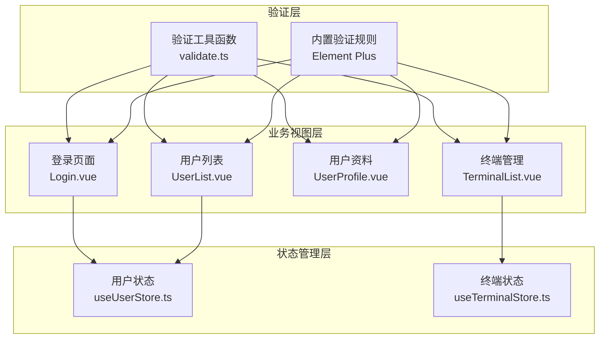
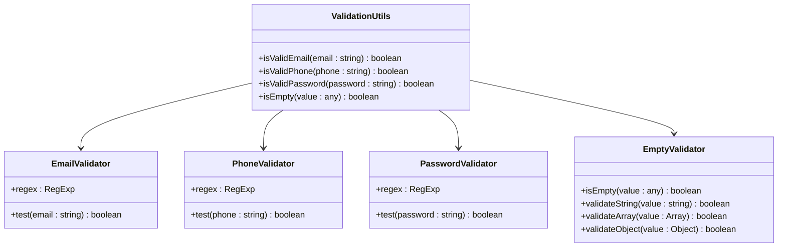
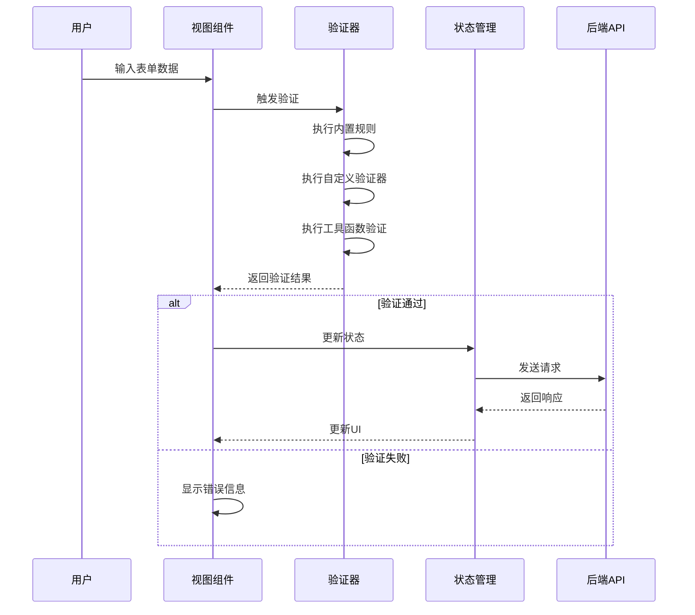
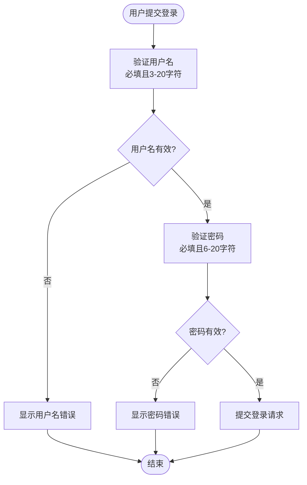
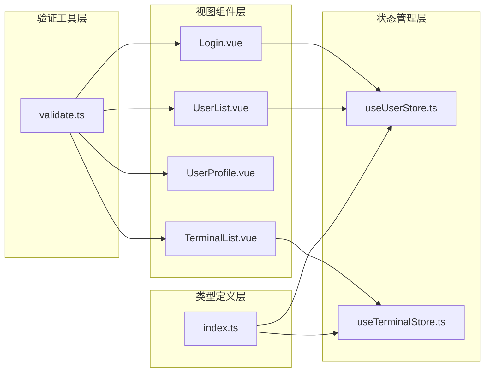

# 表单验证

<cite>
**本文档引用的文件**
- [validate.ts](file://src/utils/validate.ts)
- [Login.vue](file://src/views/login/Login.vue)
- [UserList.vue](file://src/views/user/UserList.vue)
- [UserProfile.vue](file://src/views/user/UserProfile.vue)
- [TerminalList.vue](file://src/views/terminal/TerminalList.vue)
- [useUserStore.ts](file://src/stores/useUserStore.ts)
- [index.ts](file://src/types/index.ts)
</cite>

## 目录
1. [简介](#简介)
2. [项目结构与验证体系](#项目结构与验证体系)
3. [核心验证组件](#核心验证组件)
4. [架构概览](#架构概览)
5. [详细组件分析](#详细组件分析)
6. [依赖关系分析](#依赖关系分析)
7. [性能考虑](#性能考虑)
8. [国际化与用户体验](#国际化与用户体验)
9. [自定义验证规则开发指南](#自定义验证规则开发指南)
10. [批量验证与性能优化](#批量验证与性能优化)
11. [调试与故障排除](#调试与故障排除)
12. [结论](#结论)

## 简介

本项目采用基于 Element Plus 的表单验证体系，结合自定义验证工具函数，构建了完整的前端表单验证解决方案。系统涵盖了登录验证、用户管理验证、终端管理验证等多个业务场景，提供了从基础规则到复杂业务逻辑的全方位验证能力。

## 项目结构与验证体系

项目中的表单验证主要分布在以下几个层次：



**图表来源**
- [validate.ts:1-36](file://src/utils/validate.ts#L1-L36)
- [Login.vue:103-112](file://src/views/login/Login.vue#L103-L112)
- [UserList.vue:261-297](file://src/views/user/UserList.vue#L261-L297)
- [UserProfile.vue:142-187](file://src/views/user/UserProfile.vue#L142-L187)
- [TerminalList.vue:661-671](file://src/views/terminal/TerminalList.vue#L661-L671)

## 核心验证组件

### 验证工具函数模块

项目提供了专门的验证工具函数模块，包含常用的格式验证：



**图表来源**
- [validate.ts:4-35](file://src/utils/validate.ts#L4-L35)

### 内置验证规则

项目广泛使用 Element Plus 的内置验证规则，包括：
- 必填项验证：`required: true`
- 长度验证：`min/max` 属性
- 格式验证：`type` 和 `pattern` 属性
- 自定义验证器：`validator` 函数

**章节来源**
- [validate.ts:1-36](file://src/utils/validate.ts#L1-L36)

## 架构概览

表单验证系统采用分层架构设计，确保了验证逻辑的可维护性和可扩展性：



**图表来源**
- [Login.vue:117-134](file://src/views/login/Login.vue#L117-L134)
- [UserList.vue:456-479](file://src/views/user/UserList.vue#L456-L479)
- [UserProfile.vue:231-264](file://src/views/user/UserProfile.vue#L231-L264)

## 详细组件分析

### 登录表单验证

登录表单采用了简洁而有效的验证策略：



**图表来源**
- [Login.vue:103-112](file://src/views/login/Login.vue#L103-L112)
- [Login.vue:117-134](file://src/views/login/Login.vue#L117-L134)

**章节来源**
- [Login.vue:1-408](file://src/views/login/Login.vue#L1-L408)

### 用户管理表单验证

用户管理表单包含了更复杂的验证逻辑：

#### 基础信息验证
- 用户名：必填、3-20字符、仅允许字母数字下划线
- 真实姓名：必填、最多50字符
- 邮箱：格式验证
- 手机号：11位手机号格式

#### 密码验证
密码验证采用了条件逻辑：
- 新增用户：密码必填且至少6位
- 编辑用户：密码可选，但若填写则至少6位

**章节来源**
- [UserList.vue:261-297](file://src/views/user/UserList.vue#L261-L297)
- [UserList.vue:456-479](file://src/views/user/UserList.vue#L456-L479)

### 用户资料表单验证

用户资料表单验证相对简单但实用：

#### 基础信息验证
- 真实姓名：必填、2-20字符
- 邮箱：必填且格式正确
- 手机号：11位手机号格式

#### 密码修改验证
密码修改表单采用了更严格的验证：
- 原密码：必填
- 新密码：必填、6-20字符
- 确认密码：必填且与新密码一致

**章节来源**
- [UserProfile.vue:142-187](file://src/views/user/UserProfile.vue#L142-L187)
- [UserProfile.vue:164-173](file://src/views/user/UserProfile.vue#L164-L173)

### 终端管理表单验证

终端管理表单验证专注于地理位置和标识符：

#### 基本信息验证
- 终端名称：必填、2-50字符
- 终端编码：必填、2-50字符

#### 地理位置验证
经纬度使用 `InputNumber` 组件进行数值范围验证：
- 经度：-180 到 180
- 纬度：-90 到 90
- 精度：6位小数

**章节来源**
- [TerminalList.vue:661-671](file://src/views/terminal/TerminalList.vue#L661-L671)

## 依赖关系分析

表单验证系统的核心依赖关系如下：



**图表来源**
- [validate.ts:1-36](file://src/utils/validate.ts#L1-L36)
- [Login.vue:85-88](file://src/views/login/Login.vue#L85-L88)
- [UserList.vue:209-210](file://src/views/user/UserList.vue#L209-L210)
- [TerminalList.vue:598-599](file://src/views/terminal/TerminalList.vue#L598-L599)

**章节来源**
- [useUserStore.ts:1-200](file://src/stores/useUserStore.ts#L1-L200)
- [useTerminalStore.ts:1-294](file://src/stores/useTerminalStore.ts#L1-L294)
- [index.ts:1-51](file://src/types/index.ts#L1-L51)

## 性能考虑

### 验证触发策略

项目采用了多种验证触发策略以平衡用户体验和性能：

1. **延迟验证**：大部分规则使用 `trigger: 'blur'`，在用户离开输入框时触发验证
2. **即时验证**：关键字段如用户名和密码使用 `trigger: 'blur'` 确保及时反馈
3. **条件验证**：密码验证根据操作模式（新增/编辑）动态调整

### 异步验证优化

对于需要异步验证的场景，建议采用以下策略：
- 使用防抖机制避免频繁验证
- 缓存验证结果减少重复计算
- 在网络请求中使用超时控制

## 国际化与用户体验

### 错误信息本地化

项目中的错误信息目前是硬编码的中文文本。为了支持国际化，建议：

1. **提取静态文本**：将所有错误信息提取到翻译文件
2. **动态语言切换**：根据用户语言偏好动态切换
3. **参数化消息**：支持占位符替换

### 用户体验优化

#### 即时反馈
- 使用 `ElMessage` 提供清晰的错误提示
- 在输入过程中提供实时验证反馈
- 避免不必要的重绘和闪烁

#### 可访问性
- 确保错误信息对屏幕阅读器友好
- 提供键盘导航支持
- 使用语义化的HTML结构

## 自定义验证规则开发指南

### 开发步骤

1. **定义验证函数**
```typescript
// 示例：自定义验证函数模板
const customValidator = (rule: any, value: any, callback: Function) => {
  // 验证逻辑
  if (/* 条件满足 */) {
    callback() // 验证通过
  } else {
    callback(new Error('自定义错误信息')) // 验证失败
  }
}
```

2. **集成到表单规则**
```typescript
const formRules = {
  fieldName: [
    { 
      validator: customValidator, 
      trigger: 'blur' 
    }
  ]
}
```

3. **在组件中使用**
```typescript
const handleValidate = async () => {
  await formRef.value.validate(async (valid) => {
    if (valid) {
      // 处理成功逻辑
    }
  })
}
```

### 高级验证模式

#### 异步验证
```typescript
const asyncValidator = async (rule: any, value: any, callback: Function) => {
  try {
    const result = await api.validateField(value)
    if (result.isValid) {
      callback()
    } else {
      callback(new Error(result.message))
    }
  } catch (error) {
    callback(new Error('验证失败'))
  }
}
```

#### 复合验证
```typescript
const compositeValidator = (rule: any, value: any, callback: Function) => {
  const errors: string[] = []
  
  // 多个验证条件
  if (!validatePattern(value)) errors.push('格式不正确')
  if (!validateLength(value)) errors.push('长度不符合要求')
  if (!validateBusinessRule(value)) errors.push('业务规则不满足')
  
  if (errors.length > 0) {
    callback(new Error(errors.join(', ')))
  } else {
    callback()
  }
}
```

**章节来源**
- [UserList.vue:278-292](file://src/views/user/UserList.vue#L278-L292)
- [UserProfile.vue:164-173](file://src/views/user/UserProfile.vue#L164-L173)

## 批量验证与性能优化

### 批量验证策略

对于需要同时验证多个字段的场景，可以采用以下策略：

#### 分组验证
```typescript
// 将相关字段分组验证
const groupValidation = {
  contactInfo: ['email', 'phone', 'address'],
  credentials: ['username', 'password']
}

const validateGroup = async (group: string) => {
  const fields = groupValidation[group]
  const promises = fields.map(field => formRef.value.validateField(field))
  return Promise.all(promises)
}
```

#### 条件验证
```typescript
// 根据条件动态启用验证
const conditionalRules = {
  email: [
    { 
      required: true, 
      message: '邮箱必填',
      trigger: 'blur'
    },
    { 
      type: 'email', 
      message: '邮箱格式不正确',
      trigger: 'blur'
    }
  ],
  phone: [
    { 
      required: (form: any) => form.email === '', 
      message: '邮箱或手机至少填写一项',
      trigger: 'blur'
    },
    { 
      pattern: /^1[3-9]\d{9}$/, 
      message: '手机号格式不正确',
      trigger: 'blur'
    }
  ]
}
```

### 性能优化技巧

1. **懒加载验证器**：只在需要时创建复杂的验证器
2. **缓存验证结果**：对昂贵的验证操作进行缓存
3. **批量更新**：使用 `nextTick` 批量更新多个字段的验证状态
4. **防抖处理**：对高频输入进行防抖处理

## 调试与故障排除

### 常见问题诊断

#### 验证不触发
- 检查 `trigger` 属性设置
- 确认表单引用正确绑定
- 验证规则语法正确性

#### 验证结果异常
- 检查自定义验证器的回调调用
- 确认异步验证的 Promise 处理
- 验证条件验证的逻辑分支

#### 性能问题
- 分析验证函数的复杂度
- 检查是否存在重复验证
- 优化验证触发频率

### 调试工具

#### 开发者工具
```typescript
// 添加调试日志
const debugValidator = (rule: any, value: any, callback: Function) => {
  console.log('验证规则:', rule)
  console.log('验证值:', value)
  console.log('当前表单状态:', formRef.value.model)
  
  // 验证逻辑...
  
  console.log('验证结果:', result)
  callback(result)
}
```

#### 验证状态监控
```typescript
// 监控表单验证状态
const monitorValidation = () => {
  const fields = formRef.value.getFields()
  fields.forEach(field => {
    console.log(`${field.prop}: ${field.validateState}`)
  })
}
```

### 故障排除清单

1. **验证规则无效**
   - 检查规则对象结构
   - 确认属性名称正确
   - 验证回调函数签名

2. **异步验证失败**
   - 检查 Promise 返回
   - 确认错误处理
   - 验证网络请求

3. **性能问题**
   - 分析验证函数复杂度
   - 检查重复验证
   - 优化触发策略

**章节来源**
- [validate.ts:1-36](file://src/utils/validate.ts#L1-L36)
- [UserList.vue:456-479](file://src/views/user/UserList.vue#L456-L479)

## 结论

本项目的表单验证系统展现了良好的架构设计和实用性。通过将验证逻辑分层、使用 Element Plus 的强大验证能力、以及提供自定义验证工具函数，系统实现了从基础到高级的完整验证覆盖。

### 主要优势

1. **模块化设计**：验证逻辑清晰分离，便于维护和扩展
2. **灵活性强**：支持内置规则和自定义验证器的组合使用
3. **用户体验好**：合理的验证时机和反馈机制
4. **性能优化**：采用多种策略优化验证性能

### 改进建议

1. **国际化支持**：实现多语言错误信息
2. **统一验证接口**：建立更规范的验证函数接口
3. **测试覆盖**：增加单元测试和集成测试
4. **文档完善**：补充详细的验证规则文档

该验证系统为后续的功能扩展和维护奠定了坚实的基础，能够有效支撑项目的持续发展。