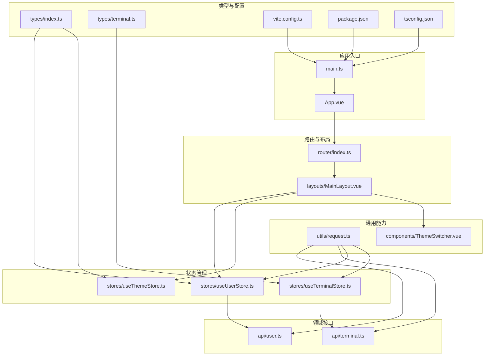
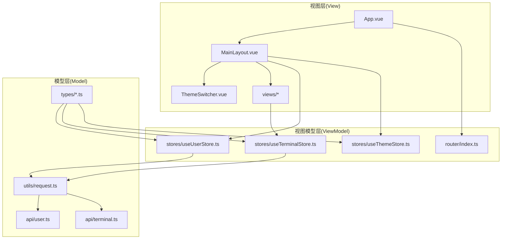
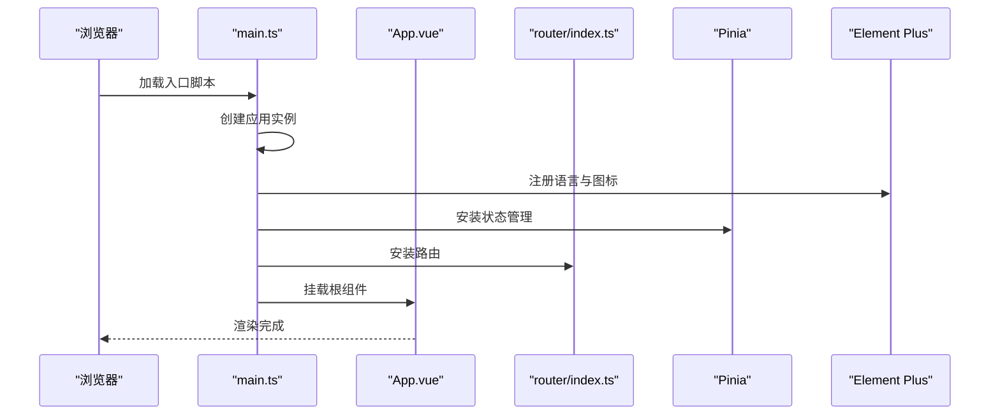
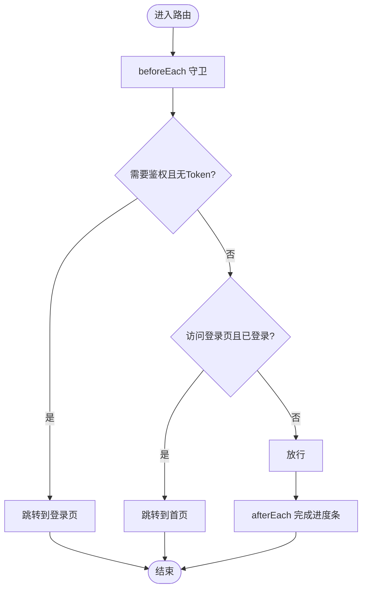
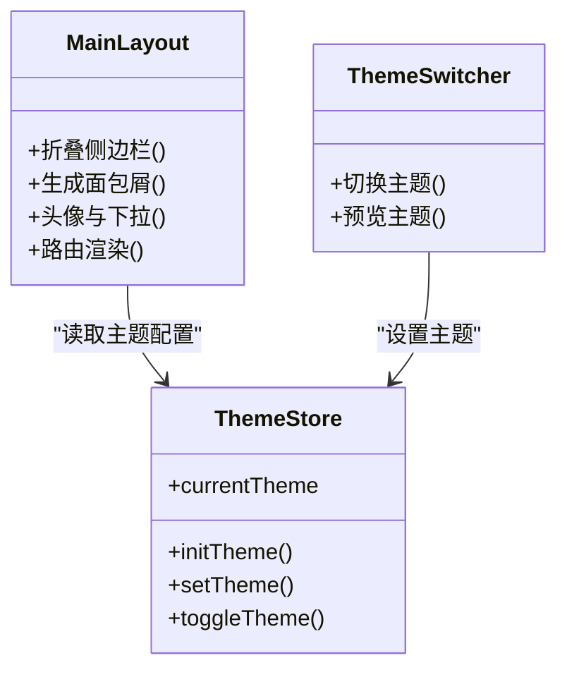
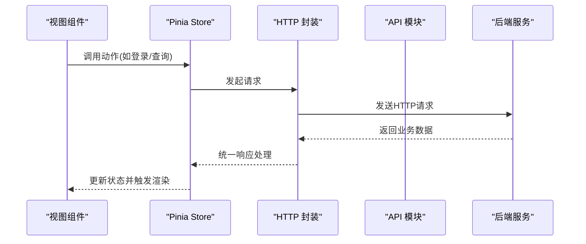
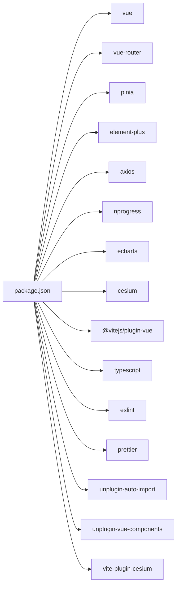

# 整体架构

<cite>
**本文引用的文件**
- [main.ts](file://src/main.ts)
- [App.vue](file://src/App.vue)
- [router/index.ts](file://src/router/index.ts)
- [stores/useUserStore.ts](file://src/stores/useUserStore.ts)
- [stores/useTerminalStore.ts](file://src/stores/useTerminalStore.ts)
- [stores/useThemeStore.ts](file://src/stores/useThemeStore.ts)
- [layouts/MainLayout.vue](file://src/layouts/MainLayout.vue)
- [components/ThemeSwitcher.vue](file://src/components/ThemeSwitcher.vue)
- [utils/request.ts](file://src/utils/request.ts)
- [api/user.ts](file://src/api/user.ts)
- [api/terminal.ts](file://src/api/terminal.ts)
- [types/index.ts](file://src/types/index.ts)
- [types/terminal.ts](file://src/types/terminal.ts)
- [vite.config.ts](file://vite.config.ts)
- [package.json](file://package.json)
- [tsconfig.json](file://tsconfig.json)
</cite>

## 目录
1. [简介](#简介)
2. [项目结构](#项目结构)
3. [核心组件](#核心组件)
4. [架构总览](#架构总览)
5. [详细组件分析](#详细组件分析)
6. [依赖分析](#依赖分析)
7. [性能考虑](#性能考虑)
8. [故障排查指南](#故障排查指南)
9. [结论](#结论)
10. [附录](#附录)

## 简介
本项目为“水文监测管理系统”的前端应用，采用 Vue 3 + TypeScript 技术栈，结合 Element Plus、Pinia、Vue Router、Vite 等生态，实现一个现代化、可维护、可扩展的中后台系统。系统遵循 MVVM 架构思想，通过组件化与模块化组织代码，配合 Pinia 状态管理与路由守卫机制，提供统一的主题切换、用户认证、终端管理、数据展示与地图概览等功能。

## 项目结构
项目采用按功能域划分的模块化组织方式，核心目录职责如下：
- src/api：封装后端接口调用，按领域拆分（用户、终端、AI等）
- src/components：可复用的通用组件（如主题切换器）
- src/layouts：布局容器（主布局 MainLayout）
- src/router：路由定义与导航守卫
- src/stores：Pinia 状态仓库（用户、终端、主题）
- src/styles：全局样式与变量
- src/types：全局与领域类型定义
- src/utils：通用工具（HTTP 封装、格式化、验证等）
- src/views：页面级视图组件（按模块划分）
- 其他根级配置：vite.config.ts、tsconfig.json、package.json 等

图表来源
- [main.ts:1-26](file://src/main.ts#L1-L26)
- [App.vue:1-15](file://src/App.vue#L1-L15)
- [router/index.ts:1-136](file://src/router/index.ts#L1-L136)
- [layouts/MainLayout.vue:1-434](file://src/layouts/MainLayout.vue#L1-L434)
- [stores/useUserStore.ts:1-200](file://src/stores/useUserStore.ts#L1-L200)
- [stores/useTerminalStore.ts:1-294](file://src/stores/useTerminalStore.ts#L1-L294)
- [stores/useThemeStore.ts:1-69](file://src/stores/useThemeStore.ts#L1-L69)
- [components/ThemeSwitcher.vue:1-132](file://src/components/ThemeSwitcher.vue#L1-L132)
- [utils/request.ts:1-180](file://src/utils/request.ts#L1-L180)
- [api/user.ts:1-179](file://src/api/user.ts#L1-L179)
- [api/terminal.ts:1-59](file://src/api/terminal.ts#L1-L59)
- [types/index.ts:1-51](file://src/types/index.ts#L1-L51)
- [types/terminal.ts:1-84](file://src/types/terminal.ts#L1-L84)
- [vite.config.ts:1-68](file://vite.config.ts#L1-L68)
- [package.json:1-48](file://package.json#L1-L48)
- [tsconfig.json:1-40](file://tsconfig.json#L1-L40)

章节来源
- [main.ts:1-26](file://src/main.ts#L1-L26)
- [router/index.ts:1-136](file://src/router/index.ts#L1-L136)
- [layouts/MainLayout.vue:1-434](file://src/layouts/MainLayout.vue#L1-L434)
- [stores/useUserStore.ts:1-200](file://src/stores/useUserStore.ts#L1-L200)
- [stores/useTerminalStore.ts:1-294](file://src/stores/useTerminalStore.ts#L1-L294)
- [stores/useThemeStore.ts:1-69](file://src/stores/useThemeStore.ts#L1-L69)
- [components/ThemeSwitcher.vue:1-132](file://src/components/ThemeSwitcher.vue#L1-L132)
- [utils/request.ts:1-180](file://src/utils/request.ts#L1-L180)
- [api/user.ts:1-179](file://src/api/user.ts#L1-L179)
- [api/terminal.ts:1-59](file://src/api/terminal.ts#L1-L59)
- [types/index.ts:1-51](file://src/types/index.ts#L1-L51)
- [types/terminal.ts:1-84](file://src/types/terminal.ts#L1-L84)
- [vite.config.ts:1-68](file://vite.config.ts#L1-L68)
- [package.json:1-48](file://package.json#L1-L48)
- [tsconfig.json:1-40](file://tsconfig.json#L1-L40)

## 核心组件
- 应用入口与初始化：在入口文件中创建 Vue 应用实例，注册 Pinia、路由、Element Plus，并挂载根组件。
- 根组件：App.vue 作为顶层容器，承载路由视图渲染。
- 路由系统：基于 Vue Router 定义菜单式路由结构，集成进度条与鉴权守卫。
- 布局系统：MainLayout 提供侧边栏、面包屑、头部导航与主题切换，统一页面骨架。
- 状态管理：Pinia Store 管理用户会话、终端列表与主题配置，提供计算属性与动作。
- 通用工具：HTTP 封装统一处理响应、鉴权与错误提示；类型定义保证前后端契约一致。
- 构建与开发：Vite 提供快速热更新与生产打包，自动导入 Element Plus 组件与 API。

章节来源
- [main.ts:1-26](file://src/main.ts#L1-L26)
- [App.vue:1-15](file://src/App.vue#L1-L15)
- [router/index.ts:1-136](file://src/router/index.ts#L1-L136)
- [layouts/MainLayout.vue:1-434](file://src/layouts/MainLayout.vue#L1-L434)
- [stores/useUserStore.ts:1-200](file://src/stores/useUserStore.ts#L1-L200)
- [stores/useTerminalStore.ts:1-294](file://src/stores/useTerminalStore.ts#L1-L294)
- [stores/useThemeStore.ts:1-69](file://src/stores/useThemeStore.ts#L1-L69)
- [utils/request.ts:1-180](file://src/utils/request.ts#L1-L180)

## 架构总览
系统采用 MVVM 架构：
- Model：Pinia Store 与 API 层，负责数据与业务状态
- View：Vue 组件（布局、页面、通用组件）
- ViewModel：Composition API + Store 动作与计算属性，协调视图与模型

图表来源
- [App.vue:1-15](file://src/App.vue#L1-L15)
- [layouts/MainLayout.vue:1-434](file://src/layouts/MainLayout.vue#L1-L434)
- [components/ThemeSwitcher.vue:1-132](file://src/components/ThemeSwitcher.vue#L1-L132)
- [router/index.ts:1-136](file://src/router/index.ts#L1-L136)
- [stores/useUserStore.ts:1-200](file://src/stores/useUserStore.ts#L1-L200)
- [stores/useTerminalStore.ts:1-294](file://src/stores/useTerminalStore.ts#L1-L294)
- [stores/useThemeStore.ts:1-69](file://src/stores/useThemeStore.ts#L1-L69)
- [utils/request.ts:1-180](file://src/utils/request.ts#L1-L180)
- [api/user.ts:1-179](file://src/api/user.ts#L1-L179)
- [api/terminal.ts:1-59](file://src/api/terminal.ts#L1-L59)
- [types/index.ts:1-51](file://src/types/index.ts#L1-L51)
- [types/terminal.ts:1-84](file://src/types/terminal.ts#L1-L84)

## 详细组件分析

### 应用入口与初始化流程
- 创建 Vue 应用实例并引入根组件
- 注册 Element Plus 国际化与全局图标
- 注册 Pinia、路由
- 引入全局样式并挂载

图表来源
- [main.ts:1-26](file://src/main.ts#L1-L26)
- [App.vue:1-15](file://src/App.vue#L1-L15)
- [router/index.ts:1-136](file://src/router/index.ts#L1-L136)

章节来源
- [main.ts:1-26](file://src/main.ts#L1-L26)

### 路由与导航守卫
- 定义菜单式路由树，支持懒加载与嵌套路由
- 集成 NProgress 进度条
- 路由守卫校验登录态与页面权限

图表来源
- [router/index.ts:116-134](file://src/router/index.ts#L116-L134)

章节来源
- [router/index.ts:1-136](file://src/router/index.ts#L1-L136)

### 布局与主题系统
- MainLayout 提供侧边栏菜单、面包屑、头部导航与内容区域
- ThemeSwitcher 支持多种主题风格，持久化存储
- 主题配置通过 Store 动态注入到布局样式

图表来源
- [layouts/MainLayout.vue:1-434](file://src/layouts/MainLayout.vue#L1-L434)
- [components/ThemeSwitcher.vue:1-132](file://src/components/ThemeSwitcher.vue#L1-L132)
- [stores/useThemeStore.ts:1-69](file://src/stores/useThemeStore.ts#L1-L69)

章节来源
- [layouts/MainLayout.vue:1-434](file://src/layouts/MainLayout.vue#L1-L434)
- [components/ThemeSwitcher.vue:1-132](file://src/components/ThemeSwitcher.vue#L1-L132)
- [stores/useThemeStore.ts:1-69](file://src/stores/useThemeStore.ts#L1-L69)

### 状态管理（Pinia）与数据流
- 用户状态：登录、登出、Token 管理、用户信息缓存与解析
- 终端状态：分页查询、详情、增删改、对话框与表单状态
- HTTP 封装：统一请求/响应拦截、错误提示、大整数安全处理

图表来源
- [stores/useUserStore.ts:1-200](file://src/stores/useUserStore.ts#L1-L200)
- [stores/useTerminalStore.ts:1-294](file://src/stores/useTerminalStore.ts#L1-L294)
- [utils/request.ts:1-180](file://src/utils/request.ts#L1-L180)
- [api/user.ts:1-179](file://src/api/user.ts#L1-L179)
- [api/terminal.ts:1-59](file://src/api/terminal.ts#L1-L59)

章节来源
- [stores/useUserStore.ts:1-200](file://src/stores/useUserStore.ts#L1-L200)
- [stores/useTerminalStore.ts:1-294](file://src/stores/useTerminalStore.ts#L1-L294)
- [utils/request.ts:1-180](file://src/utils/request.ts#L1-L180)
- [api/user.ts:1-179](file://src/api/user.ts#L1-L179)
- [api/terminal.ts:1-59](file://src/api/terminal.ts#L1-L59)

### 类型系统与数据契约
- 通用类型：响应结构、分页、用户状态与角色、主题风格
- 领域类型：终端实体、查询与分页、创建/更新 DTO、在线状态
- 通过类型约束前后端交互，减少运行时错误

章节来源
- [types/index.ts:1-51](file://src/types/index.ts#L1-L51)
- [types/terminal.ts:1-84](file://src/types/terminal.ts#L1-L84)

## 依赖分析
- 运行时依赖：Vue 3、Vue Router、Pinia、Element Plus、Axios、NProgress、ECharts、Cesium
- 开发依赖：Vite、TypeScript、ESLint、Prettier、Auto Import、Components、Cesium 插件
- 构建策略：按需自动导入 Element Plus 组件与 Vue API，分包策略将第三方库拆分为独立 chunk

图表来源
- [package.json:14-46](file://package.json#L14-L46)

章节来源
- [package.json:1-48](file://package.json#L1-L48)
- [vite.config.ts:1-68](file://vite.config.ts#L1-L68)

## 性能考虑
- 代码分割：通过手动分包策略将 element-plus 与核心依赖拆分，提升缓存命中率
- 懒加载路由：按需加载视图组件，降低首屏体积
- 自动导入：减少重复引入，提升开发效率
- 构建优化：关闭 sourcemap，增大警告阈值，避免过大 chunk 导致加载缓慢

章节来源
- [vite.config.ts:53-65](file://vite.config.ts#L53-L65)

## 故障排查指南
- 登录失败：检查 Token 是否正确存储与携带，确认后端返回结构与拦截器处理
- 数据精度丢失：关注大整数字段的字符串化处理，确保前后端一致
- 鉴权失效：响应拦截器对 401 的处理会清除本地状态并跳转登录
- 网络错误：根据状态码映射提示，优先检查代理配置与跨域设置

章节来源
- [utils/request.ts:95-151](file://src/utils/request.ts#L95-L151)
- [stores/useUserStore.ts:55-83](file://src/stores/useUserStore.ts#L55-L83)
- [router/index.ts:116-134](file://src/router/index.ts#L116-L134)

## 结论
本项目以 Vue 3 + TypeScript 为基础，结合 Element Plus、Pinia、Vue Router 与 Vite，构建了清晰的 MVVM 架构。通过模块化目录、Pinia 状态管理、路由守卫与统一 HTTP 封装，实现了高内聚、低耦合的前端体系。建议持续完善类型覆盖、测试与监控埋点，以进一步提升可维护性与稳定性。

## 附录
- 构建与开发：dev/build/preview/lint/format/type-check 脚本
- 路径别名：@ 指向 src，便于模块导入
- 环境变量：VITE_PORT、VITE_API_BASE_URL、VITE_AI_API_BASE_URL

章节来源
- [package.json:6-12](file://package.json#L6-L12)
- [tsconfig.json:23-27](file://tsconfig.json#L23-L27)
- [vite.config.ts:10-52](file://vite.config.ts#L10-L52)