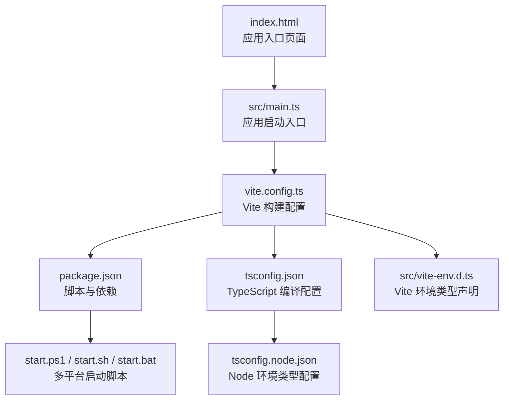
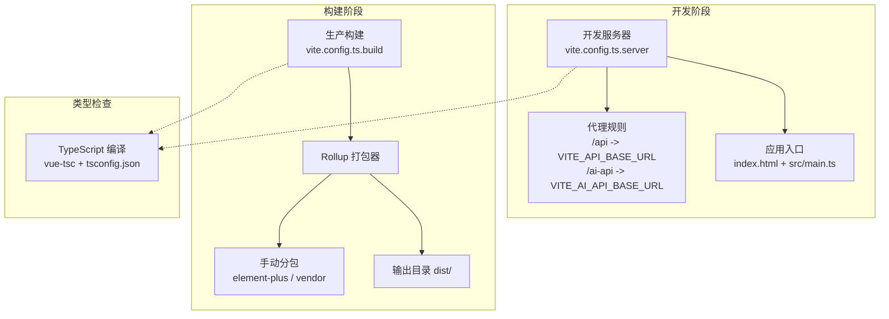
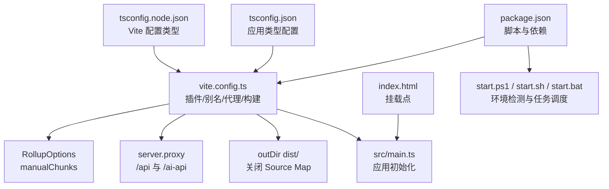

# 构建配置

<cite>
**本文引用的文件**
- [vite.config.ts](file://vite.config.ts)
- [package.json](file://package.json)
- [tsconfig.json](file://tsconfig.json)
- [tsconfig.node.json](file://tsconfig.node.json)
- [index.html](file://index.html)
- [src/main.ts](file://src/main.ts)
- [src/vite-env.d.ts](file://src/vite-env.d.ts)
- [README.md](file://README.md)
- [start.ps1](file://start.ps1)
- [start.sh](file://start.sh)
- [start.bat](file://start.bat)
</cite>

## 目录
1. [引言](#引言)
2. [项目结构](#项目结构)
3. [核心组件](#核心组件)
4. [架构总览](#架构总览)
5. [详细组件分析](#详细组件分析)
6. [依赖关系分析](#依赖关系分析)
7. [性能考量](#性能考量)
8. [故障排查指南](#故障排查指南)
9. [结论](#结论)
10. [附录](#附录)

## 引言
本文件面向“水文监测管理系统”的前端构建配置，系统化梳理 Vite 构建工具的配置策略与优化方案，涵盖开发服务器、生产构建、插件体系、TypeScript 编译与类型检查、脚本命令与依赖管理、代码分割与资源优化、缓存策略、开发与生产的差异化配置，以及构建性能优化最佳实践与产物分析调试方法。目标是帮助开发者快速理解并高效维护该工程的构建体系。

## 项目结构
本项目采用 Vite + Vue 3 + TypeScript 技术栈，构建相关的核心文件集中在根目录，包含构建配置、类型配置、入口 HTML 与应用入口、以及多平台启动脚本。下图展示与构建相关的关键文件与职责：

图表来源
- [index.html](file://index.html)
- [src/main.ts](file://src/main.ts)
- [vite.config.ts](file://vite.config.ts)
- [package.json](file://package.json)
- [tsconfig.json](file://tsconfig.json)
- [tsconfig.node.json](file://tsconfig.node.json)
- [src/vite-env.d.ts](file://src/vite-env.d.ts)
- [start.ps1](file://start.ps1)
- [start.sh](file://start.sh)
- [start.bat](file://start.bat)

章节来源
- [README.md](file://README.md)
- [index.html](file://index.html)
- [src/main.ts](file://src/main.ts)
- [vite.config.ts](file://vite.config.ts)
- [package.json](file://package.json)
- [tsconfig.json](file://tsconfig.json)
- [tsconfig.node.json](file://tsconfig.node.json)
- [src/vite-env.d.ts](file://src/vite-env.d.ts)
- [start.ps1](file://start.ps1)
- [start.sh](file://start.sh)
- [start.bat](file://start.bat)

## 核心组件
- Vite 构建配置：集中于 vite.config.ts，定义插件、别名、开发服务器代理、生产构建产物与分包策略等。
- TypeScript 编译配置：tsconfig.json 与 tsconfig.node.json 分别负责应用与 Vite 配置的类型解析。
- 包管理与脚本：package.json 中定义开发、构建、预览、类型检查、代码格式化与 Lint 等命令。
- 应用入口：index.html 与 src/main.ts 组成应用挂载点与初始化逻辑。
- 多平台启动脚本：start.ps1/start.sh/start.bat 封装环境检测、依赖安装与任务调度。

章节来源
- [vite.config.ts](file://vite.config.ts)
- [tsconfig.json](file://tsconfig.json)
- [tsconfig.node.json](file://tsconfig.node.json)
- [package.json](file://package.json)
- [index.html](file://index.html)
- [src/main.ts](file://src/main.ts)
- [src/vite-env.d.ts](file://src/vite-env.d.ts)
- [start.ps1](file://start.ps1)
- [start.sh](file://start.sh)
- [start.bat](file://start.bat)

## 架构总览
下图展示从开发到生产的整体构建与运行链路，包括开发服务器、代理、构建产物与预览流程：

图表来源
- [vite.config.ts](file://vite.config.ts)
- [index.html](file://index.html)
- [src/main.ts](file://src/main.ts)
- [package.json](file://package.json)
- [tsconfig.json](file://tsconfig.json)

## 详细组件分析

### Vite 构建配置（vite.config.ts）
- 插件体系
  - Vue 插件：启用 SFC 支持与热更新。
  - Cesium 插件：自动处理 Cesium 兼容性与资源加载。
  - 自动导入：unplugin-auto-import 与 unplugin-vue-components 结合 ElementPlusResolver，实现 Vue API、路由与组件的自动导入，减少样板代码。
- 路径别名
  - 通过 resolve.alias 将 @ 指向 src，统一模块引用路径。
- 开发服务器
  - host、port、open 控制本地可访问性与默认打开浏览器。
  - 代理规则：
    - /api 代理至 VITE_API_BASE_URL，保留路径前缀。
    - /ai-api 代理至 VITE_AI_API_BASE_URL，并移除前缀以适配后端路由。
- 生产构建
  - 输出目录 dist。
  - 关闭 Source Map 以减小产物体积。
  - 增大 Rollup 分块警告阈值，避免大体积 chunk 导致频繁告警。
  - 手动分包策略：
    - element-plus 单独拆分，便于 CDN 缓存与复用。
    - vendor（vue、vue-router、pinia、axios）单独拆分，提升缓存命中率。

章节来源
- [vite.config.ts](file://vite.config.ts)

### TypeScript 编译配置（tsconfig.json 与 tsconfig.node.json）
- 应用类型配置（tsconfig.json）
  - 目标与模块：ES2020 与 ESNext，配合 Vite 的 bundler 模式。
  - 解析策略：bundler + allowImportingTsExtensions + resolveJsonModule + isolatedModules，确保 Vite 的原生 ESM 与按需打包能力。
  - 路径别名：baseUrl 与 paths 配置与 Vite 别名一致，保证 IDE 与编译一致性。
  - Vue 类型：引入 vite/client 与 element-plus/global，增强模板与 UI 类型支持。
  - 严格性：开启 strict、noUnusedLocals、noUnusedParameters、noFallthroughCasesInSwitch。
- Node 环境类型（tsconfig.node.json）
  - 仅包含 Vite 配置文件，采用 bundler 解析，启用 composite 与 strict。

章节来源
- [tsconfig.json](file://tsconfig.json)
- [tsconfig.node.json](file://tsconfig.node.json)

### 包管理与脚本（package.json）
- 脚本命令
  - dev：启动开发服务器（Vite）。
  - build：先执行 vue-tsc 进行类型检查，再进行生产构建。
  - preview：预览生产构建产物。
  - lint：使用 ESLint + Prettier 规范代码。
  - format：格式化 src/ 目录。
  - type-check：仅类型检查，不生成输出。
- 依赖与开发依赖
  - 运行时依赖：Vue 3、Vue Router、Pinia、Axios、Element Plus、ECharts、Cesium、NProgress、Markdown-it 等。
  - 开发依赖：Vite、@vitejs/plugin-vue、unplugin-auto-import、unplugin-vue-components、vite-plugin-cesium、vue-tsc、TypeScript、ESLint、Prettier、Sass 等。

章节来源
- [package.json](file://package.json)

### 应用入口与环境类型（index.html 与 src/main.ts）
- index.html
  - 提供挂载节点与应用入口脚本，指向 src/main.ts。
- src/main.ts
  - 初始化 Vue 应用、注册 Element Plus 国际化、全局样式、路由与状态管理，并挂载到 DOM。
- src/vite-env.d.ts
  - 声明 *.vue 模块类型，使 Vite 能正确识别单文件组件。

章节来源
- [index.html](file://index.html)
- [src/main.ts](file://src/main.ts)
- [src/vite-env.d.ts](file://src/vite-env.d.ts)

### 多平台启动脚本（start.ps1 / start.sh / start.bat）
- Windows（start.bat/start.ps1）
  - 检测 Node/npm，首次运行自动安装依赖；支持读取 .env.development 中的 VITE_PORT 并启动开发服务器。
- Linux/macOS（start.sh）
  - 检测 Node/npm，若端口占用则尝试终止占用进程，随后启动开发服务器。

章节来源
- [start.ps1](file://start.ps1)
- [start.sh](file://start.sh)
- [start.bat](file://start.bat)

### 开发与生产差异化配置
- 环境变量
  - README 指定 .env、.env.development、.env.production 三类文件，用于区分不同环境的 API 基础地址与端口等。
  - Vite 会自动注入以 VITE_ 前缀的变量，可在代码中通过 import.meta.env 访问。
- 代理差异
  - /api 与 /ai-api 代理目标分别来自 VITE_API_BASE_URL 与 VITE_AI_API_BASE_URL，开发与生产环境可独立配置。
- 构建差异
  - 生产构建关闭 Source Map，减少体积；通过手动分包提升缓存效率；Rollup 警告阈值调优避免噪声。

章节来源
- [README.md](file://README.md)
- [vite.config.ts](file://vite.config.ts)

### 代码分割、资源优化与缓存策略
- 代码分割
  - 通过 manualChunks 将 element-plus 与 vendor（vue、vue-router、pinia、axios）拆分为独立 chunk，利于浏览器缓存与按需加载。
- 资源优化
  - 关闭 Source Map（生产），降低产物体积与泄露风险。
  - 增大 chunkSizeWarningLimit，避免大体积 chunk 导致频繁警告。
- 缓存策略
  - 将第三方 UI 与核心框架拆分为稳定不变的 chunk，提升长期缓存命中率。

章节来源
- [vite.config.ts](file://vite.config.ts)

### 构建性能优化最佳实践
- Tree Shaking
  - 使用 ES Module 模式与 bundler 解析，结合严格的类型与无副作用导出，最大化消除未使用代码。
- 代码压缩
  - Vite 默认使用 Rollup 插件进行压缩；生产构建建议配合现代浏览器目标以获得更好的压缩效果。
- 资源打包策略
  - 将大体量库（如 Cesium、Element Plus）单独分包，结合 CDN 或静态托管可进一步优化加载速度。
- 类型检查前置
  - 在构建前执行 vue-tsc，提前发现类型错误，避免构建失败与浪费时间。

章节来源
- [package.json](file://package.json)
- [vite.config.ts](file://vite.config.ts)
- [tsconfig.json](file://tsconfig.json)

### 构建产物分析与调试
- 产物目录
  - 生产构建输出至 dist/，可通过 vite preview 在本地预览生产构建效果。
- 分析方法
  - 使用浏览器开发者工具 Network 面板观察资源加载与缓存命中情况。
  - 使用 Source 面板查看压缩后的代码映射（如仍需 Source Map，可在开发环境开启）。
  - 结合手动分包结果，确认 element-plus 与 vendor chunk 是否按预期生成与缓存。

章节来源
- [vite.config.ts](file://vite.config.ts)
- [package.json](file://package.json)

## 依赖关系分析
下图展示构建相关文件之间的依赖关系与交互：

图表来源
- [package.json](file://package.json)
- [vite.config.ts](file://vite.config.ts)
- [tsconfig.json](file://tsconfig.json)
- [tsconfig.node.json](file://tsconfig.node.json)
- [index.html](file://index.html)
- [src/main.ts](file://src/main.ts)
- [start.ps1](file://start.ps1)
- [start.sh](file://start.sh)
- [start.bat](file://start.bat)

章节来源
- [package.json](file://package.json)
- [vite.config.ts](file://vite.config.ts)
- [tsconfig.json](file://tsconfig.json)
- [tsconfig.node.json](file://tsconfig.node.json)
- [index.html](file://index.html)
- [src/main.ts](file://src/main.ts)
- [start.ps1](file://start.ps1)
- [start.sh](file://start.sh)
- [start.bat](file://start.bat)

## 性能考量
- 开发体验
  - 代理与热更新提升迭代效率；合理分包避免首屏阻塞。
- 生产体积
  - 关闭 Source Map、拆分稳定依赖、合理的目标设定有助于减小产物体积。
- 加载性能
  - 将 UI 与核心框架独立分包，结合 CDN 或静态托管可显著提升加载速度。
- 类型检查前置
  - 通过 vue-tsc 在构建前发现问题，减少 CI/CD 时间成本。

章节来源
- [vite.config.ts](file://vite.config.ts)
- [package.json](file://package.json)
- [tsconfig.json](file://tsconfig.json)

## 故障排查指南
- 无法启动开发服务器
  - 检查 Node/npm 是否安装，确认端口未被占用；Windows 可使用 start.ps1/start.bat，Linux/macOS 使用 start.sh。
- API 代理失败
  - 确认 .env.development/.env.production 中 VITE_API_BASE_URL 与 VITE_AI_API_BASE_URL 配置正确；检查代理 rewrite 逻辑。
- 构建失败或类型错误
  - 先执行 npm run type-check 排查类型问题；再执行 npm run build 查看具体报错。
- 产物过大或加载缓慢
  - 检查 manualChunks 是否生效；评估是否可引入 CDN；确认未意外引入大型依赖。

章节来源
- [start.ps1](file://start.ps1)
- [start.sh](file://start.sh)
- [start.bat](file://start.bat)
- [vite.config.ts](file://vite.config.ts)
- [package.json](file://package.json)

## 结论
本项目以 Vite 为核心，结合 Vue 3 + TypeScript + Element Plus 的现代化技术栈，构建配置清晰、插件体系完善、开发与生产差异化明确。通过合理的代码分割、资源优化与缓存策略，兼顾了开发体验与生产性能。建议在持续集成中加入类型检查与 Lint 步骤，确保质量与稳定性。

## 附录
- 关键文件清单
  - 构建配置：vite.config.ts
  - 类型配置：tsconfig.json、tsconfig.node.json
  - 包管理：package.json
  - 应用入口：index.html、src/main.ts、src/vite-env.d.ts
  - 启动脚本：start.ps1、start.sh、start.bat
- 环境变量与代理
  - 通过 import.meta.env 访问以 VITE_ 前缀的变量，代理规则在 vite.config.ts 中集中配置。

章节来源
- [vite.config.ts](file://vite.config.ts)
- [tsconfig.json](file://tsconfig.json)
- [tsconfig.node.json](file://tsconfig.node.json)
- [package.json](file://package.json)
- [index.html](file://index.html)
- [src/main.ts](file://src/main.ts)
- [src/vite-env.d.ts](file://src/vite-env.d.ts)
- [start.ps1](file://start.ps1)
- [start.sh](file://start.sh)
- [start.bat](file://start.bat)
- [README.md](file://README.md)