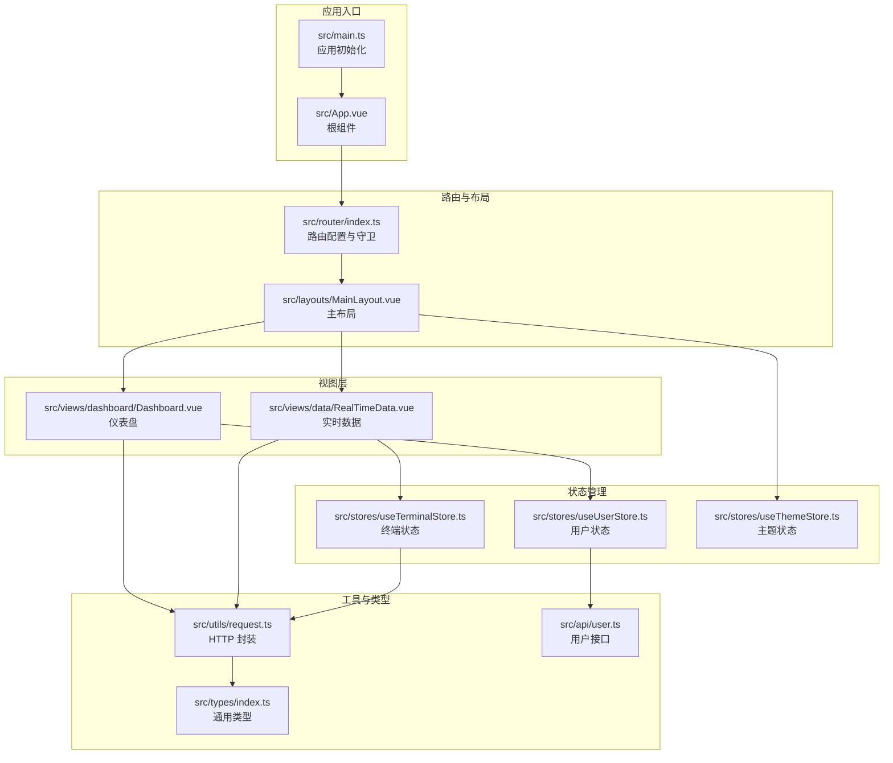
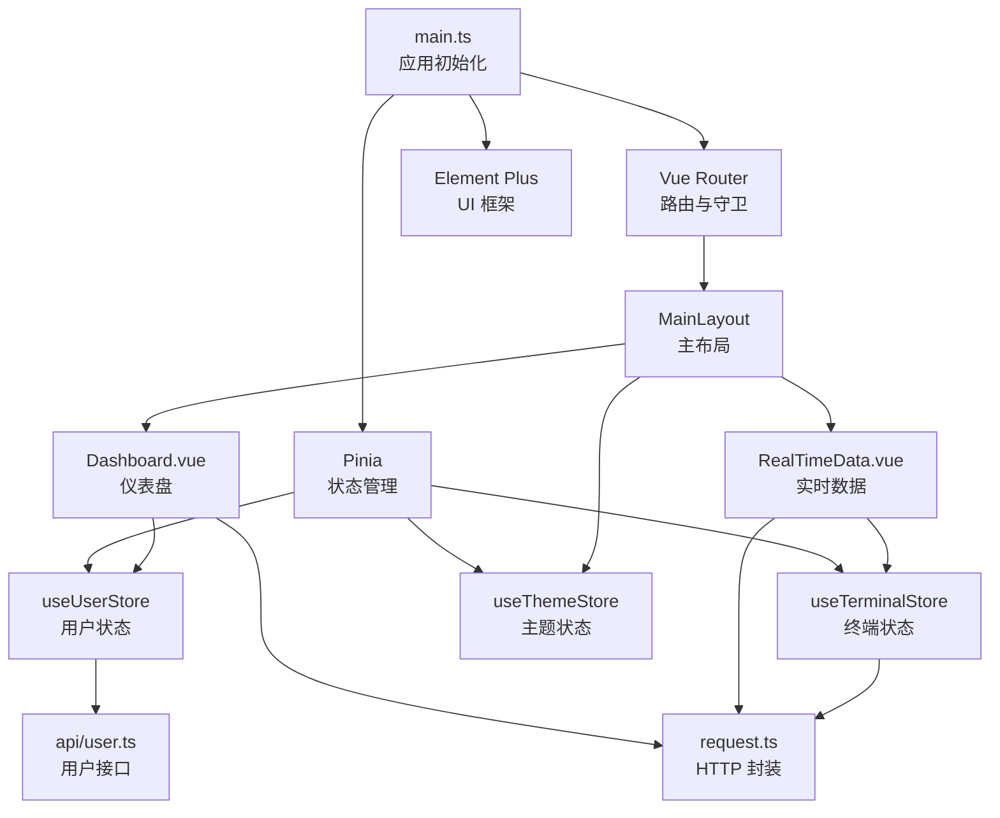
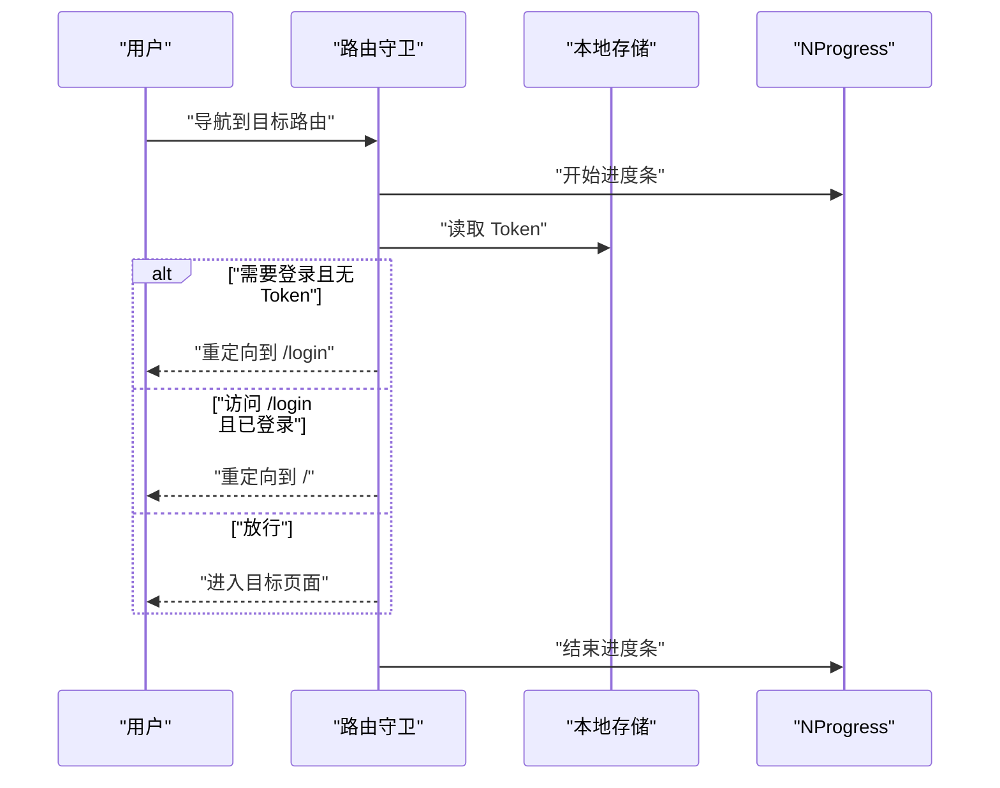
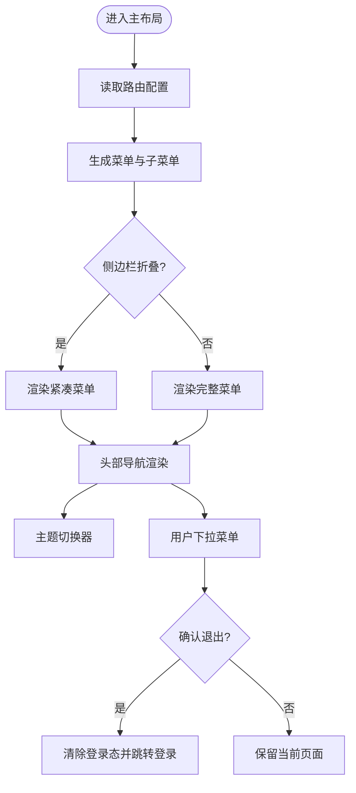
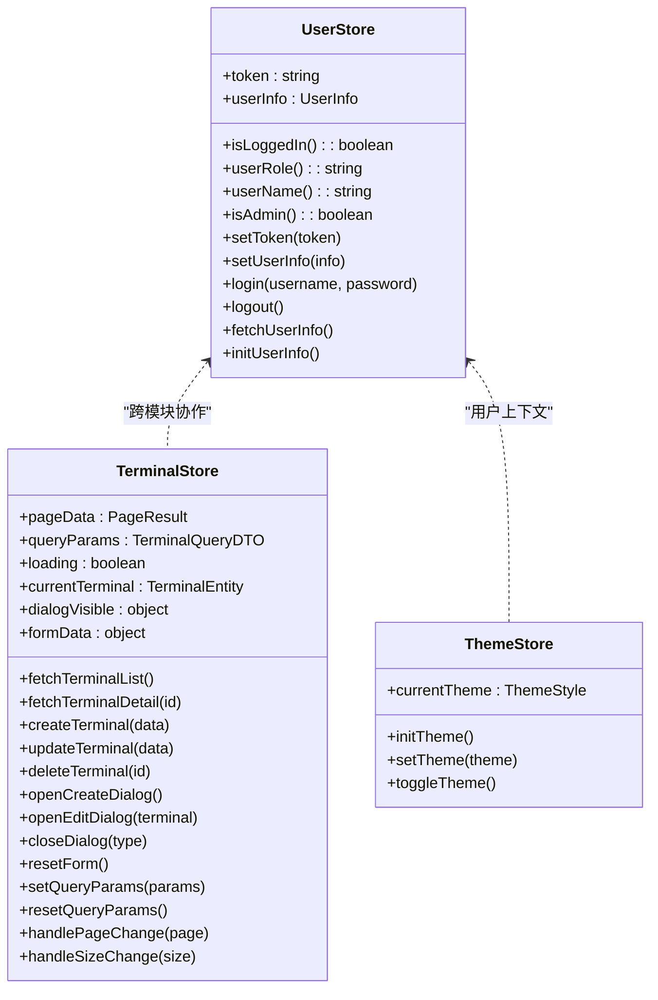
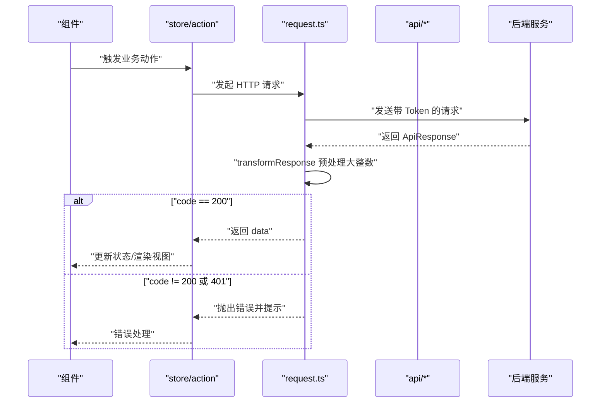
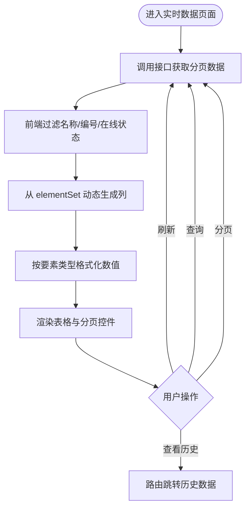
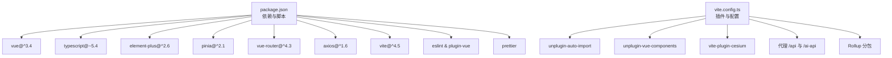

# 架构设计

<cite>
**本文引用的文件**
- [README.md](file://README.md)
- [package.json](file://package.json)
- [vite.config.ts](file://vite.config.ts)
- [src/main.ts](file://src/main.ts)
- [src/App.vue](file://src/App.vue)
- [src/router/index.ts](file://src/router/index.ts)
- [src/layouts/MainLayout.vue](file://src/layouts/MainLayout.vue)
- [src/stores/useUserStore.ts](file://src/stores/useUserStore.ts)
- [src/stores/useTerminalStore.ts](file://src/stores/useTerminalStore.ts)
- [src/stores/useThemeStore.ts](file://src/stores/useThemeStore.ts)
- [src/utils/request.ts](file://src/utils/request.ts)
- [src/api/user.ts](file://src/api/user.ts)
- [src/views/dashboard/Dashboard.vue](file://src/views/dashboard/Dashboard.vue)
- [src/views/data/RealTimeData.vue](file://src/views/data/RealTimeData.vue)
- [src/timeseries-chart.vue](file://src/timeseries-chart.vue)
- [src/components/ThemeSwitcher.vue](file://src/components/ThemeSwitcher.vue)
- [src/types/index.ts](file://src/types/index.ts)
</cite>

## 目录
1. [简介](#简介)
2. [项目结构](#项目结构)
3. [核心组件](#核心组件)
4. [架构总览](#架构总览)
5. [详细组件分析](#详细组件分析)
6. [依赖分析](#依赖分析)
7. [性能考虑](#性能考虑)
8. [故障排查指南](#故障排查指南)
9. [结论](#结论)
10. [附录](#附录)

## 简介
本项目是一个基于 Vue 3 + TypeScript 的现代化水文监测管理前端应用，采用 Composition API 与 `<script setup>` 语法，结合 Element Plus、Pinia、Vue Router、Axios 等主流生态，提供登录认证、用户管理、终端设备管理、实时/历史数据展示、地图与可视化等能力。系统通过统一的路由守卫实现权限控制，借助 Pinia 进行状态管理，并通过 Vite 构建工具实现快速开发与高效打包。

## 项目结构
项目采用按功能域划分的模块化组织方式，核心目录与职责如下：
- src/api：封装各业务模块的接口调用，统一响应结构与类型定义
- src/stores：基于 Pinia 的状态管理，拆分为用户、终端、主题等独立 Store
- src/router：路由配置与全局守卫，支持嵌套路由与权限控制
- src/layouts：布局组件，包含主布局与侧边栏、面包屑、头部导航等
- src/views：页面级组件，按模块划分（仪表盘、数据、AI、地图、系统管理等）
- src/utils：通用工具函数，如 HTTP 请求封装、格式化、校验等
- src/components：通用业务组件（如主题切换器）
- src/styles：全局样式与变量
- src/types：共享类型定义
- vite.config.ts：构建与开发服务器配置，含代理、自动导入、分包策略
- package.json：依赖与脚本定义

**图表来源**
- [src/main.ts:1-26](file://src/main.ts#L1-L26)
- [src/App.vue:1-15](file://src/App.vue#L1-L15)
- [src/router/index.ts:1-136](file://src/router/index.ts#L1-L136)
- [src/layouts/MainLayout.vue:1-434](file://src/layouts/MainLayout.vue#L1-L434)
- [src/stores/useUserStore.ts:1-200](file://src/stores/useUserStore.ts#L1-L200)
- [src/stores/useTerminalStore.ts:1-294](file://src/stores/useTerminalStore.ts#L1-L294)
- [src/stores/useThemeStore.ts:1-69](file://src/stores/useThemeStore.ts#L1-L69)
- [src/utils/request.ts:1-180](file://src/utils/request.ts#L1-L180)
- [src/api/user.ts:1-179](file://src/api/user.ts#L1-L179)
- [src/views/dashboard/Dashboard.vue:1-155](file://src/views/dashboard/Dashboard.vue#L1-L155)
- [src/views/data/RealTimeData.vue:1-300](file://src/views/data/RealTimeData.vue#L1-L300)
- [src/types/index.ts:1-51](file://src/types/index.ts#L1-L51)

**章节来源**
- [README.md:17-34](file://README.md#L17-L34)
- [package.json:14-26](file://package.json#L14-L26)

## 核心组件
- 应用入口与初始化：在入口文件中注册 Element Plus、Pinia、路由，并挂载应用。
- 路由系统：集中定义页面路由、嵌套路由与权限守卫；使用 NProgress 实现页面加载进度条。
- 布局系统：主布局组件负责侧边栏菜单、面包屑导航、头部用户信息与主题切换。
- 状态管理：用户 Store 管理登录态与用户信息；终端 Store 管理分页、查询、对话框与 CRUD；主题 Store 管理主题风格与持久化。
- HTTP 封装：统一响应结构、请求拦截器注入 Token、响应拦截器处理业务状态与错误提示，并对大整数进行安全处理。
- 视图组件：页面组件采用组合式 API，配合 Element Plus 组件实现数据展示与交互。

**章节来源**
- [src/main.ts:1-26](file://src/main.ts#L1-L26)
- [src/router/index.ts:1-136](file://src/router/index.ts#L1-L136)
- [src/layouts/MainLayout.vue:1-434](file://src/layouts/MainLayout.vue#L1-L434)
- [src/stores/useUserStore.ts:1-200](file://src/stores/useUserStore.ts#L1-L200)
- [src/stores/useTerminalStore.ts:1-294](file://src/stores/useTerminalStore.ts#L1-L294)
- [src/stores/useThemeStore.ts:1-69](file://src/stores/useThemeStore.ts#L1-L69)
- [src/utils/request.ts:1-180](file://src/utils/request.ts#L1-L180)

## 架构总览
系统采用“入口初始化 → 路由驱动 → 布局承载 → 视图交互 → 状态管理 → 数据访问”的分层架构。前端通过路由守卫实现权限控制，布局组件统一承载导航与主题切换，视图组件聚焦业务展示与交互，状态管理与 HTTP 封装提供稳定的跨模块协作。

**图表来源**
- [src/main.ts:1-26](file://src/main.ts#L1-L26)
- [src/router/index.ts:1-136](file://src/router/index.ts#L1-L136)
- [src/layouts/MainLayout.vue:1-434](file://src/layouts/MainLayout.vue#L1-L434)
- [src/stores/useUserStore.ts:1-200](file://src/stores/useUserStore.ts#L1-L200)
- [src/stores/useTerminalStore.ts:1-294](file://src/stores/useTerminalStore.ts#L1-L294)
- [src/stores/useThemeStore.ts:1-69](file://src/stores/useThemeStore.ts#L1-L69)
- [src/utils/request.ts:1-180](file://src/utils/request.ts#L1-L180)
- [src/api/user.ts:1-179](file://src/api/user.ts#L1-L179)
- [src/views/dashboard/Dashboard.vue:1-155](file://src/views/dashboard/Dashboard.vue#L1-L155)
- [src/views/data/RealTimeData.vue:1-300](file://src/views/data/RealTimeData.vue#L1-L300)

## 详细组件分析

### 路由与权限控制
- 路由结构：采用嵌套路由组织模块菜单，支持子路由与重定向；通过 meta 字段配置标题、图标与权限标志。
- 权限守卫：在 beforeEach 中判断是否需要登录与 Token 是否存在，未登录访问受保护路由跳转登录，已登录访问登录页跳转首页；afterEach 控制进度条结束。
- 进度条：使用 NProgress 在路由切换时显示加载进度。

**图表来源**
- [src/router/index.ts:116-133](file://src/router/index.ts#L116-L133)

**章节来源**
- [src/router/index.ts:1-136](file://src/router/index.ts#L1-L136)

### 布局与导航
- 侧边栏菜单：根据路由配置动态生成菜单与子菜单，支持折叠与图标渲染；菜单项与路由索引一致，点击即路由跳转。
- 面包屑：根据 matched 生成层级标题，便于定位当前页面。
- 头部导航：包含主题切换器、用户头像与下拉菜单（个人中心、退出登录）。
- 主题管理：主题 Store 支持初始化与切换，主题配置映射到侧边栏颜色与激活色。

**图表来源**
- [src/layouts/MainLayout.vue:138-210](file://src/layouts/MainLayout.vue#L138-L210)
- [src/stores/useThemeStore.ts:34-68](file://src/stores/useThemeStore.ts#L34-L68)

**章节来源**
- [src/layouts/MainLayout.vue:1-434](file://src/layouts/MainLayout.vue#L1-L434)
- [src/stores/useThemeStore.ts:1-69](file://src/stores/useThemeStore.ts#L1-L69)

### 状态管理（Pinia）
- 用户 Store：维护 Token、用户信息、登录/登出、从 Token 解析用户名、默认用户回退、初始化恢复等。
- 终端 Store：管理分页、查询参数、加载状态、当前详情、对话框状态与表单数据；提供列表、详情、增删改、分页变更等动作。
- 主题 Store：维护当前主题风格、主题配置映射、初始化与切换、循环切换。

**图表来源**
- [src/stores/useUserStore.ts:18-199](file://src/stores/useUserStore.ts#L18-L199)
- [src/stores/useTerminalStore.ts:23-293](file://src/stores/useTerminalStore.ts#L23-L293)
- [src/stores/useThemeStore.ts:34-68](file://src/stores/useThemeStore.ts#L34-L68)

**章节来源**
- [src/stores/useUserStore.ts:1-200](file://src/stores/useUserStore.ts#L1-L200)
- [src/stores/useTerminalStore.ts:1-294](file://src/stores/useTerminalStore.ts#L1-L294)
- [src/stores/useThemeStore.ts:1-69](file://src/stores/useThemeStore.ts#L1-L69)

### HTTP 与数据访问
- 统一响应结构：定义 ApiResponse，响应拦截器根据 code 判断业务状态，非 200 统一提示并处理 Token 失效。
- 请求拦截器：自动注入 Authorization 头（Bearer Token）。
- 大整数安全：在 transformResponse 中预处理 JSON，将超安全范围的大整数转为字符串，避免精度丢失。
- 接口封装：按模块拆分 API 文件，统一导出 get/post/put/del 方法，返回业务数据 T。

**图表来源**
- [src/utils/request.ts:52-151](file://src/utils/request.ts#L52-L151)
- [src/api/user.ts:106-178](file://src/api/user.ts#L106-L178)

**章节来源**
- [src/utils/request.ts:1-180](file://src/utils/request.ts#L1-L180)
- [src/api/user.ts:1-179](file://src/api/user.ts#L1-L179)

### 视图组件与数据流
- 仪表盘：统计卡片与图表占位，便于后续接入 ECharts 等可视化库。
- 实时数据：支持搜索过滤、分页、动态列渲染（根据要素集合生成列）、格式化数值、跳转历史数据。

**图表来源**
- [src/views/data/RealTimeData.vue:108-279](file://src/views/data/RealTimeData.vue#L108-L279)

**章节来源**
- [src/views/dashboard/Dashboard.vue:1-155](file://src/views/dashboard/Dashboard.vue#L1-L155)
- [src/views/data/RealTimeData.vue:1-300](file://src/views/data/RealTimeData.vue#L1-L300)

## 依赖分析
- 技术栈：Vue 3.4+、TypeScript 5.4+、Element Plus 2.6+、Pinia 2.1+、Vue Router 4.3+、Axios 1.6+、Vite 5.2+、SCSS、ESLint + Prettier。
- 构建与插件：自动导入 Element Plus 与 Vue API、组件自动注册、Cesium 插件、代理配置、分包策略（element-plus、vendor）。
- 环境变量：通过 .env.* 配置 API 基础地址与端口，支持开发与生产差异化。

**图表来源**
- [package.json:14-46](file://package.json#L14-L46)
- [vite.config.ts:14-67](file://vite.config.ts#L14-L67)

**章节来源**
- [README.md:5-16](file://README.md#L5-L16)
- [package.json:1-48](file://package.json#L1-L48)
- [vite.config.ts:1-68](file://vite.config.ts#L1-L68)

## 性能考虑
- 构建优化：启用 Rollup 分包，将 element-plus 与常用依赖单独拆分，减少首屏体积；关闭 Source Map 以降低生产体积。
- 路由懒加载：路由组件通过动态导入实现按需加载，提升初始加载速度。
- 请求优化：统一拦截器注入 Token，避免重复携带；响应拦截器直接返回 data，减少嵌套层级。
- 大整数安全：在响应阶段预处理 JSON，将超安全范围整数转为字符串，避免精度丢失导致的数据错误。
- UI 渲染：表格与分页组件按需渲染，动态列仅在数据到达后生成，降低计算压力。

**章节来源**
- [vite.config.ts:53-67](file://vite.config.ts#L53-L67)
- [src/router/index.ts:12-13](file://src/router/index.ts#L12-L13)
- [src/utils/request.ts:22-50](file://src/utils/request.ts#L22-L50)

## 故障排查指南
- 登录失败：检查登录接口返回的 token 是否存在，确认响应拦截器是否正确提取 data；查看错误消息提示。
- Token 失效：响应拦截器检测到 401 会触发登出并跳转登录页，检查后端签发的 token 有效期与签名。
- 网络错误：根据响应状态码映射提示（400/401/403/404/500/503），确认代理配置与后端服务可用性。
- 大整数异常：若出现 ID 精度丢失，确认响应阶段的大整数预处理逻辑是否生效。
- 路由权限：若无法访问受保护路由，检查本地存储中的 token 与路由守卫逻辑。
- 主题切换：确认主题配置映射与本地存储键值一致，初始化是否正确读取。

**章节来源**
- [src/utils/request.ts:95-151](file://src/utils/request.ts#L95-L151)
- [src/router/index.ts:116-133](file://src/router/index.ts#L116-L133)
- [src/stores/useThemeStore.ts:44-66](file://src/stores/useThemeStore.ts#L44-L66)

## 结论
该水文监测管理系统以 Vue 3 为核心，结合 Element Plus、Pinia、Vue Router、Axios 与 Vite，形成清晰的分层架构与模块化组织。通过统一的路由守卫与状态管理，实现了良好的权限控制与用户体验；通过 HTTP 封装与构建优化，保障了数据安全与性能表现。整体设计具备良好的可扩展性与可维护性，适合在后续迭代中持续扩展新模块与功能。

## 附录
- 设计原则
  - 单一职责：每个 Store 聚焦单一领域（用户/终端/主题），API 文件按模块拆分。
  - 可测试性：组合式 API 与明确的 Action/Getter，便于单元测试与集成测试。
  - 可扩展性：路由与布局解耦，新增模块只需新增路由与页面组件即可。
- 最佳实践
  - 统一响应结构与错误处理，避免分散的错误分支。
  - 使用动态导入与懒加载，优化首屏性能。
  - 在类型系统中明确字段约束，减少运行时错误。
  - 通过环境变量隔离开发与生产配置，便于部署与运维。