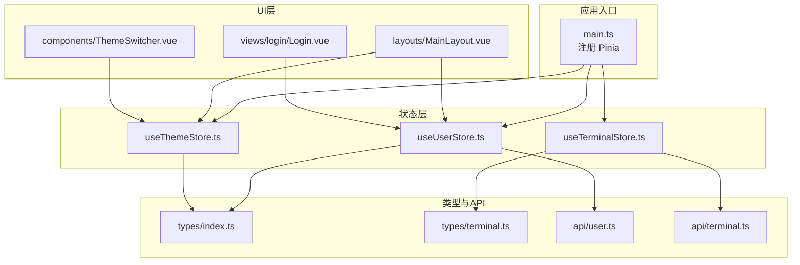
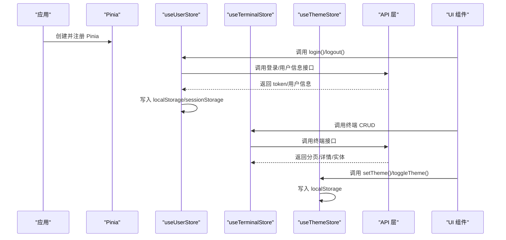
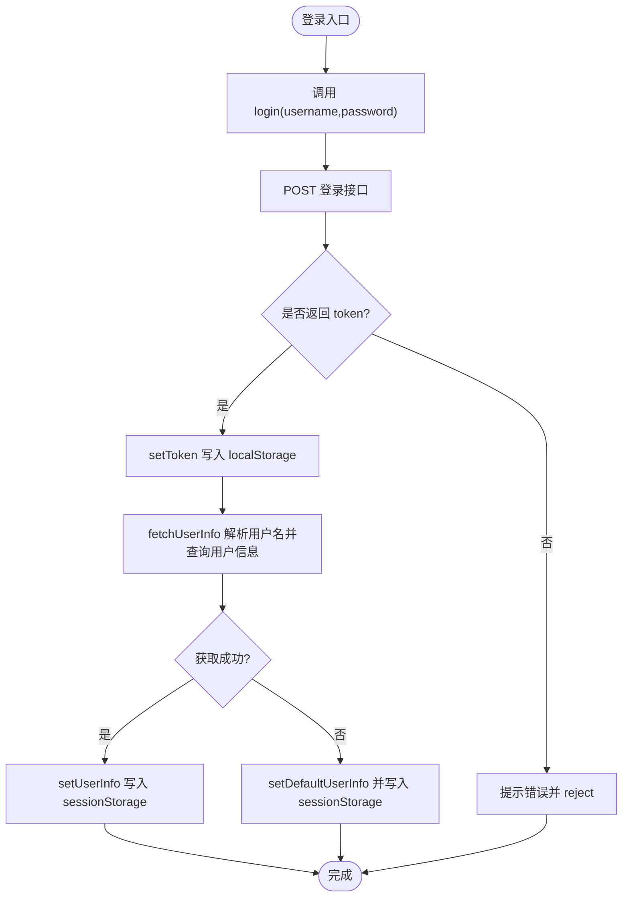
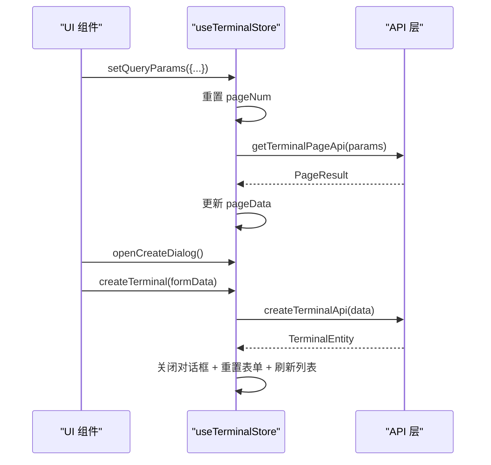
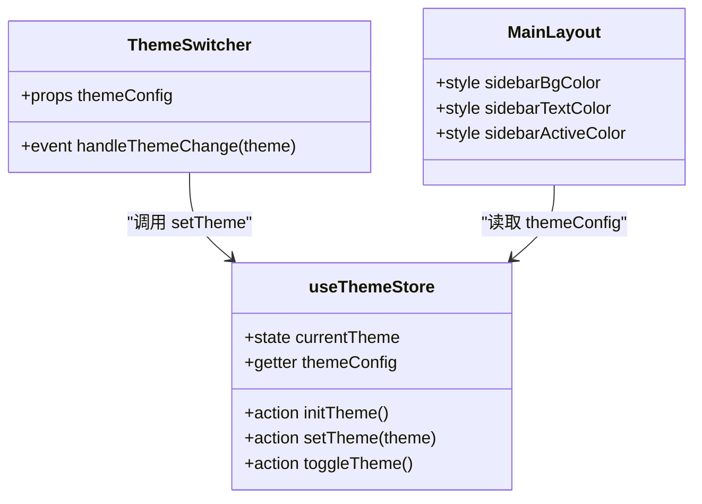
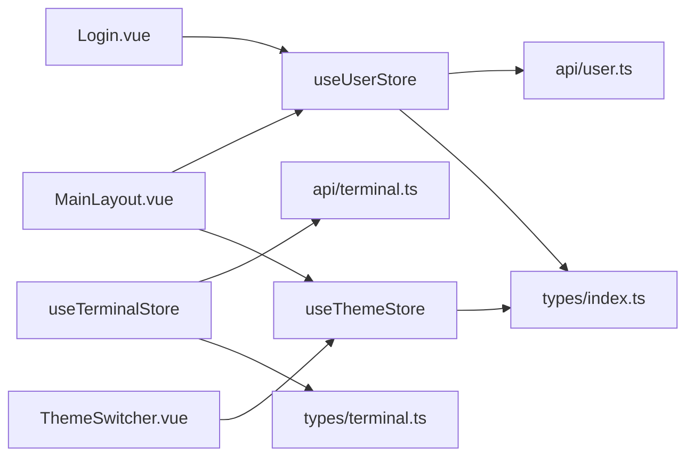

# 状态管理

<cite>
**本文引用的文件**
- [useUserStore.ts](file://src/stores/useUserStore.ts)
- [useTerminalStore.ts](file://src/stores/useTerminalStore.ts)
- [useThemeStore.ts](file://src/stores/useThemeStore.ts)
- [main.ts](file://src/main.ts)
- [index.ts](file://src/types/index.ts)
- [terminal.ts](file://src/types/terminal.ts)
- [user.ts](file://src/api/user.ts)
- [terminal.ts](file://src/api/terminal.ts)
- [ThemeSwitcher.vue](file://src/components/ThemeSwitcher.vue)
- [MainLayout.vue](file://src/layouts/MainLayout.vue)
- [Login.vue](file://src/views/login/Login.vue)
</cite>

## 目录
1. [简介](#简介)
2. [项目结构](#项目结构)
3. [核心组件](#核心组件)
4. [架构总览](#架构总览)
5. [详细组件分析](#详细组件分析)
6. [依赖分析](#依赖分析)
7. [性能考虑](#性能考虑)
8. [故障排查指南](#故障排查指南)
9. [结论](#结论)
10. [附录](#附录)

## 简介
本文件面向“水文监测管理系统”的前端状态管理，系统采用 Pinia 进行状态管理，围绕三大核心 store：用户状态管理（useUserStore）、终端设备状态管理（useTerminalStore）与主题状态管理（useThemeStore）。本文将从架构设计、状态定义、Action 实现、持久化策略、跨组件共享、store 间通信、最佳实践、性能优化与内存管理等方面进行深入说明，并提供可视化图示帮助理解。

## 项目结构
- 应用通过根入口在应用初始化时注册 Pinia，随后各页面与组件按需使用对应 store。
- store 文件位于 src/stores 下，分别封装用户、终端、主题三类状态域。
- 类型定义集中在 src/types 下，API 封装在 src/api 下，组件在 src/components 与 views 中消费 store。

图表来源
- [main.ts:19](file://src/main.ts#L19)
- [useUserStore.ts:1](file://src/stores/useUserStore.ts#L1)
- [useTerminalStore.ts:1](file://src/stores/useTerminalStore.ts#L1)
- [useThemeStore.ts:1](file://src/stores/useThemeStore.ts#L1)
- [user.ts:1](file://src/api/user.ts#L1)
- [terminal.ts:1](file://src/api/terminal.ts#L1)
- [index.ts:1](file://src/types/index.ts#L1)
- [terminal.ts:1](file://src/types/terminal.ts#L1)
- [MainLayout.vue:122-129](file://src/layouts/MainLayout.vue#L122-L129)
- [ThemeSwitcher.vue:39](file://src/components/ThemeSwitcher.vue#L39)
- [Login.vue:85-88](file://src/views/login/Login.vue#L85-L88)

章节来源
- [main.ts:19](file://src/main.ts#L19)
- [useUserStore.ts:1](file://src/stores/useUserStore.ts#L1)
- [useTerminalStore.ts:1](file://src/stores/useTerminalStore.ts#L1)
- [useThemeStore.ts:1](file://src/stores/useThemeStore.ts#L1)

## 核心组件
- 用户状态管理（useUserStore）
  - 职责：登录态维护、用户信息获取与缓存、JWT Token 管理、默认用户兜底。
  - 关键状态：token、userInfo。
  - 关键计算属性：isLoggedIn、userRole、userName、isAdmin。
  - 关键 Action：login、logout、fetchUserInfo、setToken、setUserInfo、initUserInfo。
  - 持久化：localStorage 存 token；sessionStorage 存 userInfo，刷新恢复。
- 终端设备状态管理（useTerminalStore）
  - 职责：终端分页列表、详情、增删改查、查询参数与分页控制、对话框状态与表单数据。
  - 关键状态：pageData、queryParams、loading、currentTerminal、dialogVisible、formData。
  - 关键 Action：fetchTerminalList、fetchTerminalDetail、createTerminal、updateTerminal、deleteTerminal、openCreateDialog、openEditDialog、closeDialog、setQueryParams、resetQueryParams、handlePageChange、handleSizeChange。
  - 持久化：无全局持久化，依赖 API 数据；表单数据在对话框关闭时清理。
- 主题状态管理（useThemeStore）
  - 职责：主题风格切换与持久化，提供当前主题配置。
  - 关键状态：currentTheme。
  - 关键 Getter：themeConfig。
  - 关键 Action：initTheme、setTheme、toggleTheme。
  - 持久化：localStorage 存储当前主题。

章节来源
- [useUserStore.ts:18-199](file://src/stores/useUserStore.ts#L18-L199)
- [useTerminalStore.ts:23-293](file://src/stores/useTerminalStore.ts#L23-L293)
- [useThemeStore.ts:34-68](file://src/stores/useThemeStore.ts#L34-L68)

## 架构总览
Pinia 在应用启动时被注册，随后各 store 作为独立模块暴露状态与方法，UI 组件通过组合式 API 使用 store。用户与主题 store 的持久化策略不同：用户信息在登录后写入 sessionStorage 以便刷新恢复，主题在 localStorage 持久化；终端 store 以 API 数据为主，不进行全局持久化。

图表来源
- [main.ts:19](file://src/main.ts#L19)
- [useUserStore.ts:61-94](file://src/stores/useUserStore.ts#L61-L94)
- [useTerminalStore.ts:72-180](file://src/stores/useTerminalStore.ts#L72-L180)
- [useThemeStore.ts:45-66](file://src/stores/useThemeStore.ts#L45-L66)
- [user.ts:106-128](file://src/api/user.ts#L106-L128)
- [terminal.ts:16-58](file://src/api/terminal.ts#L16-L58)

## 详细组件分析

### 用户状态管理（useUserStore）
- 设计原则
  - 使用组合式函数风格定义 store，集中管理登录态与用户信息。
  - 通过 computed 提供派生状态，减少重复计算。
  - 通过 Action 封装异步流程，统一错误处理与消息提示。
- 状态与计算属性
  - token：JWT 认证令牌，持久化于 localStorage。
  - userInfo：用户信息对象，持久化于 sessionStorage，刷新后恢复。
  - 计算属性：isLoggedIn、userRole、userName、isAdmin。
- 异步 Action
  - login：调用登录接口，设置 token 并拉取用户信息。
  - logout：清空 token 与 userInfo，移除本地存储。
  - fetchUserInfo：从 token 解析用户名，调用用户查询接口，设置 userInfo。
  - initUserInfo：从 sessionStorage 恢复用户信息。
  - setToken/setUserInfo：写入本地存储与内存状态。
- 错误处理与兜底
  - 登录失败与获取用户信息失败均弹出消息提示。
  - 解析 token 失败或用户名为空时，使用默认管理员信息，保证功能可用性。

图表来源
- [useUserStore.ts:61-125](file://src/stores/useUserStore.ts#L61-L125)
- [user.ts:106-128](file://src/api/user.ts#L106-L128)

章节来源
- [useUserStore.ts:18-199](file://src/stores/useUserStore.ts#L18-L199)
- [user.ts:106-128](file://src/api/user.ts#L106-L128)

### 终端设备状态管理（useTerminalStore）
- 设计原则
  - 以“页面级状态”为中心，聚合分页、查询参数、加载状态、对话框与表单数据。
  - CRUD 操作通过 Action 封装，统一处理 loading、错误提示与后续刷新。
- 状态与方法
  - pageData：分页结果，包含 current、size、total、pages、records。
  - queryParams：查询参数，含名称、编码、在线状态、pageNum、pageSize。
  - loading：全局加载状态。
  - currentTerminal：当前选中终端详情。
  - dialogVisible：创建/编辑/详情对话框开关。
  - formData：表单数据，支持创建与编辑。
  - 关键 Action：列表查询、详情查询、创建、更新、删除、对话框开关、表单重置、分页变更。
- 数据流
  - 列表查询：setQueryParams/重置查询/分页变更触发 fetchTerminalList。
  - 详情查询：fetchTerminalDetail 设置 currentTerminal 并打开详情对话框。
  - CRUD：create/update/delete 成功后关闭对话框、重置表单、刷新列表。

图表来源
- [useTerminalStore.ts:72-180](file://src/stores/useTerminalStore.ts#L72-L180)
- [terminal.ts:16-58](file://src/api/terminal.ts#L16-L58)

章节来源
- [useTerminalStore.ts:23-293](file://src/stores/useTerminalStore.ts#L23-L293)
- [terminal.ts:16-58](file://src/api/terminal.ts#L16-L58)

### 主题状态管理（useThemeStore）
- 设计原则
  - 使用 state + getter + action 的经典模式，主题配置集中映射。
  - 通过 localStorage 实现跨会话持久化，应用启动时自动恢复。
- 状态与方法
  - state：currentTheme。
  - getter：themeConfig，根据当前主题返回配置对象。
  - action：
    - initTheme：从 localStorage 恢复主题。
    - setTheme：切换并持久化主题。
    - toggleTheme：循环切换下一个主题。
- 与 UI 的集成
  - Layout 侧边栏与头部组件读取 themeConfig 动态设置样式。
  - ThemeSwitcher 组件通过下拉菜单触发 setTheme。

图表来源
- [useThemeStore.ts:34-68](file://src/stores/useThemeStore.ts#L34-L68)
- [ThemeSwitcher.vue:39](file://src/components/ThemeSwitcher.vue#L39)
- [MainLayout.vue:7,25-27](file://src/layouts/MainLayout.vue#L7,L25-L27)

章节来源
- [useThemeStore.ts:34-68](file://src/stores/useThemeStore.ts#L34-L68)
- [ThemeSwitcher.vue:39](file://src/components/ThemeSwitcher.vue#L39)
- [MainLayout.vue:7,25-27](file://src/layouts/MainLayout.vue#L7,L25-L27)

## 依赖分析
- store 与 API 的依赖
  - useUserStore 依赖 user.ts 的登录与用户查询接口。
  - useTerminalStore 依赖 terminal.ts 的终端分页、详情、CRUD 接口。
- store 与类型定义
  - useUserStore 依赖 types/index.ts 的用户状态与角色枚举。
  - useTerminalStore 依赖 types/terminal.ts 的终端实体、查询与分页类型。
- store 与 UI 的依赖
  - MainLayout 依赖 useUserStore 与 useThemeStore，动态渲染侧边栏与头部。
  - ThemeSwitcher 依赖 useThemeStore，提供主题切换交互。
  - Login 页面依赖 useUserStore，执行登录流程。
- store 间的耦合
  - 三个 store 相互独立，无直接依赖；通过 UI 层协调使用。
  - 主题与用户信息可影响 UI 渲染，但不形成循环依赖。

图表来源
- [useUserStore.ts:1](file://src/stores/useUserStore.ts#L1)
- [useTerminalStore.ts:1](file://src/stores/useTerminalStore.ts#L1)
- [useThemeStore.ts:1](file://src/stores/useThemeStore.ts#L1)
- [user.ts:1](file://src/api/user.ts#L1)
- [terminal.ts:1](file://src/api/terminal.ts#L1)
- [index.ts:1](file://src/types/index.ts#L1)
- [terminal.ts:1](file://src/types/terminal.ts#L1)
- [MainLayout.vue:122-129](file://src/layouts/MainLayout.vue#L122-L129)
- [ThemeSwitcher.vue:39](file://src/components/ThemeSwitcher.vue#L39)
- [Login.vue:85-88](file://src/views/login/Login.vue#L85-L88)

章节来源
- [useUserStore.ts:1](file://src/stores/useUserStore.ts#L1)
- [useTerminalStore.ts:1](file://src/stores/useTerminalStore.ts#L1)
- [useThemeStore.ts:1](file://src/stores/useThemeStore.ts#L1)

## 性能考虑
- 状态粒度与响应式开销
  - useTerminalStore 使用 reactive 聚合分页与查询参数，建议在高频更新场景（如搜索输入）配合防抖，避免频繁触发查询。
  - useUserStore 的 userInfo 仅在登录后写入 sessionStorage，刷新恢复成本低。
- 异步流程与并发控制
  - CRUD 操作统一设置 loading，避免重复提交；建议在 UI 层对按钮禁用与加载态进行协同。
- 持久化策略
  - 用户信息使用 sessionStorage，避免 localStorage 长期占用；主题使用 localStorage，适合跨会话持久化。
- 内存管理
  - 终端表单数据在对话框关闭时重置，防止长期持有。
  - 登出时清理 token 与 userInfo，释放内存。
- UI 渲染优化
  - Layout 侧边栏与头部样式由 themeConfig 动态绑定，建议在主题切换时尽量减少不必要的组件重渲染。

[本节为通用性能建议，无需特定文件来源]

## 故障排查指南
- 登录失败
  - 现象：登录接口返回异常或 token 缺失。
  - 排查：确认登录接口返回结构，检查 setToken 是否正确写入 localStorage；查看 fetchUserInfo 的 token 解析逻辑。
  - 参考
    - [useUserStore.ts:61-83](file://src/stores/useUserStore.ts#L61-L83)
    - [user.ts:106-108](file://src/api/user.ts#L106-L108)
- 获取用户信息失败
  - 现象：token 存在但解析用户名失败或接口异常。
  - 排查：检查 parseUsernameFromToken 的 JWT 结构；确认 getUserByUsernameApi 的返回值；若失败回退至默认用户信息。
  - 参考
    - [useUserStore.ts:100-125](file://src/stores/useUserStore.ts#L100-L125)
    - [user.ts:126](file://src/api/user.ts#L126)
- 终端列表查询异常
  - 现象：列表加载失败或无数据。
  - 排查：检查 getTerminalPageApi 的参数传递与分页字段；确认 pageData 更新逻辑；查看 loading 状态是否正确收尾。
  - 参考
    - [useTerminalStore.ts:72-93](file://src/stores/useTerminalStore.ts#L72-L93)
    - [terminal.ts:16](file://src/api/terminal.ts#L16)
- 主题切换无效
  - 现象：切换主题后样式未变化。
  - 排查：确认 setTheme 是否写入 localStorage；检查 themeConfig 的 getter 是否生效；确认 Layout 与 ThemeSwitcher 的绑定。
  - 参考
    - [useThemeStore.ts:53-58](file://src/stores/useThemeStore.ts#L53-L58)
    - [MainLayout.vue:7,25-27](file://src/layouts/MainLayout.vue#L7,L25-L27)
    - [ThemeSwitcher.vue:80-82](file://src/components/ThemeSwitcher.vue#L80-L82)

章节来源
- [useUserStore.ts:61-125](file://src/stores/useUserStore.ts#L61-L125)
- [useTerminalStore.ts:72-93](file://src/stores/useTerminalStore.ts#L72-L93)
- [useThemeStore.ts:53-58](file://src/stores/useThemeStore.ts#L53-L58)
- [user.ts:106-128](file://src/api/user.ts#L106-L128)
- [terminal.ts:16](file://src/api/terminal.ts#L16)
- [MainLayout.vue:7,25-27](file://src/layouts/MainLayout.vue#L7,L25-L27)
- [ThemeSwitcher.vue:80-82](file://src/components/ThemeSwitcher.vue#L80-L82)

## 结论
本系统采用 Pinia 的组合式函数风格 store，清晰划分用户、终端、主题三大状态域，结合 API 层与类型定义，实现了高内聚、低耦合的状态管理架构。通过合理的持久化策略与错误兜底机制，保障了用户体验与系统稳定性。建议在高频交互场景引入防抖与并发控制，在 UI 层强化加载态与禁用态协同，持续优化渲染性能与内存占用。

[本节为总结性内容，无需特定文件来源]

## 附录

### 最佳实践清单
- 状态结构设计
  - 将页面级状态（如分页、查询参数、对话框状态）聚合在单一 store，便于跨组件共享。
  - 将用户信息与主题配置等跨页面状态拆分为独立 store，降低耦合。
- 异步 Action 处理
  - 统一设置 loading，finally 收尾，避免状态悬挂。
  - 明确错误处理与消息提示，必要时提供兜底数据。
- 状态调试技巧
  - 在浏览器开发者工具中查看 Pinia DevTools，观察 state、getters、actions 的变化。
  - 对关键 Action 添加日志输出，定位异步流程问题。
- 性能优化与内存管理
  - 高频输入场景使用防抖；对话框关闭时重置表单数据；登出时清理 token 与 userInfo。
  - 合理选择持久化介质：短期会话用 sessionStorage，跨会话用 localStorage。

[本节为通用指导，无需特定文件来源]