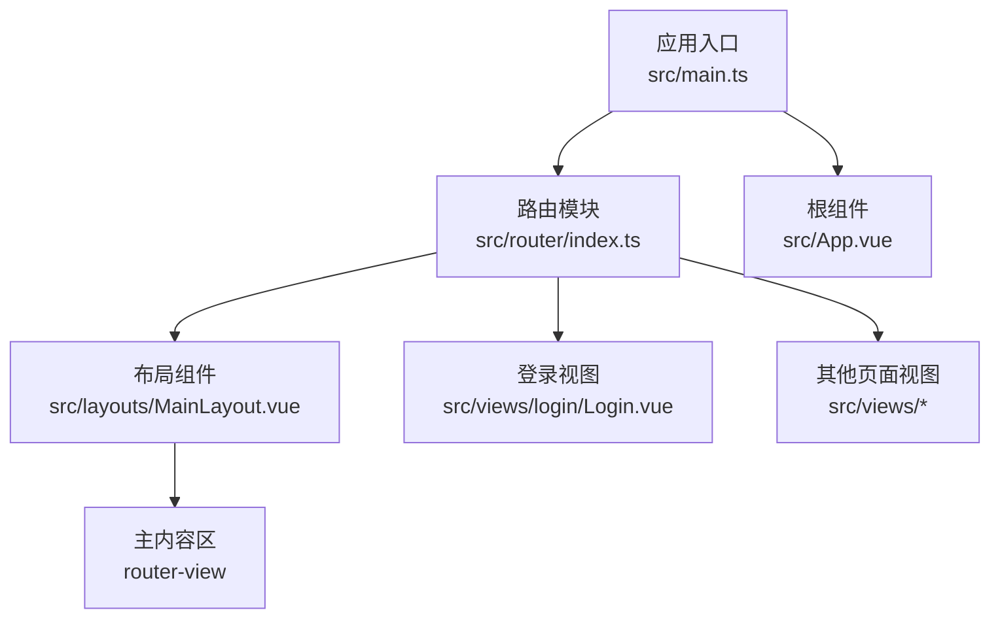
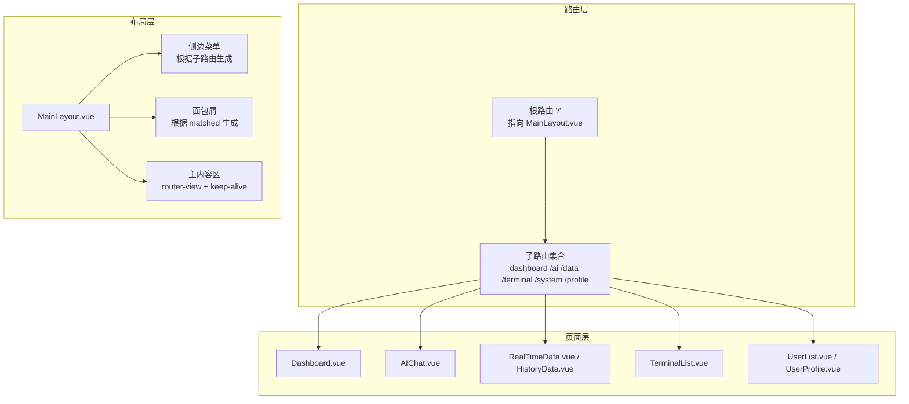
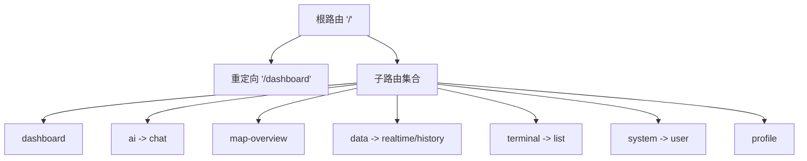
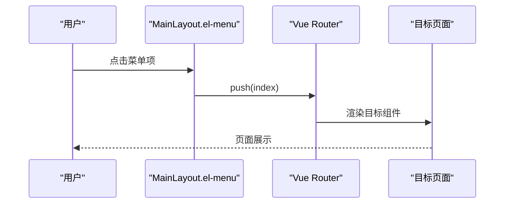
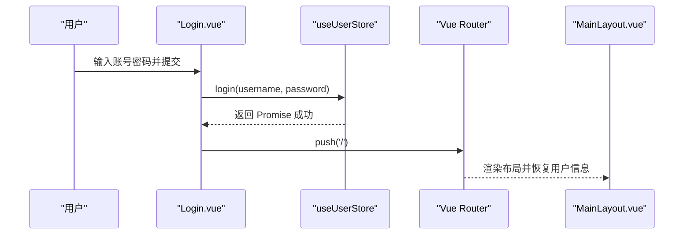
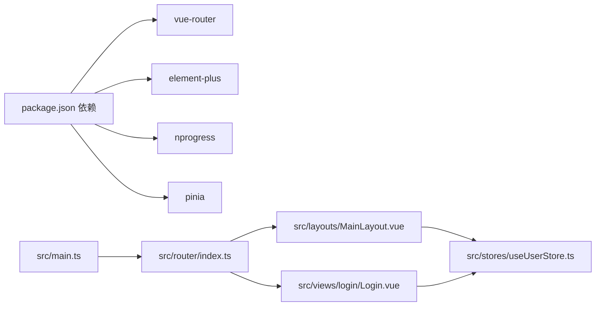
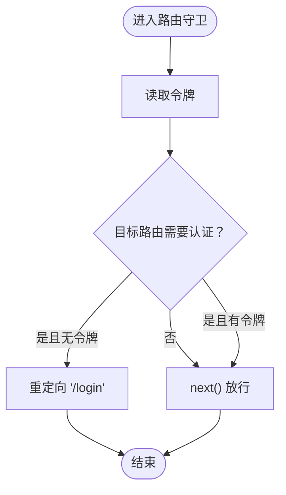

# 路由系统

<cite>
**本文引用的文件列表**
- [src/router/index.ts](file://src/router/index.ts)
- [src/main.ts](file://src/main.ts)
- [src/layouts/MainLayout.vue](file://src/layouts/MainLayout.vue)
- [src/views/login/Login.vue](file://src/views/login/Login.vue)
- [src/stores/useUserStore.ts](file://src/stores/useUserStore.ts)
- [src/App.vue](file://src/App.vue)
- [vite.config.ts](file://vite.config.ts)
- [package.json](file://package.json)
</cite>

## 目录
1. [简介](#简介)
2. [项目结构与入口](#项目结构与入口)
3. [核心组件与职责](#核心组件与职责)
4. [架构总览](#架构总览)
5. [详细组件分析](#详细组件分析)
6. [依赖关系分析](#依赖关系分析)
7. [性能与懒加载](#性能与懒加载)
8. [权限与菜单](#权限与菜单)
9. [路由守卫机制](#路由守卫机制)
10. [参数传递与元信息](#参数传递与元信息)
11. [错误处理与重定向](#错误处理与重定向)
12. [最佳实践与示例](#最佳实践与示例)
13. [结论](#结论)

## 简介
本文件面向“水文监测管理系统”的前端路由系统，基于 Vue Router 4 进行架构与实现说明。重点覆盖：
- 路由表组织结构与嵌套路由设计理念
- 动态路由与懒加载配置
- 全局前置守卫、路由独享守卫与组件内守卫的使用场景
- 权限控制在路由层面的实现（基于令牌与元信息）
- 菜单动态生成与面包屑联动
- 导航进度条与导航错误处理
- 性能优化策略与最佳实践

## 项目结构与入口
- 应用通过根组件挂载路由实例，路由表集中于路由模块，布局组件负责菜单与主内容区渲染。
- 关键入口与模块：
  - 应用入口：应用在入口文件中注册路由插件并挂载。
  - 路由定义：集中于路由模块，包含路由表、导航守卫与进度条。
  - 布局组件：侧边菜单、面包屑、头部用户信息与主内容区。
  - 登录视图：提供登录流程与跳转逻辑。
  - 用户状态：通过 Pinia Store 管理令牌与用户信息。

图表来源
- [src/main.ts:1-26](file://src/main.ts#L1-L26)
- [src/router/index.ts:111-114](file://src/router/index.ts#L111-L114)
- [src/layouts/MainLayout.vue:106-112](file://src/layouts/MainLayout.vue#L106-L112)
- [src/App.vue:1-3](file://src/App.vue#L1-L3)

章节来源
- [src/main.ts:1-26](file://src/main.ts#L1-L26)
- [src/router/index.ts:111-114](file://src/router/index.ts#L111-L114)
- [src/App.vue:1-3](file://src/App.vue#L1-L3)

## 核心组件与职责
- 路由模块：定义路由表、配置导航进度条、实现全局前置守卫与后置钩子。
- 布局组件：渲染菜单树、面包屑、头部用户信息；通过计算属性读取路由表生成菜单。
- 登录视图：校验表单、调用用户 Store 执行登录、成功后跳转首页。
- 用户 Store：管理令牌、用户信息、登录/登出、初始化用户信息。
- 应用根组件：承载顶层路由视图容器。

章节来源
- [src/router/index.ts:8-135](file://src/router/index.ts#L8-L135)
- [src/layouts/MainLayout.vue:137-144](file://src/layouts/MainLayout.vue#L137-L144)
- [src/views/login/Login.vue:80-134](file://src/views/login/Login.vue#L80-L134)
- [src/stores/useUserStore.ts:18-199](file://src/stores/useUserStore.ts#L18-L199)
- [src/App.vue:1-3](file://src/App.vue#L1-L3)

## 架构总览
系统采用“路由驱动布局”的模式：根路由指向布局组件，布局内部通过子路由渲染具体页面；菜单与面包屑均基于路由表动态生成。

图表来源
- [src/router/index.ts:16-109](file://src/router/index.ts#L16-L109)
- [src/layouts/MainLayout.vue:20-55](file://src/layouts/MainLayout.vue#L20-L55)
- [src/layouts/MainLayout.vue:106-112](file://src/layouts/MainLayout.vue#L106-L112)

## 详细组件分析

### 路由表与嵌套路由
- 根路由指向布局组件，并设置默认重定向至仪表盘。
- 子路由按功能模块划分，形成多级菜单结构：
  - 一级菜单：仪表盘、AI助手、地图概览、查看数据、终端管理、系统管理、个人中心。
  - 二级菜单：AI助手下的智能问答；查看数据下的实时数据、历史数据；终端管理下的终端；系统管理下的用户管理。
- 子路由通过 meta 字段携带标题、图标与权限标记，用于菜单与面包屑渲染。

图表来源
- [src/router/index.ts:16-109](file://src/router/index.ts#L16-L109)

章节来源
- [src/router/index.ts:8-109](file://src/router/index.ts#L8-L109)

### 动态路由与懒加载
- 所有页面组件均采用动态导入（懒加载）以提升首屏性能。
- 构建阶段通过 Rollup 的 manualChunks 将第三方库拆分，减少单体包体积。
- 进度条在每次导航开始时启动，结束时完成，提升用户体验。

章节来源
- [src/router/index.ts:12-12, 24-104:12-12](file://src/router/index.ts#L12-L12)
- [vite.config.ts:58-63](file://vite.config.ts#L58-L63)
- [src/router/index.ts:117-133](file://src/router/index.ts#L117-L133)

### 菜单动态生成与面包屑
- 布局组件通过计算属性读取根路由的子路由集合，动态生成菜单树。
- 一级菜单无子菜单时直接渲染为菜单项，有子菜单时渲染为子菜单组。
- 面包屑通过 matched 过滤 meta.title 生成，与当前路由路径一致。
- 菜单项的 index 通过工具函数解析为完整路径，保证 Element Plus 菜单与路由一致。

图表来源
- [src/layouts/MainLayout.vue:20-55](file://src/layouts/MainLayout.vue#L20-L55)
- [src/layouts/MainLayout.vue:137-144](file://src/layouts/MainLayout.vue#L137-L144)
- [src/layouts/MainLayout.vue:169-188](file://src/layouts/MainLayout.vue#L169-L188)

章节来源
- [src/layouts/MainLayout.vue:20-55](file://src/layouts/MainLayout.vue#L20-L55)
- [src/layouts/MainLayout.vue:137-144](file://src/layouts/MainLayout.vue#L137-L144)
- [src/layouts/MainLayout.vue:169-188](file://src/layouts/MainLayout.vue#L169-L188)

### 登录流程与令牌管理
- 登录页提供表单校验与提交，成功后调用用户 Store 的登录方法并设置令牌。
- 登录成功后跳转首页，布局组件在 mounted 阶段恢复用户信息与主题。
- 用户 Store 提供令牌持久化、用户信息获取与默认信息回退逻辑。

图表来源
- [src/views/login/Login.vue:117-134](file://src/views/login/Login.vue#L117-L134)
- [src/stores/useUserStore.ts:61-83](file://src/stores/useUserStore.ts#L61-L83)
- [src/layouts/MainLayout.vue:206-210](file://src/layouts/MainLayout.vue#L206-L210)

章节来源
- [src/views/login/Login.vue:80-134](file://src/views/login/Login.vue#L80-L134)
- [src/stores/useUserStore.ts:18-199](file://src/stores/useUserStore.ts#L18-L199)
- [src/layouts/MainLayout.vue:206-210](file://src/layouts/MainLayout.vue#L206-L210)

## 依赖关系分析
- 路由模块依赖 Vue Router 4 与 NProgress。
- 布局组件依赖 Element Plus 菜单、面包屑与图标，以及用户与主题 Store。
- 登录视图依赖用户 Store 与路由实例进行导航。
- 应用入口注册路由插件并挂载根组件。

图表来源
- [package.json:14-26](file://package.json#L14-L26)
- [src/main.ts:19-20](file://src/main.ts#L19-L20)
- [src/router/index.ts:111-114](file://src/router/index.ts#L111-L114)

章节来源
- [package.json:14-26](file://package.json#L14-L26)
- [src/main.ts:19-20](file://src/main.ts#L19-L20)

## 性能与懒加载
- 懒加载：所有页面组件均通过动态导入实现按需加载，降低首屏体积。
- 构建优化：Rollup manualChunks 将 element-plus 与 vendor（vue、vue-router、pinia、axios）拆分为独立 chunk，提升缓存命中率。
- 进度条：全局前置守卫开启进度条，后置钩子关闭，改善导航体验。

章节来源
- [src/router/index.ts:12-12, 24-104:12-12](file://src/router/index.ts#L12-L12)
- [vite.config.ts:58-63](file://vite.config.ts#L58-L63)
- [src/router/index.ts:117-133](file://src/router/index.ts#L117-L133)

## 权限与菜单
- 权限控制：全局前置守卫读取本地令牌，若目标路由要求认证且无令牌则重定向登录；若访问登录页且已有令牌则重定向首页。
- 菜单生成：布局组件从根路由的子路由集合动态生成菜单树，结合 meta.icon 与 meta.title 渲染图标与标题。
- 角色权限：当前实现基于令牌存在与否进行简单鉴权；如需细化角色权限，可在 meta 中扩展字段并在守卫中判断。

章节来源
- [src/router/index.ts:117-129](file://src/router/index.ts#L117-L129)
- [src/layouts/MainLayout.vue:29-54](file://src/layouts/MainLayout.vue#L29-L54)

## 路由守卫机制
- 全局前置守卫：在每次导航前启动进度条，根据 meta.requiresAuth 与令牌决定是否放行、重定向登录或首页。
- 路由独享守卫：当前路由模块未定义路由独享守卫。
- 组件内守卫：当前路由模块未定义组件内守卫。

图表来源
- [src/router/index.ts:117-129](file://src/router/index.ts#L117-L129)

章节来源
- [src/router/index.ts:117-129](file://src/router/index.ts#L117-L129)

## 参数传递与元信息
- 路由参数：当前路由表未显式声明动态参数与查询参数处理逻辑，建议在需要时使用路由参数与查询参数配合 meta 字段传递页面元数据。
- 查询参数：可通过路由实例的 query 对象在导航时传入，组件内通过 useRoute 访问。
- 元信息：通过 meta 字段传递标题、图标、权限标记等，用于菜单、面包屑与权限控制。

章节来源
- [src/router/index.ts:24-105](file://src/router/index.ts#L24-L105)
- [src/layouts/MainLayout.vue:143](file://src/layouts/MainLayout.vue#L143)

## 错误处理与重定向
- 导航错误：全局后置钩子统一关闭进度条，避免异常导致的阻塞。
- 登录重定向：已登录用户访问登录页时重定向首页；未登录用户访问受保护路由时重定向登录页。
- 令牌异常：登录失败时通过消息提示反馈错误，避免阻断流程。

章节来源
- [src/router/index.ts:131-133](file://src/router/index.ts#L131-L133)
- [src/router/index.ts:122-128](file://src/router/index.ts#L122-L128)
- [src/views/login/Login.vue:124-133](file://src/views/login/Login.vue#L124-L133)

## 最佳实践与示例
- 路由表组织
  - 将页面组件统一使用动态导入，提升首屏性能。
  - 在根路由下组织子路由，形成清晰的模块化菜单结构。
  - 使用 meta 字段统一管理标题、图标与权限标记。
- 守卫策略
  - 全局前置守卫用于通用鉴权与进度条控制。
  - 如需更细粒度控制，可考虑在需要的角色权限页面添加路由独享守卫。
- 菜单与面包屑
  - 通过计算属性读取路由表生成菜单树，避免硬编码。
  - 面包屑基于 matched 过滤 meta.title，确保与当前路径一致。
- 参数与元信息
  - 使用路由参数与查询参数传递业务数据，结合 meta 字段传递页面元数据。
- 性能优化
  - 使用动态导入与构建分包策略，减少首屏体积。
  - 合理使用 keep-alive 缓存页面，平衡内存与性能。
- 错误处理
  - 在导航前后钩子中统一处理进度条状态，避免异常导致 UI 卡死。
  - 登录失败时提供明确的错误提示并阻止后续流程。

章节来源
- [src/router/index.ts:8-135](file://src/router/index.ts#L8-L135)
- [src/layouts/MainLayout.vue:137-144](file://src/layouts/MainLayout.vue#L137-L144)
- [vite.config.ts:58-63](file://vite.config.ts#L58-L63)

## 结论
该路由系统以“路由驱动布局”为核心，通过嵌套路由与动态导入实现模块化与高性能；借助全局前置守卫与进度条提升用户体验；菜单与面包屑基于路由表动态生成，便于维护与扩展。未来可在路由独享守卫与角色权限方面进一步细化，以满足更复杂的权限控制需求。