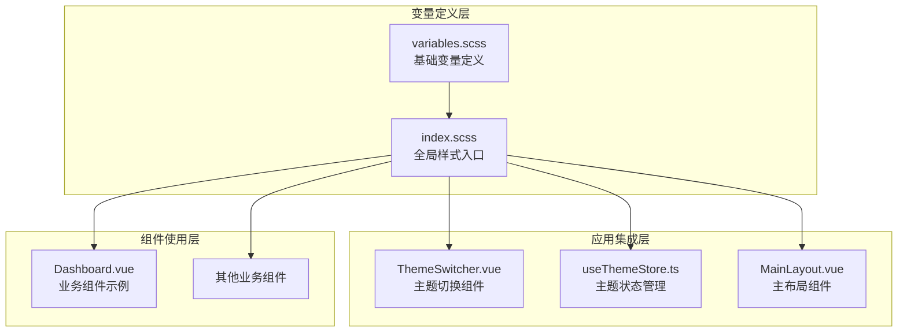
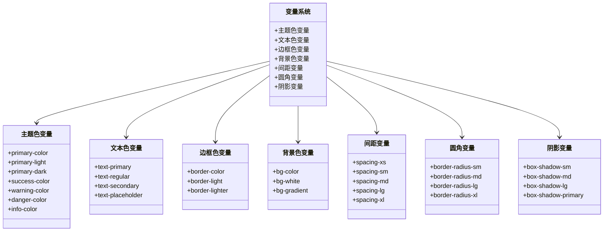
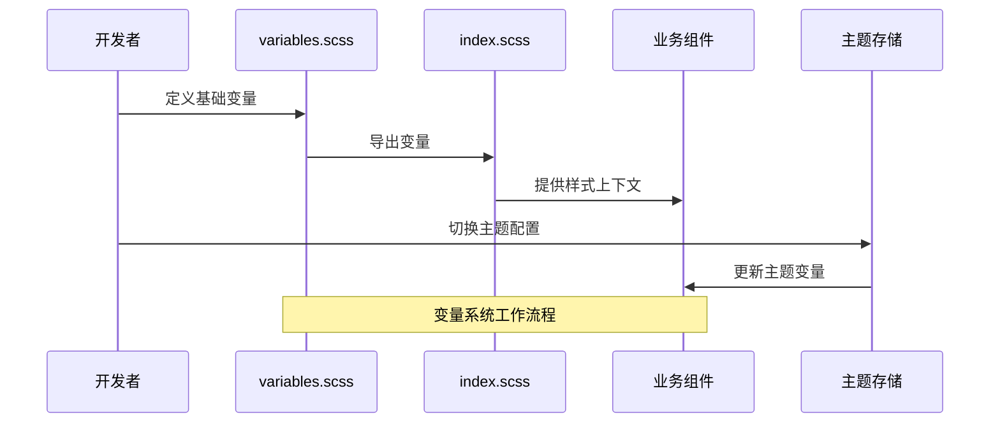
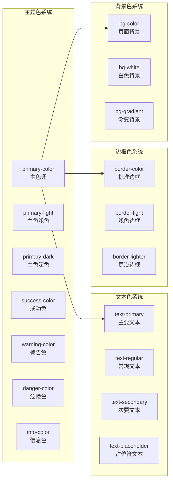
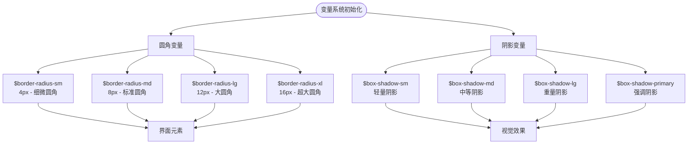
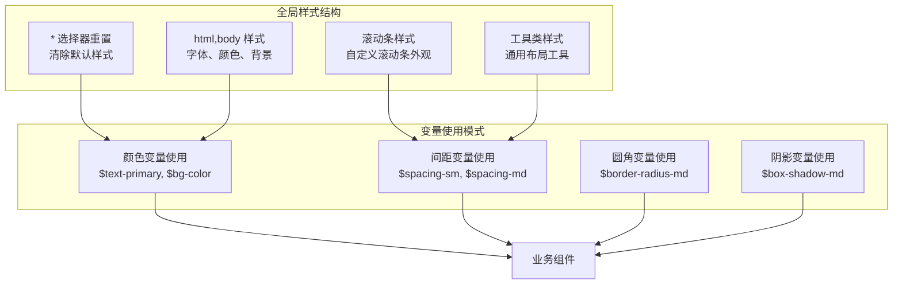
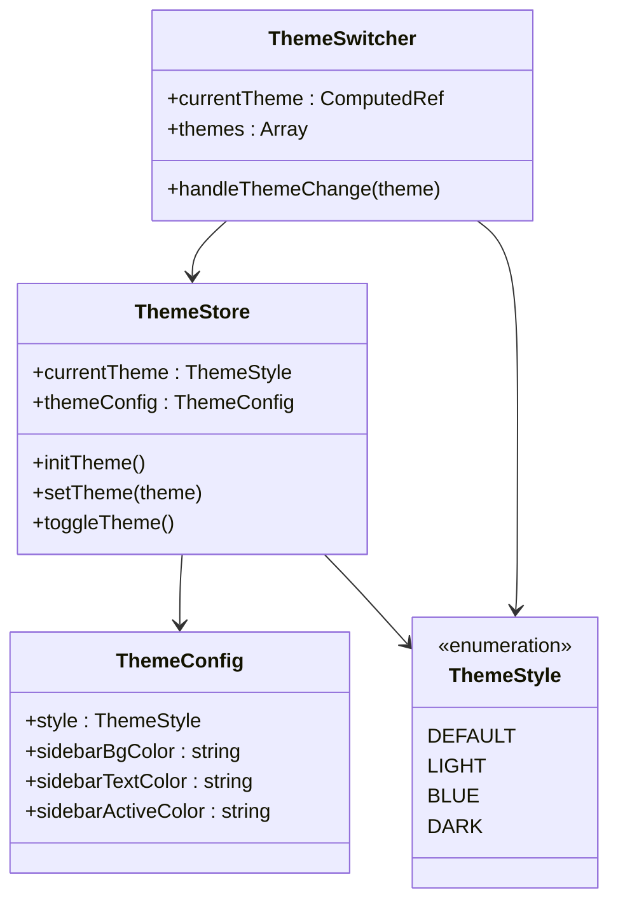
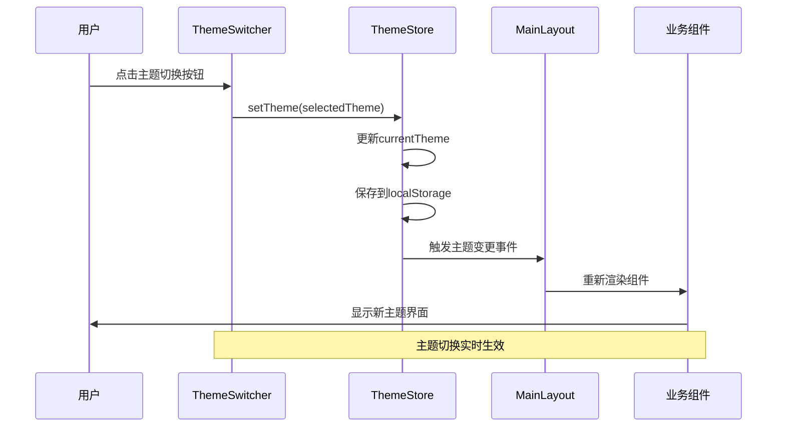
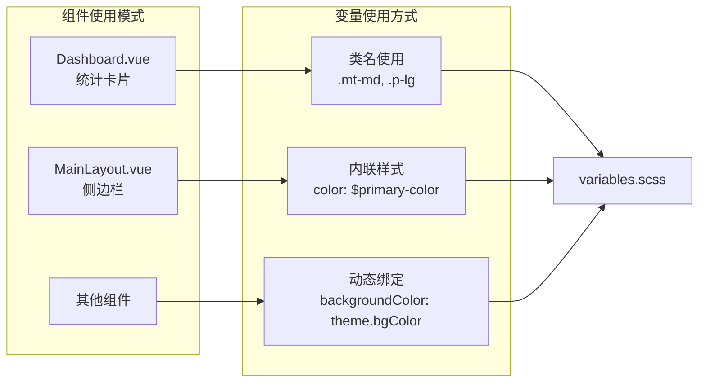
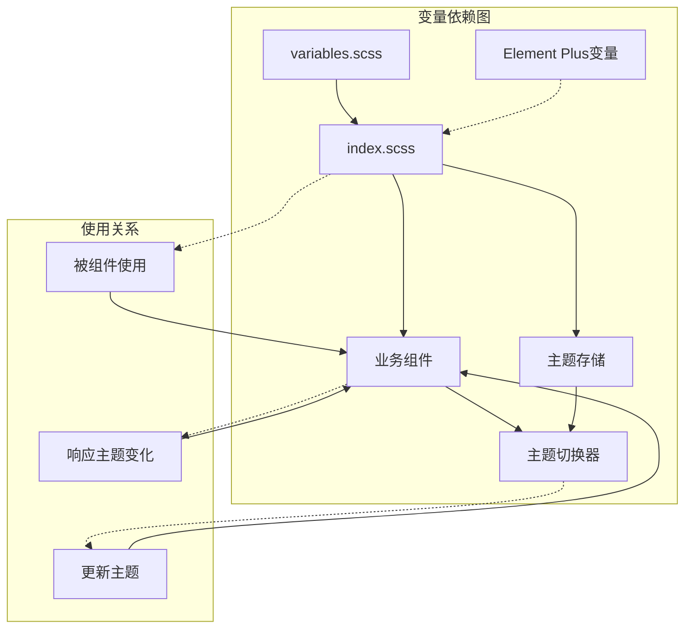

# SCSS变量系统

<cite>
**本文档引用的文件**
- [variables.scss](file://src/styles/variables.scss)
- [index.scss](file://src/styles/index.scss)
- [ThemeSwitcher.vue](file://src/components/ThemeSwitcher.vue)
- [useThemeStore.ts](file://src/stores/useThemeStore.ts)
- [MainLayout.vue](file://src/layouts/MainLayout.vue)
- [Dashboard.vue](file://src/views/dashboard/Dashboard.vue)
- [var.scss](file://node_modules/element-plus/theme-chalk/src/common/var.scss)
</cite>

## 目录
1. [简介](#简介)
2. [项目结构](#项目结构)
3. [核心组件](#核心组件)
4. [架构概览](#架构概览)
5. [详细组件分析](#详细组件分析)
6. [依赖分析](#依赖分析)
7. [性能考虑](#性能考虑)
8. [故障排除指南](#故障排除指南)
9. [结论](#结论)

## 简介

水文监测管理系统的SCSS变量系统是一个精心设计的视觉设计基础设施，为整个前端应用提供了统一的颜色、间距、圆角和阴影等视觉属性管理。该系统采用模块化设计，通过清晰的命名规范和层次化的组织结构，确保了视觉一致性的同时保持了高度的可定制性和可维护性。

系统的核心设计理念是"语义化命名 + 层次化组织 + 可扩展性"，通过将视觉属性抽象为可复用的变量，实现了设计系统与代码实现的解耦，为后续的主题切换和视觉定制奠定了坚实基础。

## 项目结构

系统采用分层模块化结构，主要由以下三个层次组成：

**图表来源**
- [variables.scss:1-44](file://src/styles/variables.scss#L1-L44)
- [index.scss:1-114](file://src/styles/index.scss#L1-L114)

**章节来源**
- [variables.scss:1-44](file://src/styles/variables.scss#L1-L44)
- [index.scss:1-114](file://src/styles/index.scss#L1-L114)

## 核心组件

### 变量组织架构

系统采用功能分类的变量组织方式，将视觉属性按照用途划分为多个功能域：

**图表来源**
- [variables.scss:1-44](file://src/styles/variables.scss#L1-L44)

### 设计理念分析

系统的设计理念体现在以下几个方面：

1. **语义化命名**: 所有变量都采用描述性的语义化命名，如 `$text-primary`、`$bg-color` 等，便于理解和维护
2. **层次化组织**: 按照视觉属性的功能分类进行组织，形成清晰的层次结构
3. **可扩展性**: 为每个功能域预留了扩展空间，支持未来新增变量类型
4. **一致性保证**: 通过统一的变量管理，确保整个应用的视觉一致性

**章节来源**
- [variables.scss:1-44](file://src/styles/variables.scss#L1-L44)

## 架构概览

系统采用"变量定义 → 全局引入 → 组件使用"的三层架构模式：

**图表来源**
- [variables.scss:1-44](file://src/styles/variables.scss#L1-L44)
- [index.scss:1-114](file://src/styles/index.scss#L1-L114)
- [useThemeStore.ts:1-69](file://src/stores/useThemeStore.ts#L1-L69)

## 详细组件分析

### 变量定义系统

#### 颜色变量体系

系统建立了完整的颜色变量体系，包括主题色、文本色、边框色和背景色四个主要类别：

**图表来源**
- [variables.scss:1-25](file://src/styles/variables.scss#L1-L25)

#### 间距变量设计

间距变量采用了1:2的递增比例设计，确保了视觉层级的一致性：

| 变量名 | 值 | 设计原则 | 应用场景 |
|--------|----|----------|----------|
| `$spacing-xs` | 4px | 最小间距，微调使用 | 微小元素间距 |
| `$spacing-sm` | 8px | 小间距，基础间距 | 组件内边距 |
| `$spacing-md` | 16px | 中等间距，推荐值 | 标准间距 |
| `$spacing-lg` | 24px | 大间距，分隔使用 | 区块间分隔 |
| `$spacing-xl` | 32px | 最大间距，大间隔 | 主要分区间隔 |

这种设计遵循了UI设计中的"8像素规则"，确保了视觉平衡和设计一致性。

**章节来源**
- [variables.scss:26-32](file://src/styles/variables.scss#L26-L32)
- [index.scss:79-113](file://src/styles/index.scss#L79-L113)

#### 圆角和阴影系统

系统提供了完整的圆角和阴影变量体系，支持不同层级的视觉效果：

**图表来源**
- [variables.scss:33-44](file://src/styles/variables.scss#L33-L44)

**章节来源**
- [variables.scss:33-44](file://src/styles/variables.scss#L33-L44)

### 全局样式集成

#### 全局重置和基础样式

全局样式文件负责将变量系统集成到整个应用中：

**图表来源**
- [index.scss:1-114](file://src/styles/index.scss#L1-L114)

**章节来源**
- [index.scss:1-114](file://src/styles/index.scss#L1-L114)

### 主题切换系统

#### 主题配置管理

系统实现了灵活的主题切换机制，支持多种预设主题：

**图表来源**
- [useThemeStore.ts:1-69](file://src/stores/useThemeStore.ts#L1-L69)
- [ThemeSwitcher.vue:1-132](file://src/components/ThemeSwitcher.vue#L1-L132)
- [types/index.ts:36-50](file://src/types/index.ts#L36-L50)

#### 主题切换流程

**图表来源**
- [ThemeSwitcher.vue:80-82](file://src/components/ThemeSwitcher.vue#L80-L82)
- [useThemeStore.ts:52-58](file://src/stores/useThemeStore.ts#L52-L58)

**章节来源**
- [useThemeStore.ts:1-69](file://src/stores/useThemeStore.ts#L1-L69)
- [ThemeSwitcher.vue:1-132](file://src/components/ThemeSwitcher.vue#L1-L132)

### 组件使用模式

#### 业务组件中的变量使用

业务组件通过CSS类名和内联样式的结合使用变量系统：

**图表来源**
- [Dashboard.vue:108-153](file://src/views/dashboard/Dashboard.vue#L108-L153)
- [MainLayout.vue:4-28](file://src/layouts/MainLayout.vue#L4-L28)

**章节来源**
- [Dashboard.vue:1-155](file://src/views/dashboard/Dashboard.vue#L1-L155)
- [MainLayout.vue:1-200](file://src/layouts/MainLayout.vue#L1-L200)

## 依赖分析

### 变量依赖关系

系统中的变量存在明确的依赖关系和使用模式：

**图表来源**
- [variables.scss:1-44](file://src/styles/variables.scss#L1-L44)
- [index.scss:1-114](file://src/styles/index.scss#L1-L114)
- [useThemeStore.ts:1-69](file://src/stores/useThemeStore.ts#L1-L69)

### 与第三方库的集成

系统与Element Plus的变量系统存在良好的兼容性：

| Element Plus变量 | 对应系统变量 | 用途 |
|------------------|--------------|------|
| `$text-color` | `$text-primary` | 文本颜色 |
| `$bg-color` | `$bg-color` | 背景颜色 |
| `$border-color` | `$border-color` | 边框颜色 |
| `$border-radius` | `$border-radius-md` | 圆角半径 |

**章节来源**
- [var.scss:98-146](file://node_modules/element-plus/theme-chalk/src/common/var.scss#L98-L146)

## 性能考虑

### 变量编译优化

系统在变量使用上体现了良好的性能考量：

1. **变量复用**: 通过集中定义和复用变量，减少了CSS重复代码
2. **选择器优化**: 使用简化的类名选择器，提高样式匹配效率
3. **主题切换性能**: 通过CSS变量和状态管理实现平滑的主题切换
4. **构建优化**: 变量系统在构建时进行静态分析和优化

### 内存使用优化

- 变量定义集中在单一文件，便于内存管理和缓存
- 工具类样式按需使用，避免不必要的样式加载
- 主题切换采用增量更新策略，减少重绘开销

## 故障排除指南

### 常见问题及解决方案

#### 变量未生效问题

**问题表现**: 组件中使用变量但样式未按预期显示

**可能原因**:
1. 变量未正确导入到组件样式中
2. 变量名拼写错误
3. 样式作用域冲突

**解决步骤**:
1. 检查组件是否正确导入全局样式
2. 验证变量名的拼写和大小写
3. 确认样式作用域不会覆盖变量定义

#### 主题切换失效问题

**问题表现**: 主题切换后界面没有变化

**可能原因**:
1. 主题存储未正确保存
2. 组件未监听主题变化
3. CSS优先级问题

**解决步骤**:
1. 检查localStorage中是否有主题配置
2. 确认组件正确订阅主题状态
3. 调整CSS选择器优先级

**章节来源**
- [useThemeStore.ts:44-58](file://src/stores/useThemeStore.ts#L44-L58)
- [ThemeSwitcher.vue:80-82](file://src/components/ThemeSwitcher.vue#L80-L82)

## 结论

水文监测管理系统的SCSS变量系统展现了现代前端开发中变量管理的最佳实践。通过精心设计的变量组织结构、清晰的命名规范和完善的主题切换机制，系统实现了视觉设计的一致性和高度的可定制性。

系统的主要优势包括：

1. **设计一致性**: 通过统一的变量管理确保整个应用的视觉统一
2. **可维护性**: 模块化的变量组织便于维护和扩展
3. **可扩展性**: 灵活的主题系统支持未来的视觉定制需求
4. **性能优化**: 合理的变量使用模式提升了构建和运行效率

该变量系统为水文监测管理系统的视觉设计提供了坚实的基础设施，为后续的功能扩展和视觉升级奠定了良好的基础。