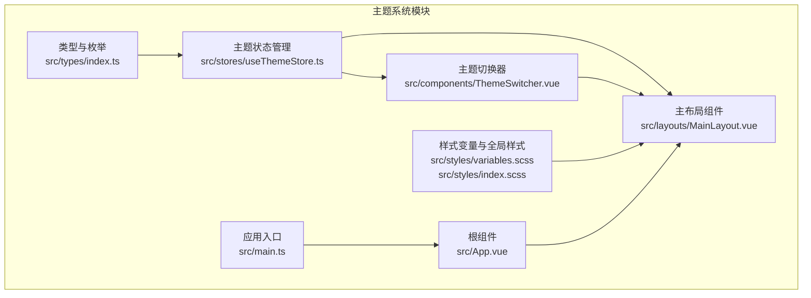
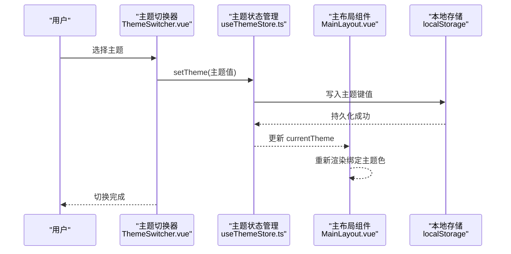
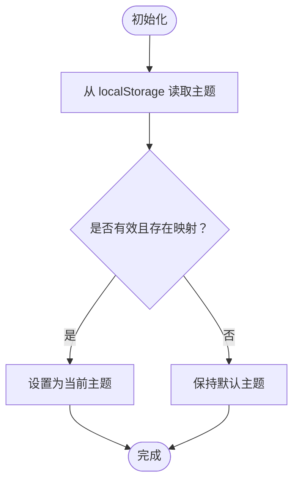
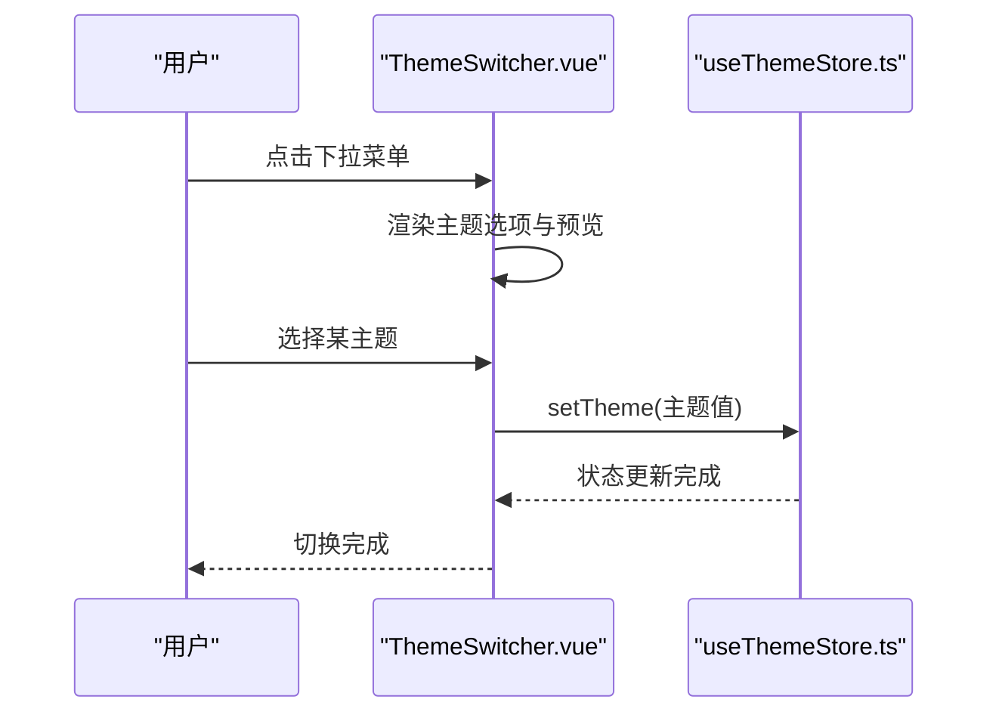
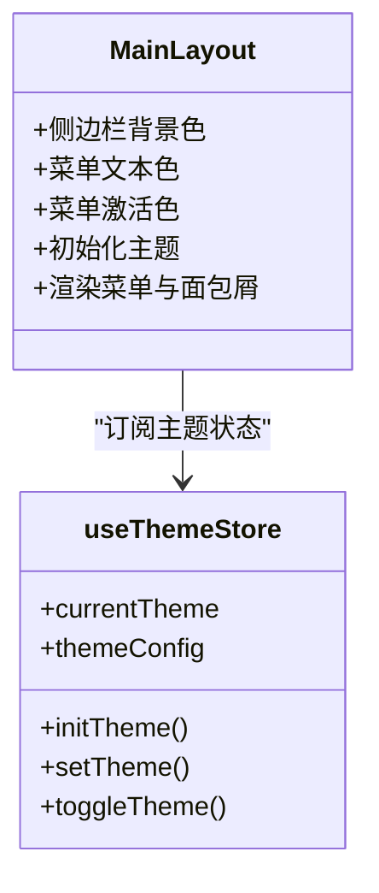
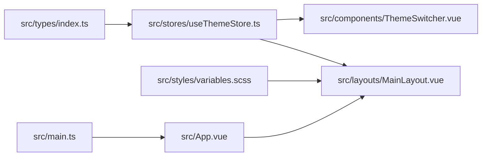

# 主题系统

<cite>
**本文引用的文件**
- [useThemeStore.ts](file://src/stores/useThemeStore.ts)
- [ThemeSwitcher.vue](file://src/components/ThemeSwitcher.vue)
- [variables.scss](file://src/styles/variables.scss)
- [index.scss](file://src/styles/index.scss)
- [MainLayout.vue](file://src/layouts/MainLayout.vue)
- [index.ts](file://src/types/index.ts)
- [main.ts](file://src/main.ts)
- [App.vue](file://src/App.vue)
</cite>

## 目录
1. [简介](#简介)
2. [项目结构](#项目结构)
3. [核心组件](#核心组件)
4. [架构总览](#架构总览)
5. [详细组件分析](#详细组件分析)
6. [依赖关系分析](#依赖关系分析)
7. [性能与体验](#性能与体验)
8. [故障排查与恢复](#故障排查与恢复)
9. [结论](#结论)
10. [附录](#附录)

## 简介
本主题系统为水文监测管理系统提供多主题能力，覆盖明暗主题与品牌主题的切换、持久化存储、组件级响应式渲染以及可扩展的主题配置。系统采用 Pinia 状态管理与 Element Plus 组件库，通过主题配置映射与布局组件的样式绑定实现主题切换；同时使用 SCSS 变量统一管理全局配色与间距，保证视觉一致性与可维护性。

## 项目结构
主题系统涉及以下关键文件：
- 类型与枚举：定义主题风格与配置接口
- 状态管理：集中管理当前主题与持久化
- 主题切换器：提供下拉选择与预览
- 布局组件：在侧边栏与菜单等区域应用主题色
- 样式层：SCSS 变量与全局样式

图表来源
- [index.ts:36-51](file://src/types/index.ts#L36-L51)
- [useThemeStore.ts:34-68](file://src/stores/useThemeStore.ts#L34-L68)
- [ThemeSwitcher.vue:1-132](file://src/components/ThemeSwitcher.vue#L1-L132)
- [MainLayout.vue:1-434](file://src/layouts/MainLayout.vue#L1-L434)
- [variables.scss:1-44](file://src/styles/variables.scss#L1-L44)
- [index.scss:1-114](file://src/styles/index.scss#L1-L114)
- [main.ts:1-26](file://src/main.ts#L1-L26)
- [App.vue:1-15](file://src/App.vue#L1-L15)

章节来源
- [index.ts:36-51](file://src/types/index.ts#L36-L51)
- [useThemeStore.ts:1-69](file://src/stores/useThemeStore.ts#L1-L69)
- [ThemeSwitcher.vue:1-132](file://src/components/ThemeSwitcher.vue#L1-L132)
- [MainLayout.vue:1-434](file://src/layouts/MainLayout.vue#L1-L434)
- [variables.scss:1-44](file://src/styles/variables.scss#L1-L44)
- [index.scss:1-114](file://src/styles/index.scss#L1-L114)
- [main.ts:1-26](file://src/main.ts#L1-L26)
- [App.vue:1-15](file://src/App.vue#L1-L15)

## 核心组件
- 主题风格枚举与配置接口：定义主题风格集合与侧边栏背景、文本、激活色等配置项。
- 主题状态管理：提供初始化、切换与循环切换主题的能力，并持久化到本地存储。
- 主题切换器：基于 Element Plus 下拉菜单展示主题选项，支持预览与选中态高亮。
- 主布局组件：在侧边栏、菜单、头部等区域动态绑定主题色，实现组件级响应式渲染。
- 样式变量：统一管理主色、文字色、边框色、背景色与间距等，供全局样式与组件样式使用。

章节来源
- [index.ts:36-51](file://src/types/index.ts#L36-L51)
- [useThemeStore.ts:34-68](file://src/stores/useThemeStore.ts#L34-L68)
- [ThemeSwitcher.vue:1-132](file://src/components/ThemeSwitcher.vue#L1-L132)
- [MainLayout.vue:1-434](file://src/layouts/MainLayout.vue#L1-L434)
- [variables.scss:1-44](file://src/styles/variables.scss#L1-L44)
- [index.scss:1-114](file://src/styles/index.scss#L1-L114)

## 架构总览
主题系统采用“状态驱动 + 组件绑定”的架构模式：
- 状态层：Pinia Store 维护当前主题与主题配置映射。
- 视图层：组件通过计算属性订阅主题状态，动态绑定样式。
- 存储层：localStorage 持久化主题偏好。
- 样式层：SCSS 变量与全局样式提供一致的视觉基线。

图表来源
- [ThemeSwitcher.vue:80-82](file://src/components/ThemeSwitcher.vue#L80-L82)
- [useThemeStore.ts:52-58](file://src/stores/useThemeStore.ts#L52-L58)
- [MainLayout.vue:7-28](file://src/layouts/MainLayout.vue#L7-L28)

## 详细组件分析

### 主题状态管理（Pinia Store）
- 设计要点
  - 主题配置映射：以枚举值为键，映射到包含侧边栏背景、文本与激活色的配置对象。
  - 初始化：启动时从 localStorage 读取保存的主题，若无效则回退到默认主题。
  - 切换：设置当前主题并写入 localStorage。
  - 循环切换：按枚举顺序轮询下一个主题。
- 数据结构复杂度
  - 映射查找：O(1)，切换与循环切换：O(n)（n 为主题数量）。
- 错误处理
  - 读取到未知主题值时安全回退，避免异常。
- 性能影响
  - localStorage 访问为同步操作，但仅在初始化与切换时触发，开销可忽略。

图表来源
- [useThemeStore.ts:44-50](file://src/stores/useThemeStore.ts#L44-L50)

章节来源
- [useThemeStore.ts:34-68](file://src/stores/useThemeStore.ts#L34-L68)

### 主题切换器（组件）
- 设计要点
  - 下拉菜单展示主题列表，每个选项包含主题预览与标签。
  - 选中态通过类名与边框颜色高亮。
  - 事件回调调用状态管理进行主题切换。
- 响应式渲染
  - 通过计算属性订阅当前主题，选中态随状态变化自动更新。
- 动画与交互
  - 提供悬停过渡与选中态高亮，提升交互体验。

图表来源
- [ThemeSwitcher.vue:1-132](file://src/components/ThemeSwitcher.vue#L1-L132)
- [useThemeStore.ts:52-58](file://src/stores/useThemeStore.ts#L52-L58)

章节来源
- [ThemeSwitcher.vue:1-132](file://src/components/ThemeSwitcher.vue#L1-L132)

### 主布局组件（主题应用）
- 设计要点
  - 侧边栏背景色、菜单文本色、激活色均来自主题配置。
  - 头部与面包屑等区域采用 Element Plus 的默认样式，不直接绑定主题色。
- 响应式渲染
  - 通过计算属性访问主题配置，组件挂载时初始化主题，实现即时生效。
- 兼容性
  - Element Plus 组件样式优先，主题色主要作用于自定义区域（如侧边栏与菜单）。

图表来源
- [MainLayout.vue:1-434](file://src/layouts/MainLayout.vue#L1-L434)
- [useThemeStore.ts:34-68](file://src/stores/useThemeStore.ts#L34-L68)

章节来源
- [MainLayout.vue:1-434](file://src/layouts/MainLayout.vue#L1-L434)

### 样式层（SCSS 变量与全局样式）
- 设计要点
  - SCSS 变量集中管理主色、文字色、边框色、背景色与间距等。
  - 全局样式统一字体、字号、滚动条与常用工具类。
- 与主题的关系
  - 全局变量用于通用配色与间距，主题色主要通过组件绑定实现动态更新。
- 扩展建议
  - 新增主题时可在组件层新增配置，同时可考虑在 SCSS 层增加对应变量以增强一致性。

章节来源
- [variables.scss:1-44](file://src/styles/variables.scss#L1-L44)
- [index.scss:1-114](file://src/styles/index.scss#L1-L114)

## 依赖关系分析
- 类型与枚举
  - 主题风格枚举与配置接口为状态管理与组件提供契约。
- 状态管理依赖类型定义，组件依赖状态管理。
- 布局组件依赖状态管理与 Element Plus 组件库。
- 应用入口注册 Pinia、路由与 Element Plus，确保主题系统在应用生命周期内可用。

图表来源
- [index.ts:36-51](file://src/types/index.ts#L36-L51)
- [useThemeStore.ts:1-69](file://src/stores/useThemeStore.ts#L1-L69)
- [ThemeSwitcher.vue:1-132](file://src/components/ThemeSwitcher.vue#L1-L132)
- [MainLayout.vue:1-434](file://src/layouts/MainLayout.vue#L1-L434)
- [variables.scss:1-44](file://src/styles/variables.scss#L1-L44)
- [main.ts:1-26](file://src/main.ts#L1-L26)
- [App.vue:1-15](file://src/App.vue#L1-L15)

章节来源
- [index.ts:36-51](file://src/types/index.ts#L36-L51)
- [useThemeStore.ts:1-69](file://src/stores/useThemeStore.ts#L1-L69)
- [ThemeSwitcher.vue:1-132](file://src/components/ThemeSwitcher.vue#L1-L132)
- [MainLayout.vue:1-434](file://src/layouts/MainLayout.vue#L1-L434)
- [variables.scss:1-44](file://src/styles/variables.scss#L1-L44)
- [main.ts:1-26](file://src/main.ts#L1-L26)
- [App.vue:1-15](file://src/App.vue#L1-L15)

## 性能与体验
- 切换性能
  - 切换动作为 O(1) 级别，仅更新状态与本地存储，组件通过响应式更新渲染，延迟极低。
- 初始化性能
  - 启动时一次性读取 localStorage 并设置主题，开销微小。
- 动画与过渡
  - 主题切换器提供悬停过渡，布局组件使用平滑过渡属性，整体交互自然。
- 无障碍与可访问性
  - 建议在后续版本中为主题切换器添加键盘可达性与屏幕阅读器支持。

[本节为通用性能讨论，无需特定文件来源]

## 故障排查与恢复
- 常见问题
  - 主题未持久化：检查 localStorage 是否被禁用或清理。
  - 切换后样式未生效：确认组件是否正确绑定主题配置，以及是否存在样式优先级冲突。
  - 初始化失败：当读取到未知主题值时，系统会回退到默认主题，属预期行为。
- 恢复机制
  - 清除 localStorage 中的主题键值，重启应用将回到默认主题。
  - 在状态管理中增加校验与兜底逻辑，确保异常场景下的稳定性。

章节来源
- [useThemeStore.ts:44-50](file://src/stores/useThemeStore.ts#L44-L50)
- [MainLayout.vue:206-210](file://src/layouts/MainLayout.vue#L206-L210)

## 结论
该主题系统以简洁的状态管理与组件绑定为核心，实现了多主题的快速切换与持久化。通过 SCSS 变量与布局组件的协作，既保证了视觉一致性，又具备良好的扩展性。建议在后续迭代中进一步完善无障碍支持、主题预设与品牌色的深度集成，并持续优化主题切换的动画与性能体验。

[本节为总结性内容，无需特定文件来源]

## 附录

### 主题配置扩展方法
- 新增主题风格
  - 在类型定义中新增枚举值。
  - 在状态管理中为新风格补充配置映射。
  - 在切换器中新增选项与预览。
- 自定义主题创建
  - 在组件层为新风格提供独立配置对象，确保侧边栏背景、文本与激活色协调。
- 品牌色彩集成
  - 将品牌主色与辅助色纳入 SCSS 变量体系，统一全局配色基线。

章节来源
- [index.ts:36-51](file://src/types/index.ts#L36-L51)
- [useThemeStore.ts:5-30](file://src/stores/useThemeStore.ts#L5-L30)
- [ThemeSwitcher.vue:45-78](file://src/components/ThemeSwitcher.vue#L45-L78)

### 主题切换的用户体验设计
- 交互反馈
  - 下拉菜单提供清晰的选中态与悬停高亮。
  - 切换过程无闪烁，组件响应式更新。
- 动画效果
  - 过渡时间为合理区间，避免过长导致卡顿。
- 可发现性
  - 将主题切换器放置在显眼位置，便于用户操作。

章节来源
- [ThemeSwitcher.vue:85-131](file://src/components/ThemeSwitcher.vue#L85-L131)
- [MainLayout.vue:78-81](file://src/layouts/MainLayout.vue#L78-L81)

### 测试方法与兼容性
- 测试方法
  - 单元测试：验证状态管理的初始化、切换与循环切换逻辑。
  - 端到端测试：验证主题切换后组件样式是否正确应用。
- 兼容性
  - Element Plus 组件样式优先，确保第三方组件不受主题色影响。
  - 在不同浏览器与设备上验证主题切换与滚动条样式的一致性。

章节来源
- [useThemeStore.ts:44-68](file://src/stores/useThemeStore.ts#L44-L68)
- [ThemeSwitcher.vue:1-132](file://src/components/ThemeSwitcher.vue#L1-L132)
- [MainLayout.vue:1-434](file://src/layouts/MainLayout.vue#L1-L434)

### 维护指南与最佳实践
- 维护指南
  - 定期审查主题配置映射，确保颜色搭配符合品牌规范。
  - 对新增组件进行主题适配，统一使用主题配置进行样式绑定。
- 最佳实践
  - 将主题色与业务色解耦，避免硬编码颜色值。
  - 在样式层统一管理可复用的配色变量，减少重复与不一致。
  - 保持主题切换器的简洁与直观，避免过多冗余选项。

章节来源
- [variables.scss:1-44](file://src/styles/variables.scss#L1-L44)
- [index.scss:1-114](file://src/styles/index.scss#L1-L114)
- [ThemeSwitcher.vue:1-132](file://src/components/ThemeSwitcher.vue#L1-L132)