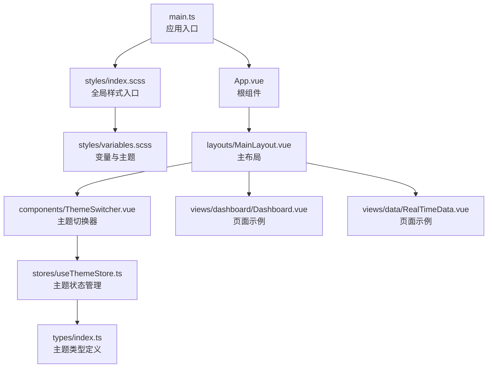
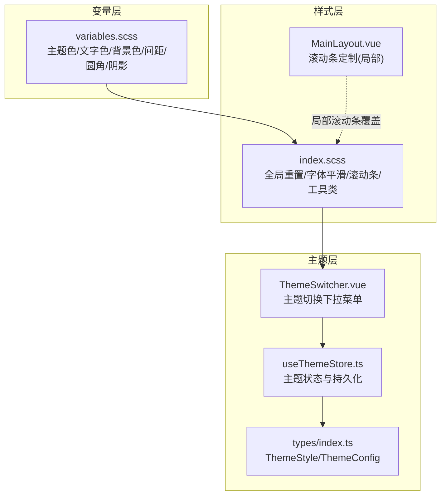
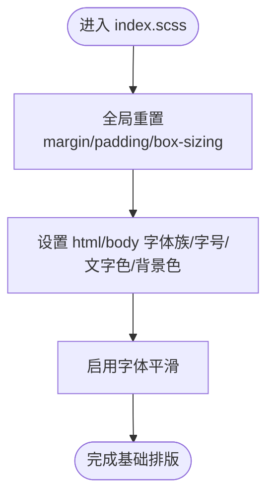
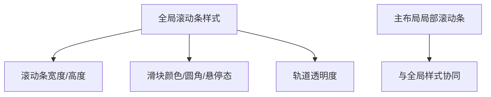
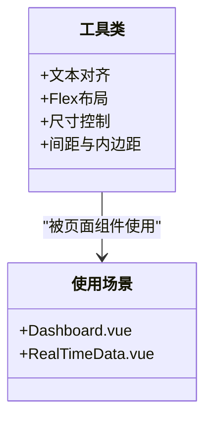
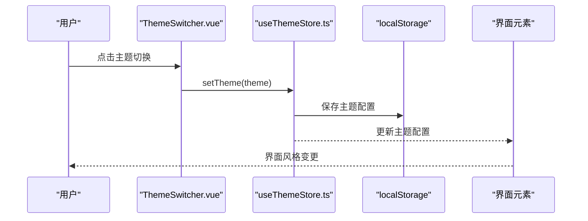
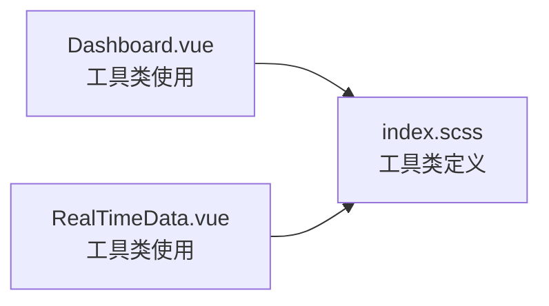
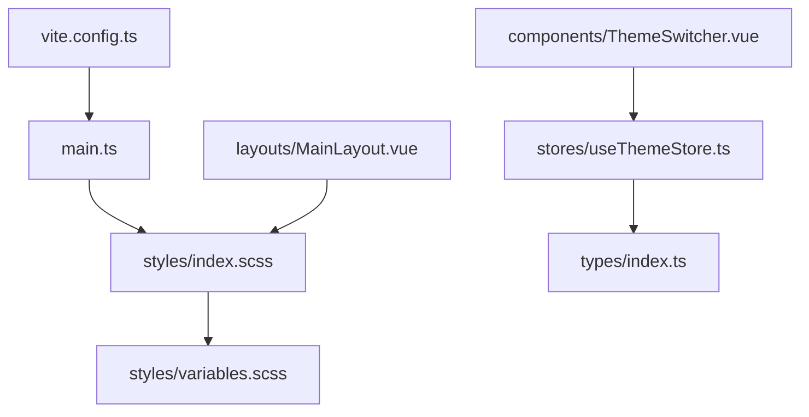

# 全局样式

<cite>
**本文引用的文件**
- [src/styles/index.scss](file://src/styles/index.scss)
- [src/styles/variables.scss](file://src/styles/variables.scss)
- [src/main.ts](file://src/main.ts)
- [src/App.vue](file://src/App.vue)
- [src/layouts/MainLayout.vue](file://src/layouts/MainLayout.vue)
- [src/components/ThemeSwitcher.vue](file://src/components/ThemeSwitcher.vue)
- [src/stores/useThemeStore.ts](file://src/stores/useThemeStore.ts)
- [src/types/index.ts](file://src/types/index.ts)
- [src/views/dashboard/Dashboard.vue](file://src/views/dashboard/Dashboard.vue)
- [src/views/data/RealTimeData.vue](file://src/views/data/RealTimeData.vue)
- [vite.config.ts](file://vite.config.ts)
- [package.json](file://package.json)
</cite>

## 目录
1. [简介](#简介)
2. [项目结构](#项目结构)
3. [核心组件](#核心组件)
4. [架构总览](#架构总览)
5. [详细组件分析](#详细组件分析)
6. [依赖关系分析](#依赖关系分析)
7. [性能考量](#性能考量)
8. [故障排查指南](#故障排查指南)
9. [结论](#结论)
10. [附录](#附录)

## 简介
本文件面向水文监测管理系统前端的“全局样式”体系，系统性阐述以下方面：
- 全局重置样式的实现原理与浏览器兼容性处理
- 字体系统选择策略、字体平滑优化与可访问性考虑
- 滚动条样式定制、暗色模式适配与用户体验优化
- 通用工具类设计理念与使用方法（文本对齐、Flex 布局、尺寸控制等）
- 全局样式的加载顺序、优先级管理与样式冲突解决方案
- 全局样式的维护策略、性能优化与最佳实践
- 扩展与自定义方案，帮助开发者在不破坏整体风格的前提下进行二次开发

## 项目结构
全局样式相关的核心文件集中在 src/styles 目录，并通过入口文件统一引入。主要结构如下：
- 变量与混入：variables.scss 定义主题色、文字色、边框色、背景色、间距、圆角、阴影等变量
- 全局样式：index.scss 引入变量，执行全局重置、字体与平滑设置、滚动条定制、通用工具类
- 应用入口：main.ts 在应用启动时引入全局样式
- 主布局：MainLayout.vue 使用 Element Plus 的容器组件并内建滚动条样式
- 主题切换：ThemeSwitcher.vue 提供主题切换能力，配合 useThemeStore.ts 实现主题持久化与切换
- 页面示例：Dashboard.vue、RealTimeData.vue 展示了工具类与 Element Plus 组件的组合使用

**图示来源**
- [src/main.ts:10](file://src/main.ts#L10)
- [src/styles/index.scss:1](file://src/styles/index.scss#L1)
- [src/styles/variables.scss:1](file://src/styles/variables.scss#L1)
- [src/App.vue:1](file://src/App.vue#L1)
- [src/layouts/MainLayout.vue:1](file://src/layouts/MainLayout.vue#L1)
- [src/components/ThemeSwitcher.vue:1](file://src/components/ThemeSwitcher.vue#L1)
- [src/stores/useThemeStore.ts:1](file://src/stores/useThemeStore.ts#L1)
- [src/types/index.ts:36](file://src/types/index.ts#L36)
- [src/views/dashboard/Dashboard.vue:1](file://src/views/dashboard/Dashboard.vue#L1)
- [src/views/data/RealTimeData.vue:1](file://src/views/data/RealTimeData.vue#L1)

**章节来源**
- [src/main.ts:10](file://src/main.ts#L10)
- [src/styles/index.scss:1](file://src/styles/index.scss#L1)
- [src/styles/variables.scss:1](file://src/styles/variables.scss#L1)
- [src/App.vue:1](file://src/App.vue#L1)
- [src/layouts/MainLayout.vue:1](file://src/layouts/MainLayout.vue#L1)
- [src/components/ThemeSwitcher.vue:1](file://src/components/ThemeSwitcher.vue#L1)
- [src/stores/useThemeStore.ts:1](file://src/stores/useThemeStore.ts#L1)
- [src/types/index.ts:36](file://src/types/index.ts#L36)
- [src/views/dashboard/Dashboard.vue:1](file://src/views/dashboard/Dashboard.vue#L1)
- [src/views/data/RealTimeData.vue:1](file://src/views/data/RealTimeData.vue#L1)

## 核心组件
- 全局重置与基础排版：通过通配符选择器统一 margin/padding 与盒模型，设置 html/body 的字体族、字号、文字色、背景色，并启用 WebKit 字体平滑
- 滚动条样式：针对 WebKit 内核提供统一的滚动条宽度、轨道与滑块颜色及悬停态
- 通用工具类：提供文本对齐、Flex 布局、宽高全屏、间距与内边距等常用类，便于快速布局
- 主题变量：集中管理主色、文字色、边框色、背景色、间距、圆角与阴影，保证视觉一致性
- 主题切换：通过下拉菜单切换主题风格，主题配置保存于本地存储并在初始化时恢复

**章节来源**
- [src/styles/index.scss:3-114](file://src/styles/index.scss#L3-L114)
- [src/styles/variables.scss:1-44](file://src/styles/variables.scss#L1-L44)
- [src/components/ThemeSwitcher.vue:45-78](file://src/components/ThemeSwitcher.vue#L45-L78)
- [src/stores/useThemeStore.ts:44-66](file://src/stores/useThemeStore.ts#L44-L66)

## 架构总览
全局样式采用“变量驱动 + 工具类 + 主题切换”的三层架构：
- 变量层：集中定义主题色、文字色、背景色、间距、圆角与阴影等，确保跨组件一致
- 样式层：全局重置与基础排版 + 通用工具类 + 滚动条定制，形成统一的视觉基线
- 主题层：通过主题枚举与配置映射，结合 Pinia 状态管理与本地存储，实现主题切换与持久化

**图示来源**
- [src/styles/variables.scss:1](file://src/styles/variables.scss#L1)
- [src/styles/index.scss:1](file://src/styles/index.scss#L1)
- [src/layouts/MainLayout.vue:402-422](file://src/layouts/MainLayout.vue#L402-L422)
- [src/components/ThemeSwitcher.vue:1](file://src/components/ThemeSwitcher.vue#L1)
- [src/stores/useThemeStore.ts:1](file://src/stores/useThemeStore.ts#L1)
- [src/types/index.ts:36](file://src/types/index.ts#L36)

## 详细组件分析

### 全局重置与基础排版
- 通配符重置：统一 margin/padding，盒模型采用 border-box，避免盒模型差异导致的布局问题
- 字体系统：采用系统字体栈，兼顾跨平台一致性与性能；字号设定为 14px，符合现代 Web 设计规范
- 字体平滑：启用 -webkit-font-smoothing 与 -moz-osx-font-smoothing，提升文本可读性
- 背景色与文字色：基于变量统一设置，便于后续主题切换

**图示来源**
- [src/styles/index.scss:3-21](file://src/styles/index.scss#L3-L21)

**章节来源**
- [src/styles/index.scss:3-21](file://src/styles/index.scss#L3-L21)

### 滚动条样式定制
- WebKit 滚动条：定义滚动条宽度、轨道与滑块颜色，以及悬停态变化，提升交互体验
- 局部覆盖：主布局中对 el-main 区域也提供了滚动条定制，确保不同容器内滚动条风格一致

**图示来源**
- [src/styles/index.scss:23-40](file://src/styles/index.scss#L23-L40)
- [src/layouts/MainLayout.vue:402-422](file://src/layouts/MainLayout.vue#L402-L422)

**章节来源**
- [src/styles/index.scss:23-40](file://src/styles/index.scss#L23-L40)
- [src/layouts/MainLayout.vue:402-422](file://src/layouts/MainLayout.vue#L402-L422)

### 通用工具类设计
- 文本对齐：text-left/text-center/text-right
- Flex 布局：flex、flex-center、flex-between
- 尺寸控制：w-full、h-full
- 间距与内边距：mt-sm/mt-md/mt-lg、mb-sm/mb-md/mb-lg、p-sm/p-md/p-lg
- 命名策略：语义化命名，便于团队协作与维护

**图示来源**
- [src/styles/index.scss:42-114](file://src/styles/index.scss#L42-L114)
- [src/views/dashboard/Dashboard.vue:104-155](file://src/views/dashboard/Dashboard.vue#L104-L155)
- [src/views/data/RealTimeData.vue:281-300](file://src/views/data/RealTimeData.vue#L281-L300)

**章节来源**
- [src/styles/index.scss:42-114](file://src/styles/index.scss#L42-L114)
- [src/views/dashboard/Dashboard.vue:104-155](file://src/views/dashboard/Dashboard.vue#L104-L155)
- [src/views/data/RealTimeData.vue:281-300](file://src/views/data/RealTimeData.vue#L281-L300)

### 主题变量与主题切换
- 主题变量：集中定义主色、文字色、边框色、背景色、间距、圆角与阴影，便于统一风格
- 主题枚举与配置：ThemeStyle 与 ThemeConfig 定义主题风格与配置项
- 主题切换：ThemeSwitcher.vue 提供下拉菜单，useThemeStore.ts 实现切换与持久化
- 初始化：应用启动时从本地存储恢复主题

**图示来源**
- [src/components/ThemeSwitcher.vue:80-82](file://src/components/ThemeSwitcher.vue#L80-L82)
- [src/stores/useThemeStore.ts:52-58](file://src/stores/useThemeStore.ts#L52-L58)
- [src/stores/useThemeStore.ts:44-50](file://src/stores/useThemeStore.ts#L44-L50)

**章节来源**
- [src/styles/variables.scss:1-44](file://src/styles/variables.scss#L1-L44)
- [src/types/index.ts:36-50](file://src/types/index.ts#L36-L50)
- [src/components/ThemeSwitcher.vue:45-78](file://src/components/ThemeSwitcher.vue#L45-L78)
- [src/stores/useThemeStore.ts:4-30](file://src/stores/useThemeStore.ts#L4-L30)
- [src/stores/useThemeStore.ts:44-66](file://src/stores/useThemeStore.ts#L44-L66)

### 页面中的样式使用示例
- Dashboard.vue：使用工具类进行卡片布局与内容对齐，展示 Flex 布局与间距类的实际效果
- RealTimeData.vue：使用工具类进行搜索表单与分页容器的对齐，体现工具类在复杂页面中的复用价值

**图示来源**
- [src/views/dashboard/Dashboard.vue:104-155](file://src/views/dashboard/Dashboard.vue#L104-L155)
- [src/views/data/RealTimeData.vue:281-300](file://src/views/data/RealTimeData.vue#L281-L300)
- [src/styles/index.scss:42-114](file://src/styles/index.scss#L42-L114)

**章节来源**
- [src/views/dashboard/Dashboard.vue:104-155](file://src/views/dashboard/Dashboard.vue#L104-L155)
- [src/views/data/RealTimeData.vue:281-300](file://src/views/data/RealTimeData.vue#L281-L300)
- [src/styles/index.scss:42-114](file://src/styles/index.scss#L42-L114)

## 依赖关系分析
- 入口依赖：main.ts 通过 import 引入全局样式，确保在应用启动时即生效
- 组件依赖：各页面组件通过 scoped 样式与全局工具类协同工作
- 主题依赖：ThemeSwitcher.vue 依赖 useThemeStore.ts，后者依赖 types/index.ts 中的主题类型定义
- 构建依赖：Vite 配置中包含 Vue 插件与自动导入插件，间接影响样式打包与按需加载

**图示来源**
- [src/main.ts:10](file://src/main.ts#L10)
- [src/styles/index.scss:1](file://src/styles/index.scss#L1)
- [src/styles/variables.scss:1](file://src/styles/variables.scss#L1)
- [src/layouts/MainLayout.vue:1](file://src/layouts/MainLayout.vue#L1)
- [src/components/ThemeSwitcher.vue:1](file://src/components/ThemeSwitcher.vue#L1)
- [src/stores/useThemeStore.ts:1](file://src/stores/useThemeStore.ts#L1)
- [src/types/index.ts:36](file://src/types/index.ts#L36)
- [vite.config.ts:1](file://vite.config.ts#L1)

**章节来源**
- [src/main.ts:10](file://src/main.ts#L10)
- [src/layouts/MainLayout.vue:1](file://src/layouts/MainLayout.vue#L1)
- [src/components/ThemeSwitcher.vue:1](file://src/components/ThemeSwitcher.vue#L1)
- [src/stores/useThemeStore.ts:1](file://src/stores/useThemeStore.ts#L1)
- [src/types/index.ts:36](file://src/types/index.ts#L36)
- [vite.config.ts:1](file://vite.config.ts#L1)

## 性能考量
- 样式体积控制：通过变量集中管理减少重复定义，降低 CSS 体积
- 滚动条样式：仅针对 WebKit 内核生效，避免不必要的样式分支
- 工具类：语义化与复用性强，减少重复样式编写，提高构建效率
- 构建优化：Vite 配置中对第三方库进行手动分包，有助于缓存与加载性能

**章节来源**
- [vite.config.ts:53-66](file://vite.config.ts#L53-L66)

## 故障排查指南
- 字体显示异常
  - 检查 html/body 字体族是否正确加载，确认系统字体栈可用
  - 确认字体平滑属性是否生效
- 滚动条样式不一致
  - 检查全局滚动条样式与局部滚动条样式是否存在冲突
  - 确保 WebKit 内核浏览器支持
- 主题切换无效
  - 检查 useThemeStore.ts 的 setTheme 逻辑与本地存储键值
  - 确认 ThemeSwitcher.vue 的下拉菜单事件绑定
- 工具类未生效
  - 检查页面组件是否正确引入全局样式或使用了 scoped 样式覆盖

**章节来源**
- [src/styles/index.scss:14-21](file://src/styles/index.scss#L14-L21)
- [src/styles/index.scss:23-40](file://src/styles/index.scss#L23-L40)
- [src/stores/useThemeStore.ts:52-58](file://src/stores/useThemeStore.ts#L52-L58)
- [src/components/ThemeSwitcher.vue:80-82](file://src/components/ThemeSwitcher.vue#L80-L82)

## 结论
本项目的全局样式体系以变量为核心、工具类为骨架、主题切换为扩展，形成了统一、可维护且具备良好扩展性的样式架构。通过合理的加载顺序与优先级管理，配合主题持久化与局部滚动条覆盖，既保证了跨浏览器的一致性，又提升了用户体验与开发效率。

## 附录

### 全局样式的加载顺序与优先级管理
- 入口引入：在应用入口文件中先引入全局样式，再挂载应用，确保全局样式优先级高于组件局部样式
- 变量优先：变量文件在全局样式中被 @use 引入，保证变量在全局范围内可用
- 局部覆盖：主布局等组件可对滚动条等样式进行局部覆盖，但应尽量遵循最小覆盖原则

**章节来源**
- [src/main.ts:10](file://src/main.ts#L10)
- [src/styles/index.scss:1](file://src/styles/index.scss#L1)
- [src/layouts/MainLayout.vue:402-422](file://src/layouts/MainLayout.vue#L402-L422)

### 样式冲突解决方案
- 使用作用域样式：组件内部使用 scoped 样式，避免污染全局
- 降低选择器权重：优先使用类选择器而非标签选择器，减少特异性
- 局部覆盖策略：仅在必要时对全局样式进行局部覆盖，且尽量使用更具体的选择器

**章节来源**
- [src/App.vue:9-14](file://src/App.vue#L9-L14)
- [src/layouts/MainLayout.vue:213-433](file://src/layouts/MainLayout.vue#L213-L433)

### 维护策略与最佳实践
- 变量集中管理：新增颜色、间距、圆角等变量时，统一在 variables.scss 中维护
- 工具类扩展：新增工具类时，遵循现有命名规范，确保语义清晰
- 主题扩展：新增主题风格时，在 ThemeSwitcher.vue 与 useThemeStore.ts 中同步更新

**章节来源**
- [src/styles/variables.scss:1-44](file://src/styles/variables.scss#L1-L44)
- [src/components/ThemeSwitcher.vue:45-78](file://src/components/ThemeSwitcher.vue#L45-L78)
- [src/stores/useThemeStore.ts:4-30](file://src/stores/useThemeStore.ts#L4-L30)

### 扩展与自定义方案
- 新增主题风格：在 ThemeSwitcher.vue 的 themes 数组中添加新主题配置，并在 useThemeStore.ts 中完善映射
- 新增工具类：在 index.scss 的工具类区域添加新的类名与规则，保持命名一致性
- 新增变量：在 variables.scss 中定义新的变量，确保与现有主题体系兼容

**章节来源**
- [src/components/ThemeSwitcher.vue:45-78](file://src/components/ThemeSwitcher.vue#L45-L78)
- [src/stores/useThemeStore.ts:4-30](file://src/stores/useThemeStore.ts#L4-L30)
- [src/styles/index.scss:42-114](file://src/styles/index.scss#L42-L114)
- [src/styles/variables.scss:1-44](file://src/styles/variables.scss#L1-L44)