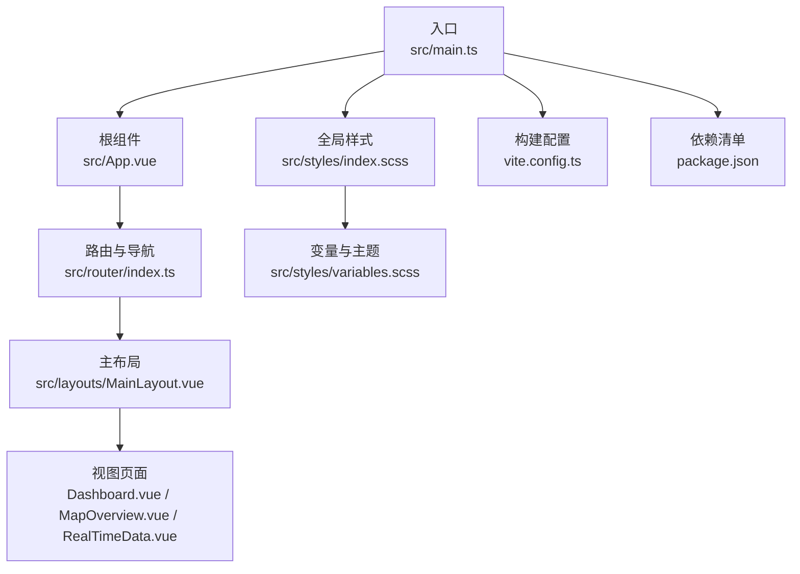
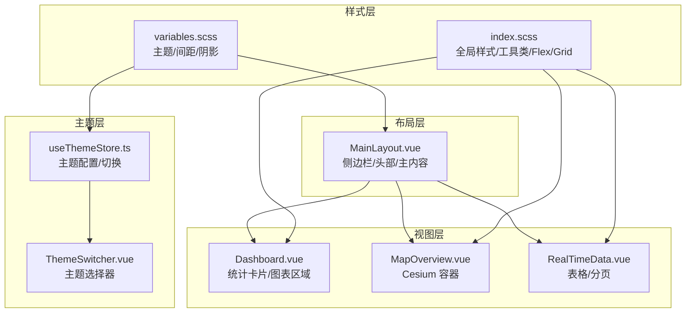
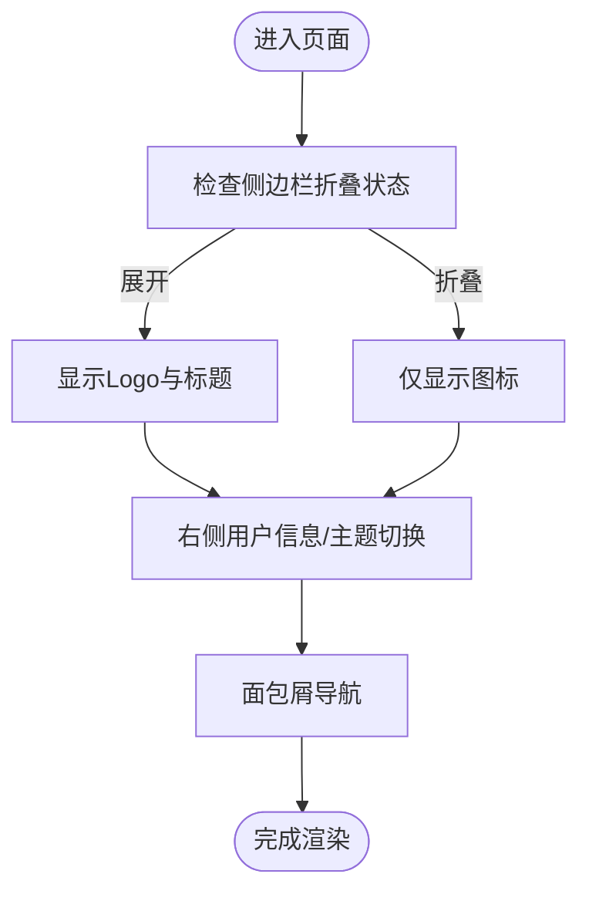
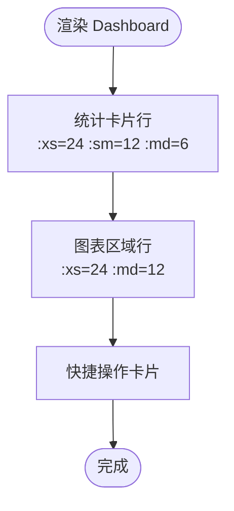
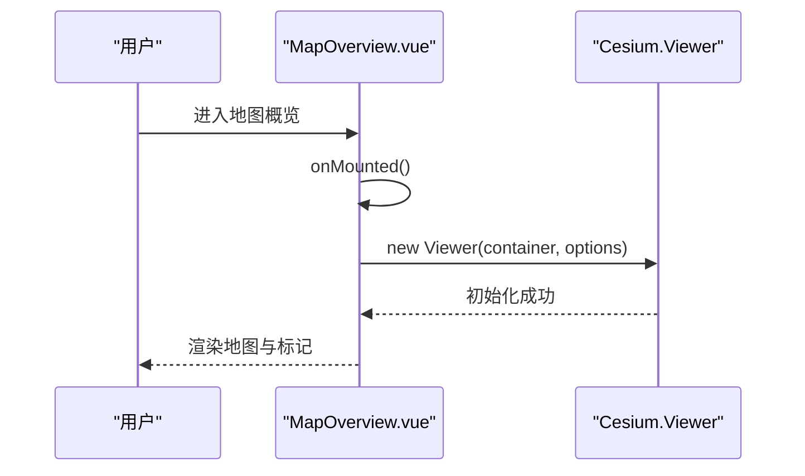
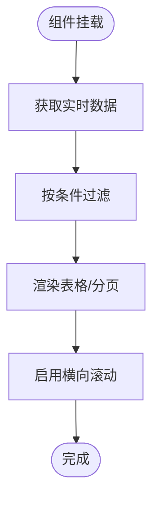
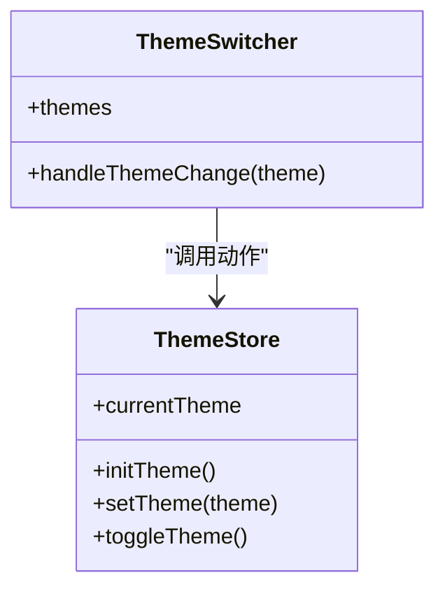
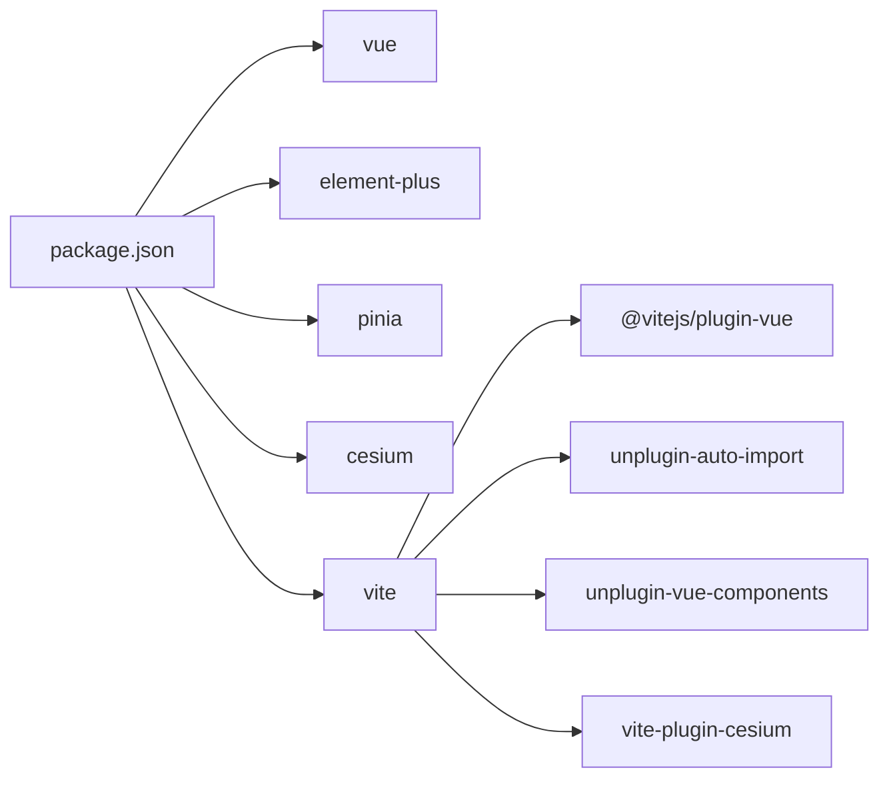

# 响应式设计

<cite>
**本文引用的文件**
- [src/styles/index.scss](file://src/styles/index.scss)
- [src/styles/variables.scss](file://src/styles/variables.scss)
- [src/App.vue](file://src/App.vue)
- [src/main.ts](file://src/main.ts)
- [vite.config.ts](file://vite.config.ts)
- [src/layouts/MainLayout.vue](file://src/layouts/MainLayout.vue)
- [src/views/dashboard/Dashboard.vue](file://src/views/dashboard/Dashboard.vue)
- [src/views/map/MapOverview.vue](file://src/views/map/MapOverview.vue)
- [src/views/data/RealTimeData.vue](file://src/views/data/RealTimeData.vue)
- [src/router/index.ts](file://src/router/index.ts)
- [src/stores/useThemeStore.ts](file://src/stores/useThemeStore.ts)
- [src/components/ThemeSwitcher.vue](file://src/components/ThemeSwitcher.vue)
- [src/types/index.ts](file://src/types/index.ts)
- [package.json](file://package.json)
</cite>

## 目录
1. [引言](#引言)
2. [项目结构](#项目结构)
3. [核心组件](#核心组件)
4. [架构总览](#架构总览)
5. [详细组件分析](#详细组件分析)
6. [依赖关系分析](#依赖关系分析)
7. [性能考量](#性能考量)
8. [故障排查指南](#故障排查指南)
9. [结论](#结论)
10. [附录](#附录)

## 引言
本文件面向“水文监测管理系统”的前端团队，系统化梳理项目在响应式设计方面的现状、策略与改进建议。重点覆盖：
- 响应式断点策略与移动端优先实践
- 不同屏幕尺寸下的布局适配、元素尺寸调整与交互优化
- Flex 与 Grid 在响应式场景的应用技巧
- 触摸设备交互适配、手势支持与体验优化
- 移动端特有样式处理、性能与兼容性测试建议
- 响应式最佳实践、调试方法与维护策略
- 扩展方案与自定义断点的实现路径

## 项目结构
项目采用 Vue 3 + Vite + Element Plus 架构，样式通过 SCSS 组织，全局样式与工具类统一管理，布局组件提供侧边栏与头部导航，视图层包含仪表盘、地图、实时数据等页面。

**图表来源**
- [src/main.ts:1-26](file://src/main.ts#L1-L26)
- [src/App.vue:1-15](file://src/App.vue#L1-L15)
- [src/router/index.ts:1-136](file://src/router/index.ts#L1-L136)
- [src/layouts/MainLayout.vue:1-434](file://src/layouts/MainLayout.vue#L1-L434)
- [src/views/dashboard/Dashboard.vue:1-155](file://src/views/dashboard/Dashboard.vue#L1-L155)
- [src/views/map/MapOverview.vue:1-649](file://src/views/map/MapOverview.vue#L1-L649)
- [src/views/data/RealTimeData.vue:1-300](file://src/views/data/RealTimeData.vue#L1-L300)
- [src/styles/index.scss:1-114](file://src/styles/index.scss#L1-L114)
- [src/styles/variables.scss:1-44](file://src/styles/variables.scss#L1-L44)
- [vite.config.ts:1-68](file://vite.config.ts#L1-L68)
- [package.json:1-48](file://package.json#L1-L48)

**章节来源**
- [src/main.ts:1-26](file://src/main.ts#L1-L26)
- [src/router/index.ts:1-136](file://src/router/index.ts#L1-L136)
- [src/layouts/MainLayout.vue:1-434](file://src/layouts/MainLayout.vue#L1-L434)
- [src/styles/index.scss:1-114](file://src/styles/index.scss#L1-L114)
- [src/styles/variables.scss:1-44](file://src/styles/variables.scss#L1-L44)
- [vite.config.ts:1-68](file://vite.config.ts#L1-L68)
- [package.json:1-48](file://package.json#L1-L48)

## 核心组件
- 全局样式与工具类：提供基础排版、Flex 工具类、间距与滚动条样式，支撑各视图的响应式布局。
- 主布局组件：提供侧边栏、头部导航与主内容区，配合 Element Plus 的容器组件实现响应式布局。
- 视图组件：
  - 仪表盘：使用 Element Plus 的栅格系统实现卡片与图表区域的响应式排列。
  - 地图概览：基于 Cesium 的三维场景容器，采用固定高度与占满视口的策略，保证在不同设备上的可用性。
  - 实时数据：表格与分页在不同断点下保持可读性与可操作性。
- 路由与导航：统一的面包屑与菜单路由，便于在移动端展示与交互。
- 主题与主题切换：通过 Pinia 管理主题配置，支持多种主题风格，提升可访问性与个性化体验。

**章节来源**
- [src/styles/index.scss:1-114](file://src/styles/index.scss#L1-L114)
- [src/layouts/MainLayout.vue:1-434](file://src/layouts/MainLayout.vue#L1-L434)
- [src/views/dashboard/Dashboard.vue:1-155](file://src/views/dashboard/Dashboard.vue#L1-L155)
- [src/views/map/MapOverview.vue:1-649](file://src/views/map/MapOverview.vue#L1-L649)
- [src/views/data/RealTimeData.vue:1-300](file://src/views/data/RealTimeData.vue#L1-L300)
- [src/router/index.ts:1-136](file://src/router/index.ts#L1-L136)
- [src/stores/useThemeStore.ts:1-69](file://src/stores/useThemeStore.ts#L1-L69)
- [src/components/ThemeSwitcher.vue:1-132](file://src/components/ThemeSwitcher.vue#L1-L132)

## 架构总览
系统采用“布局-视图-样式-路由-主题”分层组织，响应式能力主要体现在：
- 布局层：主容器与侧边栏、头部导航的弹性与折叠机制
- 视图层：栅格系统、卡片与表格的断点适配
- 样式层：SCSS 变量与工具类、Flex/Grid 使用
- 主题层：多主题风格与交互反馈

**图表来源**
- [src/layouts/MainLayout.vue:1-434](file://src/layouts/MainLayout.vue#L1-L434)
- [src/views/dashboard/Dashboard.vue:1-155](file://src/views/dashboard/Dashboard.vue#L1-L155)
- [src/views/map/MapOverview.vue:1-649](file://src/views/map/MapOverview.vue#L1-L649)
- [src/views/data/RealTimeData.vue:1-300](file://src/views/data/RealTimeData.vue#L1-L300)
- [src/styles/index.scss:1-114](file://src/styles/index.scss#L1-L114)
- [src/styles/variables.scss:1-44](file://src/styles/variables.scss#L1-L44)
- [src/stores/useThemeStore.ts:1-69](file://src/stores/useThemeStore.ts#L1-L69)
- [src/components/ThemeSwitcher.vue:1-132](file://src/components/ThemeSwitcher.vue#L1-L132)

## 详细组件分析

### 布局与导航（移动端优先）
- 侧边栏折叠：通过状态控制宽度与菜单项显示，适合窄屏设备。
- 头部导航：左右分区布局，右侧包含用户信息与主题切换，适合移动端紧凑展示。
- 面包屑导航：随路由变化，帮助用户定位当前页面。

**图表来源**
- [src/layouts/MainLayout.vue:131-211](file://src/layouts/MainLayout.vue#L131-L211)

**章节来源**
- [src/layouts/MainLayout.vue:1-434](file://src/layouts/MainLayout.vue#L1-L434)

### 仪表盘（栅格与卡片）
- 使用 Element Plus 的栅格系统，针对不同断点设置列宽，使统计卡片在小屏上堆叠，在中大屏上并排。
- 卡片内采用 Flex 布局，图标与文本对齐，保证信息密度与可读性。

**图表来源**
- [src/views/dashboard/Dashboard.vue:4-52](file://src/views/dashboard/Dashboard.vue#L4-L52)
- [src/views/dashboard/Dashboard.vue:55-81](file://src/views/dashboard/Dashboard.vue#L55-L81)
- [src/views/dashboard/Dashboard.vue:84-96](file://src/views/dashboard/Dashboard.vue#L84-L96)

**章节来源**
- [src/views/dashboard/Dashboard.vue:1-155](file://src/views/dashboard/Dashboard.vue#L1-L155)

### 地图概览（Cesium 场景）
- 地图容器采用占满视口高度与宽度，并通过深度选择器隐藏 Cesium 版权信息，减少视觉干扰。
- Cesium Viewer 在挂载时根据设备能力与屏幕尺寸进行初始化，保证在移动设备上的可用性。

**图表来源**
- [src/views/map/MapOverview.vue:607-622](file://src/views/map/MapOverview.vue#L607-L622)
- [src/views/map/MapOverview.vue:83-98](file://src/views/map/MapOverview.vue#L83-L98)

**章节来源**
- [src/views/map/MapOverview.vue:1-649](file://src/views/map/MapOverview.vue#L1-L649)

### 实时数据（表格与分页）
- 表单采用内联布局，输入控件在窄屏下仍保持可读性。
- 表格列根据要素动态生成，支持横向滚动；分页控件右对齐，便于移动端点击。
- 通过最大高度限制与滚动条样式，提升长列表的可操作性。

**图表来源**
- [src/views/data/RealTimeData.vue:187-229](file://src/views/data/RealTimeData.vue#L187-L229)
- [src/views/data/RealTimeData.vue:251-262](file://src/views/data/RealTimeData.vue#L251-L262)

**章节来源**
- [src/views/data/RealTimeData.vue:1-300](file://src/views/data/RealTimeData.vue#L1-L300)

### 主题与交互（可访问性与个性化）
- 主题存储在 Pinia 中，支持多种风格，切换时更新侧边栏与菜单颜色。
- 主题切换器提供可视化预览，便于用户选择合适的主题。

**图表来源**
- [src/stores/useThemeStore.ts:34-68](file://src/stores/useThemeStore.ts#L34-L68)
- [src/components/ThemeSwitcher.vue:35-82](file://src/components/ThemeSwitcher.vue#L35-L82)

**章节来源**
- [src/stores/useThemeStore.ts:1-69](file://src/stores/useThemeStore.ts#L1-L69)
- [src/components/ThemeSwitcher.vue:1-132](file://src/components/ThemeSwitcher.vue#L1-L132)
- [src/types/index.ts:36-50](file://src/types/index.ts#L36-L50)

## 依赖关系分析
- 样式依赖：全局样式引入 SCSS 变量，工具类统一 Flex 与间距。
- 构建依赖：Vite 插件链路包含 Vue、自动导入、组件解析与 Cesium 插件，保障开发与运行效率。
- 运行时依赖：Element Plus 提供 UI 组件与栅格系统；Cesium 提供三维地图能力；Pinia 提供状态管理。

**图表来源**
- [package.json:14-26](file://package.json#L14-L26)
- [vite.config.ts:14-27](file://vite.config.ts#L14-L27)

**章节来源**
- [package.json:1-48](file://package.json#L1-L48)
- [vite.config.ts:1-68](file://vite.config.ts#L1-L68)

## 性能考量
- 构建优化：通过手动分块策略将第三方库拆分，减少首屏体积。
- 运行时优化：Cesium 场景在卸载时释放资源，避免内存泄漏。
- 样式优化：统一使用 SCSS 变量与工具类，减少重复样式与重绘。

**章节来源**
- [vite.config.ts:53-65](file://vite.config.ts#L53-L65)
- [src/views/map/MapOverview.vue:611-622](file://src/views/map/MapOverview.vue#L611-L622)
- [src/styles/index.scss:1-114](file://src/styles/index.scss#L1-L114)

## 故障排查指南
- 路由守卫：检查鉴权逻辑与进度条配置，确保登录状态与页面跳转正确。
- 主题切换：确认主题配置映射与本地存储键名一致。
- 地图初始化：关注 Cesium 初始化异常与资源加载错误，必要时增加降级提示。
- 表格渲染：检查数据过滤与列动态生成逻辑，避免空值导致的渲染异常。

**章节来源**
- [src/router/index.ts:116-133](file://src/router/index.ts#L116-L133)
- [src/stores/useThemeStore.ts:44-58](file://src/stores/useThemeStore.ts#L44-L58)
- [src/views/map/MapOverview.vue:77-124](file://src/views/map/MapOverview.vue#L77-L124)
- [src/views/data/RealTimeData.vue:187-229](file://src/views/data/RealTimeData.vue#L187-L229)

## 结论
本项目在响应式设计方面已具备良好基础：全局样式与工具类、Element Plus 栅格系统、主布局的折叠机制以及主题切换能力。为进一步提升移动端体验，建议补充媒体查询断点策略、增强触摸交互细节、完善手势支持与无障碍访问，并建立系统化的响应式测试流程与回归策略。

## 附录

### 响应式断点策略与移动端优先
- 断点建议
  - 超小屏（手机竖屏）：≤ 576px，卡片堆叠、按钮与输入控件增大触控面积
  - 小屏（手机横屏/平板竖屏）：577px - 768px，适度压缩间距，优先展示关键信息
  - 中屏（平板横屏）：769px - 1024px，启用双列布局，保留侧边栏折叠
  - 大屏及以上：≥ 1025px，启用三列或四列布局，充分利用空间
- 移动端优先
  - 以最小断点为基线，向上增强
  - 控制字体大小与行高，确保可读性
  - 增大点击目标尺寸，降低误触概率
  - 优化滚动与触摸手势，减少重绘与回流

### Flex 与 Grid 在响应式中的应用技巧
- Flex
  - 使用 `flex-wrap` 与 `gap` 控制换行与间距
  - 在窄屏下将主轴对齐方式改为居中或两端对齐，提升视觉平衡
- Grid
  - 使用 `repeat(auto-fit, minmax())` 实现自适应网格
  - 在卡片密集场景中，结合 `grid-template-columns` 与 `auto-fill` 保持均匀分布

### 触摸设备交互适配与手势支持
- 触摸目标尺寸：按钮与链接至少 44px × 44px
- 滚动手势：为长列表启用原生滚动，避免自定义滚动条带来的性能问题
- 拖拽与缩放：在地图场景中谨慎启用缩放与旋转，提供简化操作入口

### 移动端特有样式处理与兼容性测试
- 样式处理
  - 使用 `rem/em` 或 `clamp()` 控制字号与间距的流式变化
  - 为高对比度用户提供替代配色方案
- 兼容性测试
  - 覆盖主流浏览器与 WebView（Android Chrome、iOS Safari）
  - 关注字体回退、图标渲染与第三方库的兼容性

### 响应式最佳实践、调试方法与维护策略
- 最佳实践
  - 统一断点命名与间距体系，避免散乱的像素值
  - 优先使用语义化组件与布局，减少自定义样式
  - 为关键交互提供键盘与屏幕阅读器支持
- 调试方法
  - 使用浏览器开发者工具的设备模拟器与网络面板
  - 对比不同分辨率下的布局与交互表现
- 维护策略
  - 建立响应式变更评审流程
  - 为常用断点与样式变量建立文档与示例

### 扩展方案与自定义断点实现
- 自定义断点
  - 在 SCSS 变量中定义断点常量，集中管理
  - 通过 Mixin 或函数封装媒体查询，复用断点逻辑
- 组件级响应式
  - 为关键组件提供 props 控制布局行为（如是否折叠、列数等）
  - 使用组合式 API 在组件内动态计算布局参数