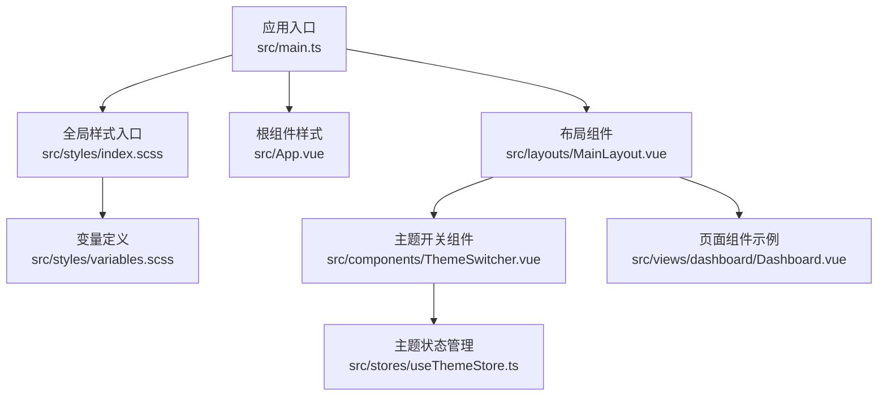
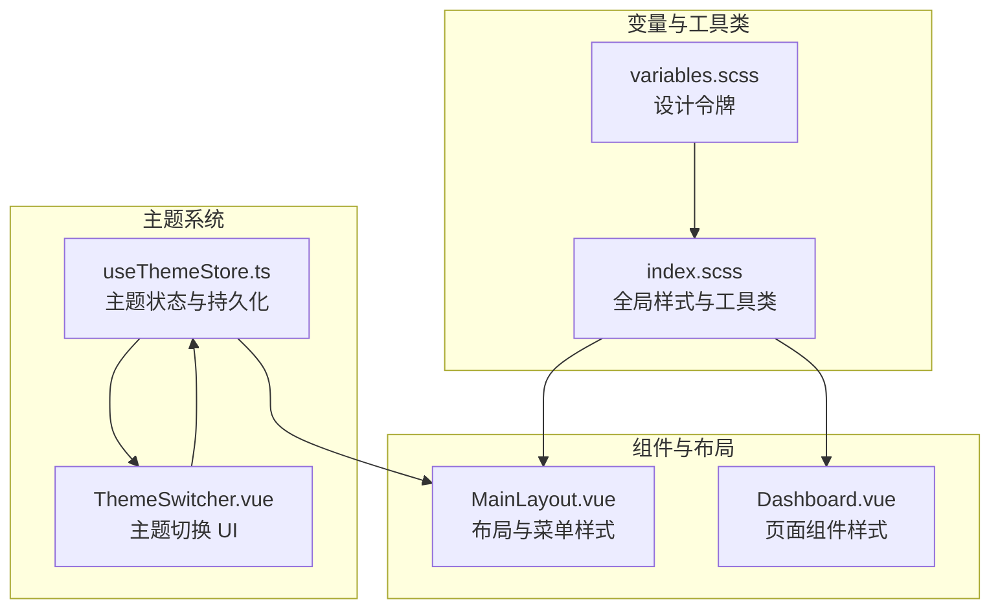
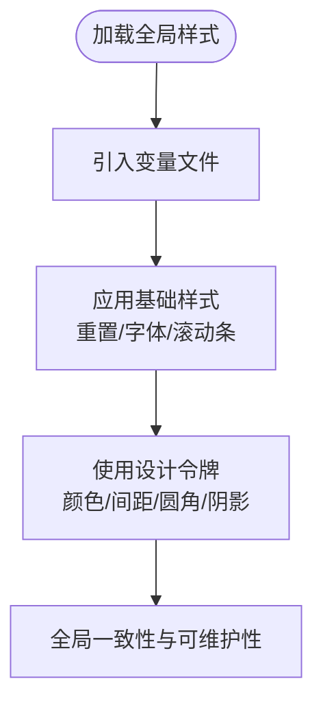
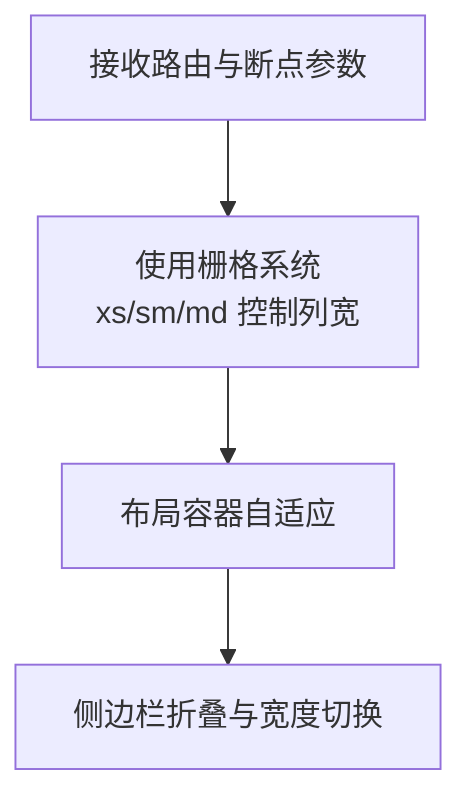
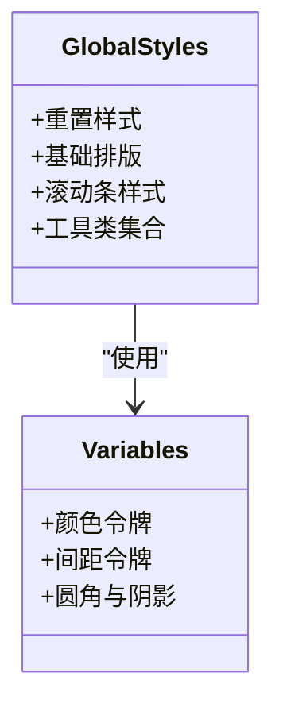
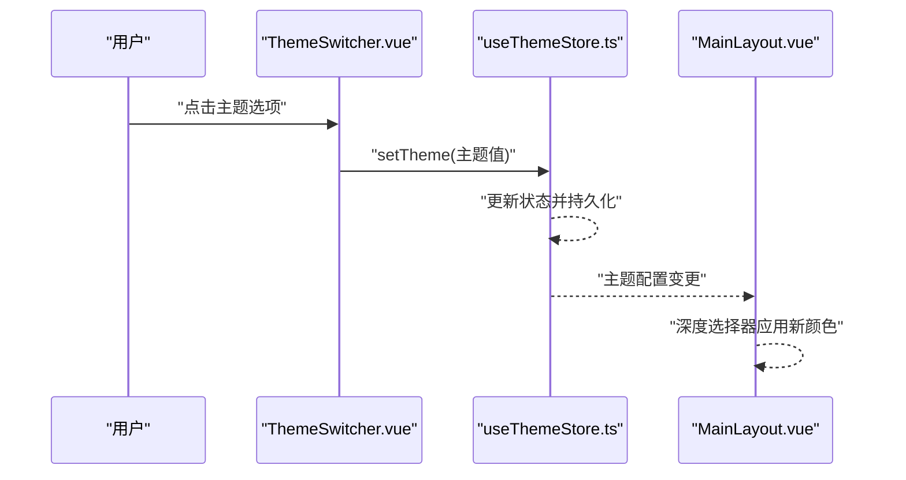
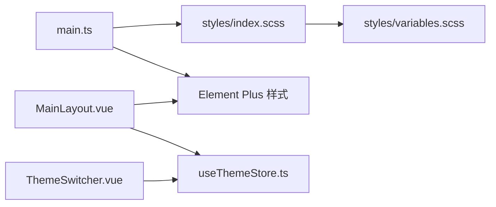

# 样式系统

<cite>
**本文引用的文件**
- [src/styles/index.scss](file://src/styles/index.scss)
- [src/styles/variables.scss](file://src/styles/variables.scss)
- [src/main.ts](file://src/main.ts)
- [src/App.vue](file://src/App.vue)
- [src/layouts/MainLayout.vue](file://src/layouts/MainLayout.vue)
- [src/components/ThemeSwitcher.vue](file://src/components/ThemeSwitcher.vue)
- [src/stores/useThemeStore.ts](file://src/stores/useThemeStore.ts)
- [src/views/dashboard/Dashboard.vue](file://src/views/dashboard/Dashboard.vue)
- [src/types/index.ts](file://src/types/index.ts)
- [vite.config.ts](file://vite.config.ts)
- [package.json](file://package.json)
</cite>

## 目录
1. [简介](#简介)
2. [项目结构](#项目结构)
3. [核心组件](#核心组件)
4. [架构总览](#架构总览)
5. [详细组件分析](#详细组件分析)
6. [依赖分析](#依赖分析)
7. [性能考虑](#性能考虑)
8. [故障排查指南](#故障排查指南)
9. [结论](#结论)
10. [附录](#附录)

## 简介
本文件面向水文监测管理系统中的样式系统，系统采用 SCSS 变量与工具类组织全局样式，结合 Element Plus 组件库与 Pinia 主题状态管理，实现主题切换与组件样式隔离。文档涵盖变量系统设计理念、颜色体系、响应式布局策略、全局样式组织、组件样式隔离、主题系统实现、CSS 变量使用建议、样式覆盖与自定义方案、性能优化、浏览器兼容性与移动端适配、最佳实践与维护指南，以及静态资源与图标的使用建议。

## 项目结构
样式系统由以下层次构成：
- 全局入口：在应用入口统一引入全局样式与 Element Plus 样式，保证全局样式优先级与组件样式一致。
- 变量层：集中定义颜色、间距、圆角、阴影等设计令牌，供全局与组件样式复用。
- 工具类层：提供常用的排版、布局、间距等工具类，提升开发效率并减少重复样式。
- 主题层：通过 Pinia 管理主题状态，动态注入侧边栏与菜单的颜色变量，实现主题切换。
- 组件层：每个页面与组件按需引入 Element Plus 组件样式，并在组件内使用工具类与主题变量。

**图表来源**
- [src/main.ts:10](file://src/main.ts#L10)
- [src/styles/index.scss:1](file://src/styles/index.scss#L1)
- [src/styles/variables.scss:1](file://src/styles/variables.scss#L1)
- [src/App.vue:9](file://src/App.vue#L9)
- [src/layouts/MainLayout.vue:1](file://src/layouts/MainLayout.vue#L1)
- [src/components/ThemeSwitcher.vue:1](file://src/components/ThemeSwitcher.vue#L1)
- [src/stores/useThemeStore.ts:1](file://src/stores/useThemeStore.ts#L1)
- [src/views/dashboard/Dashboard.vue:1](file://src/views/dashboard/Dashboard.vue#L1)

**章节来源**
- [src/main.ts:10](file://src/main.ts#L10)
- [src/styles/index.scss:1](file://src/styles/index.scss#L1)
- [src/styles/variables.scss:1](file://src/styles/variables.scss#L1)
- [src/App.vue:9](file://src/App.vue#L9)
- [src/layouts/MainLayout.vue:1](file://src/layouts/MainLayout.vue#L1)
- [src/components/ThemeSwitcher.vue:1](file://src/components/ThemeSwitcher.vue#L1)
- [src/stores/useThemeStore.ts:1](file://src/stores/useThemeStore.ts#L1)
- [src/views/dashboard/Dashboard.vue:1](file://src/views/dashboard/Dashboard.vue#L1)

## 核心组件
- 全局样式入口：负责重置、字体、滚动条、通用工具类等全局样式，统一基础视觉语言。
- 变量系统：集中定义主色、文字色、边框色、背景色、间距、圆角与阴影等设计令牌，便于主题扩展与一致性维护。
- 主题状态管理：提供主题风格枚举与主题配置映射，持久化存储当前主题，支持切换与遍历。
- 主题切换器：基于 Element Plus 下拉菜单，展示主题预览与标签，触发主题状态变更。
- 布局组件：通过深度作用选择器与主题变量，控制侧边栏、菜单、头部等区域的色彩与交互。
- 页面组件：使用 Element Plus 组件与工具类，体现统一的栅格、卡片、按钮等视觉规范。

**章节来源**
- [src/styles/index.scss:1](file://src/styles/index.scss#L1)
- [src/styles/variables.scss:1](file://src/styles/variables.scss#L1)
- [src/stores/useThemeStore.ts:1](file://src/stores/useThemeStore.ts#L1)
- [src/components/ThemeSwitcher.vue:1](file://src/components/ThemeSwitcher.vue#L1)
- [src/layouts/MainLayout.vue:1](file://src/layouts/MainLayout.vue#L1)
- [src/views/dashboard/Dashboard.vue:1](file://src/views/dashboard/Dashboard.vue#L1)

## 架构总览
样式系统围绕“变量—工具类—主题—组件”的分层结构展开，主题切换通过 Pinia 状态驱动，布局与组件样式通过深度作用选择器与主题变量生效，确保主题切换时的样式一致性与可维护性。

**图表来源**
- [src/styles/variables.scss:1](file://src/styles/variables.scss#L1)
- [src/styles/index.scss:1](file://src/styles/index.scss#L1)
- [src/stores/useThemeStore.ts:1](file://src/stores/useThemeStore.ts#L1)
- [src/components/ThemeSwitcher.vue:1](file://src/components/ThemeSwitcher.vue#L1)
- [src/layouts/MainLayout.vue:1](file://src/layouts/MainLayout.vue#L1)
- [src/views/dashboard/Dashboard.vue:1](file://src/views/dashboard/Dashboard.vue#L1)

## 详细组件分析

### 变量系统与颜色体系
- 设计令牌集中于变量文件，包括主色系、语义色（成功/警告/危险/信息）、文本色、边框色、背景色、间距、圆角与阴影等。
- 全局样式通过变量统一应用到 body、滚动条与工具类，确保全局一致性。
- 颜色体系与 Element Plus 主色保持一致，便于在组件中直接使用类型化颜色。

**图表来源**
- [src/styles/index.scss:1](file://src/styles/index.scss#L1)
- [src/styles/variables.scss:1](file://src/styles/variables.scss#L1)

**章节来源**
- [src/styles/variables.scss:1](file://src/styles/variables.scss#L1)
- [src/styles/index.scss:1](file://src/styles/index.scss#L1)

### 响应式布局策略
- 页面组件采用 Element Plus 的栅格系统，针对不同断点设置列宽，实现移动端到桌面端的自适应。
- 布局组件对侧边栏宽度进行条件计算，配合菜单折叠逻辑，兼顾小屏与大屏体验。

**图表来源**
- [src/views/dashboard/Dashboard.vue:4](file://src/views/dashboard/Dashboard.vue#L4)
- [src/layouts/MainLayout.vue:4](file://src/layouts/MainLayout.vue#L4)

**章节来源**
- [src/views/dashboard/Dashboard.vue:4](file://src/views/dashboard/Dashboard.vue#L4)
- [src/layouts/MainLayout.vue:4](file://src/layouts/MainLayout.vue#L4)

### 全局样式组织与工具类
- 全局重置与基础排版在入口样式中统一声明，字体平滑与字号设定提升阅读体验。
- 提供常用工具类（对齐、Flex 布局、尺寸、间距），减少重复样式代码，提高开发效率。

**图表来源**
- [src/styles/index.scss:1](file://src/styles/index.scss#L1)
- [src/styles/variables.scss:1](file://src/styles/variables.scss#L1)

**章节来源**
- [src/styles/index.scss:1](file://src/styles/index.scss#L1)
- [src/styles/variables.scss:1](file://src/styles/variables.scss#L1)

### 组件样式隔离与主题系统实现
- 布局组件通过深度作用选择器覆盖 Element Plus 菜单与面包屑样式，结合主题变量实现侧边栏与菜单的色彩切换。
- 主题开关组件提供主题预览与标签，点击后通过 Pinia 更新主题状态并持久化。
- 主题状态管理提供初始化、切换与遍历方法，确保主题切换的可控与可恢复。

**图表来源**
- [src/components/ThemeSwitcher.vue:80](file://src/components/ThemeSwitcher.vue#L80)
- [src/stores/useThemeStore.ts:52](file://src/stores/useThemeStore.ts#L52)
- [src/layouts/MainLayout.vue:25](file://src/layouts/MainLayout.vue#L25)

**章节来源**
- [src/components/ThemeSwitcher.vue:1](file://src/components/ThemeSwitcher.vue#L1)
- [src/stores/useThemeStore.ts:1](file://src/stores/useThemeStore.ts#L1)
- [src/layouts/MainLayout.vue:1](file://src/layouts/MainLayout.vue#L1)

### CSS 变量使用、样式覆盖与自定义方案
- 当前项目主要通过 SCSS 变量与深度作用选择器实现主题覆盖，未直接使用 CSS 自定义属性。
- 建议在需要运行时动态切换的场景引入 CSS 变量，结合 JavaScript 动态更新根节点变量，以获得更灵活的主题切换能力。

**章节来源**
- [src/layouts/MainLayout.vue:252](file://src/layouts/MainLayout.vue#L252)
- [src/styles/variables.scss:1](file://src/styles/variables.scss#L1)

### 静态资源管理、图片与图标系统
- 图标通过 Element Plus 图标库统一引入并在组件中使用，无需额外处理。
- 页面组件中使用 Element Plus 卡片与栅格，配合工具类实现占位与布局。

**章节来源**
- [src/main.ts:14](file://src/main.ts#L14)
- [src/views/dashboard/Dashboard.vue:6](file://src/views/dashboard/Dashboard.vue#L6)

## 依赖分析
- 应用入口引入全局样式与 Element Plus 样式，保证全局样式优先级。
- 布局与组件依赖 Element Plus 组件样式，通过深度作用选择器进行局部覆盖。
- 主题系统依赖 Pinia 状态管理，持久化存储主题配置。

**图表来源**
- [src/main.ts:10](file://src/main.ts#L10)
- [src/styles/index.scss:1](file://src/styles/index.scss#L1)
- [src/styles/variables.scss:1](file://src/styles/variables.scss#L1)
- [src/layouts/MainLayout.vue:1](file://src/layouts/MainLayout.vue#L1)
- [src/stores/useThemeStore.ts:1](file://src/stores/useThemeStore.ts#L1)
- [src/components/ThemeSwitcher.vue:1](file://src/components/ThemeSwitcher.vue#L1)

**章节来源**
- [src/main.ts:10](file://src/main.ts#L10)
- [src/layouts/MainLayout.vue:1](file://src/layouts/MainLayout.vue#L1)
- [src/stores/useThemeStore.ts:1](file://src/stores/useThemeStore.ts#L1)
- [src/components/ThemeSwitcher.vue:1](file://src/components/ThemeSwitcher.vue#L1)

## 性能考虑
- 构建配置中对 Element Plus 与第三方库进行手动分包，减少首屏体积与重复打包。
- 关闭源码映射以减小构建产物体积，提升生产环境加载速度。
- 建议在生产环境开启 CSS 与 JS 压缩与资源压缩，进一步优化加载性能。

**章节来源**
- [vite.config.ts:53](file://vite.config.ts#L53)
- [vite.config.ts:55](file://vite.config.ts#L55)
- [vite.config.ts:61](file://vite.config.ts#L61)

## 故障排查指南
- 主题切换无效：检查主题状态是否正确持久化，确认主题枚举与配置映射一致。
- 菜单颜色未生效：确认深度作用选择器是否正确应用，检查主题变量是否被覆盖。
- 字体显示不清晰：检查全局字体与字体平滑设置，确保在不同系统上的一致性。
- 移动端布局异常：核对栅格断点与容器宽度，确保在小屏设备上的可读性与可用性。

**章节来源**
- [src/stores/useThemeStore.ts:44](file://src/stores/useThemeStore.ts#L44)
- [src/layouts/MainLayout.vue:252](file://src/layouts/MainLayout.vue#L252)
- [src/styles/index.scss:14](file://src/styles/index.scss#L14)
- [src/views/dashboard/Dashboard.vue:4](file://src/views/dashboard/Dashboard.vue#L4)

## 结论
该样式系统通过 SCSS 变量与工具类实现全局一致性，结合 Pinia 主题状态与 Element Plus 组件，形成可维护、可扩展的主题体系。建议在后续迭代中引入 CSS 变量以增强运行时主题切换能力，并持续优化构建与资源加载策略，以提升性能与用户体验。

## 附录
- 主题风格枚举与配置：用于定义与切换主题风格，确保主题切换的可控与可恢复。
- 构建与插件：通过 Vite 插件自动导入 Element Plus 组件与 Vue API，减少样板代码。

**章节来源**
- [src/types/index.ts:36](file://src/types/index.ts#L36)
- [src/types/index.ts:44](file://src/types/index.ts#L44)
- [vite.config.ts:18](file://vite.config.ts#L18)
- [vite.config.ts:23](file://vite.config.ts#L23)