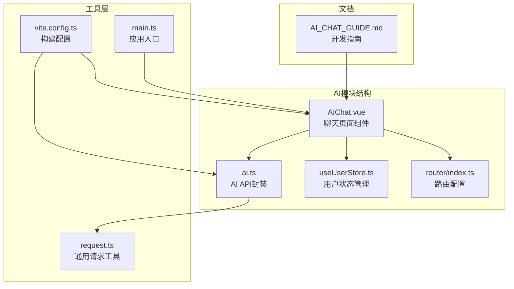
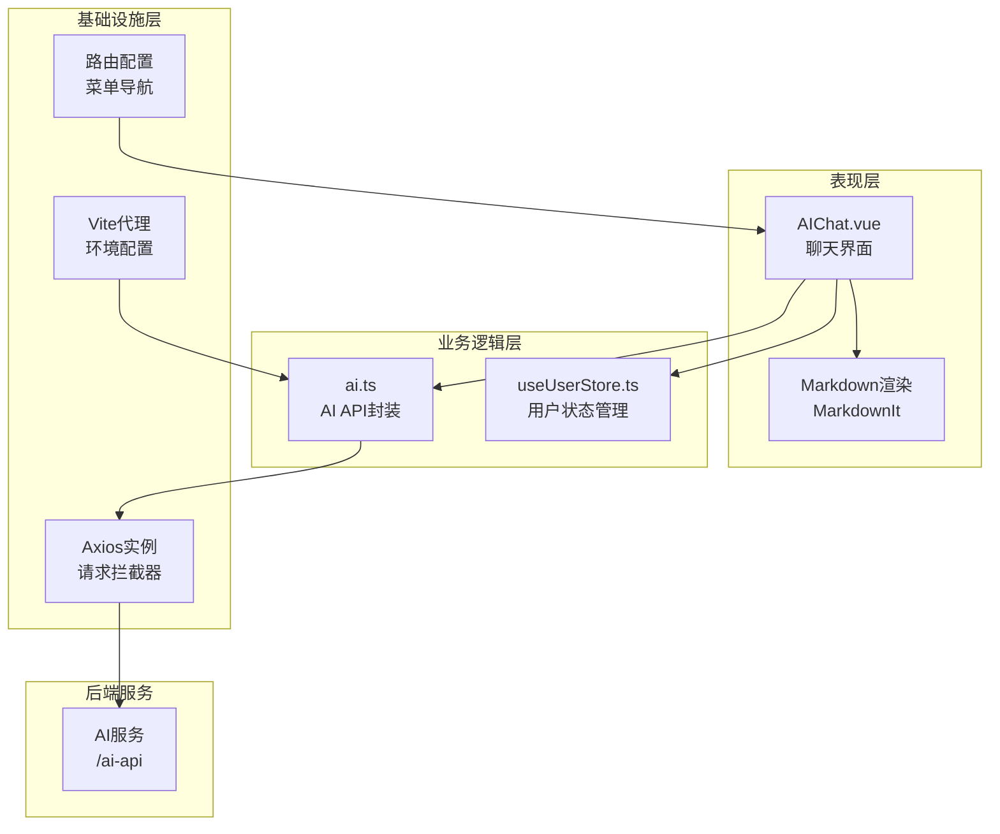
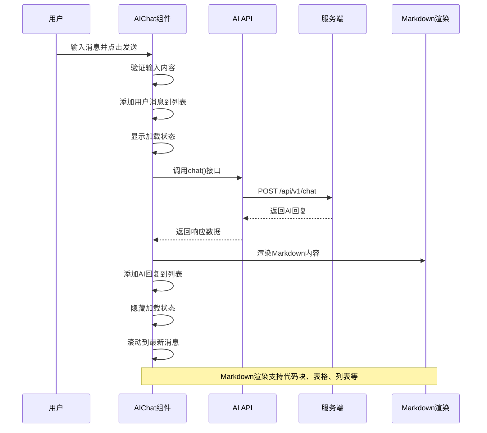
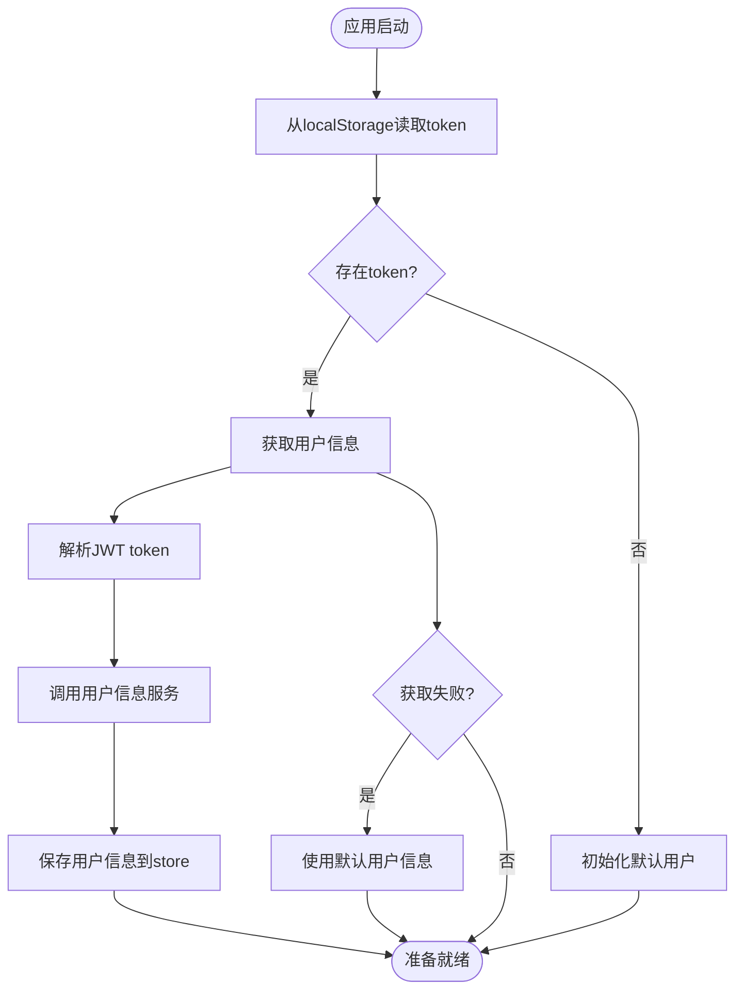
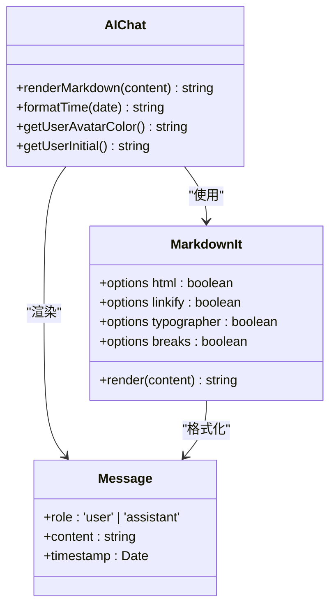
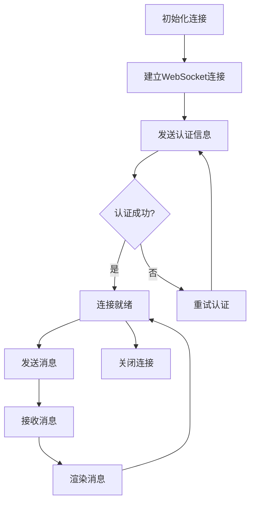

# AI智能助手模块

<cite>
**本文档引用的文件**
- [AIChat.vue](file://src/views/ai/AIChat.vue)
- [ai.ts](file://src/api/ai.ts)
- [useUserStore.ts](file://src/stores/useUserStore.ts)
- [request.ts](file://src/utils/request.ts)
- [index.ts](file://src/router/index.ts)
- [AI_CHAT_GUIDE.md](file://docs/AI_CHAT_GUIDE.md)
- [vite.config.ts](file://vite.config.ts)
- [main.ts](file://src/main.ts)
- [package.json](file://package.json)
</cite>

## 目录
1. [简介](#简介)
2. [项目结构](#项目结构)
3. [核心组件](#核心组件)
4. [架构总览](#架构总览)
5. [详细组件分析](#详细组件分析)
6. [依赖关系分析](#依赖关系分析)
7. [性能考虑](#性能考虑)
8. [故障排除指南](#故障排除指南)
9. [结论](#结论)
10. [附录](#附录)

## 简介
本模块实现了基于大语言模型的智能问答功能，提供完整的聊天界面、消息渲染、历史管理与实时响应机制。系统采用前后端分离架构，前端使用Vue 3 + TypeScript + Element Plus构建，通过Axios进行API通信，支持Markdown格式渲染、用户身份认证、响应式布局和错误处理。

## 项目结构
AI智能助手模块位于src/views/ai目录下，主要包含聊天页面组件和API封装层。



**图表来源**
- [AIChat.vue:1-519](file://src/views/ai/AIChat.vue#L1-L519)
- [ai.ts:1-113](file://src/api/ai.ts#L1-L113)
- [useUserStore.ts:1-200](file://src/stores/useUserStore.ts#L1-L200)
- [index.ts:1-136](file://src/router/index.ts#L1-L136)

**章节来源**
- [AIChat.vue:1-519](file://src/views/ai/AIChat.vue#L1-L519)
- [ai.ts:1-113](file://src/api/ai.ts#L1-L113)
- [index.ts:1-136](file://src/router/index.ts#L1-L136)

## 核心组件
AI智能助手模块的核心组件包括聊天页面组件、API封装层、用户状态管理和路由配置。

### 聊天页面组件 (AIChat.vue)
该组件实现了完整的聊天界面，包含消息列表渲染、输入处理、Markdown渲染和用户交互功能。

**主要特性：**
- 实时消息渲染与滚动定位
- Markdown格式支持（代码块、表格、列表等）
- 用户头像动态生成
- 加载状态指示器
- 健康检查与错误处理

**章节来源**
- [AIChat.vue:165-202](file://src/views/ai/AIChat.vue#L165-L202)
- [AIChat.vue:131-147](file://src/views/ai/AIChat.vue#L131-L147)
- [AIChat.vue:106-109](file://src/views/ai/AIChat.vue#L106-L109)

### API封装层 (ai.ts)
提供AI服务的HTTP接口封装，包含聊天消息发送、健康检查和诊断功能。

**接口定义：**
- POST /api/v1/chat - 发送聊天消息
- GET /api/v1/chat/health - 健康检查
- GET /api/v1/chat/diagnose - 诊断服务

**章节来源**
- [ai.ts:96-105](file://src/api/ai.ts#L96-L105)
- [ai.ts:80-90](file://src/api/ai.ts#L80-L90)

## 架构总览
系统采用分层架构设计，各层职责明确，耦合度低。



**图表来源**
- [AIChat.vue:92-110](file://src/views/ai/AIChat.vue#L92-L110)
- [ai.ts:8-15](file://src/api/ai.ts#L8-L15)
- [vite.config.ts:37-51](file://vite.config.ts#L37-L51)

## 详细组件分析

### 聊天消息处理流程
系统实现了完整的消息发送接收流程，包括用户输入验证、消息渲染和错误处理。



**图表来源**
- [AIChat.vue:165-202](file://src/views/ai/AIChat.vue#L165-L202)
- [ai.ts:96-98](file://src/api/ai.ts#L96-L98)

### 用户身份认证与状态管理
系统通过Pinia状态管理实现用户认证状态的持久化和跨组件共享。



**图表来源**
- [useUserStore.ts:100-125](file://src/stores/useUserStore.ts#L100-L125)
- [useUserStore.ts:132-150](file://src/stores/useUserStore.ts#L132-L150)

**章节来源**
- [useUserStore.ts:18-53](file://src/stores/useUserStore.ts#L18-L53)
- [useUserStore.ts:185-199](file://src/stores/useUserStore.ts#L185-L199)

### Markdown渲染机制
系统集成了Markdown-it库，提供丰富的文本格式化能力。



**图表来源**
- [AIChat.vue:131-147](file://src/views/ai/AIChat.vue#L131-L147)
- [AIChat.vue:100-104](file://src/views/ai/AIChat.vue#L100-L104)

**章节来源**
- [AIChat.vue:131-154](file://src/views/ai/AIChat.vue#L131-L154)
- [AI_CHAT_GUIDE.md:136-160](file://docs/AI_CHAT_GUIDE.md#L136-L160)

### WebSocket连接机制
虽然当前实现使用HTTP请求，但系统架构支持WebSocket连接的扩展。



**图表来源**
- [AIChat.vue:165-202](file://src/views/ai/AIChat.vue#L165-L202)
- [ai.ts:18-30](file://src/api/ai.ts#L18-L30)

## 依赖关系分析

### 技术栈依赖
系统采用现代化的前端技术栈，各依赖包协同工作。

```mermaid
graph TB
subgraph "核心框架"
Vue[Vue 3.4.21<br/>Composition API]
TS[TypeScript 5.4.3<br/>强类型支持]
Pinia[Pinia 2.1.7<br/>状态管理]
end
subgraph "UI组件库"
EP[Element Plus 2.6.3<br/>组件库]
Icons[Element Icons<br/>图标系统]
end
subgraph "网络请求"
Axios[Axios 1.6.8<br/>HTTP客户端]
NProgress[NProgress 0.2.0<br/>进度条]
end
subgraph "文本处理"
MD[Markdown-it 14.2.0<br/>Markdown解析]
TypesMD[@types/markdown-it<br/>类型定义]
end
subgraph "构建工具"
Vite[Vite 4.5.3<br/>开发服务器]
Router[Vue Router 4.3.0<br/>路由]
end
Vue --> EP
Vue --> Pinia
Vue --> Router
EP --> Icons
Vue --> Axios
Axios --> NProgress
Vue --> MD
MD --> TypesMD
Vite --> Vue
Vite --> Router
```

**图表来源**
- [package.json:14-26](file://package.json#L14-L26)
- [main.ts:1-26](file://src/main.ts#L1-L26)

**章节来源**
- [package.json:1-48](file://package.json#L1-L48)
- [main.ts:1-26](file://src/main.ts#L1-L26)

### 环境配置与代理
系统通过Vite配置实现开发环境的API代理和环境变量管理。

**章节来源**
- [vite.config.ts:37-51](file://vite.config.ts#L37-L51)
- [AI_CHAT_GUIDE.md:25-31](file://docs/AI_CHAT_GUIDE.md#L25-L31)

## 性能考虑
系统在设计时充分考虑了性能优化和用户体验。

### 渲染性能优化
- **懒加载策略**：长文本内容采用渐进式渲染
- **虚拟滚动**：大量历史消息时可考虑实现虚拟滚动
- **防抖处理**：输入验证和发送操作的防抖处理
- **内存管理**：及时清理不再使用的DOM节点

### 网络性能优化
- **请求缓存**：对重复请求进行缓存处理
- **连接池管理**：合理管理HTTP连接
- **超时控制**：设置合理的请求超时时间
- **错误重试**：实现智能的错误重试机制

## 故障排除指南

### 常见问题及解决方案

**问题1：发送消息失败**
- **可能原因**：AI服务未启动、网络连接异常、API地址配置错误
- **解决方案**：
  1. 检查后端服务状态：`http://127.0.0.1:8180`
  2. 点击"健康检查"按钮测试连接
  3. 查看浏览器控制台错误信息

**问题2：响应超时**
- **可能原因**：网络延迟、AI处理时间过长、服务器负载过高
- **解决方案**：
  1. 检查网络连接质量
  2. 简化问题描述，分步骤提问
  3. 稍后重试或联系管理员

**问题3：Markdown渲染异常**
- **可能原因**：markdown-it依赖未正确安装、渲染函数调用错误、CSS样式缺失
- **解决方案**：
  1. 确认依赖已安装：`npm list markdown-it`
  2. 检查控制台是否有渲染错误
  3. 验证CSS样式是否正确加载

**问题4：菜单不显示**
- **可能原因**：路由配置未生效、浏览器缓存问题
- **解决方案**：
  1. 清除浏览器缓存
  2. 重启开发服务器
  3. 检查路由配置文件

**章节来源**
- [AI_CHAT_GUIDE.md:297-345](file://docs/AI_CHAT_GUIDE.md#L297-L345)

## 结论
AI智能助手模块是一个功能完整、架构清晰的前端应用模块。它提供了优秀的用户体验，包括实时聊天、Markdown渲染、响应式设计和完善的错误处理机制。模块采用现代化的技术栈，具有良好的可维护性和扩展性。通过合理的状态管理和API封装，系统能够稳定地支持多轮对话和复杂的交互场景。

## 附录

### 开发者指南
- **环境要求**：Node.js 16+，npm 8+
- **安装依赖**：`npm install`
- **启动开发**：`npm run dev`
- **构建生产**：`npm run build`

### 扩展接口
系统预留了多个扩展点：
1. **WebSocket支持**：可扩展实时消息推送
2. **插件系统**：支持自定义Markdown扩展
3. **主题系统**：支持多主题切换
4. **国际化**：支持多语言本地化

### 自定义配置选项
- **消息参数**：maxTokens、temperature等LLM参数
- **UI样式**：主题颜色、字体大小、布局模式
- **行为设置**：自动滚动、消息保存、通知提醒