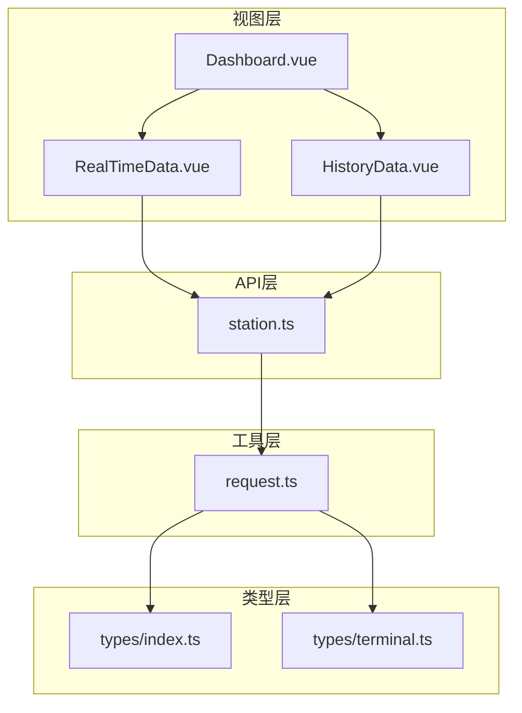
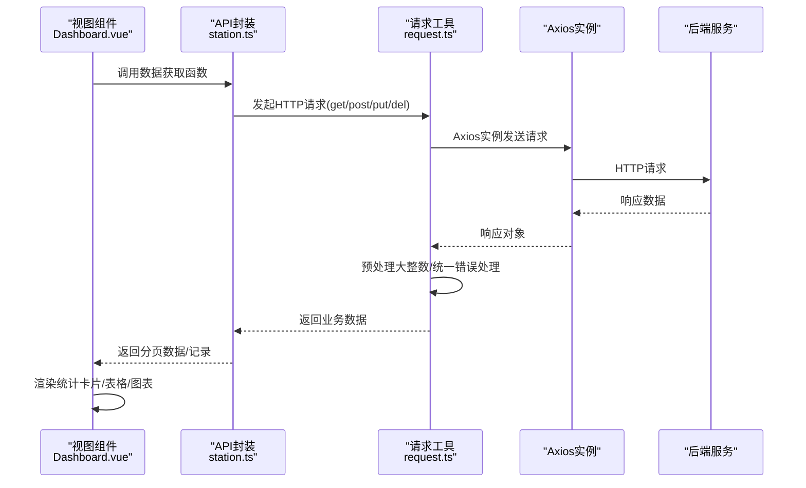
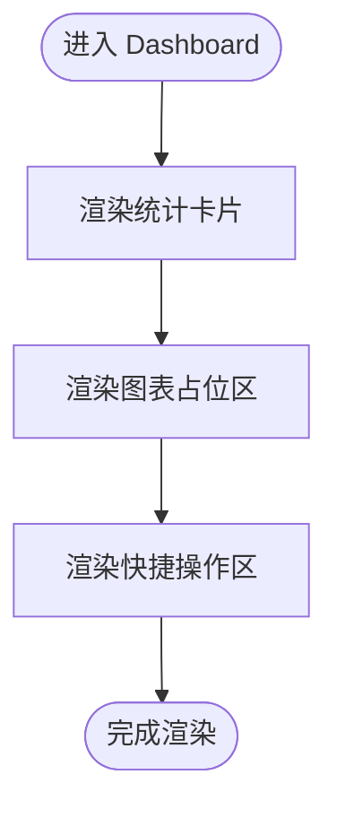
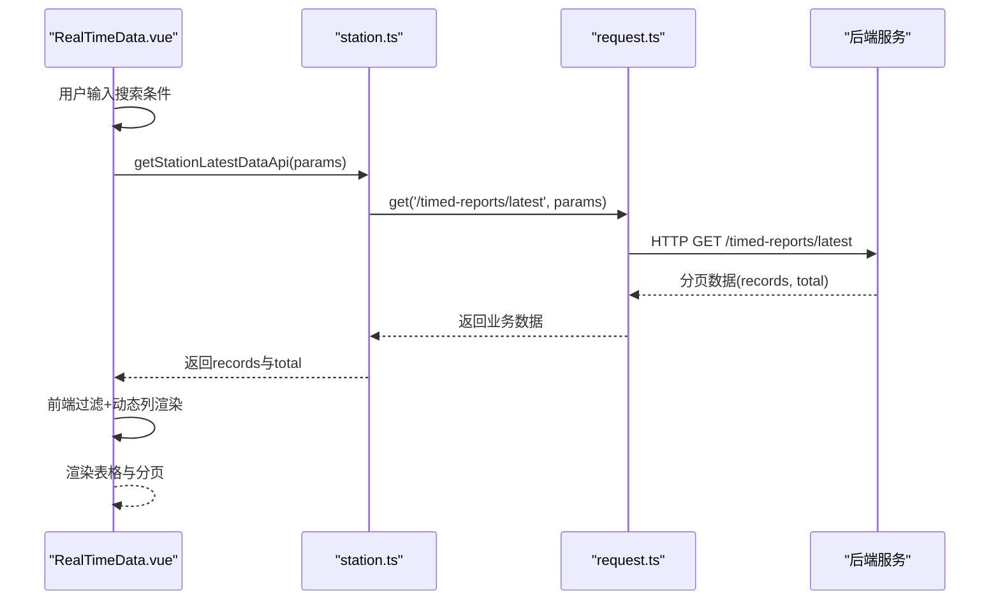
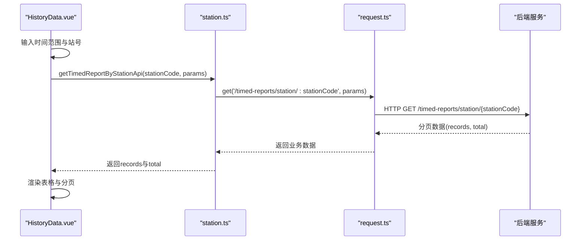
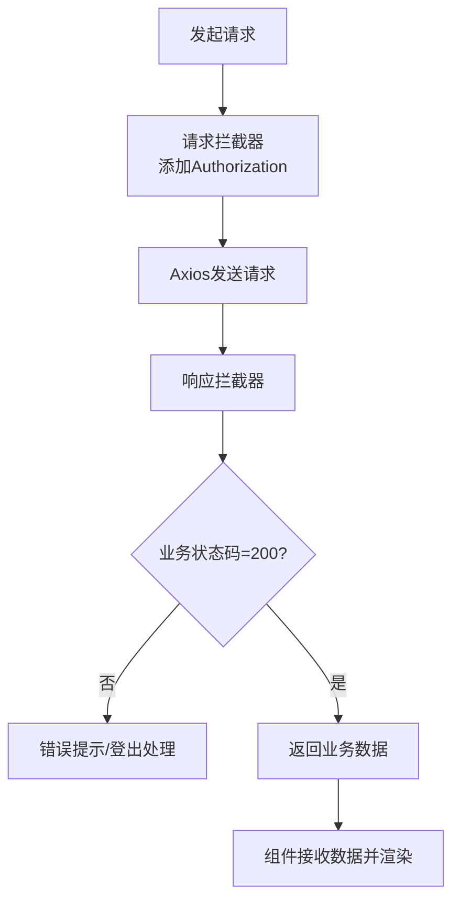
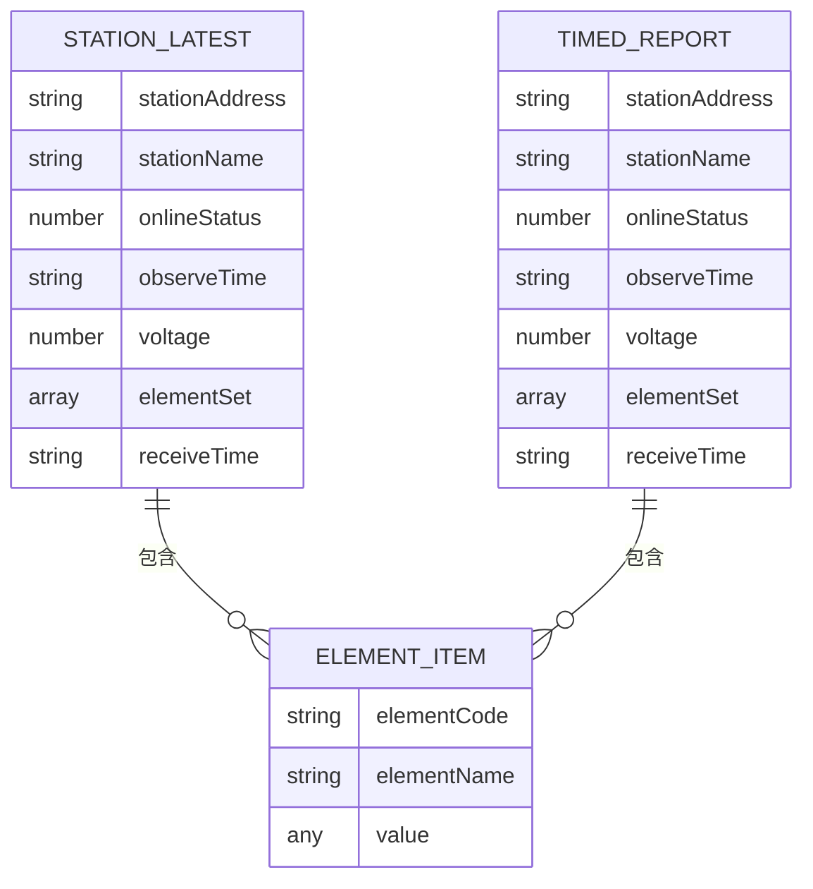
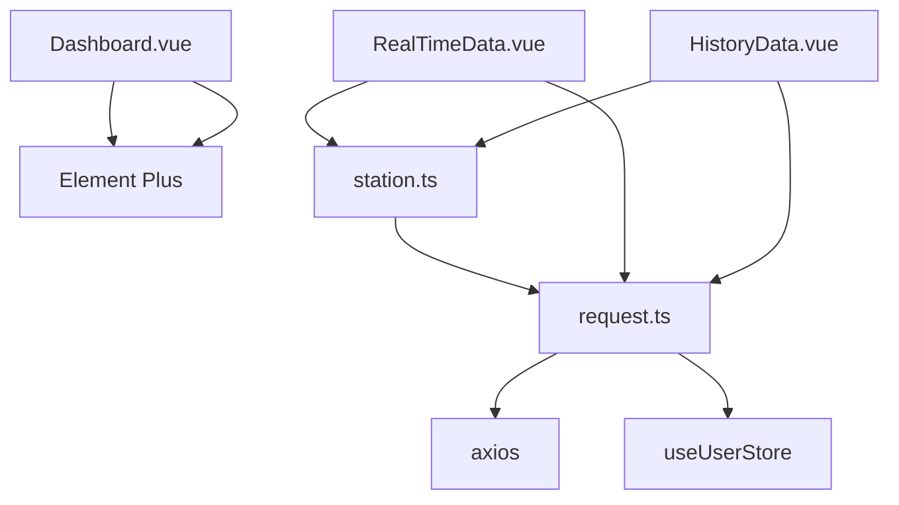

# 仪表盘模块

<cite>
**本文档引用的文件**
- [Dashboard.vue](file://src/views/dashboard/Dashboard.vue)
- [RealTimeData.vue](file://src/views/data/RealTimeData.vue)
- [HistoryData.vue](file://src/views/data/HistoryData.vue)
- [station.ts](file://src/api/station.ts)
- [request.ts](file://src/utils/request.ts)
- [index.ts](file://src/router/index.ts)
- [index.ts](file://src/types/index.ts)
- [terminal.ts](file://src/types/terminal.ts)
- [TerminalList.vue](file://src/views/terminal/TerminalList.vue)
- [package.json](file://package.json)
</cite>

## 目录
1. [简介](#简介)
2. [项目结构](#项目结构)
3. [核心组件](#核心组件)
4. [架构总览](#架构总览)
5. [详细组件分析](#详细组件分析)
6. [依赖关系分析](#依赖关系分析)
7. [性能考虑](#性能考虑)
8. [故障排除指南](#故障排除指南)
9. [结论](#结论)
10. [附录](#附录)

## 简介
本文件为仪表盘模块的详细技术文档，聚焦于数据概览功能的设计与实现，涵盖实时数据展示、统计数据计算、图表组件集成以及响应式布局设计。文档同时阐述数据获取流程、API 调用方式、数据缓存策略与错误处理机制，并提供组件配置选项、自定义图表类型与数据筛选功能的扩展指南。最后给出性能优化技巧、数据刷新机制与用户体验设计建议，帮助开发者进行二次开发与功能扩展。

## 项目结构
仪表盘模块位于 views/dashboard 目录下，采用 Vue 3 + TypeScript + Element Plus 架构，结合 Pinia 状态管理与 Axios 封装的请求工具，形成清晰的分层结构：
- 视图层：Dashboard.vue 提供统计卡片、图表占位区与快捷操作区
- 数据层：通过 API 层封装请求，统一处理响应与错误
- 工具层：请求工具对响应进行预处理，确保大整数精度与统一错误提示
- 类型层：定义通用响应与分页结构，保证类型安全

**图表来源**
- [Dashboard.vue:1-155](file://src/views/dashboard/Dashboard.vue#L1-L155)
- [RealTimeData.vue:1-300](file://src/views/data/RealTimeData.vue#L1-L300)
- [HistoryData.vue:1-271](file://src/views/data/HistoryData.vue#L1-L271)
- [station.ts:1-114](file://src/api/station.ts#L1-L114)
- [request.ts:1-180](file://src/utils/request.ts#L1-L180)
- [index.ts:1-51](file://src/types/index.ts#L1-L51)
- [terminal.ts:1-84](file://src/types/terminal.ts#L1-L84)

**章节来源**
- [Dashboard.vue:1-155](file://src/views/dashboard/Dashboard.vue#L1-L155)
- [index.ts:1-136](file://src/router/index.ts#L1-L136)

## 核心组件
- Dashboard 统计卡片：展示用户总数、文章数量、评论数量、访问量等关键指标，采用 Element Plus 卡片与图标组合，支持响应式栅格布局。
- 图表占位区：预留 ECharts 集成空间，当前以占位符形式呈现，便于后续接入折线图、柱状图等可视化组件。
- 快捷操作区：提供新建用户、导入数据、导出数据、系统设置等常用按钮，提升操作效率。

上述组件均基于 Element Plus 的栅格系统与卡片组件，具备良好的移动端适配能力。

**章节来源**
- [Dashboard.vue:1-155](file://src/views/dashboard/Dashboard.vue#L1-L155)

## 架构总览
仪表盘模块的数据流遵循“视图 → API → 工具 → 后端”的标准链路，错误处理与鉴权逻辑集中在请求工具层，确保各视图组件保持简洁与一致。

**图表来源**
- [Dashboard.vue:1-155](file://src/views/dashboard/Dashboard.vue#L1-L155)
- [station.ts:1-114](file://src/api/station.ts#L1-L114)
- [request.ts:1-180](file://src/utils/request.ts#L1-L180)

## 详细组件分析

### Dashboard 组件分析
- 结构组成：统计卡片网格、图表区域占位、快捷操作区
- 响应式设计：基于 Element Plus 的栅格系统，XS/SM/MD 断点控制卡片排列
- 样式设计：统计卡片采用左右布局，图标+数值+标签的视觉层次清晰；图表占位区提供统一高度与背景色，便于后续集成

**图表来源**
- [Dashboard.vue:1-155](file://src/views/dashboard/Dashboard.vue#L1-L155)

**章节来源**
- [Dashboard.vue:1-155](file://src/views/dashboard/Dashboard.vue#L1-L155)

### 实时数据组件分析
- 数据获取：通过 getStationLatestDataApi 分页获取最新监测数据，支持按遥测站名称、编号、在线状态筛选
- 动态列渲染：根据 elementSet 中的要素集合动态生成列，实现多要素指标的灵活展示
- 数值格式化：针对不同要素类型（如水位、降雨、流速、电压）进行小数位数控制与空值处理
- 分页与刷新：内置分页控件与刷新按钮，支持页码与每页条数变更

**图表来源**
- [RealTimeData.vue:1-300](file://src/views/data/RealTimeData.vue#L1-L300)
- [station.ts:74-80](file://src/api/station.ts#L74-L80)
- [request.ts:155-177](file://src/utils/request.ts#L155-L177)

**章节来源**
- [RealTimeData.vue:1-300](file://src/views/data/RealTimeData.vue#L1-L300)
- [station.ts:74-80](file://src/api/station.ts#L74-L80)

### 历史数据组件分析
- 数据获取：通过 getTimedReportByStationApi 根据遥测站编号查询定时数据，支持时间范围筛选
- 动态列渲染：与实时数据类似，基于 elementSet 动态生成列
- 数值格式化：针对不同要素类型进行格式化处理
- 分页与刷新：支持分页切换与手动刷新

**图表来源**
- [HistoryData.vue:1-271](file://src/views/data/HistoryData.vue#L1-L271)
- [station.ts:99-104](file://src/api/station.ts#L99-L104)
- [request.ts:155-177](file://src/utils/request.ts#L155-L177)

**章节来源**
- [HistoryData.vue:1-271](file://src/views/data/HistoryData.vue#L1-L271)
- [station.ts:99-104](file://src/api/station.ts#L99-L104)

### 请求工具与错误处理
- Axios 实例：统一基础配置、超时设置与请求头
- 响应预处理：解决大整数精度问题，避免前端数值溢出
- 统一拦截器：请求添加 Token，响应根据业务状态码处理错误与登出逻辑
- 导出方法：get/post/put/del 四种方法，返回业务数据，避免多层嵌套

**图表来源**
- [request.ts:52-151](file://src/utils/request.ts#L52-L151)

**章节来源**
- [request.ts:1-180](file://src/utils/request.ts#L1-L180)

### 类型系统与数据模型
- 通用响应：包含 code、message、data 字段，统一前后端交互协议
- 分页结构：包含 current、size、total、pages、records，便于前后端一致的分页约定
- 遥测站数据：包含观测时间、电压、要素集合、原始报文、接收时间等字段，支持动态列渲染
- 终端实体与查询：终端管理模块的实体与分页查询类型，为仪表盘扩展提供参考

**图表来源**
- [station.ts:1-114](file://src/api/station.ts#L1-L114)
- [index.ts:1-51](file://src/types/index.ts#L1-L51)

**章节来源**
- [station.ts:1-114](file://src/api/station.ts#L1-L114)
- [index.ts:1-51](file://src/types/index.ts#L1-L51)

## 依赖关系分析
- 依赖关系：Dashboard.vue 依赖 Element Plus 的布局与卡片组件；实时/历史数据组件依赖 station.ts 的 API 封装；API 封装依赖 request.ts 的请求工具；request.ts 依赖 Axios 与 Pinia 用户状态。
- 外部依赖：echarts（图表库）、element-plus（UI 组件库）、axios（HTTP 客户端）、pinia（状态管理）、vue-router（路由）

**图表来源**
- [Dashboard.vue:1-155](file://src/views/dashboard/Dashboard.vue#L1-L155)
- [RealTimeData.vue:1-300](file://src/views/data/RealTimeData.vue#L1-L300)
- [HistoryData.vue:1-271](file://src/views/data/HistoryData.vue#L1-L271)
- [station.ts:1-114](file://src/api/station.ts#L1-L114)
- [request.ts:1-180](file://src/utils/request.ts#L1-L180)
- [package.json:14-26](file://package.json#L14-L26)

**章节来源**
- [package.json:14-26](file://package.json#L14-L26)

## 性能考虑
- 前端过滤与渲染优化：实时数据组件在获取到分页数据后进行前端过滤，建议在数据量较大时考虑后端分页筛选以减少传输与渲染压力。
- 动态列渲染：基于 elementSet 动态生成列，避免固定列导致的冗余渲染；建议对列数量进行上限控制与懒渲染。
- 图表集成：建议在图表组件中启用数据更新节流与图表实例复用，避免频繁销毁重建带来的性能损耗。
- 缓存策略：对于不频繁变动的静态数据（如统计卡片），可在组件内进行轻量缓存；对于实时数据，建议通过合理的刷新间隔与增量更新策略平衡时效性与性能。
- 资源加载：按需引入 ECharts 与 Element Plus 组件，减少首屏体积；对图片与图标采用懒加载策略。

## 故障排除指南
- 登录过期与权限错误：请求拦截器检测到业务状态码为 401 时，触发登出并跳转登录页；请检查 Token 是否正确传递与后端签发策略。
- 网络错误与超时：响应拦截器根据 HTTP 状态码映射常见错误信息，如 400、401、403、404、500、503 等；请检查网络连通性与后端服务状态。
- 大整数精度问题：请求工具对响应进行预处理，将超过安全范围的大整数转换为字符串，避免前端精度丢失；若仍出现异常，请确认后端返回格式与字段类型。
- 组件渲染异常：检查 API 返回的数据结构是否符合类型定义；若 elementSet 为空或格式不一致，可能导致动态列渲染失败。

**章节来源**
- [request.ts:95-151](file://src/utils/request.ts#L95-L151)

## 结论
仪表盘模块以清晰的分层架构与完善的类型系统为基础，实现了统计卡片、动态表格与图表占位的组合展示。通过统一的请求工具与错误处理机制，保障了数据获取的稳定性与一致性。建议在后续迭代中优先完成图表组件集成与数据筛选优化，进一步提升用户体验与系统性能。

## 附录

### 数据获取流程与 API 调用方式
- 实时数据：调用 getStationLatestDataApi，支持分页参数与可选站号筛选
- 历史数据：调用 getTimedReportByStationApi，传入站编号与分页参数
- 请求方法：统一通过 request.ts 的 get/post/put/del 方法封装

**章节来源**
- [RealTimeData.vue:187-229](file://src/views/data/RealTimeData.vue#L187-L229)
- [HistoryData.vue:182-208](file://src/views/data/HistoryData.vue#L182-L208)
- [station.ts:74-104](file://src/api/station.ts#L74-L104)
- [request.ts:155-177](file://src/utils/request.ts#L155-L177)

### 数据缓存策略与错误处理机制
- 缓存策略：组件内轻量缓存适用于静态或低频更新数据；实时数据建议通过刷新间隔与增量更新控制缓存命中率。
- 错误处理：统一在请求工具层进行业务状态码判断与错误提示；网络错误按状态码映射友好信息；401 触发登出流程。

**章节来源**
- [request.ts:95-151](file://src/utils/request.ts#L95-L151)

### 组件配置选项与自定义图表类型
- 统计卡片：可通过修改图标、颜色与数值格式实现主题化定制。
- 图表组件：建议集成 ECharts，支持折线图、柱状图、饼图等；通过 props 传入数据集与配置项，实现多图表类型切换。
- 数据筛选：在现有基础上扩展时间范围、要素类型、站号等筛选维度，结合后端分页查询提升性能。

**章节来源**
- [Dashboard.vue:1-155](file://src/views/dashboard/Dashboard.vue#L1-L155)
- [RealTimeData.vue:1-300](file://src/views/data/RealTimeData.vue#L1-L300)
- [HistoryData.vue:1-271](file://src/views/data/HistoryData.vue#L1-L271)

### 数据刷新机制与用户体验设计
- 刷新机制：提供手动刷新按钮与定时轮询策略；建议在后台标签页或失焦状态下降低刷新频率。
- 用户体验：保持加载状态提示与骨架屏；对空数据场景提供明确的占位信息与引导；移动端适配方面，确保卡片与表格在窄屏下的可读性与可操作性。

**章节来源**
- [RealTimeData.vue:246-249](file://src/views/data/RealTimeData.vue#L246-L249)
- [HistoryData.vue:224-227](file://src/views/data/HistoryData.vue#L224-L227)

### 二次开发指南
- 新增图表类型：在图表占位区引入 ECharts，通过 props 接收数据与配置，实现按需渲染与尺寸自适应。
- 扩展筛选功能：在现有表单基础上增加更多筛选项，结合后端接口参数进行过滤与分页联动。
- 统一主题与样式：通过 SCSS 变量与 Element Plus 主题配置，实现全局风格统一与暗色模式支持。
- 状态管理：对于跨组件共享的筛选条件与图表配置，可迁移至 Pinia store，提升可维护性。

**章节来源**
- [Dashboard.vue:1-155](file://src/views/dashboard/Dashboard.vue#L1-L155)
- [TerminalList.vue:966-964](file://src/views/terminal/TerminalList.vue#L966-L964)