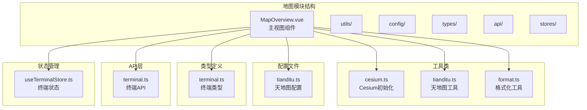
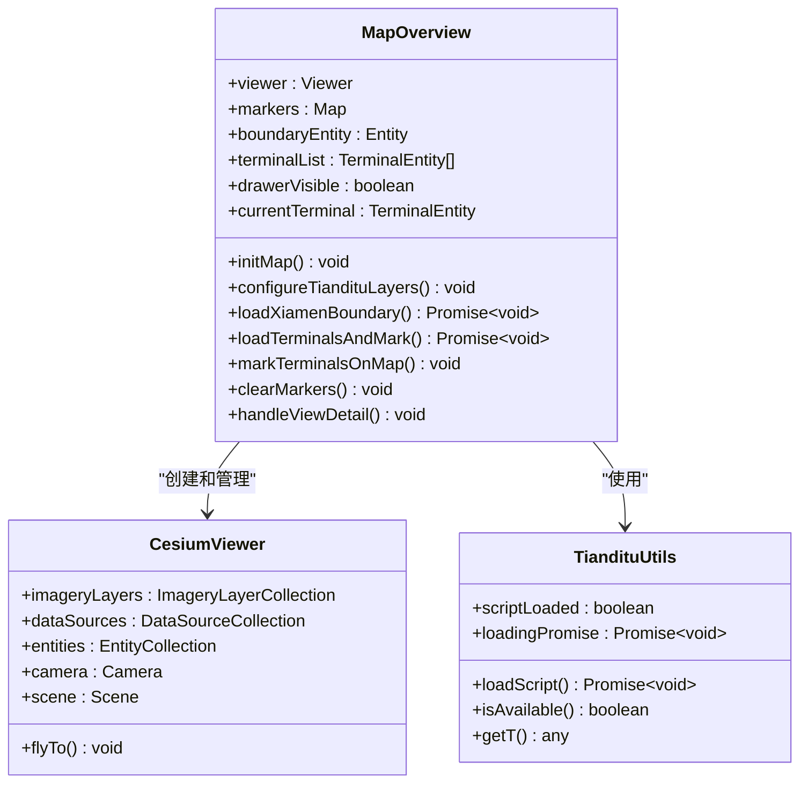
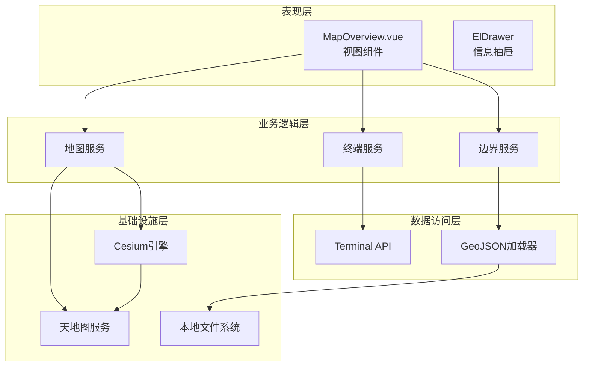
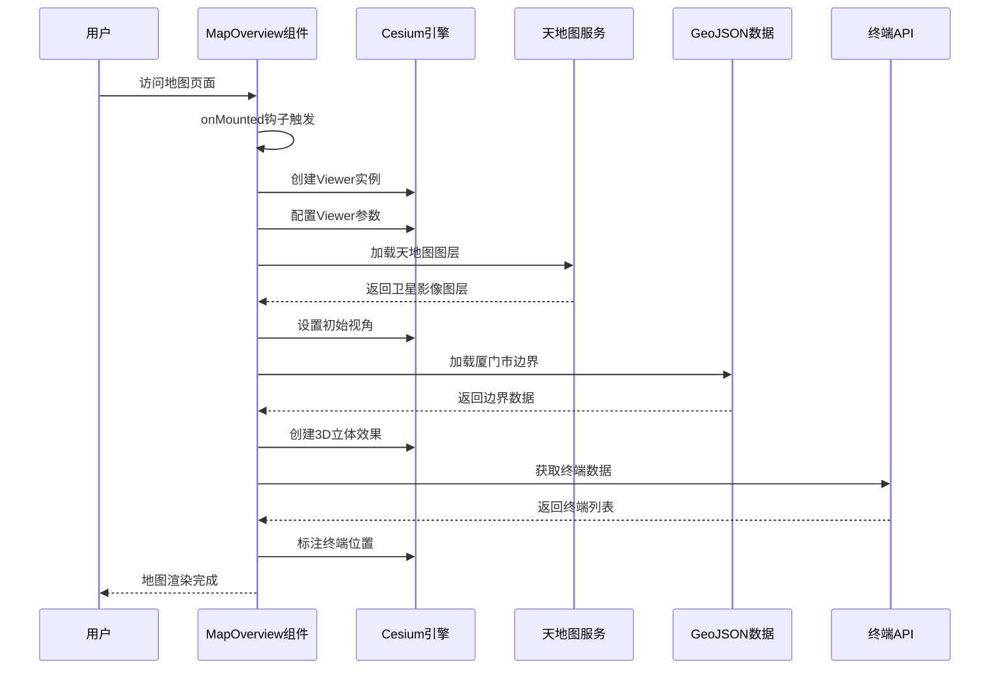
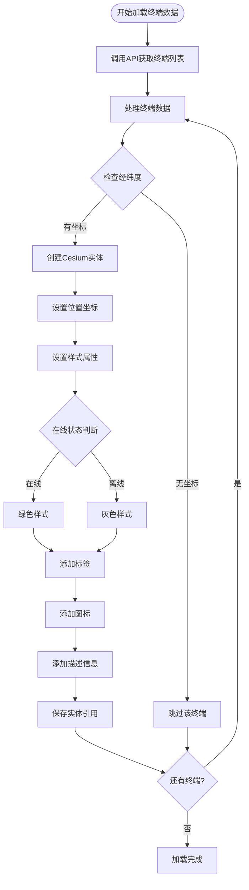
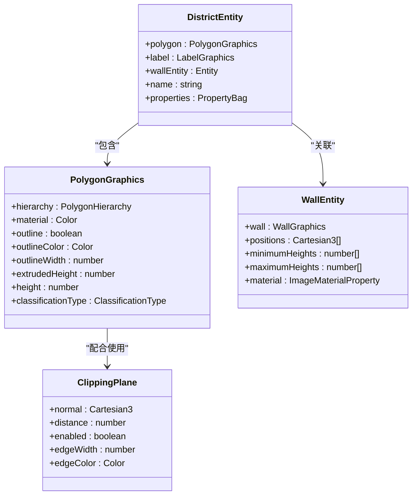
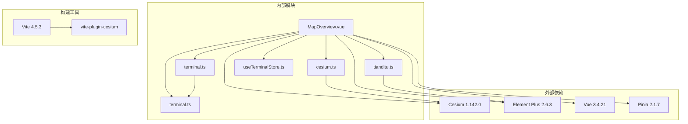
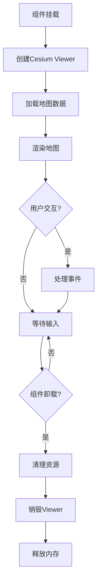

# 地图可视化模块

<cite>
**本文档引用的文件**
- [MapOverview.vue](file://src/views/map/MapOverview.vue)
- [cesium.ts](file://src/utils/cesium.ts)
- [tianditu.ts](file://src/config/tianditu.ts)
- [tianditu-utils.ts](file://src/utils/tianditu.ts)
- [terminal.ts](file://src/types/terminal.ts)
- [terminal-api.ts](file://src/api/terminal.ts)
- [useTerminalStore.ts](file://src/stores/useTerminalStore.ts)
- [format.ts](file://src/utils/format.ts)
- [router/index.ts](file://src/router/index.ts)
- [vite.config.ts](file://vite.config.ts)
- [package.json](file://package.json)
- [CESIUM_GUIDE.md](file://docs/CESIUM_GUIDE.md)
- [厦门市.geojson](file://厦门市.geojson)
</cite>

## 目录
1. [简介](#简介)
2. [项目结构](#项目结构)
3. [核心组件](#核心组件)
4. [架构概览](#架构概览)
5. [详细组件分析](#详细组件分析)
6. [依赖关系分析](#依赖关系分析)
7. [性能考虑](#性能考虑)
8. [故障排除指南](#故障排除指南)
9. [结论](#结论)
10. [附录](#附录)

## 简介

地图可视化模块是一个基于 Cesium 3D 地图引擎的高级地图展示系统，专为水文监测项目设计。该模块集成了天地图服务，实现了厦门市6个行政区的3D立体展示，包含终端设备位置标注、区域边界显示、地图控件配置和用户交互事件处理等功能。

系统采用现代化的前端技术栈，结合Vue 3 Composition API、TypeScript 和 Pinia 状态管理，提供了完整的地图可视化解决方案。模块支持多种地图服务，包括天地图、Cesium Ion 等，并具备良好的扩展性和自定义能力。

## 项目结构

地图可视化模块位于项目的 `src/views/map/` 目录下，主要包含以下核心文件：



**图表来源**
- [MapOverview.vue:1-649](file://src/views/map/MapOverview.vue#L1-L649)
- [cesium.ts:1-19](file://src/utils/cesium.ts#L1-L19)
- [tianditu.ts:1-68](file://src/utils/tianditu.ts#L1-L68)

**章节来源**
- [MapOverview.vue:1-649](file://src/views/map/MapOverview.vue#L1-L649)
- [vite.config.ts:1-68](file://vite.config.ts#L1-L68)

## 核心组件

### Cesium 地图初始化

地图模块的核心是 `MapOverview.vue` 组件，它负责整个地图的初始化和管理。该组件使用 Cesium Viewer 创建 3D 地图实例，并配置各种地图服务和视觉效果。



**图表来源**
- [MapOverview.vue:52-623](file://src/views/map/MapOverview.vue#L52-L623)
- [tianditu.ts:7-67](file://src/utils/tianditu.ts#L7-L67)

### 天地图服务集成

系统集成了天地图服务，提供高质量的卫星影像和注记图层。天地图工具类负责动态加载天地图 JavaScript API，并提供便捷的方法来检查服务可用性和获取实例。

**章节来源**
- [MapOverview.vue:129-162](file://src/views/map/MapOverview.vue#L129-L162)
- [tianditu.ts:14-49](file://src/utils/tianditu.ts#L14-L49)

## 架构概览

地图可视化模块采用了分层架构设计，确保了良好的可维护性和扩展性：



**图表来源**
- [MapOverview.vue:77-124](file://src/views/map/MapOverview.vue#L77-L124)
- [terminal-api.ts:16-18](file://src/api/terminal.ts#L16-L18)

## 详细组件分析

### 地图初始化流程

地图初始化是一个复杂的多步骤过程，涉及多个组件和服务的协调工作：



**图表来源**
- [MapOverview.vue:77-124](file://src/views/map/MapOverview.vue#L77-L124)
- [MapOverview.vue:302-462](file://src/views/map/MapOverview.vue#L302-L462)

### 终端设备位置标注系统

系统实现了完整的终端设备位置标注功能，支持在线状态区分和交互式信息展示：



**图表来源**
- [MapOverview.vue:490-557](file://src/views/map/MapOverview.vue#L490-L557)
- [MapOverview.vue:562-571](file://src/views/map/MapOverview.vue#L562-L571)

### 区域边界显示与3D立体效果

系统实现了厦门市6个行政区的精确边界显示和3D立体效果，包括光墙效果和裁剪功能：



**图表来源**
- [MapOverview.vue:344-387](file://src/views/map/MapOverview.vue#L344-L387)
- [MapOverview.vue:206-297](file://src/views/map/MapOverview.vue#L206-L297)

### 地图控件配置

系统提供了丰富的地图控件配置选项，支持用户自定义地图界面：

| 控件名称 | 功能描述 | 默认状态 |
|---------|----------|----------|
| Animation | 动画控件 | 关闭 |
| BaseLayerPicker | 底图选择器 | 开启 |
| FullscreenButton | 全屏按钮 | 开启 |
| Geocoder | 地理编码器 | 开启 |
| HomeButton | 主页按钮 | 关闭 |
| InfoBox | 信息框 | 开启 |
| SceneModePicker | 场景模式选择器 | 开启 |
| SelectionIndicator | 选择指示器 | 开启 |
| Timeline | 时间线 | 关闭 |
| NavigationHelpButton | 导航帮助按钮 | 关闭 |
| Scene3DOnly | 3D模式限制 | 关闭 |

**章节来源**
- [MapOverview.vue:82-98](file://src/views/map/MapOverview.vue#L82-L98)

## 依赖关系分析

地图可视化模块的依赖关系体现了清晰的分层架构：



**图表来源**
- [package.json:14-46](file://package.json#L14-L46)
- [vite.config.ts:14-27](file://vite.config.ts#L14-L27)

**章节来源**
- [package.json:14-46](file://package.json#L14-L46)
- [vite.config.ts:14-27](file://vite.config.ts#L14-L27)

## 性能考虑

### 渲染性能优化

系统采用了多项性能优化策略来确保地图的流畅运行：

1. **标签显示范围控制**: 使用 `DistanceDisplayCondition` 限制标签的显示距离，减少不必要的渲染
2. **标签缩放优化**: 通过 `NearFarScalar` 实现标签的自适应缩放
3. **深度测试优化**: 对标签禁用深度测试，确保UI元素始终显示在最前面
4. **纹理复用**: 创建一次发光纹理并在多个光墙中复用

### 内存管理



**图表来源**
- [MapOverview.vue:606-622](file://src/views/map/MapOverview.vue#L606-L622)

### 地图缩放、旋转、平移操作

系统支持完整的地图交互操作，包括缩放、旋转和平移：

- **缩放操作**: 通过鼠标滚轮实现地图缩放，支持最小和最大缩放级别控制
- **旋转操作**: 右键拖拽实现地图旋转，支持连续旋转和角度锁定
- **平移操作**: 按住空格键拖拽实现地图平移，支持惯性滚动
- **飞行动画**: 使用 `viewer.flyTo()` 实现平滑的视角切换动画

**章节来源**
- [MapOverview.vue:448-455](file://src/views/map/MapOverview.vue#L448-L455)

## 故障排除指南

### 常见问题及解决方案

#### Cesium 模块导入错误

**问题症状**: 控制台出现模块导入相关的错误信息

**解决方案**:
1. 确保安装了 `vite-plugin-cesium` 插件
2. 检查 Vite 配置中是否正确引入了 Cesium 插件
3. 验证 Cesium 版本兼容性

#### 天地图图层无法加载

**问题症状**: 地图显示空白或只有默认底图

**解决方案**:
1. 检查天地图 Token 是否正确配置
2. 确认网络连接正常，无跨域问题
3. 验证天地图服务的可用性

#### 厦门市边界数据加载失败

**问题症状**: 行政区边界不显示或显示异常

**解决方案**:
1. 确认 `厦门市.geojson` 文件存在于项目根目录
2. 检查 GeoJSON 文件格式是否正确
3. 验证文件编码为 UTF-8

#### 性能问题

**问题症状**: 地图渲染缓慢或卡顿

**解决方案**:
1. 减少同时显示的标记点数量
2. 调整标签显示距离范围
3. 简化 GeoJSON 数据精度
4. 禁用不必要的视觉效果

**章节来源**
- [CESIUM_GUIDE.md:397-460](file://docs/CESIUM_GUIDE.md#L397-L460)

## 结论

地图可视化模块是一个功能完整、架构清晰的地图解决方案。通过集成 Cesium 3D 引擎和天地图服务，系统实现了高质量的地理信息展示功能。

模块的主要优势包括：
- **完整的3D地图体验**: 支持卫星影像、地形和3D建筑
- **丰富的交互功能**: 支持缩放、旋转、平移等多种操作
- **灵活的样式定制**: 支持颜色、材质、光照等视觉效果自定义
- **高性能渲染**: 采用多项优化策略确保流畅的用户体验
- **良好的扩展性**: 模块化设计便于功能扩展和维护

该模块为水文监测项目提供了强大的地理信息可视化能力，能够满足复杂的数据展示需求。

## 附录

### 自定义选项

系统提供了丰富的自定义选项，开发者可以根据需要进行个性化配置：

#### 修改行政区颜色
```typescript
const districtColors = [
  Cesium.Color.RED.withAlpha(0.3),        // 红色
  Cesium.Color.fromCssColorString('#FF6B6B').withAlpha(0.3), // 十六进制
  Cesium.Color.fromBytes(255, 100, 100, 76), // RGB + Alpha
]
```

#### 调整3D立体效果
```typescript
extrudedHeight: 3000,  // 更高的3D效果
extrudedHeight: 1000,  // 更低的3D效果
```

#### 动态开关裁剪功能
```javascript
// 在浏览器控制台中运行
viewer.scene.globe.clippingPlanes.enabled = false  // 禁用
viewer.scene.globe.clippingPlanes.enabled = true   // 启用
```

### 扩展开发指南

开发者可以通过以下方式扩展地图功能：

1. **添加新的地图服务**: 在 `configureTiandituLayers()` 方法中添加新的图层
2. **自定义样式**: 通过修改颜色、材质和光照参数实现个性化效果
3. **集成其他数据源**: 扩展终端API以支持更多类型的地理数据
4. **添加新的交互功能**: 扩展事件处理器以支持自定义的用户交互