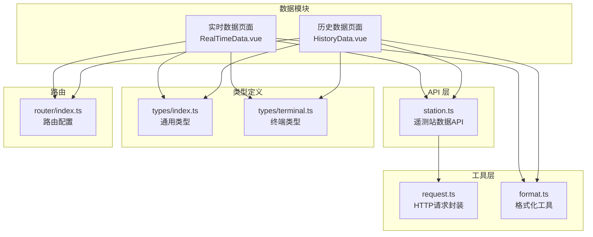
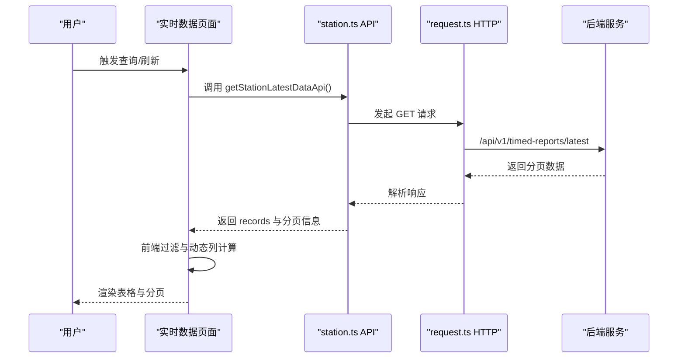
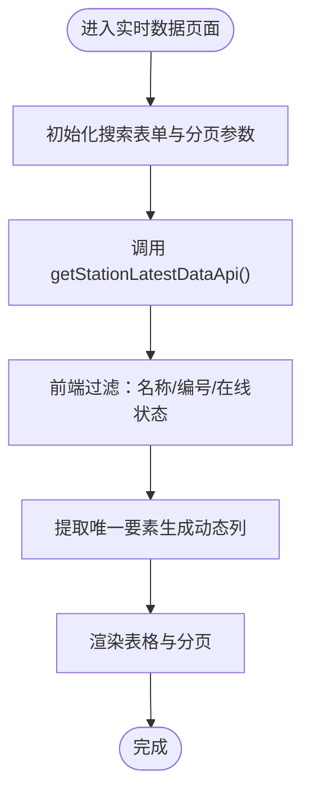
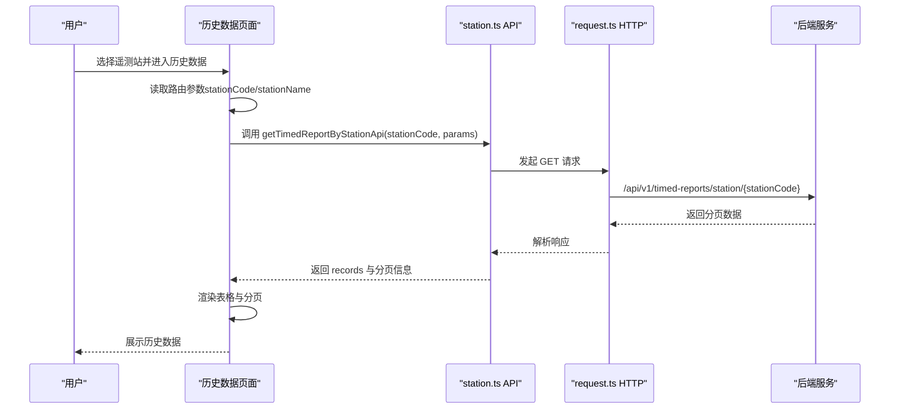
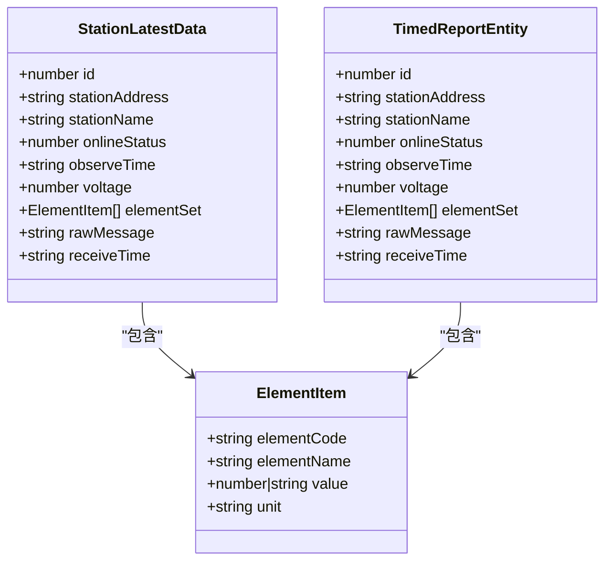
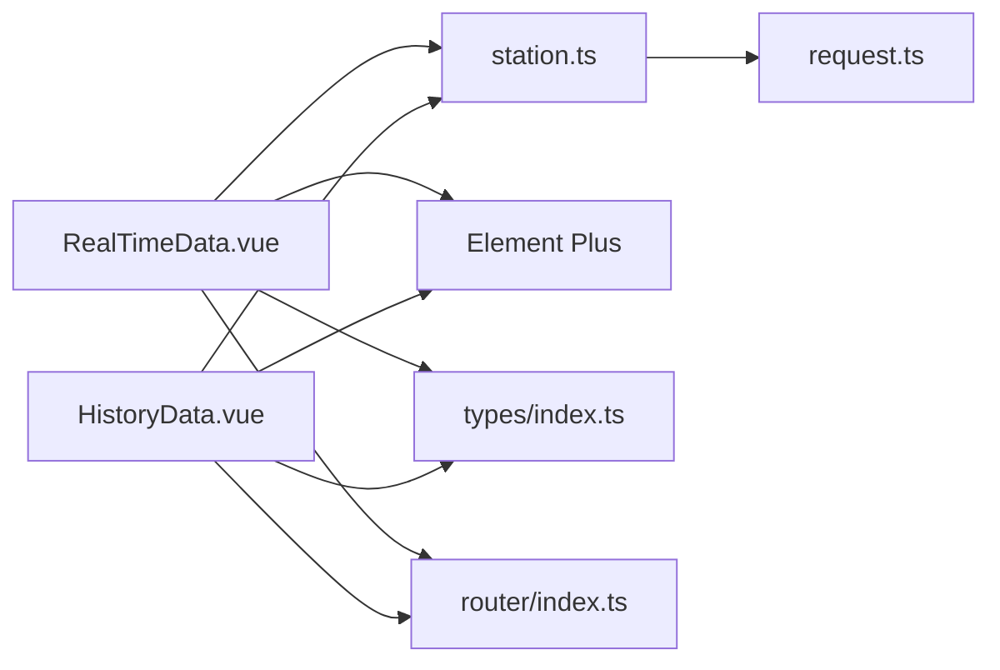

# 数据管理模块

<cite>
**本文档引用的文件**
- [RealTimeData.vue](file://src/views/data/RealTimeData.vue)
- [HistoryData.vue](file://src/views/data/HistoryData.vue)
- [station.ts](file://src/api/station.ts)
- [format.ts](file://src/utils/format.ts)
- [request.ts](file://src/utils/request.ts)
- [index.ts](file://src/router/index.ts)
- [DATA_MODULE.md](file://docs/DATA_MODULE.md)
- [index.ts](file://src/types/index.ts)
- [terminal.ts](file://src/types/terminal.ts)
- [main.ts](file://src/main.ts)
- [package.json](file://package.json)
</cite>

## 目录
1. [简介](#简介)
2. [项目结构](#项目结构)
3. [核心组件](#核心组件)
4. [架构总览](#架构总览)
5. [详细组件分析](#详细组件分析)
6. [依赖关系分析](#依赖关系分析)
7. [性能考虑](#性能考虑)
8. [故障排除指南](#故障排除指南)
9. [结论](#结论)
10. [附录](#附录)

## 简介
本文件为数据管理模块的综合技术文档，重点覆盖实时数据与历史数据的展示功能，包括数据表格渲染、时间范围选择、数据筛选与排序、数据获取流程、API 接口调用、数据缓存策略与分页加载机制，并提供图表组件集成、数据导出功能、搜索过滤功能、数据格式化、异常处理与加载状态管理。同时给出面向开发者的自定义选项与扩展接口建议，帮助快速理解与二次开发。

## 项目结构
数据管理模块位于 views/data 目录下，包含两个核心页面：
- 实时数据页面：展示所有遥测站的最新监测数据，支持按名称、编号、在线状态搜索，动态要素列显示，分页与刷新。
- 历史数据页面：基于遥测站编号查询历史定时数据，支持时间范围筛选，动态要素列显示，分页与刷新。

**图表来源**
- [RealTimeData.vue:1-300](file://src/views/data/RealTimeData.vue#L1-L300)
- [HistoryData.vue:1-271](file://src/views/data/HistoryData.vue#L1-L271)
- [station.ts:1-115](file://src/api/station.ts#L1-L115)
- [request.ts:1-180](file://src/utils/request.ts#L1-L180)
- [format.ts:1-102](file://src/utils/format.ts#L1-L102)
- [index.ts:1-136](file://src/router/index.ts#L1-L136)
- [index.ts:1-51](file://src/types/index.ts#L1-L51)
- [terminal.ts:1-84](file://src/types/terminal.ts#L1-L84)

**章节来源**
- [RealTimeData.vue:1-300](file://src/views/data/RealTimeData.vue#L1-L300)
- [HistoryData.vue:1-271](file://src/views/data/HistoryData.vue#L1-L271)
- [station.ts:1-115](file://src/api/station.ts#L1-L115)
- [request.ts:1-180](file://src/utils/request.ts#L1-L180)
- [format.ts:1-102](file://src/utils/format.ts#L1-L102)
- [index.ts:1-136](file://src/router/index.ts#L1-L136)
- [index.ts:1-51](file://src/types/index.ts#L1-L51)
- [terminal.ts:1-84](file://src/types/terminal.ts#L1-L84)

## 核心组件
- 实时数据页面（RealTimeData.vue）
  - 搜索条件：遥测站名称、遥测站编号、在线状态
  - 表格列：序号、遥测站编号、遥测站名称、在线状态、观测时间、动态要素列、电压、接收时间、操作（查看历史数据）
  - 分页与刷新：支持分页切换与手动刷新
  - 前端过滤：按名称、编号、在线状态进行本地过滤
  - 动态列：根据 elementSet 提取唯一要素生成列
  - 数值格式化：按要素类型自动调整小数位数
- 历史数据页面（HistoryData.vue）
  - 搜索条件：遥测站编号（来自路由参数）、开始时间、结束时间
  - 表格列：序号、遥测站编号、遥测站名称、在线状态、观测时间、动态要素列、电压、接收时间
  - 分页与刷新：支持分页切换与手动刷新
  - 动态列：根据 elementSet 提取唯一要素生成列
  - 数值格式化：按要素类型自动调整小数位数

**章节来源**
- [RealTimeData.vue:118-278](file://src/views/data/RealTimeData.vue#L118-L278)
- [HistoryData.vue:113-249](file://src/views/data/HistoryData.vue#L113-L249)

## 架构总览
数据管理模块采用“视图组件 + API 封装 + 工具函数”的分层架构：
- 视图组件负责 UI 渲染、交互事件与状态管理
- API 封装提供统一的接口调用与响应处理
- 工具函数提供日期时间格式化、防抖节流等通用能力
- 类型定义确保前后端数据结构一致

**图表来源**
- [RealTimeData.vue:187-229](file://src/views/data/RealTimeData.vue#L187-L229)
- [station.ts:74-80](file://src/api/station.ts#L74-L80)
- [request.ts:155-165](file://src/utils/request.ts#L155-L165)

**章节来源**
- [RealTimeData.vue:187-229](file://src/views/data/RealTimeData.vue#L187-L229)
- [station.ts:74-80](file://src/api/station.ts#L74-L80)
- [request.ts:155-165](file://src/utils/request.ts#L155-L165)

## 详细组件分析

### 实时数据页面（RealTimeData.vue）
- 数据获取流程
  - 初始化时触发数据拉取
  - 支持手动刷新与分页切换
  - 前端过滤：名称、编号、在线状态
- 动态要素列
  - 通过 computed 提取所有唯一要素，生成动态列
  - 渲染时从 elementSet 中查找对应要素值并格式化
- 数值格式化
  - 根据要素编码包含的关键字自动调整小数位数
  - 空值处理：缺失或空字符串显示为占位符
- 异常处理与加载状态
  - loading 控制表格加载状态
  - try/catch 捕获错误并提示消息
  - 分页参数 pageNum/pageSize 控制请求页码与条数

**图表来源**
- [RealTimeData.vue:187-229](file://src/views/data/RealTimeData.vue#L187-L229)
- [RealTimeData.vue:138-153](file://src/views/data/RealTimeData.vue#L138-L153)
- [RealTimeData.vue:155-185](file://src/views/data/RealTimeData.vue#L155-L185)

**章节来源**
- [RealTimeData.vue:187-229](file://src/views/data/RealTimeData.vue#L187-L229)
- [RealTimeData.vue:138-153](file://src/views/data/RealTimeData.vue#L138-L153)
- [RealTimeData.vue:155-185](file://src/views/data/RealTimeData.vue#L155-L185)

### 历史数据页面（HistoryData.vue）
- 数据获取流程
  - 从路由参数读取遥测站编号与名称
  - 支持手动刷新与分页切换
  - 时间范围筛选：开始时间、结束时间
- 动态要素列与数值格式化
  - 与实时页面一致的动态列与格式化逻辑
- 异常处理与加载状态
  - 缺少遥测站编号时提示警告
  - loading 控制表格加载状态
  - try/catch 捕获错误并提示消息

**图表来源**
- [HistoryData.vue:182-208](file://src/views/data/HistoryData.vue#L182-L208)
- [station.ts:99-104](file://src/api/station.ts#L99-L104)
- [request.ts:155-165](file://src/utils/request.ts#L155-L165)

**章节来源**
- [HistoryData.vue:182-208](file://src/views/data/HistoryData.vue#L182-L208)
- [station.ts:99-104](file://src/api/station.ts#L99-L104)
- [request.ts:155-165](file://src/utils/request.ts#L155-L165)

### API 接口与数据模型
- 实时数据接口
  - GET /api/v1/timed-reports/latest
  - 参数：pageNum、pageSize
  - 返回：分页结果（current、size、total、pages、records）
- 历史数据接口
  - GET /api/v1/timed-reports/station/{stationCode}
  - 参数：pageNum、pageSize
  - 返回：分页结果（current、size、total、pages、records）
- 数据模型
  - StationLatestData：包含 id、stationAddress、stationName、onlineStatus、observeTime、voltage、elementSet、rawMessage、receiveTime
  - TimedReportEntity：包含 id、stationAddress、stationName、onlineStatus、observeTime、voltage、elementSet、rawMessage、receiveTime
  - ElementItem：包含 elementCode、elementName、value、unit

**图表来源**
- [station.ts:13-23](file://src/api/station.ts#L13-L23)
- [station.ts:35-45](file://src/api/station.ts#L35-L45)
- [station.ts:5-10](file://src/api/station.ts#L5-L10)

**章节来源**
- [station.ts:13-23](file://src/api/station.ts#L13-L23)
- [station.ts:35-45](file://src/api/station.ts#L35-L45)
- [station.ts:5-10](file://src/api/station.ts#L5-L10)

### 数据格式化与数值处理
- 数值格式化规则
  - 水位/降雨量/流量：保留两位小数
  - 流速：保留三位小数
  - 电压：保留两位小数
  - 其他数值：转为字符串
- 空值处理
  - elementSet 为空或元素缺失时返回占位符
  - value 为 null/undefined/空字符串时返回占位符

**章节来源**
- [RealTimeData.vue:155-185](file://src/views/data/RealTimeData.vue#L155-L185)
- [HistoryData.vue:150-180](file://src/views/data/HistoryData.vue#L150-L180)

### 分页加载机制
- 实时数据与历史数据均支持分页
- 分页参数：pageNum、pageSize
- 页码变更与每页条数变更会触发重新请求
- 总条目数用于分页控件渲染

**章节来源**
- [RealTimeData.vue:131-136](file://src/views/data/RealTimeData.vue#L131-L136)
- [RealTimeData.vue:251-262](file://src/views/data/RealTimeData.vue#L251-L262)
- [HistoryData.vue:126-131](file://src/views/data/HistoryData.vue#L126-L131)
- [HistoryData.vue:229-240](file://src/views/data/HistoryData.vue#L229-L240)

### 图表组件集成（扩展建议）
- 当前模块未直接集成图表组件，但具备良好的扩展基础
- 建议在历史数据页面集成 ECharts，展示要素随时间的趋势图
- 可参考终端列表页面的图表集成方式，结合动态要素列生成图表数据

**章节来源**
- [package.json:19](file://package.json#L19)
- [DATA_MODULE.md:428-435](file://docs/DATA_MODULE.md#L428-L435)

### 数据导出功能（扩展建议）
- 当前模块未提供数据导出功能
- 建议在页面顶部工具栏增加“导出”按钮，支持导出 Excel/CSV
- 导出范围可限定为当前页或全量数据（需后端支持）

**章节来源**
- [DATA_MODULE.md:428](file://docs/DATA_MODULE.md#L428)

### 搜索过滤与排序（现状与扩展）
- 现状
  - 实时数据：支持名称、编号、在线状态的前端过滤
  - 历史数据：支持时间范围筛选
- 扩展建议
  - 增加动态要素列的排序功能
  - 增加更多筛选条件（如在线状态、要素值范围）
  - 增加搜索框的防抖与远程搜索

**章节来源**
- [RealTimeData.vue:196-218](file://src/views/data/RealTimeData.vue#L196-L218)
- [HistoryData.vue:182-208](file://src/views/data/HistoryData.vue#L182-L208)
- [DATA_MODULE.md:423-425](file://docs/DATA_MODULE.md#L423-L425)

## 依赖关系分析
- 组件依赖
  - RealTimeData.vue 依赖 station.ts 的 getStationLatestDataApi
  - HistoryData.vue 依赖 station.ts 的 getTimedReportByStationApi
  - 两者均依赖 request.ts 的 HTTP 封装与 Element Plus UI 组件
- 类型依赖
  - 通用类型定义（分页、响应体）与遥测站类型定义
- 路由依赖
  - 路由配置将数据模块注册为一级菜单，子路由分别为实时数据与历史数据

**图表来源**
- [RealTimeData.vue:113-114](file://src/views/data/RealTimeData.vue#L113-L114)
- [HistoryData.vue:104-105](file://src/views/data/HistoryData.vue#L104-L105)
- [station.ts:1-2](file://src/api/station.ts#L1-L2)
- [request.ts:1-3](file://src/utils/request.ts#L1-L3)
- [index.ts:1-136](file://src/router/index.ts#L1-L136)
- [index.ts:1-51](file://src/types/index.ts#L1-L51)

**章节来源**
- [RealTimeData.vue:113-114](file://src/views/data/RealTimeData.vue#L113-L114)
- [HistoryData.vue:104-105](file://src/views/data/HistoryData.vue#L104-L105)
- [station.ts:1-2](file://src/api/station.ts#L1-L2)
- [request.ts:1-3](file://src/utils/request.ts#L1-L3)
- [index.ts:1-136](file://src/router/index.ts#L1-L136)
- [index.ts:1-51](file://src/types/index.ts#L1-L51)

## 性能考虑
- 前端过滤与动态列计算
  - 使用 computed 缓存 displayedElements，避免重复计算
  - 前端过滤仅在本地数据集上进行，适合中小规模数据
- HTTP 请求与响应
  - request.ts 已内置响应拦截器与错误处理
  - 大整数预处理避免精度丢失
- 加载状态与用户体验
  - loading 控制表格加载状态，提升交互体验
  - Element Plus 的分页控件减少一次性渲染压力

**章节来源**
- [RealTimeData.vue:138-153](file://src/views/data/RealTimeData.vue#L138-L153)
- [request.ts:22-50](file://src/utils/request.ts#L22-L50)
- [RealTimeData.vue:125-126](file://src/views/data/RealTimeData.vue#L125-L126)

## 故障排除指南
- 动态要素列不显示
  - 检查后端返回的 elementSet 是否存在且格式正确
  - 确认 displayedElements 计算属性是否正确提取唯一要素
- 要素值显示为占位符
  - 检查 elementSet 中是否存在匹配的 elementCode
  - 确认 value 字段是否存在且非空
- 数值格式化不符合预期
  - 检查要素编码是否包含特定关键字（如 Level、Rain、Flow、Velocity、Voltage）
  - 根据需求调整格式化规则
- 网络请求失败
  - 检查响应拦截器中的错误提示与 Token 有效性
  - 确认 baseURL 与环境变量配置

**章节来源**
- [DATA_MODULE.md:279-374](file://docs/DATA_MODULE.md#L279-L374)
- [request.ts:95-151](file://src/utils/request.ts#L95-L151)

## 结论
数据管理模块提供了完整的实时与历史数据展示能力，具备动态要素列、数值格式化、前端过滤与分页加载等核心特性。通过清晰的分层架构与完善的类型定义，模块易于维护与扩展。建议后续优先实现图表集成与数据导出功能，进一步提升数据可视化与分析能力。

## 附录
- 路由配置
  - 数据模块注册为一级菜单，子路由包含实时数据与历史数据页面
- 第三方依赖
  - Element Plus、ECharts、Axios、Pinia、Vue Router 等
- 开发建议
  - 保持 API 接口与数据模型的一致性
  - 逐步引入远程搜索与排序功能
  - 增强异常处理与日志记录

**章节来源**
- [index.ts:49-69](file://src/router/index.ts#L49-L69)
- [package.json:14-26](file://package.json#L14-L26)
- [DATA_MODULE.md:420-435](file://docs/DATA_MODULE.md#L420-L435)