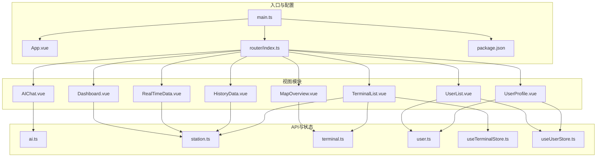
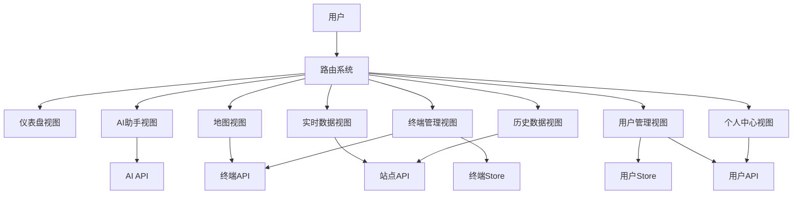
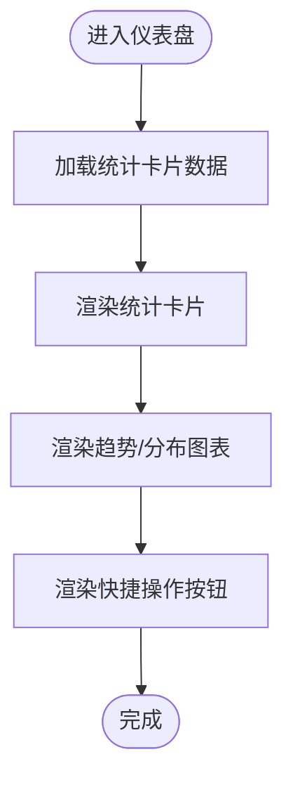
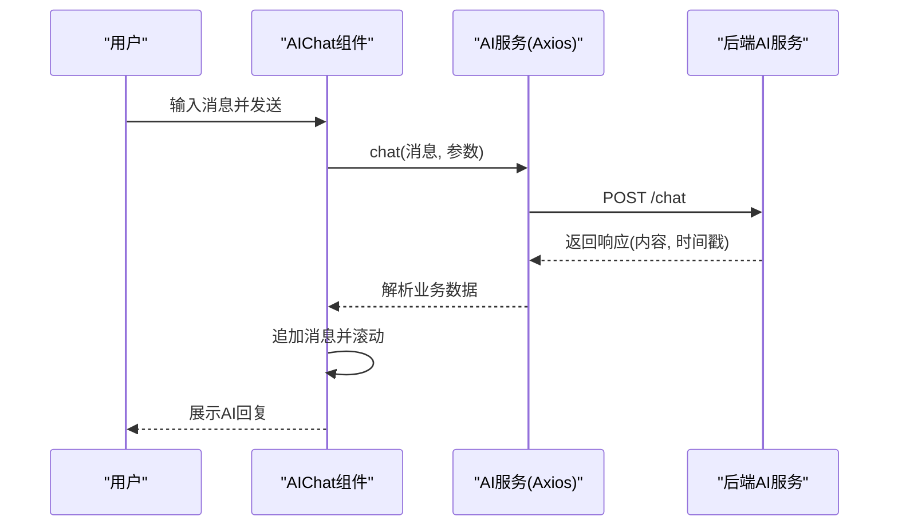
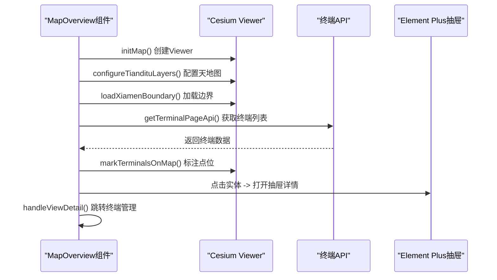
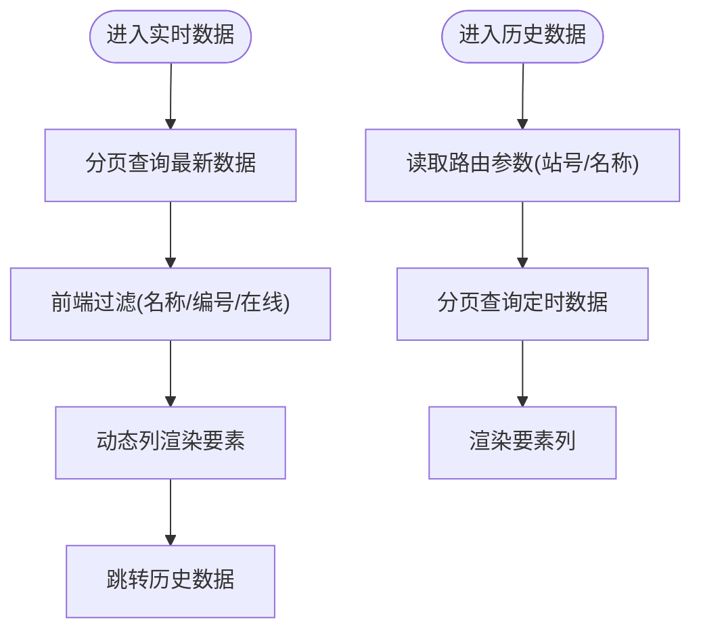
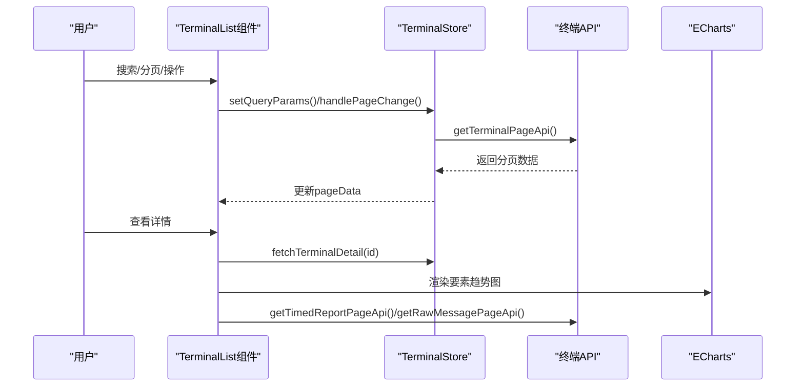
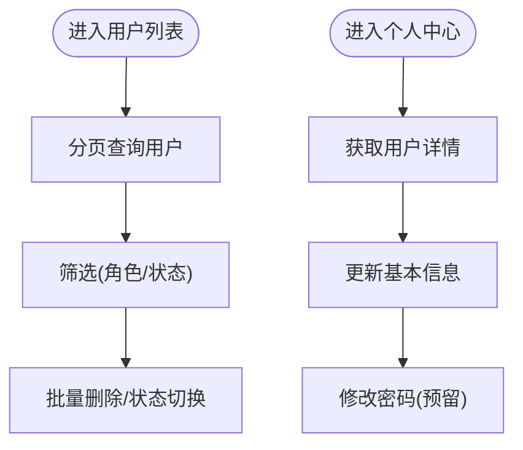
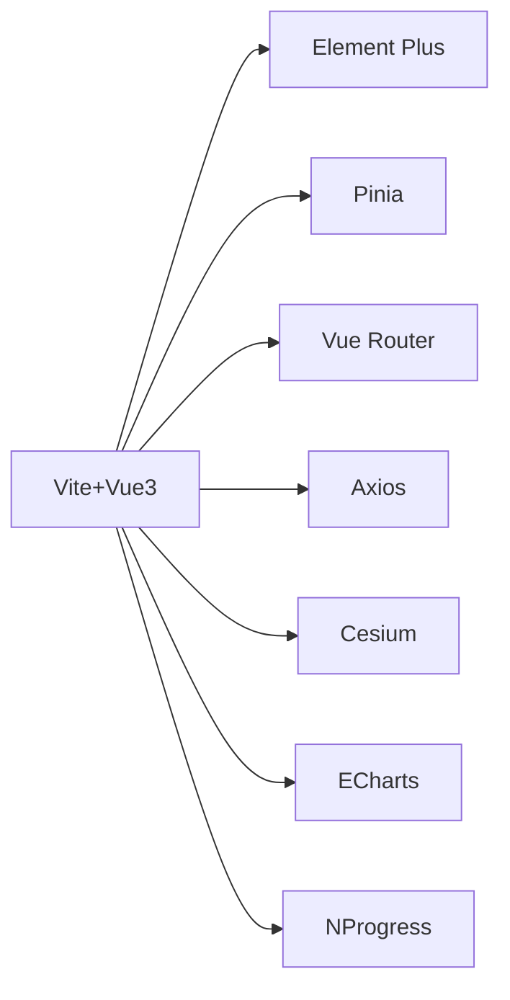

# 核心功能模块

<cite>
**本文档引用的文件**
- [README.md](file://README.md)
- [main.ts](file://src/main.ts)
- [App.vue](file://src/App.vue)
- [router/index.ts](file://src/router/index.ts)
- [package.json](file://package.json)
- [Dashboard.vue](file://src/views/dashboard/Dashboard.vue)
- [AIChat.vue](file://src/views/ai/AIChat.vue)
- [MapOverview.vue](file://src/views/map/MapOverview.vue)
- [RealTimeData.vue](file://src/views/data/RealTimeData.vue)
- [HistoryData.vue](file://src/views/data/HistoryData.vue)
- [TerminalList.vue](file://src/views/terminal/TerminalList.vue)
- [UserList.vue](file://src/views/user/UserList.vue)
- [UserProfile.vue](file://src/views/user/UserProfile.vue)
- [ai.ts](file://src/api/ai.ts)
- [station.ts](file://src/api/station.ts)
- [terminal.ts](file://src/api/terminal.ts)
- [user.ts](file://src/api/user.ts)
- [useTerminalStore.ts](file://src/stores/useTerminalStore.ts)
- [useUserStore.ts](file://src/stores/useUserStore.ts)
</cite>

## 目录
1. [引言](#引言)
2. [项目结构](#项目结构)
3. [核心组件](#核心组件)
4. [架构总览](#架构总览)
5. [详细组件分析](#详细组件分析)
6. [依赖分析](#依赖分析)
7. [性能考虑](#性能考虑)
8. [故障排除指南](#故障排除指南)
9. [结论](#结论)
10. [附录](#附录)

## 引言
本文件面向水文监测管理系统的核心功能模块，系统采用 Vue 3 + TypeScript + Element Plus 技术栈，围绕仪表盘、AI智能助手、地图可视化、数据查看、终端管理和用户管理六大模块展开，阐述设计理念、实现方式、使用场景、模块间交互关系、数据流向与业务逻辑，并提供配置选项、扩展点、自定义方式、性能优化与用户体验建议，帮助开发者快速理解与二次开发。

## 项目结构
项目采用典型的前端工程化组织方式，按功能域划分目录，核心模块位于 src/views 下，配合 API 封装、状态管理与路由配置形成完整的前端架构。

**图表来源**
- [main.ts:1-26](file://src/main.ts#L1-L26)
- [router/index.ts:1-136](file://src/router/index.ts#L1-L136)
- [Dashboard.vue:1-155](file://src/views/dashboard/Dashboard.vue#L1-L155)
- [AIChat.vue:1-519](file://src/views/ai/AIChat.vue#L1-L519)
- [MapOverview.vue:1-649](file://src/views/map/MapOverview.vue#L1-L649)
- [RealTimeData.vue:1-300](file://src/views/data/RealTimeData.vue#L1-L300)
- [HistoryData.vue:1-271](file://src/views/data/HistoryData.vue#L1-L271)
- [TerminalList.vue:1-800](file://src/views/terminal/TerminalList.vue#L1-L800)
- [UserList.vue:1-617](file://src/views/user/UserList.vue#L1-L617)
- [UserProfile.vue:1-376](file://src/views/user/UserProfile.vue#L1-L376)
- [ai.ts:1-113](file://src/api/ai.ts#L1-L113)
- [station.ts:1-115](file://src/api/station.ts#L1-L115)
- [terminal.ts:1-59](file://src/api/terminal.ts#L1-L59)
- [user.ts:1-179](file://src/api/user.ts#L1-L179)
- [useTerminalStore.ts:1-294](file://src/stores/useTerminalStore.ts#L1-L294)
- [useUserStore.ts:1-200](file://src/stores/useUserStore.ts#L1-L200)

**章节来源**
- [README.md:17-34](file://README.md#L17-L34)
- [router/index.ts:8-109](file://src/router/index.ts#L8-L109)
- [main.ts:12-25](file://src/main.ts#L12-L25)

## 核心组件
- 仪表盘模块：提供统计卡片、趋势图表与快捷操作，聚焦宏观数据概览与运营指标展示。
- AI智能助手：集成聊天对话、Markdown渲染、健康检查与消息持久化，提升人机交互体验。
- 地图可视化模块：基于 Cesium 实现3D地球场景、天地图底图、区域裁剪与终端标注，支持抽屉详情与跳转。
- 数据查看模块：实时数据与历史数据双视图，支持动态指标列、分页查询、时间筛选与历史跳转。
- 终端管理模块：终端列表、创建/编辑/删除、地图选点、抽屉详情与实时/要素分析/原始报文三标签页。
- 用户管理模块：用户列表、新增/编辑/删除、批量删除、状态切换与个人中心。

**章节来源**
- [Dashboard.vue:1-155](file://src/views/dashboard/Dashboard.vue#L1-L155)
- [AIChat.vue:1-519](file://src/views/ai/AIChat.vue#L1-L519)
- [MapOverview.vue:1-649](file://src/views/map/MapOverview.vue#L1-L649)
- [RealTimeData.vue:1-300](file://src/views/data/RealTimeData.vue#L1-L300)
- [HistoryData.vue:1-271](file://src/views/data/HistoryData.vue#L1-L271)
- [TerminalList.vue:1-800](file://src/views/terminal/TerminalList.vue#L1-L800)
- [UserList.vue:1-617](file://src/views/user/UserList.vue#L1-L617)
- [UserProfile.vue:1-376](file://src/views/user/UserProfile.vue#L1-L376)

## 架构总览
系统采用“路由驱动 + 组合式API + Pinia状态管理”的前端架构，模块间通过路由导航与API调用解耦，状态通过Store集中管理，UI组件通过Element Plus统一风格。

**图表来源**
- [router/index.ts:8-109](file://src/router/index.ts#L8-L109)
- [useTerminalStore.ts:23-293](file://src/stores/useTerminalStore.ts#L23-L293)
- [useUserStore.ts:18-199](file://src/stores/useUserStore.ts#L18-L199)
- [ai.ts:8-113](file://src/api/ai.ts#L8-L113)
- [station.ts:68-115](file://src/api/station.ts#L68-L115)
- [terminal.ts:10-59](file://src/api/terminal.ts#L10-L59)
- [user.ts:98-179](file://src/api/user.ts#L98-L179)

## 详细组件分析

### 仪表盘模块
- 设计理念：以统计卡片与图表为核心，提供运营关键指标的快速概览，支持快捷操作入口。
- 实现方式：使用 Element Plus 卡片与栅格布局，预留 ECharts 集成空间；静态占位便于后续接入真实数据。
- 使用场景：领导驾驶舱、运营监控面板、值班日志入口。
- 配置与扩展：可通过路由元信息配置图标与标题；图表区域可替换为 ECharts 实例以展示真实趋势。

**章节来源**
- [Dashboard.vue:1-155](file://src/views/dashboard/Dashboard.vue#L1-L155)

### AI智能助手模块
- 设计理念：提供自然语言问答能力，支持 Markdown 渲染、健康检查与会话持久化。
- 实现方式：基于 Axios 封装 AI 服务实例，统一请求/响应拦截；组件内维护消息列表、Markdown 解析器与滚动行为。
- 使用场景：业务咨询、操作指导、异常排查辅助。
- 交互流程：用户输入 -> 发送请求 -> 服务端响应 -> 追加消息 -> 自动滚动 -> 错误提示。

**图表来源**
- [AIChat.vue:164-202](file://src/views/ai/AIChat.vue#L164-L202)
- [ai.ts:96-105](file://src/api/ai.ts#L96-L105)

**章节来源**
- [AIChat.vue:1-519](file://src/views/ai/AIChat.vue#L1-L519)
- [ai.ts:1-113](file://src/api/ai.ts#L1-L113)

### 地图可视化模块
- 设计理念：基于 Cesium 构建3D地球场景，集成天地图底图、区域裁剪与终端标注，支持抽屉详情与跳转。
- 实现方式：初始化 Viewer、配置影像图层、加载厦门市边界与终端点位、创建发光纹理与光墙效果、ClippingPlane 裁剪。
- 使用场景：区域态势展示、终端分布可视化、应急指挥调度。
- 交互流程：地图初始化 -> 加载边界 -> 加载终端 -> 标注点位 -> 点击抽屉详情 -> 跳转终端管理。

**图表来源**
- [MapOverview.vue:77-124](file://src/views/map/MapOverview.vue#L77-L124)
- [MapOverview.vue:467-485](file://src/views/map/MapOverview.vue#L467-L485)
- [MapOverview.vue:588-597](file://src/views/map/MapOverview.vue#L588-L597)
- [terminal.ts:16-18](file://src/api/terminal.ts#L16-L18)

**章节来源**
- [MapOverview.vue:1-649](file://src/views/map/MapOverview.vue#L1-L649)
- [tianditu.ts](file://src/config/tianditu.ts)

### 数据查看模块
- 实时数据：支持按遥测站名称/编号、在线状态筛选，动态渲染要素列，分页查询与历史跳转。
- 历史数据：根据路由参数自动填充遥测站编号，支持时间范围筛选与分页。
- 实现方式：API 封装分页查询接口，组件内维护搜索表单、分页参数与动态列渲染。

**图表来源**
- [RealTimeData.vue:187-229](file://src/views/data/RealTimeData.vue#L187-L229)
- [HistoryData.vue:182-208](file://src/views/data/HistoryData.vue#L182-L208)

**章节来源**
- [RealTimeData.vue:1-300](file://src/views/data/RealTimeData.vue#L1-L300)
- [HistoryData.vue:1-271](file://src/views/data/HistoryData.vue#L1-L271)
- [station.ts:68-115](file://src/api/station.ts#L68-L115)

### 终端管理模块
- 设计理念：统一管理终端设备，支持地图选点、实时/要素分析/原始报文三标签页，提供完整的运维视图。
- 实现方式：Pinia Store 管理分页、查询参数、对话框与表单；组件内集成 ECharts 图表与分页查询。
- 使用场景：终端新增/编辑、设备运维、报文分析与故障定位。
- 交互流程：列表查询 -> 详情抽屉 -> 三标签页切换 -> 图表渲染 -> 分页查询 -> 地图选点。

**图表来源**
- [TerminalList.vue:725-791](file://src/views/terminal/TerminalList.vue#L725-L791)
- [useTerminalStore.ts:69-113](file://src/stores/useTerminalStore.ts#L69-L113)
- [terminal.ts:16-28](file://src/api/terminal.ts#L16-L28)

**章节来源**
- [TerminalList.vue:1-800](file://src/views/terminal/TerminalList.vue#L1-L800)
- [useTerminalStore.ts:1-294](file://src/stores/useTerminalStore.ts#L1-L294)
- [terminal.ts:1-59](file://src/api/terminal.ts#L1-L59)

### 用户管理模块
- 用户列表：支持按用户名/真实姓名/手机号/角色/状态筛选，批量删除与状态切换。
- 个人中心：展示与修改个人信息，提供修改密码入口（预留接口）。
- 实现方式：API 封装用户 CRUD 与分页查询，Store 管理用户信息与登录状态。

**图表来源**
- [UserList.vue:302-315](file://src/views/user/UserList.vue#L302-L315)
- [UserProfile.vue:204-226](file://src/views/user/UserProfile.vue#L204-L226)

**章节来源**
- [UserList.vue:1-617](file://src/views/user/UserList.vue#L1-L617)
- [UserProfile.vue:1-376](file://src/views/user/UserProfile.vue#L1-L376)
- [user.ts:98-179](file://src/api/user.ts#L98-L179)
- [useUserStore.ts:18-199](file://src/stores/useUserStore.ts#L18-L199)

## 依赖分析
- 外部依赖：Vue 3、Element Plus、Axios、Cesium、ECharts、Pinia、Vue Router、NProgress。
- 模块耦合：各模块通过路由解耦，API 层统一管理网络请求，Store 聚合状态，降低组件间耦合。
- 潜在风险：Cesium 与 ECharts 资源体积较大，需注意按需加载与懒加载策略。

**图表来源**
- [package.json:14-26](file://package.json#L14-L26)
- [package.json:27-46](file://package.json#L27-L46)

**章节来源**
- [package.json:1-48](file://package.json#L1-L48)

## 性能考虑
- 资源加载优化：Cesium 与 ECharts 按需引入，组件懒加载与路由懒加载减少首屏压力。
- 数据分页与虚拟滚动：列表组件采用分页与固定高度，避免大数据量渲染卡顿。
- 图表渲染优化：ECharts 图表在切换标签页时延迟初始化，减少不必要的渲染。
- 地图性能：Cesium 的 ClippingPlane 数量与边界点数量直接影响性能，建议在大规模数据时降采样或简化几何。
- 缓存策略：Store 与本地存储结合，减少重复请求；路由守卫避免未登录访问。

[本节为通用性能建议，无需特定文件引用]

## 故障排除指南
- 登录与鉴权：路由守卫检查 token，未登录跳转登录页；用户 Store 解析 token 并获取用户信息，失败时使用默认管理员信息。
- API 错误处理：Axios 拦截器统一处理业务状态码与 HTTP 状态码，错误消息通过 Element Plus 提示。
- 地图初始化失败：检查天地图 Token 与网络连通性；确认 Cesium 资源加载路径正确。
- 数据为空或异常：检查后端接口返回格式与分页参数；确认 Element Plus 版本与组件属性一致。

**章节来源**
- [router/index.ts:116-129](file://src/router/index.ts#L116-L129)
- [useUserStore.ts:100-125](file://src/stores/useUserStore.ts#L100-L125)
- [ai.ts:32-77](file://src/api/ai.ts#L32-L77)
- [MapOverview.vue:120-123](file://src/views/map/MapOverview.vue#L120-L123)

## 结论
该系统以模块化设计为核心，通过路由与 API 的清晰边界、Pinia 的集中状态管理，实现了仪表盘、AI助手、地图可视化、数据查看、终端管理与用户管理的协同工作。模块间职责明确、扩展性强，具备良好的二次开发基础。建议在生产环境中进一步完善按需加载、图表与地图的性能优化以及错误监控体系。

[本节为总结性内容，无需特定文件引用]

## 附录
- 配置选项与环境变量：在 .env 中配置 API 基础地址与 AI 服务地址；Cesium Ion Token 可选配置。
- 扩展点：新增模块可在路由中注册，通过 API 封装统一接入；Store 可按领域拆分以提升可维护性。
- 自定义方式：主题切换、图标扩展、组件二次封装与国际化均可在现有基础设施上扩展。

**章节来源**
- [README.md:100-123](file://README.md#L100-L123)
- [main.ts:14-17](file://src/main.ts#L14-L17)