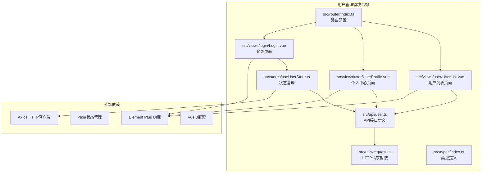
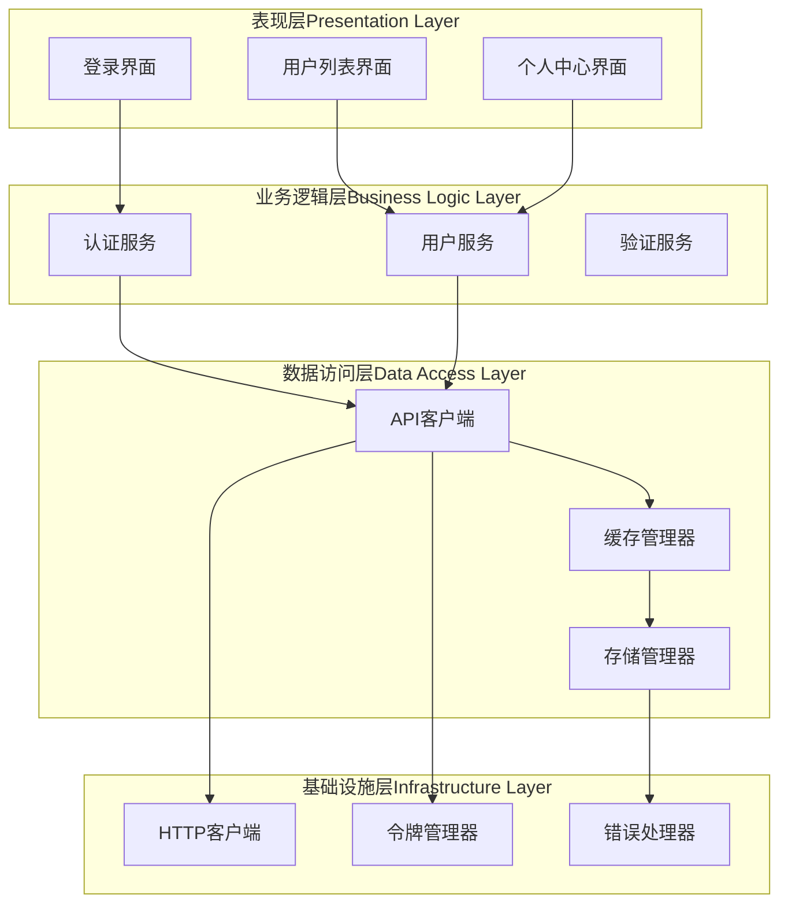
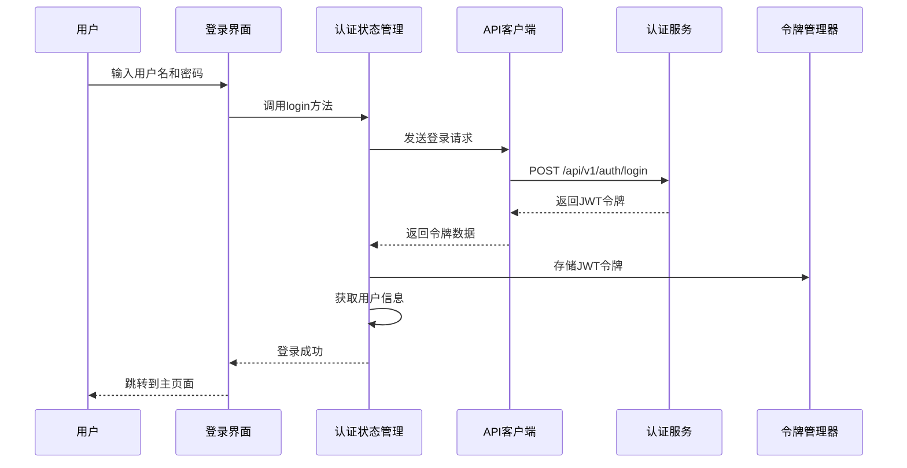
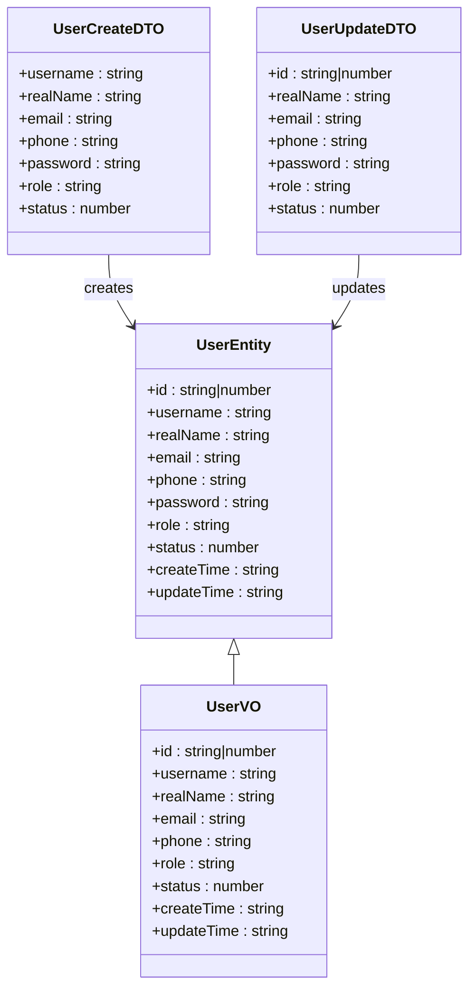
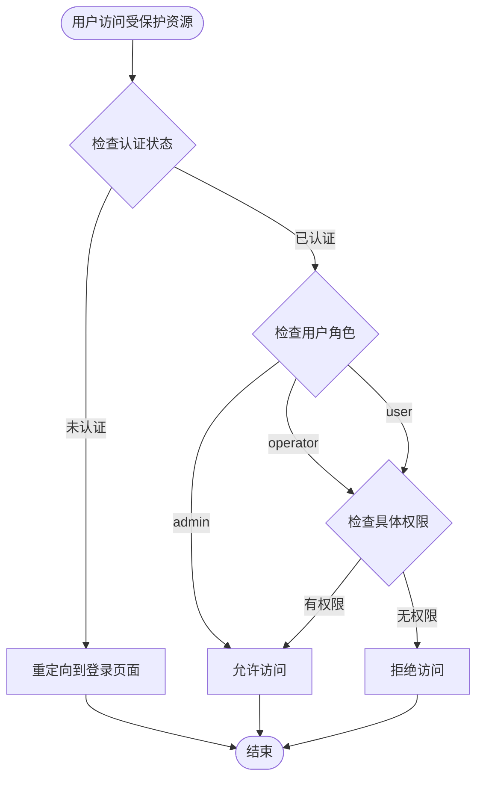
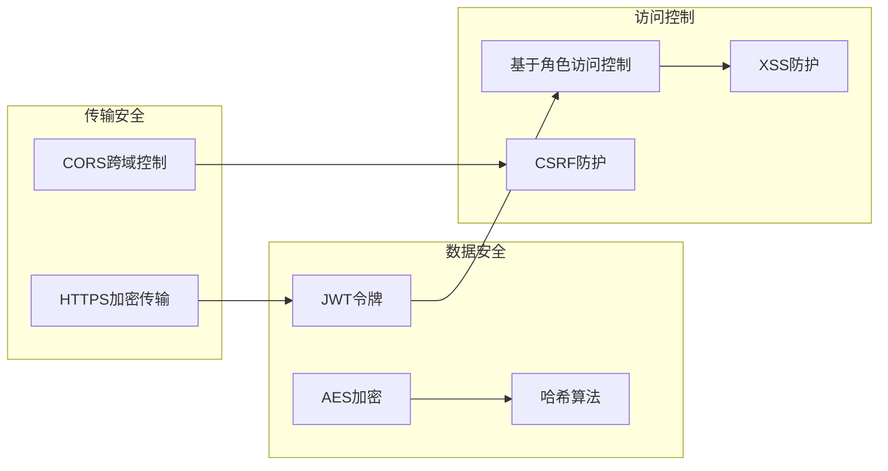
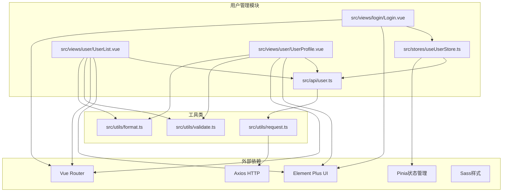

# 用户管理模块

<cite>
**本文档引用的文件**
- [src/api/user.ts](file://src/api/user.ts)
- [src/stores/useUserStore.ts](file://src/stores/useUserStore.ts)
- [src/views/user/UserList.vue](file://src/views/user/UserList.vue)
- [src/views/user/UserProfile.vue](file://src/views/user/UserProfile.vue)
- [src/router/index.ts](file://src/router/index.ts)
- [src/utils/request.ts](file://src/utils/request.ts)
- [src/views/login/Login.vue](file://src/views/login/Login.vue)
- [src/types/index.ts](file://src/types/index.ts)
- [-v3-api-docs.md](file://-v3-api-docs.md)
</cite>

## 目录
1. [简介](#简介)
2. [项目结构](#项目结构)
3. [核心组件](#核心组件)
4. [架构概览](#架构概览)
5. [详细组件分析](#详细组件分析)
6. [依赖关系分析](#依赖关系分析)
7. [性能考虑](#性能考虑)
8. [故障排除指南](#故障排除指南)
9. [结论](#结论)
10. [附录](#附录)

## 简介

用户管理模块是 HydroMonitor 智慧水利监测平台的核心功能模块之一，负责系统的用户生命周期管理。该模块提供了完整的用户信息管理功能，包括用户列表展示、个人信息编辑、角色权限分配和账户状态管理。系统采用前后端分离架构，前端基于 Vue 3 + TypeScript + Element Plus 构建，实现了现代化的用户界面和流畅的用户体验。

该模块的主要特点包括：
- **完整的用户生命周期管理**：从用户注册、登录认证到权限管理和状态控制
- **多层次的安全保障**：JWT 令牌管理、密码安全策略、会话管理
- **灵活的权限体系**：基于角色的访问控制（RBAC），支持管理员、操作员、普通用户三种角色
- **丰富的用户界面**：响应式设计，支持多种设备访问
- **完善的错误处理**：统一的错误提示和异常处理机制

## 项目结构

用户管理模块在项目中的组织结构如下：

**图表来源**
- [src/api/user.ts:1-179](file://src/api/user.ts#L1-L179)
- [src/stores/useUserStore.ts:1-200](file://src/stores/useUserStore.ts#L1-L200)
- [src/views/user/UserList.vue:1-617](file://src/views/user/UserList.vue#L1-L617)
- [src/views/user/UserProfile.vue:1-376](file://src/views/user/UserProfile.vue#L1-L376)

**章节来源**
- [src/api/user.ts:1-179](file://src/api/user.ts#L1-L179)
- [src/stores/useUserStore.ts:1-200](file://src/stores/useUserStore.ts#L1-L200)
- [src/views/user/UserList.vue:1-617](file://src/views/user/UserList.vue#L1-L617)
- [src/views/user/UserProfile.vue:1-376](file://src/views/user/UserProfile.vue#L1-L376)

## 核心组件

用户管理模块由多个核心组件协同工作，每个组件都有明确的职责分工：

### API 接口层
负责与后端服务进行数据交互，定义了完整的用户管理 API 接口：
- 用户认证接口：登录、注销
- 用户信息接口：查询、创建、更新、删除
- 用户列表接口：分页查询、条件筛选
- 用户详情接口：获取用户完整信息

### 状态管理层
基于 Pinia 实现的状态管理，负责：
- JWT 令牌的存储和管理
- 用户信息的缓存和同步
- 登录状态的持久化
- 权限信息的管理

### 视图组件层
包含两个主要的用户界面组件：
- 用户列表组件：提供用户信息的展示、搜索、批量操作功能
- 个人中心组件：允许用户查看和编辑个人信息，修改密码

### 路由管理层
通过 Vue Router 实现的路由系统，支持：
- 路由守卫和权限控制
- 页面跳转和导航
- 登录状态检查

**章节来源**
- [src/api/user.ts:98-179](file://src/api/user.ts#L98-L179)
- [src/stores/useUserStore.ts:18-199](file://src/stores/useUserStore.ts#L18-L199)
- [src/views/user/UserList.vue:1-617](file://src/views/user/UserList.vue#L1-L617)
- [src/views/user/UserProfile.vue:1-376](file://src/views/user/UserProfile.vue#L1-L376)

## 架构概览

用户管理模块采用了清晰的分层架构设计，确保了代码的可维护性和扩展性：

**图表来源**
- [src/views/login/Login.vue:117-134](file://src/views/login/Login.vue#L117-L134)
- [src/views/user/UserList.vue:302-315](file://src/views/user/UserList.vue#L302-L315)
- [src/views/user/UserProfile.vue:231-264](file://src/views/user/UserProfile.vue#L231-L264)

该架构的主要优势：
- **关注点分离**：各层职责明确，便于维护和测试
- **可扩展性**：新增功能时只需在相应层次添加代码
- **可测试性**：每层都可以独立进行单元测试
- **可复用性**：业务逻辑可以在不同界面中复用

## 详细组件分析

### 用户认证流程

用户认证是整个用户管理模块的核心流程，采用 JWT（JSON Web Token）认证机制：

**图表来源**
- [src/views/login/Login.vue:117-134](file://src/views/login/Login.vue#L117-L134)
- [src/stores/useUserStore.ts:61-83](file://src/stores/useUserStore.ts#L61-L83)
- [src/utils/request.ts:78-93](file://src/utils/request.ts#L78-L93)

认证流程的关键特性：
- **JWT 令牌管理**：自动处理令牌的存储、验证和刷新
- **用户信息同步**：登录后自动获取并缓存用户详细信息
- **错误处理**：完善的错误提示和异常处理机制
- **安全性保障**：令牌过期自动处理，防止未授权访问

### 用户信息管理

用户信息管理功能提供了完整的 CRUD（创建、读取、更新、删除）操作：

**图表来源**
- [src/api/user.ts:19-96](file://src/api/user.ts#L19-L96)

用户信息管理的核心功能：
- **用户列表展示**：支持分页、排序、搜索和筛选
- **个人信息编辑**：允许用户修改基本信息和联系方式
- **角色权限分配**：支持不同角色的权限设置
- **账户状态管理**：支持启用、禁用等状态控制

### 权限验证机制

系统实现了基于角色的访问控制（RBAC）机制：

**图表来源**
- [src/router/index.ts:116-129](file://src/router/index.ts#L116-L129)
- [src/stores/useUserStore.ts:24-27](file://src/stores/useUserStore.ts#L24-L27)

权限验证的关键实现：
- **路由守卫**：全局路由守卫检查用户认证状态
- **角色判断**：通过用户角色决定访问权限
- **动态权限**：支持更细粒度的权限控制
- **权限缓存**：避免重复的权限检查

### 数据安全策略

系统采用了多层次的数据安全策略：

**图表来源**
- [src/utils/request.ts:52-75](file://src/utils/request.ts#L52-L75)
- [src/stores/useUserStore.ts:132-150](file://src/stores/useUserStore.ts#L132-L150)

安全策略的具体实现：
- **HTTPS 加密**：所有数据传输都经过 SSL/TLS 加密
- **JWT 令牌**：使用 JWT 进行身份认证和会话管理
- **密码哈希**：用户密码采用安全的哈希算法存储
- **权限控制**：严格的访问控制和权限验证机制

**章节来源**
- [src/views/login/Login.vue:117-134](file://src/views/login/Login.vue#L117-L134)
- [src/stores/useUserStore.ts:61-125](file://src/stores/useUserStore.ts#L61-L125)
- [src/views/user/UserList.vue:302-451](file://src/views/user/UserList.vue#L302-L451)
- [src/views/user/UserProfile.vue:231-310](file://src/views/user/UserProfile.vue#L231-L310)

## 依赖关系分析

用户管理模块的依赖关系体现了清晰的分层架构：

**图表来源**
- [src/api/user.ts:1](file://src/api/user.ts#L1)
- [src/stores/useUserStore.ts:1](file://src/stores/useUserStore.ts#L1)
- [src/views/user/UserList.vue:209](file://src/views/user/UserList.vue#L209)
- [src/views/user/UserProfile.vue:121](file://src/views/user/UserProfile.vue#L121)
- [src/views/login/Login.vue:85](file://src/views/login/Login.vue#L85)

**章节来源**
- [src/api/user.ts:1-179](file://src/api/user.ts#L1-L179)
- [src/stores/useUserStore.ts:1-200](file://src/stores/useUserStore.ts#L1-L200)
- [src/views/user/UserList.vue:1-617](file://src/views/user/UserList.vue#L1-L617)
- [src/views/user/UserProfile.vue:1-376](file://src/views/user/UserProfile.vue#L1-L376)

## 性能考虑

用户管理模块在设计时充分考虑了性能优化：

### 前端性能优化

1. **组件懒加载**：使用 Vue Router 的异步组件实现按需加载
2. **虚拟滚动**：对于大量用户数据的场景，可以考虑实现虚拟滚动
3. **缓存策略**：合理使用浏览器缓存和内存缓存
4. **防抖节流**：对频繁触发的操作使用防抖和节流优化

### 后端性能优化

1. **分页查询**：所有用户列表查询都支持分页，避免一次性加载大量数据
2. **条件筛选**：支持多维度的查询条件，提高查询效率
3. **批量操作**：提供批量删除等批量操作，减少 API 调用次数

### 网络性能优化

1. **HTTP 请求优化**：统一的请求拦截器处理认证和错误
2. **响应数据优化**：自动处理大整数精度问题
3. **连接池管理**：合理的连接管理和复用

## 故障排除指南

### 常见问题及解决方案

#### 登录失败问题
**问题现象**：用户无法登录系统
**可能原因**：
- 用户名或密码错误
- 网络连接异常
- 服务器认证服务不可用
- 令牌过期

**解决方案**：
1. 检查用户名和密码是否正确
2. 确认网络连接正常
3. 查看浏览器控制台的错误信息
4. 清除浏览器缓存重新登录

#### 用户信息加载失败
**问题现象**：用户列表或个人信息无法加载
**可能原因**：
- 令牌失效
- API 接口异常
- 数据格式错误

**解决方案**：
1. 检查令牌是否有效
2. 验证 API 接口状态
3. 查看数据格式是否符合预期

#### 权限访问被拒绝
**问题现象**：用户访问某些功能时被拒绝
**可能原因**：
- 用户角色权限不足
- 会话过期
- 权限配置错误

**解决方案**：
1. 检查用户的角色和权限
2. 重新登录获取新的会话
3. 联系系统管理员检查权限配置

### 调试技巧

1. **浏览器开发者工具**：使用 Network 标签查看 API 请求和响应
2. **控制台日志**：利用 console.log 输出调试信息
3. **状态检查**：检查 Pinia store 中的状态变化
4. **令牌验证**：验证 JWT 令牌的有效性和内容

**章节来源**
- [src/utils/request.ts:95-151](file://src/utils/request.ts#L95-L151)
- [src/stores/useUserStore.ts:100-125](file://src/stores/useUserStore.ts#L100-L125)

## 结论

用户管理模块作为 HydroMonitor 平台的核心功能，展现了现代前端应用的最佳实践。该模块通过清晰的分层架构、完善的认证机制、灵活的权限控制和优秀的用户体验设计，为整个平台提供了坚实的用户管理基础。

模块的主要优势包括：
- **架构清晰**：分层设计使得代码易于维护和扩展
- **功能完整**：涵盖了用户管理的所有核心功能
- **安全可靠**：多重安全措施保障系统的安全性
- **用户体验优秀**：响应式设计和流畅的交互体验
- **性能优化**：合理的性能优化策略确保良好的用户体验

未来可以考虑的功能扩展：
- **审计日志**：增加用户操作审计和日志记录功能
- **批量导入导出**：支持用户数据的批量导入和导出
- **自定义权限**：支持更细粒度的权限配置
- **多租户支持**：支持多租户场景下的用户管理

## 附录

### API 接口文档

用户管理模块提供的主要 API 接口：

| 接口名称 | 方法 | 路径 | 描述 |
|---------|------|------|------|
| 用户登录 | POST | `/api/v1/auth/login` | 用户认证，获取 JWT 令牌 |
| 获取用户信息 | GET | `/api/v1/users/{id}` | 根据用户 ID 获取用户详细信息 |
| 根据用户名查询用户 | GET | `/api/v1/users/username/{username}` | 根据用户名获取用户信息 |
| 分页查询用户列表 | GET | `/api/v1/users/page` | 支持条件筛选的分页查询 |
| 查询用户详情 | GET | `/api/v1/users/{id}` | 获取用户完整信息 |
| 创建用户 | POST | `/api/v1/users` | 创建新用户 |
| 更新用户 | PUT | `/api/v1/users` | 更新用户信息 |
| 删除用户 | DELETE | `/api/v1/users/{id}` | 删除指定用户 |

### 数据模型定义

用户相关的数据模型包括：

- **UserEntity**：用户实体，包含完整的用户信息
- **UserVO**：用户视图对象，用于列表展示
- **UserCreateDTO**：用户创建数据传输对象
- **UserUpdateDTO**：用户更新数据传输对象
- **UserQueryDTO**：用户查询参数对象
- **PageResult**：分页查询结果对象

### 角色权限体系

系统支持三种基本角色：
- **admin**：系统管理员，拥有最高权限
- **operator**：操作员，具有特定功能的操作权限
- **user**：普通用户，基本的查看和编辑权限

### 安全最佳实践

1. **密码安全**：使用强密码策略和安全的哈希算法
2. **令牌管理**：合理设置令牌过期时间和刷新机制
3. **输入验证**：对所有用户输入进行严格的验证和过滤
4. **权限控制**：实施最小权限原则和纵深防御策略
5. **日志审计**：记录重要的用户操作和系统事件