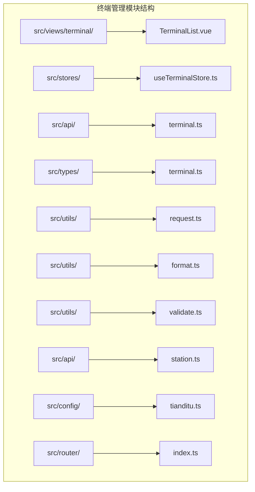
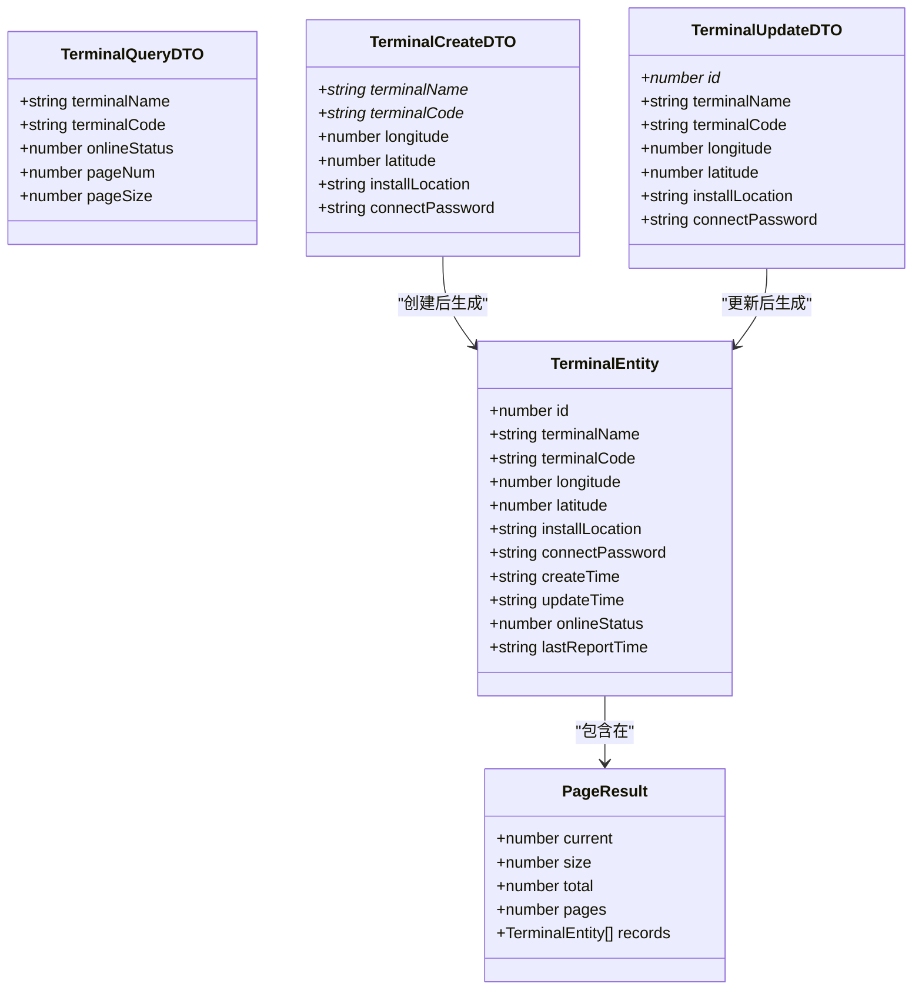
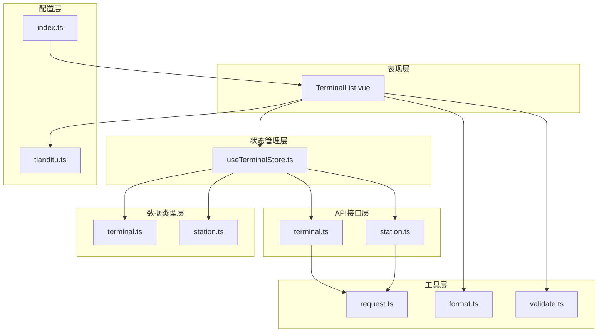
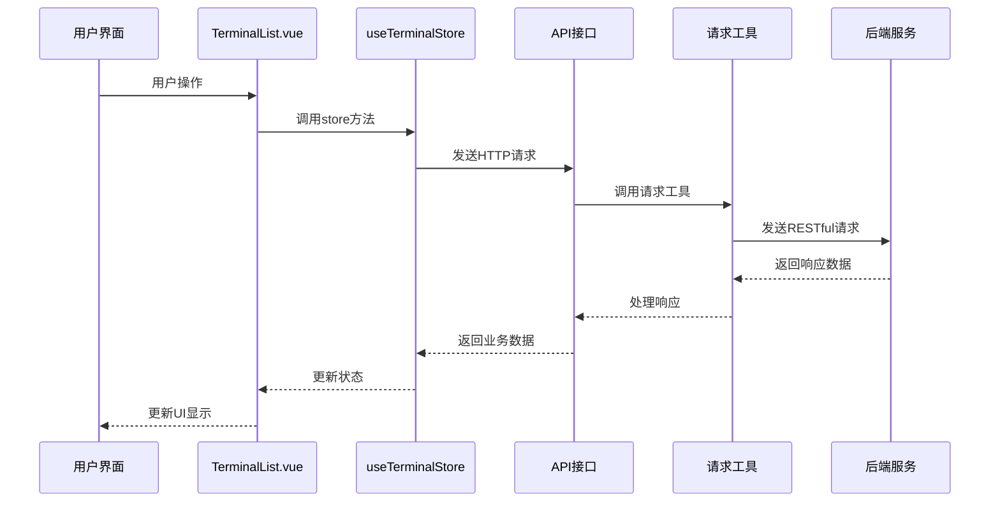
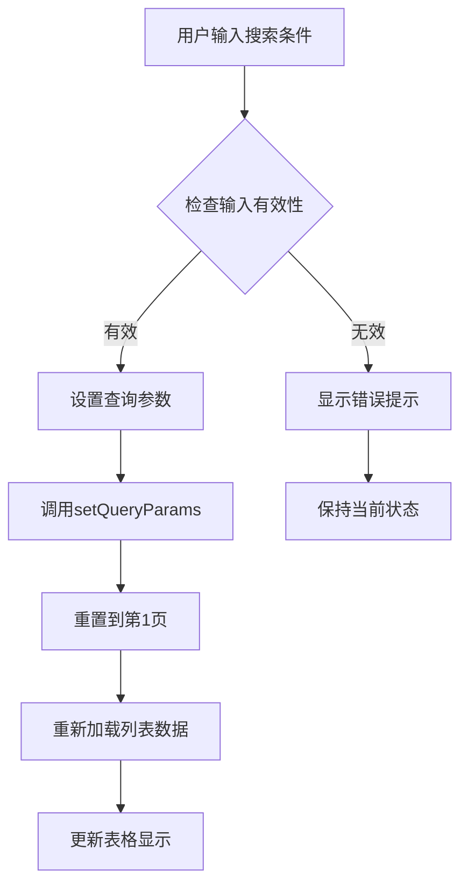
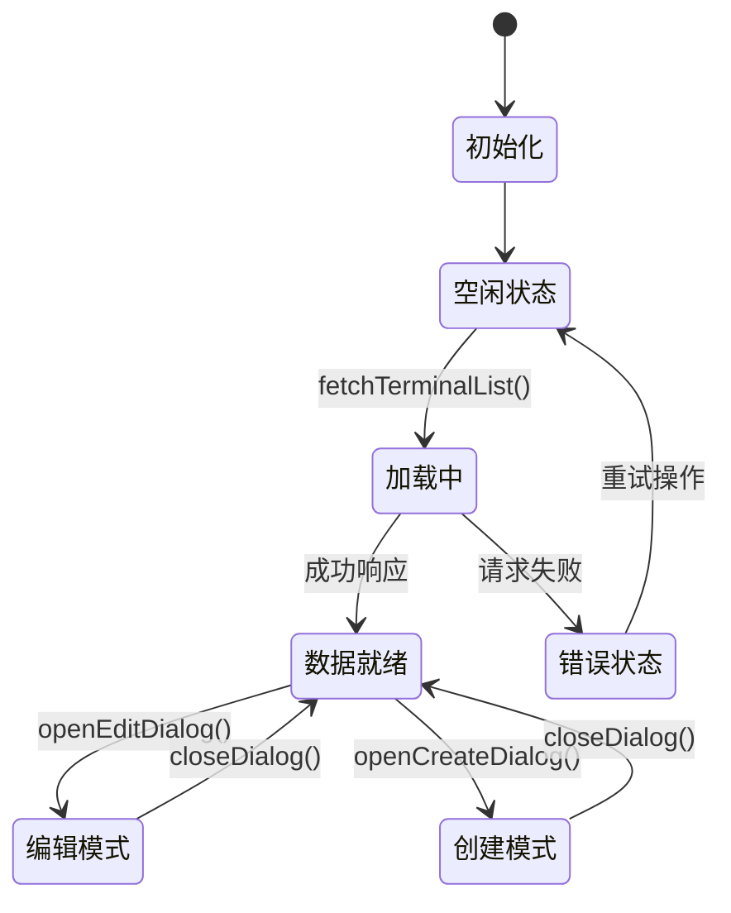
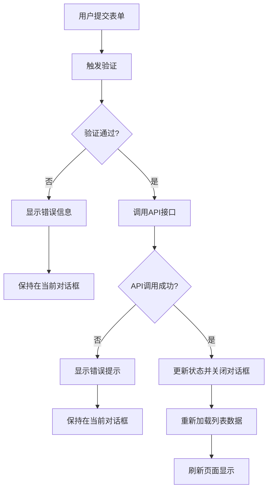
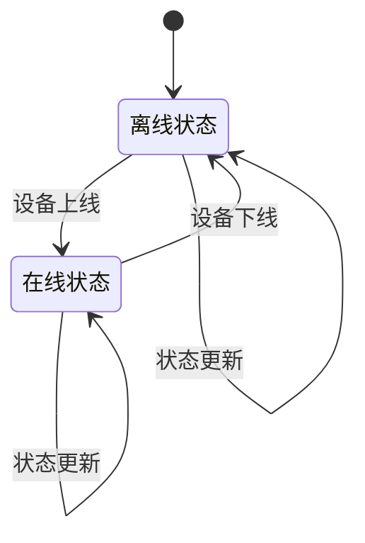
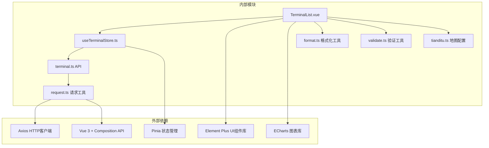

# 终端管理模块

<cite>
**本文档引用的文件**
- [terminal.ts](file://src/api/terminal.ts)
- [useTerminalStore.ts](file://src/stores/useTerminalStore.ts)
- [terminal.ts](file://src/types/terminal.ts)
- [TerminalList.vue](file://src/views/terminal/TerminalList.vue)
- [request.ts](file://src/utils/request.ts)
- [format.ts](file://src/utils/format.ts)
- [validate.ts](file://src/utils/validate.ts)
- [station.ts](file://src/api/station.ts)
- [index.ts](file://src/router/index.ts)
- [tianditu.ts](file://src/config/tianditu.ts)
</cite>

## 目录
1. [简介](#简介)
2. [项目结构](#项目结构)
3. [核心组件](#核心组件)
4. [架构概览](#架构概览)
5. [详细组件分析](#详细组件分析)
6. [依赖关系分析](#依赖关系分析)
7. [性能考虑](#性能考虑)
8. [故障排除指南](#故障排除指南)
9. [结论](#结论)
10. [附录](#附录)

## 简介

终端管理模块是水文监测系统中的核心功能模块，负责终端设备的全生命周期管理。该模块提供了完整的CRUD操作、设备状态监控、数据验证、批量操作等功能，支持设备列表展示、设备详情查看、搜索过滤、分页显示和排序等特性。

本模块采用现代化的前端技术栈，基于Vue 3 Composition API、Pinia状态管理、Element Plus组件库和ECharts可视化库构建，实现了高度交互性和用户体验友好的界面设计。

## 项目结构

终端管理模块在项目中的组织结构如下：



**图表来源**
- [TerminalList.vue:1-50](file://src/views/terminal/TerminalList.vue#L1-L50)
- [useTerminalStore.ts:1-50](file://src/stores/useTerminalStore.ts#L1-L50)
- [terminal.ts:1-59](file://src/api/terminal.ts#L1-L59)

**章节来源**
- [TerminalList.vue:1-100](file://src/views/terminal/TerminalList.vue#L1-L100)
- [useTerminalStore.ts:1-50](file://src/stores/useTerminalStore.ts#L1-L50)
- [terminal.ts:1-59](file://src/api/terminal.ts#L1-L59)

## 核心组件

### 终端实体模型

终端管理模块的核心数据模型定义了终端设备的完整信息结构：



**图表来源**
- [terminal.ts:6-18](file://src/types/terminal.ts#L6-L18)
- [terminal.ts:25-31](file://src/types/terminal.ts#L25-L31)
- [terminal.ts:51-58](file://src/types/terminal.ts#L51-L58)
- [terminal.ts:65-73](file://src/types/terminal.ts#L65-L73)

### API接口层

终端管理模块提供了完整的RESTful API接口：

| 接口类型 | HTTP方法 | 路径 | 功能描述 |
|---------|---------|------|----------|
| 分页查询 | GET | `/terminals/page` | 获取终端分页列表 |
| 详情查询 | GET | `/terminals/{id}` | 获取终端详细信息 |
| 创建终端 | POST | `/terminals` | 创建新的终端设备 |
| 更新终端 | PUT | `/terminals` | 更新终端设备信息 |
| 删除终端 | DELETE | `/terminals/{id}` | 删除指定终端设备 |

**章节来源**
- [terminal.ts:10-59](file://src/api/terminal.ts#L10-L59)
- [terminal.ts:1-84](file://src/types/terminal.ts#L1-L84)

## 架构概览

终端管理模块采用分层架构设计，各层职责清晰分离：



**图表来源**
- [TerminalList.vue:594-609](file://src/views/terminal/TerminalList.vue#L594-L609)
- [useTerminalStore.ts:1-23](file://src/stores/useTerminalStore.ts#L1-L23)
- [terminal.ts:1-8](file://src/api/terminal.ts#L1-L8)

### 数据流图



**图表来源**
- [TerminalList.vue:726-732](file://src/views/terminal/TerminalList.vue#L726-L732)
- [useTerminalStore.ts:72-93](file://src/stores/useTerminalStore.ts#L72-L93)
- [request.ts:154-177](file://src/utils/request.ts#L154-L177)

## 详细组件分析

### 终端列表视图组件

TerminalList.vue是终端管理模块的核心视图组件，实现了完整的设备管理功能：

#### 搜索和过滤功能

组件提供了多维度的搜索和过滤能力：



**图表来源**
- [TerminalList.vue:725-732](file://src/views/terminal/TerminalList.vue#L725-L732)

#### 表格展示功能

终端列表表格支持以下特性：
- 基本信息展示：ID、名称、编码、经纬度、安装位置
- 状态标识：在线/离线状态标签
- 时间信息：最后上报时间、创建时间
- 操作按钮：查看详情、编辑、删除

#### 对话框表单系统

组件包含三个主要对话框：

1. **创建对话框**：用于新增终端设备
2. **编辑对话框**：用于修改现有终端信息  
3. **详情对话框**：用于查看终端详细信息

每个对话框都集成了完整的表单验证和数据绑定功能。

**章节来源**
- [TerminalList.vue:1-107](file://src/views/terminal/TerminalList.vue#L1-L107)
- [TerminalList.vue:109-296](file://src/views/terminal/TerminalList.vue#L109-L296)
- [TerminalList.vue:298-590](file://src/views/terminal/TerminalList.vue#L298-L590)

### Pinia状态管理

useTerminalStore.ts实现了集中式的状态管理：

#### 状态定义



**图表来源**
- [useTerminalStore.ts:23-56](file://src/stores/useTerminalStore.ts#L23-L56)

#### 核心功能方法

| 方法名 | 参数 | 功能描述 | 返回值 |
|-------|------|----------|--------|
| fetchTerminalList | 无 | 获取终端列表 | Promise<void> |
| fetchTerminalDetail | id: number | 获取终端详情 | Promise<void> |
| createTerminal | data: TerminalCreateDTO | 创建新终端 | Promise<boolean> |
| updateTerminal | data: TerminalUpdateDTO | 更新终端信息 | Promise<boolean> |
| deleteTerminal | id: number | 删除终端 | Promise<boolean> |
| openCreateDialog | 无 | 打开创建对话框 | void |
| openEditDialog | terminal: TerminalEntity | 打开编辑对话框 | void |
| closeDialog | type: DialogType | 关闭对话框 | void |

**章节来源**
- [useTerminalStore.ts:69-180](file://src/stores/useTerminalStore.ts#L69-L180)
- [useTerminalStore.ts:182-226](file://src/stores/useTerminalStore.ts#L182-L226)

### 数据验证系统

组件集成了完整的表单验证机制：

#### 验证规则

| 字段名 | 验证规则 | 错误消息 |
|--------|----------|----------|
| terminalName | 必填，2-50字符 | 请输入终端名称，长度在2到50个字符 |
| terminalCode | 必填，2-50字符 | 请输入终端编码，长度在2到50个字符 |
| longitude | 数字，-180到180范围 | 经度必须在-180到180之间 |
| latitude | 数字，-90到90范围 | 纬度必须在-90到90之间 |

#### 验证流程



**图表来源**
- [TerminalList.vue:662-671](file://src/views/terminal/TerminalList.vue#L662-L671)
- [TerminalList.vue:1096-1137](file://src/views/terminal/TerminalList.vue#L1096-L1137)

**章节来源**
- [TerminalList.vue:662-671](file://src/views/terminal/TerminalList.vue#L662-L671)
- [validate.ts:1-36](file://src/utils/validate.ts#L1-L36)

### 设备状态监控

终端管理模块提供了丰富的设备状态监控功能：

#### 在线状态管理



**图表来源**
- [terminal.ts:80-83](file://src/types/terminal.ts#L80-L83)

#### 实时数据集成

终端详情抽屉集成了多个数据源：
- **最新实时数据**：显示设备最新的监测数据
- **定时报数据**：展示历史监测数据的趋势分析
- **原始报文**：提供设备通信的原始数据包

**章节来源**
- [TerminalList.vue:359-505](file://src/views/terminal/TerminalList.vue#L359-L505)
- [station.ts:13-23](file://src/api/station.ts#L13-L23)

### 地图集成功能

终端管理模块集成了天地图服务，提供直观的位置选择功能：

#### 地图功能特性

- **位置选择**：通过点击地图选择经纬度坐标
- **标记显示**：在地图上显示当前位置标记
- **坐标输入**：支持手动输入经纬度坐标
- **地图缩放**：根据配置进行地图缩放控制

**章节来源**
- [TerminalList.vue:1139-1243](file://src/views/terminal/TerminalList.vue#L1139-L1243)
- [tianditu.ts:1-28](file://src/config/tianditu.ts#L1-L28)

## 依赖关系分析

### 组件间依赖关系



**图表来源**
- [TerminalList.vue:594-609](file://src/views/terminal/TerminalList.vue#L594-L609)
- [useTerminalStore.ts:1-17](file://src/stores/useTerminalStore.ts#L1-L17)
- [request.ts:1-10](file://src/utils/request.ts#L1-L10)

### 数据类型依赖

终端管理模块的数据类型具有清晰的层次结构：

```mermaid
erDiagram
TERMINAL_ENTITY {
number id PK
string terminalName
string terminalCode
number longitude
number latitude
string installLocation
string connectPassword
string createTime
string updateTime
number onlineStatus
string lastReportTime
}
TERMINAL_QUERY_DTO {
string terminalName
string terminalCode
number onlineStatus
number pageNum
number pageSize
}
TERMINAL_CREATE_DTO {
string terminalName
string terminalCode
number longitude
number latitude
string installLocation
string connectPassword
}
TERMINAL_UPDATE_DTO {
number id
string terminalName
string terminalCode
number longitude
number latitude
string installLocation
string connectPassword
}
PAGE_RESULT {
number current
number size
number total
number pages
TERMINAL_ENTITY[] records
}
TERMINAL_ENTITY ||--|| PAGE_RESULT : "包含在"
TERMINAL_CREATE_DTO --> TERMINAL_ENTITY : "创建后生成"
TERMINAL_UPDATE_DTO --> TERMINAL_ENTITY : "更新后生成"
```

**图表来源**
- [terminal.ts:6-18](file://src/types/terminal.ts#L6-L18)
- [terminal.ts:25-31](file://src/types/terminal.ts#L25-L31)
- [terminal.ts:51-58](file://src/types/terminal.ts#L51-L58)
- [terminal.ts:65-73](file://src/types/terminal.ts#L65-L73)

**章节来源**
- [terminal.ts:1-84](file://src/types/terminal.ts#L1-L84)

## 性能考虑

### 前端性能优化

1. **懒加载策略**：路由组件采用动态导入，减少初始加载时间
2. **虚拟滚动**：对于大量数据的场景，可以考虑实现虚拟滚动
3. **缓存机制**：合理利用浏览器缓存和组件缓存
4. **防抖节流**：对频繁触发的操作使用防抖节流优化

### 网络请求优化

1. **请求拦截器**：统一处理Token认证和错误处理
2. **响应预处理**：解决大整数精度丢失问题
3. **超时控制**：设置合理的请求超时时间
4. **并发控制**：避免重复请求相同数据

### 内存管理

1. **组件卸载清理**：及时清理定时器和事件监听器
2. **图表实例管理**：正确销毁ECharts实例
3. **地图实例管理**：确保地图资源正确释放

## 故障排除指南

### 常见问题及解决方案

#### 登录认证问题

**问题现象**：用户登录后无法访问终端管理功能
**解决方案**：
1. 检查Token是否正确存储在localStorage中
2. 确认路由守卫逻辑正常工作
3. 验证后端认证接口是否返回有效的Token

#### 数据加载失败

**问题现象**：终端列表无法加载或显示空白
**解决方案**：
1. 检查网络连接状态
2. 验证API接口URL配置
3. 查看浏览器控制台错误信息
4. 确认后端服务正常运行

#### 表单验证错误

**问题现象**：表单提交时出现验证错误
**解决方案**：
1. 检查输入数据格式是否符合要求
2. 确认必填字段是否完整填写
3. 验证特殊字符和长度限制

#### 地图功能异常

**问题现象**：地图无法正常显示或选择位置
**解决方案**：
1. 检查天地图API密钥配置
2. 验证网络连接是否正常
3. 确认地图脚本是否正确加载

**章节来源**
- [request.ts:95-151](file://src/utils/request.ts#L95-L151)
- [TerminalList.vue:1190-1243](file://src/views/terminal/TerminalList.vue#L1190-L1243)

## 结论

终端管理模块是一个功能完整、架构清晰的前端管理系统。它成功地实现了终端设备的全生命周期管理，包括：

### 主要成就

1. **完整的CRUD功能**：支持终端设备的创建、读取、更新、删除操作
2. **强大的搜索过滤**：提供多维度的搜索和过滤功能
3. **状态监控集成**：实时显示设备状态和历史数据
4. **用户友好界面**：采用现代化的UI设计和交互体验
5. **数据验证保障**：完善的表单验证和错误处理机制

### 技术亮点

- **模块化设计**：清晰的分层架构和职责分离
- **响应式开发**：支持多种屏幕尺寸和设备类型
- **性能优化**：合理的性能优化策略和最佳实践
- **可扩展性**：良好的扩展接口和自定义字段支持

### 改进建议

1. **批量操作功能**：可以考虑添加批量删除、批量状态更新等功能
2. **导入导出功能**：支持Excel等格式的数据导入导出
3. **操作日志**：记录用户的操作历史便于审计
4. **权限控制**：细化不同角色的权限管理
5. **配置管理**：提供更多的系统配置选项

该模块为水文监测系统的终端管理提供了坚实的技术基础，为后续的功能扩展和维护奠定了良好的基础。

## 附录

### API接口规范

#### 终端管理API

| 接口 | 方法 | 路径 | 请求体 | 响应体 |
|------|------|------|--------|--------|
| 获取终端列表 | GET | `/terminals/page` | 查询参数 | PageResult<TerminalEntity> |
| 获取终端详情 | GET | `/terminals/{id}` | 无 | TerminalEntity |
| 创建终端 | POST | `/terminals` | TerminalCreateDTO | TerminalEntity |
| 更新终端 | PUT | `/terminals` | TerminalUpdateDTO | TerminalEntity |
| 删除终端 | DELETE | `/terminals/{id}` | 无 | 无 |

#### 数据查询API

| 接口 | 方法 | 路径 | 请求体 | 响应体 |
|------|------|------|--------|--------|
| 最新实时数据 | GET | `/timed-reports/latest` | 查询参数 | PageResult<StationLatestData> |
| 定时报数据 | POST | `/timed-reports/page` | TimedReportQueryDTO | PageResult<TimedReportEntity> |
| 原始报文 | POST | `/raw-messages/page` | RawMessageQueryDTO | PageResult<RawMessageEntity> |

### 数据类型定义

#### 终端实体属性

| 属性名 | 类型 | 必填 | 描述 |
|--------|------|------|------|
| id | number | 是 | 终端唯一标识符 |
| terminalName | string | 是 | 终端名称 |
| terminalCode | string | 是 | 终端编码 |
| longitude | number | 否 | 经度坐标 |
| latitude | number | 否 | 纬度坐标 |
| installLocation | string | 否 | 安装位置 |
| connectPassword | string | 否 | 连接密码 |
| createTime | string | 是 | 创建时间 |
| updateTime | string | 是 | 更新时间 |
| onlineStatus | number | 是 | 在线状态（0离线，1在线） |
| lastReportTime | string | 否 | 最后上报时间 |

### 开发指南

#### 扩展接口

如需扩展终端管理功能，建议遵循以下原则：

1. **保持一致性**：新功能应遵循现有的命名约定和代码风格
2. **模块化设计**：将新功能封装在独立的模块中
3. **类型安全**：使用TypeScript确保类型安全
4. **错误处理**：完善错误处理和用户反馈机制
5. **性能考虑**：关注新功能对性能的影响

#### 自定义字段支持

系统预留了自定义字段的支持，可以通过以下方式扩展：

1. **数据模型扩展**：在类型定义中添加新的字段
2. **API接口扩展**：在后端API中支持新的字段
3. **前端界面扩展**：在表单和表格中添加相应的UI元素
4. **验证规则扩展**：添加对应的验证规则