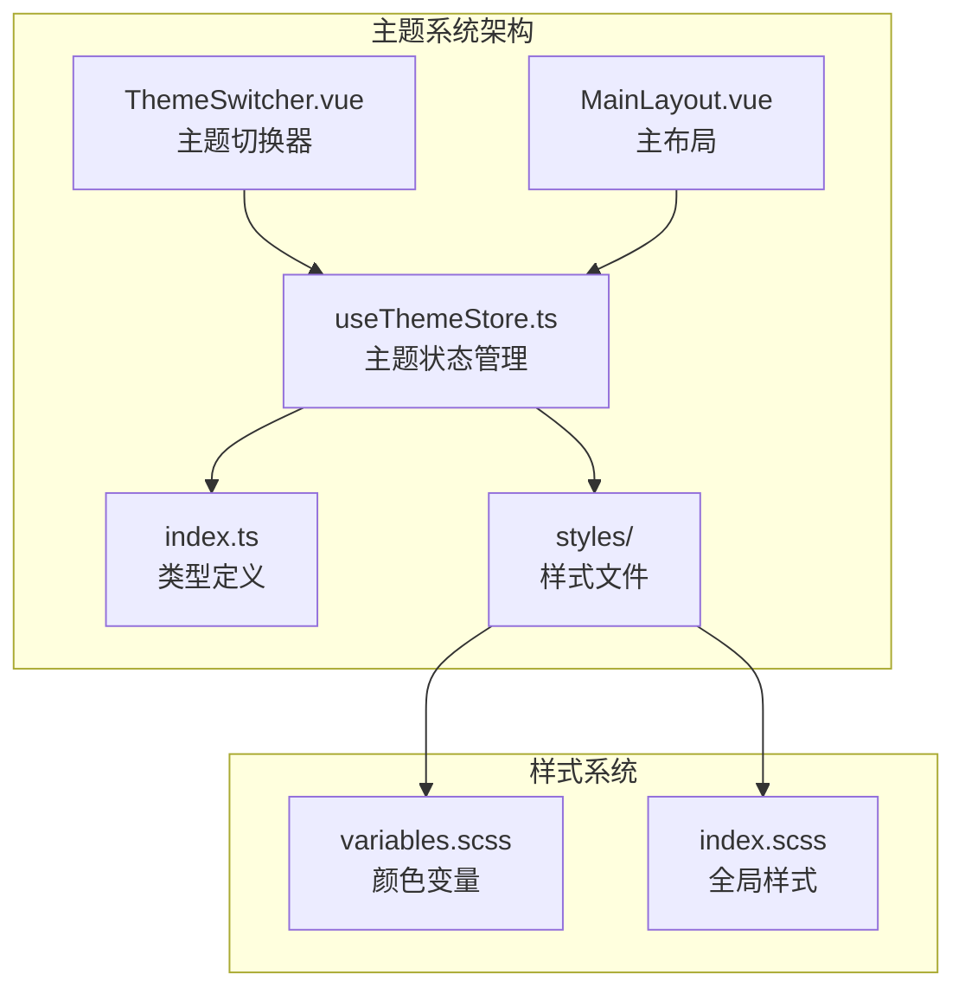
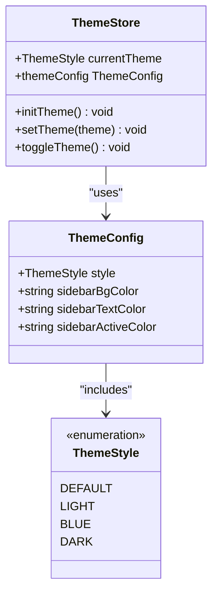
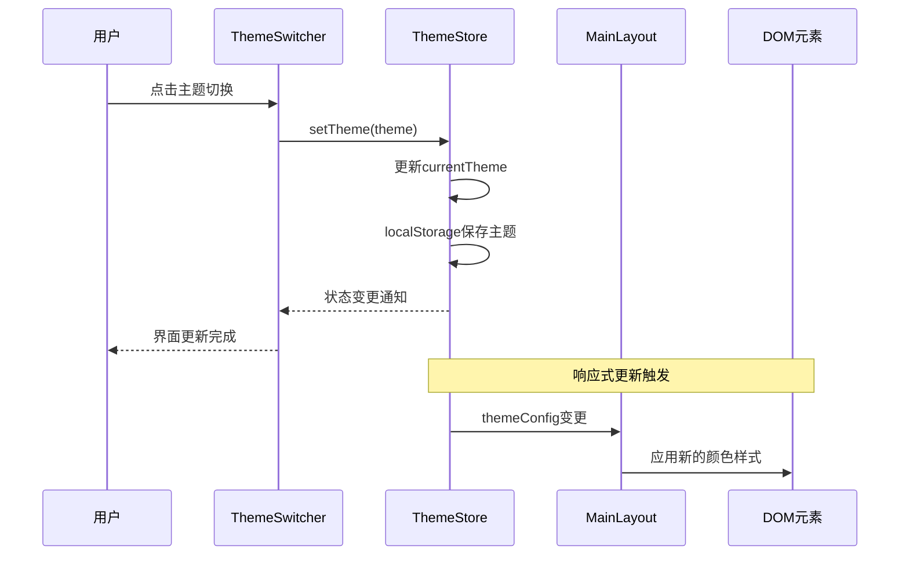
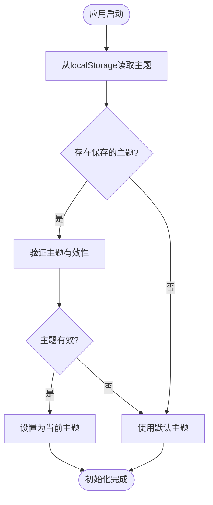
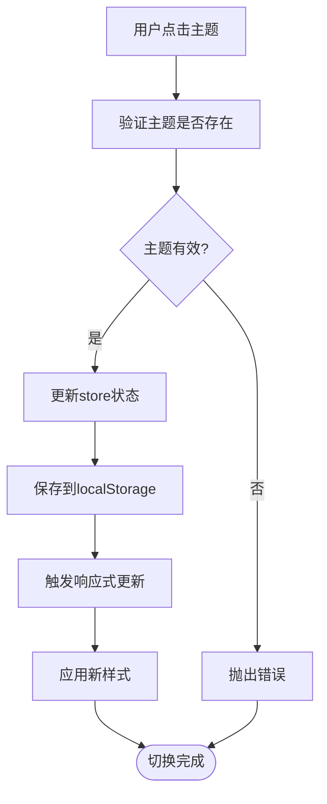
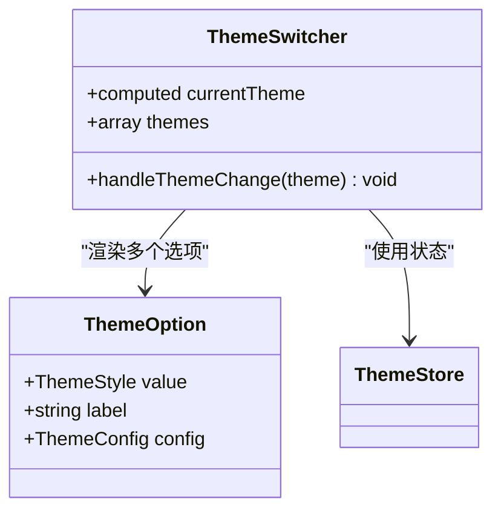
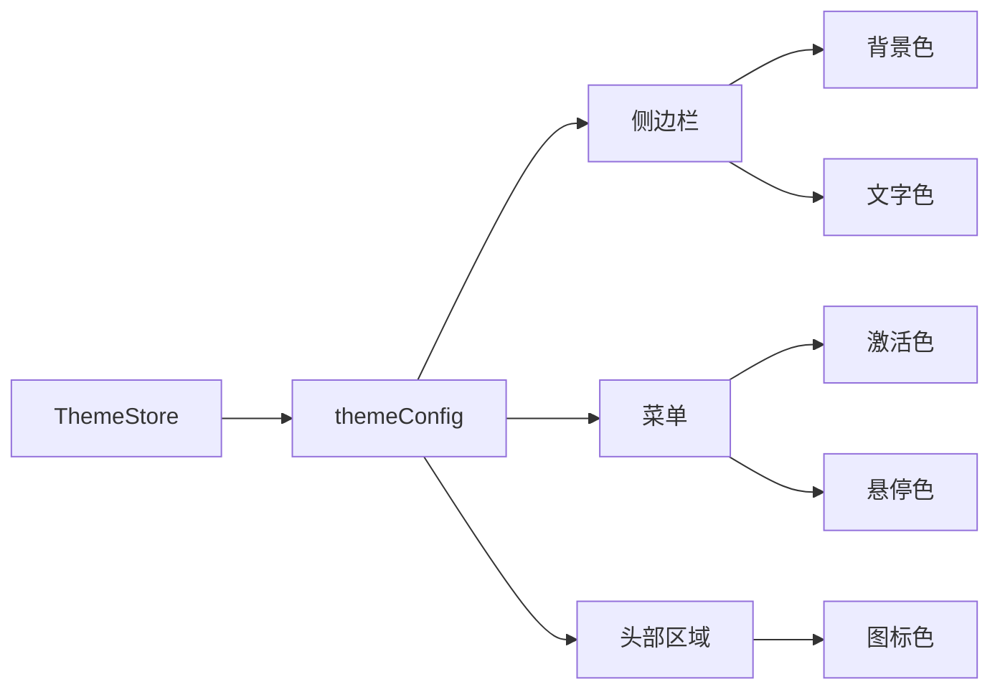
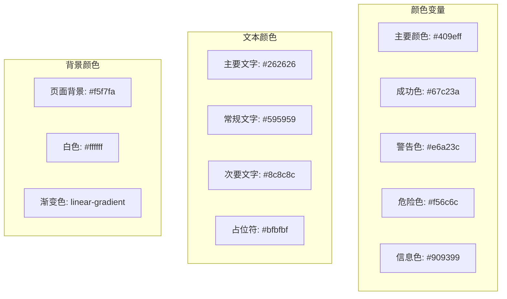
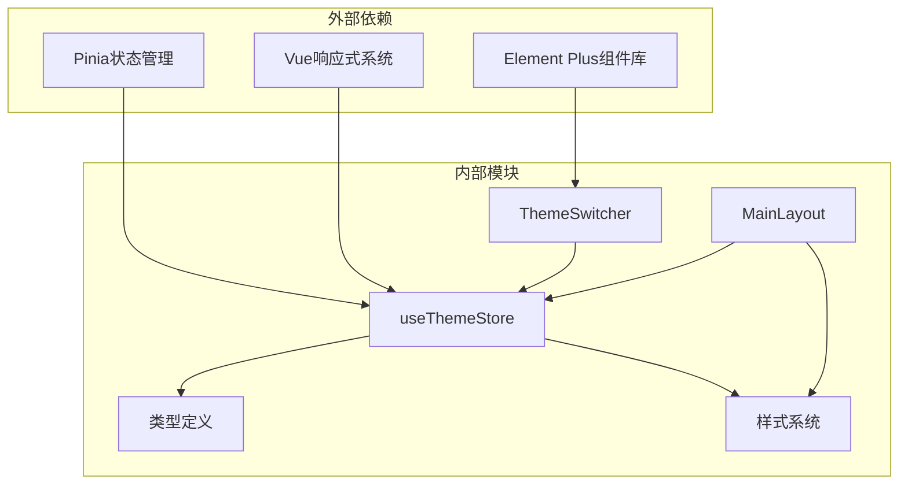

# 主题状态管理

<cite>
**本文档引用的文件**
- [useThemeStore.ts](file://src/stores/useThemeStore.ts)
- [ThemeSwitcher.vue](file://src/components/ThemeSwitcher.vue)
- [MainLayout.vue](file://src/layouts/MainLayout.vue)
- [variables.scss](file://src/styles/variables.scss)
- [index.scss](file://src/styles/index.scss)
- [index.ts](file://src/types/index.ts)
- [main.ts](file://src/main.ts)
- [App.vue](file://src/App.vue)
</cite>

## 目录
1. [简介](#简介)
2. [项目结构](#项目结构)
3. [核心组件](#核心组件)
4. [架构概览](#架构概览)
5. [详细组件分析](#详细组件分析)
6. [依赖关系分析](#依赖关系分析)
7. [性能考虑](#性能考虑)
8. [故障排除指南](#故障排除指南)
9. [结论](#结论)

## 简介

水文监测管理系统采用Pinia状态管理库实现主题状态管理，提供了完整的主题切换机制、颜色变量管理和动态样式更新功能。该系统支持四种主题风格（默认深色、浅色、科技蓝、极客黑），具备持久化存储、自动检测和响应式设计支持。

## 项目结构

主题系统围绕以下核心文件构建：

**图表来源**
- [useThemeStore.ts:1-69](file://src/stores/useThemeStore.ts#L1-L69)
- [ThemeSwitcher.vue:1-132](file://src/components/ThemeSwitcher.vue#L1-L132)
- [MainLayout.vue:1-434](file://src/layouts/MainLayout.vue#L1-L434)

**章节来源**
- [useThemeStore.ts:1-69](file://src/stores/useThemeStore.ts#L1-L69)
- [ThemeSwitcher.vue:1-132](file://src/components/ThemeSwitcher.vue#L1-L132)
- [MainLayout.vue:1-434](file://src/layouts/MainLayout.vue#L1-L434)

## 核心组件

### 主题状态管理器

`useThemeStore`是整个主题系统的核心，基于Pinia实现状态管理：

**图表来源**
- [useThemeStore.ts:34-68](file://src/stores/useThemeStore.ts#L34-L68)
- [index.ts:36-50](file://src/types/index.ts#L36-L50)

### 主题配置映射

系统预定义了四种主题配置，每种主题都包含侧边栏背景色、文字颜色和激活颜色：

| 主题名称 | 主题值 | 侧边栏背景色 | 侧边栏文字色 | 激活颜色 |
|---------|--------|-------------|-------------|----------|
| 默认深色 | default | #304156 | #bfcbd9 | #409eff |
| 浅色 | light | #ffffff | #303133 | #409eff |
| 科技蓝 | blue | #001529 | #a6adb4 | #1890ff |
| 极客黑 | dark | #141414 | #999999 | #1677ff |

**章节来源**
- [useThemeStore.ts:5-30](file://src/stores/useThemeStore.ts#L5-L30)
- [index.ts:36-42](file://src/types/index.ts#L36-L42)

## 架构概览

主题系统的整体架构采用分层设计，实现了状态管理、视图绑定和样式应用的分离：

**图表来源**
- [ThemeSwitcher.vue:80-82](file://src/components/ThemeSwitcher.vue#L80-L82)
- [useThemeStore.ts:53-58](file://src/stores/useThemeStore.ts#L53-L58)
- [MainLayout.vue:7-28](file://src/layouts/MainLayout.vue#L7-L28)

## 详细组件分析

### 主题状态管理器实现

`useThemeStore`实现了完整的主题生命周期管理：

#### 初始化机制

**图表来源**
- [useThemeStore.ts:45-50](file://src/stores/useThemeStore.ts#L45-L50)

#### 主题切换流程

**图表来源**
- [useThemeStore.ts:53-66](file://src/stores/useThemeStore.ts#L53-L66)

**章节来源**
- [useThemeStore.ts:34-68](file://src/stores/useThemeStore.ts#L34-L68)

### 主题切换器组件

`ThemeSwitcher`组件提供了直观的主题选择界面：

#### 组件结构

**图表来源**
- [ThemeSwitcher.vue:35-82](file://src/components/ThemeSwitcher.vue#L35-L82)

#### 主题预览机制
组件通过内联样式实时预览主题效果：
- 侧边栏背景色预览
- 激活状态颜色展示
- 主题标签显示

**章节来源**
- [ThemeSwitcher.vue:1-132](file://src/components/ThemeSwitcher.vue#L1-L132)

### 主布局集成

`MainLayout`组件集成了主题系统到实际界面中：

#### 动态样式应用

**图表来源**
- [MainLayout.vue:4-28](file://src/layouts/MainLayout.vue#L4-L28)

**章节来源**
- [MainLayout.vue:1-434](file://src/layouts/MainLayout.vue#L1-L434)

### 样式系统架构

#### SCSS变量体系
系统采用SCSS变量管理颜色和样式规范：

**图表来源**
- [variables.scss:1-44](file://src/styles/variables.scss#L1-L44)

**章节来源**
- [variables.scss:1-44](file://src/styles/variables.scss#L1-L44)
- [index.scss:1-114](file://src/styles/index.scss#L1-L114)

## 依赖关系分析

主题系统的依赖关系清晰明确，遵循单一职责原则：

**图表来源**
- [main.ts:1-26](file://src/main.ts#L1-L26)
- [useThemeStore.ts:1-3](file://src/stores/useThemeStore.ts#L1-L3)

**章节来源**
- [main.ts:1-26](file://src/main.ts#L1-L26)
- [index.ts:1-51](file://src/types/index.ts#L1-L51)

## 性能考虑

### 响应式更新优化
- 使用Pinia的响应式状态管理，避免不必要的重新渲染
- 主题切换仅影响相关组件，不触发全应用重绘
- localStorage操作异步执行，不影响UI流畅度

### 内存管理
- 主题配置对象在内存中缓存，避免重复创建
- 组件计算属性缓存计算结果
- 事件处理器使用箭头函数避免this绑定问题

### 加载性能
- 主题初始化在应用启动时异步执行
- 样式文件按需加载，不阻塞主流程
- 图标组件懒加载，减少初始包体积

## 故障排除指南

### 常见问题及解决方案

#### 主题切换无效
**问题描述**: 点击主题切换按钮后界面没有变化
**可能原因**:
- localStorage访问被阻止
- 主题配置数据损坏
- 组件未正确响应状态变化

**解决步骤**:
1. 检查浏览器localStorage功能是否正常
2. 清除localStorage中的theme_config键
3. 重启应用验证问题是否解决

#### 主题状态不同步
**问题描述**: 页面刷新后主题恢复到默认状态
**解决方法**:
- 确认localStorage权限设置
- 检查浏览器隐私模式设置
- 验证应用是否有跨域限制

#### 样式显示异常
**问题描述**: 主题切换后某些元素颜色未更新
**排查步骤**:
1. 检查组件是否正确使用themeConfig
2. 验证CSS优先级设置
3. 确认Element Plus组件的样式覆盖

**章节来源**
- [useThemeStore.ts:45-50](file://src/stores/useThemeStore.ts#L45-L50)
- [ThemeSwitcher.vue:80-82](file://src/components/ThemeSwitcher.vue#L80-L82)

## 结论

水文监测管理系统的主题状态管理实现了以下关键特性：

### 技术优势
- **模块化设计**: 清晰的职责分离，易于维护和扩展
- **响应式更新**: 基于Vue响应式系统，实现无缝的主题切换体验
- **持久化存储**: localStorage确保用户偏好的持久保存
- **类型安全**: 完整的TypeScript类型定义，提供编译时安全保障

### 扩展性设计
- 支持动态添加新主题配置
- 易于集成第三方主题库
- 可扩展的颜色变量系统
- 组件化的主题切换器设计

### 最佳实践建议
1. **主题扩展**: 新增主题时只需修改主题配置映射
2. **样式组织**: 保持SCSS变量的层次化管理
3. **性能优化**: 注意避免不必要的响应式更新
4. **用户体验**: 提供主题切换的视觉反馈和过渡动画

该主题系统为水文监测管理系统的用户界面提供了灵活、可定制的主题管理解决方案，满足了现代Web应用对个性化界面的需求。