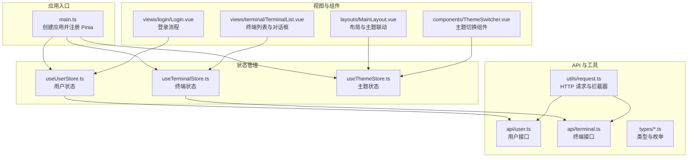
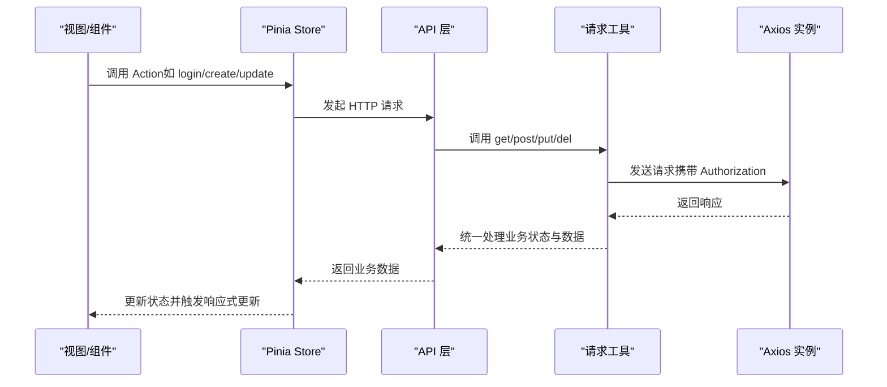
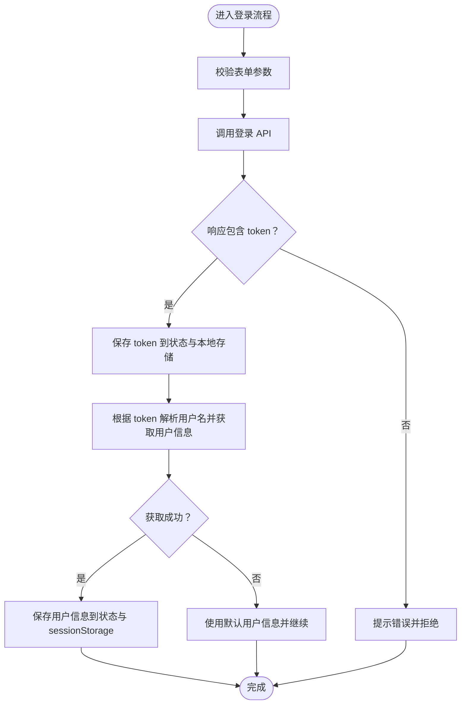
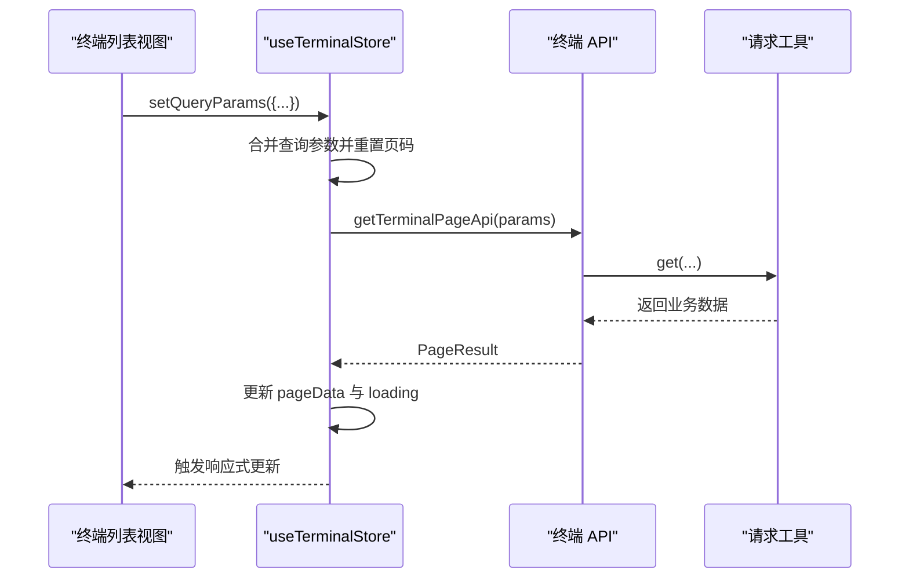
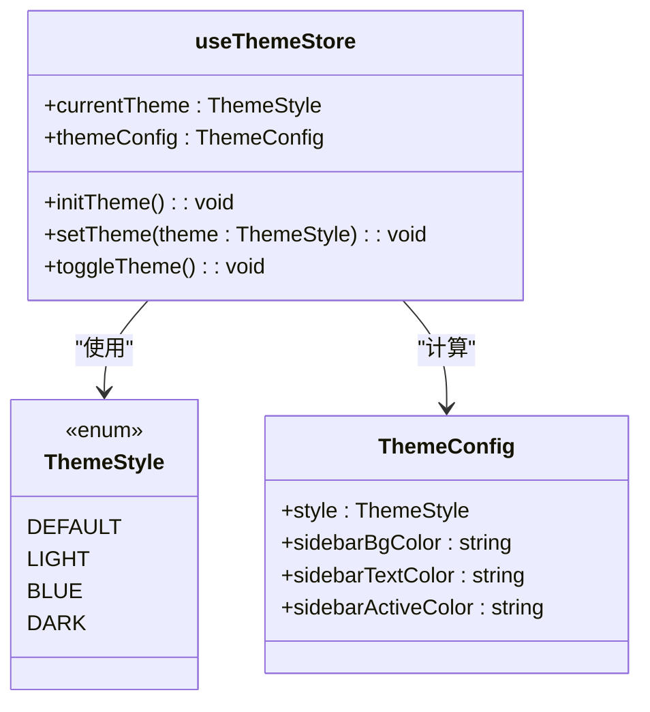
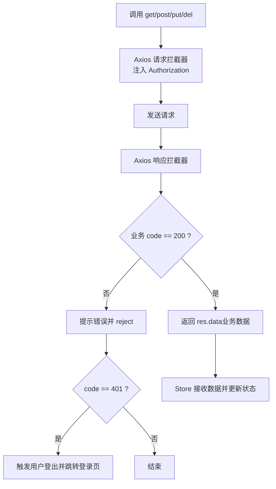
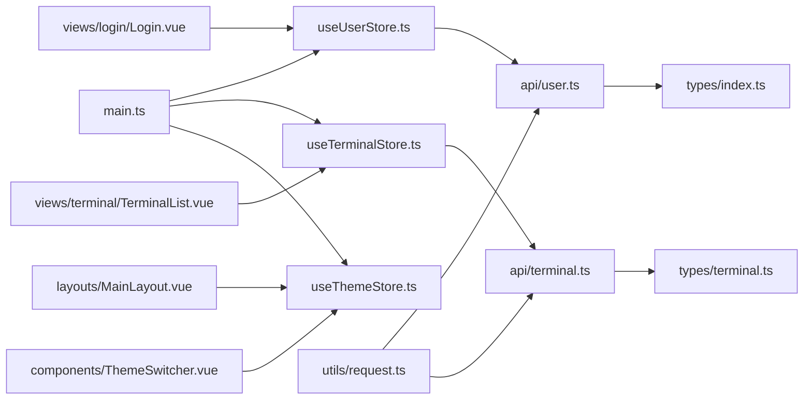

# 状态管理

<cite>
**本文档引用的文件**
- [main.ts](file://src/main.ts)
- [useUserStore.ts](file://src/stores/useUserStore.ts)
- [useTerminalStore.ts](file://src/stores/useTerminalStore.ts)
- [useThemeStore.ts](file://src/stores/useThemeStore.ts)
- [user.ts](file://src/api/user.ts)
- [terminal.ts](file://src/api/terminal.ts)
- [request.ts](file://src/utils/request.ts)
- [index.ts](file://src/types/index.ts)
- [terminal.ts](file://src/types/terminal.ts)
- [ThemeSwitcher.vue](file://src/components/ThemeSwitcher.vue)
- [MainLayout.vue](file://src/layouts/MainLayout.vue)
- [Login.vue](file://src/views/login/Login.vue)
- [TerminalList.vue](file://src/views/terminal/TerminalList.vue)
</cite>

## 目录
1. [简介](#简介)
2. [项目结构](#项目结构)
3. [核心组件](#核心组件)
4. [架构总览](#架构总览)
5. [详细组件分析](#详细组件分析)
6. [依赖关系分析](#依赖关系分析)
7. [性能考量](#性能考量)
8. [故障排查指南](#故障排查指南)
9. [结论](#结论)
10. [附录](#附录)

## 简介
本文件面向“水文监测管理系统”的前端状态管理，系统采用 Pinia 作为状态管理库，围绕三类核心 Store 展开：用户状态管理、终端设备状态管理、主题状态管理。文档将深入解释 Store 的设计模式、数据流、持久化策略、响应式更新机制、跨组件通信方式，并提供最佳实践、性能优化与调试技巧，覆盖初始化、更新与清理流程，以及与 API 层的交互、异步处理与错误状态管理。

## 项目结构
状态管理相关的核心文件组织如下：
- 应用入口注册 Pinia：在应用启动时挂载 Pinia 插件，使各 Store 可用
- Store 定义：用户、终端、主题三个 Store，分别封装各自的状态、计算属性与动作
- API 层：统一通过请求工具发起 HTTP 请求，响应拦截器统一处理业务状态与 Token
- 类型定义：用户、终端、主题等类型与枚举，保证 Store 与 API 的数据契约一致
- 视图与组件：在页面与组件中使用 Store，完成数据驱动与交互

**图表来源**
- [main.ts:19](file://src/main.ts#L19)
- [useUserStore.ts:18](file://src/stores/useUserStore.ts#L18)
- [useTerminalStore.ts:23](file://src/stores/useTerminalStore.ts#L23)
- [useThemeStore.ts:34](file://src/stores/useThemeStore.ts#L34)
- [user.ts:106](file://src/api/user.ts#L106)
- [terminal.ts:16](file://src/api/terminal.ts#L16)
- [request.ts:53](file://src/utils/request.ts#L53)
- [index.ts:36](file://src/types/index.ts#L36)
- [MainLayout.vue:122](file://src/layouts/MainLayout.vue#L122)
- [ThemeSwitcher.vue:39](file://src/components/ThemeSwitcher.vue#L39)
- [Login.vue:85](file://src/views/login/Login.vue#L85)
- [TerminalList.vue:598](file://src/views/terminal/TerminalList.vue#L598)

**章节来源**
- [main.ts:19](file://src/main.ts#L19)
- [useUserStore.ts:18](file://src/stores/useUserStore.ts#L18)
- [useTerminalStore.ts:23](file://src/stores/useTerminalStore.ts#L23)
- [useThemeStore.ts:34](file://src/stores/useThemeStore.ts#L34)
- [user.ts:106](file://src/api/user.ts#L106)
- [terminal.ts:16](file://src/api/terminal.ts#L16)
- [request.ts:53](file://src/utils/request.ts#L53)
- [index.ts:36](file://src/types/index.ts#L36)
- [MainLayout.vue:122](file://src/layouts/MainLayout.vue#L122)
- [ThemeSwitcher.vue:39](file://src/components/ThemeSwitcher.vue#L39)
- [Login.vue:85](file://src/views/login/Login.vue#L85)
- [TerminalList.vue:598](file://src/views/terminal/TerminalList.vue#L598)

## 核心组件
本系统围绕三大 Store 构建状态管理：
- 用户状态管理（useUserStore）
  - 管理 Token、用户信息、登录/登出、从 Token 解析用户名、默认用户信息与初始化恢复
  - 与 API 层的登录与按用户名查询用户信息对接
- 终端设备状态管理（useTerminalStore）
  - 管理分页数据、查询参数、加载状态、当前选中终端详情、对话框状态与表单数据
  - 提供终端列表、详情、创建、更新、删除等动作，统一处理加载态与错误提示
- 主题状态管理（useThemeStore）
  - 管理当前主题风格与主题配置映射，支持初始化与切换主题
  - 与布局组件联动，实现侧边栏背景、文字与高亮色的动态切换

上述 Store 通过 Pinia 的响应式机制与 Vue 的组合式 API 协作，形成清晰的数据流与职责边界。

**章节来源**
- [useUserStore.ts:18](file://src/stores/useUserStore.ts#L18)
- [useTerminalStore.ts:23](file://src/stores/useTerminalStore.ts#L23)
- [useThemeStore.ts:34](file://src/stores/useThemeStore.ts#L34)

## 架构总览
Pinia 在应用启动时被注册，随后各 Store 通过 defineStore 定义状态、计算属性与动作。API 层通过统一的请求工具发起 HTTP 请求，响应拦截器负责业务状态判断与 Token 处理，简化 Store 的异步逻辑。视图与组件通过组合式 API 使用 Store，实现跨组件通信与状态驱动的 UI 更新。

**图表来源**
- [Login.vue:124](file://src/views/login/Login.vue#L124)
- [useUserStore.ts:61](file://src/stores/useUserStore.ts#L61)
- [useTerminalStore.ts:119](file://src/stores/useTerminalStore.ts#L119)
- [user.ts:106](file://src/api/user.ts#L106)
- [terminal.ts:16](file://src/api/terminal.ts#L16)
- [request.ts:78](file://src/utils/request.ts#L78)
- [request.ts:96](file://src/utils/request.ts#L96)

## 详细组件分析

### 用户状态管理（useUserStore）
- 状态与计算属性
  - token：来自本地存储，用于鉴权
  - userInfo：用户信息，包含 id、用户名、真实姓名、邮箱、电话、角色、状态等
  - 计算属性：isLoggedIn、userRole、userName、isAdmin
- 动作
  - setToken：设置并持久化 token
  - setUserInfo：设置用户信息并缓存到 sessionStorage
  - login：调用登录 API，校验响应并设置 token，随后获取用户信息
  - logout：清空 token 与用户信息，移除本地缓存
  - fetchUserInfo：从 token 解析用户名，调用按用户名查询接口，失败时回退默认用户信息
  - initUserInfo：应用挂载时从 sessionStorage 恢复用户信息
- 持久化策略
  - token：localStorage
  - 用户信息：sessionStorage（刷新后恢复）
- 错误处理
  - 登录失败与获取用户信息失败均进行错误提示与兜底处理

**图表来源**
- [useUserStore.ts:61](file://src/stores/useUserStore.ts#L61)
- [useUserStore.ts:100](file://src/stores/useUserStore.ts#L100)
- [useUserStore.ts:132](file://src/stores/useUserStore.ts#L132)
- [useUserStore.ts:155](file://src/stores/useUserStore.ts#L155)

**章节来源**
- [useUserStore.ts:18](file://src/stores/useUserStore.ts#L18)
- [useUserStore.ts:61](file://src/stores/useUserStore.ts#L61)
- [useUserStore.ts:100](file://src/stores/useUserStore.ts#L100)
- [useUserStore.ts:132](file://src/stores/useUserStore.ts#L132)
- [useUserStore.ts:155](file://src/stores/useUserStore.ts#L155)
- [user.ts:106](file://src/api/user.ts#L106)
- [user.ts:126](file://src/api/user.ts#L126)

### 终端设备状态管理（useTerminalStore）
- 状态
  - pageData：分页结果（current、size、total、pages、records）
  - queryParams：查询参数（名称、编码、在线状态、pageNum、pageSize）
  - loading：加载状态
  - currentTerminal：当前选中终端详情
  - dialogVisible：创建/编辑/详情对话框可见性
  - formData：表单数据（终端名称、编码、经纬度、安装位置、连接密码等）
- 动作
  - 列表查询：fetchTerminalList，合并查询参数并更新分页数据
  - 详情查询：fetchTerminalDetail，设置当前终端并打开详情抽屉
  - 新增/修改/删除：createTerminal/updateTerminal/deleteTerminal，统一处理加载态、消息提示与列表刷新
  - 对话框控制：openCreateDialog/openEditDialog/closeDialog/resetForm
  - 查询参数变更：setQueryParams/resetQueryParams/handlePageChange/handleSizeChange
- 数据流
  - Store 内部维护状态，动作内调用 API 并更新状态，视图通过响应式绑定自动更新

**图表来源**
- [useTerminalStore.ts:232](file://src/stores/useTerminalStore.ts#L232)
- [useTerminalStore.ts:72](file://src/stores/useTerminalStore.ts#L72)
- [terminal.ts:16](file://src/api/terminal.ts#L16)
- [request.ts:155](file://src/utils/request.ts#L155)

**章节来源**
- [useTerminalStore.ts:23](file://src/stores/useTerminalStore.ts#L23)
- [useTerminalStore.ts:72](file://src/stores/useTerminalStore.ts#L72)
- [useTerminalStore.ts:119](file://src/stores/useTerminalStore.ts#L119)
- [useTerminalStore.ts:232](file://src/stores/useTerminalStore.ts#L232)
- [terminal.ts:16](file://src/api/terminal.ts#L16)
- [terminal.ts:36](file://src/api/terminal.ts#L36)

### 主题状态管理（useThemeStore）
- 状态与计算属性
  - currentTheme：当前主题风格（枚举）
  - themeConfig：基于当前主题的配置映射（侧边栏背景色、文字色、高亮色）
- 动作
  - initTheme：从 localStorage 恢复主题
  - setTheme：切换并持久化主题
  - toggleTheme：循环切换下一个主题
- 与布局联动
  - 布局组件订阅 themeConfig，动态设置侧边栏与菜单样式
  - 主题切换组件通过 action 切换主题

**图表来源**
- [useThemeStore.ts:34](file://src/stores/useThemeStore.ts#L34)
- [index.ts:36](file://src/types/index.ts#L36)
- [index.ts:44](file://src/types/index.ts#L44)

**章节来源**
- [useThemeStore.ts:34](file://src/stores/useThemeStore.ts#L34)
- [index.ts:36](file://src/types/index.ts#L36)
- [index.ts:44](file://src/types/index.ts#L44)
- [MainLayout.vue:7](file://src/layouts/MainLayout.vue#L7)
- [ThemeSwitcher.vue:80](file://src/components/ThemeSwitcher.vue#L80)

### API 层与请求拦截器
- 请求工具
  - 统一封装 get/post/put/del，基于 Axios 实例
  - 响应转换器：预处理大整数避免精度丢失，统一返回业务 data
- 请求拦截器
  - 自动注入 Authorization: Bearer token
- 响应拦截器
  - 根据业务 code 判断成功/失败，失败时统一提示
  - code=401 时触发用户登出并跳转登录页
- 类型支撑
  - 用户与终端的请求/响应 DTO、分页结果、枚举等类型定义

**图表来源**
- [request.ts:78](file://src/utils/request.ts#L78)
- [request.ts:96](file://src/utils/request.ts#L96)
- [request.ts:155](file://src/utils/request.ts#L155)
- [user.ts:106](file://src/api/user.ts#L106)
- [terminal.ts:16](file://src/api/terminal.ts#L16)

**章节来源**
- [request.ts:53](file://src/utils/request.ts#L53)
- [request.ts:78](file://src/utils/request.ts#L78)
- [request.ts:96](file://src/utils/request.ts#L96)
- [user.ts:106](file://src/api/user.ts#L106)
- [terminal.ts:16](file://src/api/terminal.ts#L16)

## 依赖关系分析
- 入口依赖
  - main.ts 注册 Pinia，使所有 Store 可用
- Store 间耦合
  - Store 之间低耦合：用户 Store 与终端 Store 通过 API 间接关联；主题 Store 与布局组件强耦合但与业务 Store 无直接依赖
- 组件与 Store
  - 布局组件订阅主题 Store；登录视图使用用户 Store；终端列表视图使用终端 Store
- 类型与 API
  - Store 与 API 严格遵循类型定义，减少运行时错误

**图表来源**
- [main.ts:19](file://src/main.ts#L19)
- [useUserStore.ts:18](file://src/stores/useUserStore.ts#L18)
- [useTerminalStore.ts:23](file://src/stores/useTerminalStore.ts#L23)
- [useThemeStore.ts:34](file://src/stores/useThemeStore.ts#L34)
- [user.ts:106](file://src/api/user.ts#L106)
- [terminal.ts:16](file://src/api/terminal.ts#L16)
- [request.ts:53](file://src/utils/request.ts#L53)
- [index.ts:36](file://src/types/index.ts#L36)
- [terminal.ts](file://src/types/terminal.ts#L1)
- [MainLayout.vue:122](file://src/layouts/MainLayout.vue#L122)
- [ThemeSwitcher.vue:39](file://src/components/ThemeSwitcher.vue#L39)
- [Login.vue:85](file://src/views/login/Login.vue#L85)
- [TerminalList.vue:598](file://src/views/terminal/TerminalList.vue#L598)

**章节来源**
- [main.ts:19](file://src/main.ts#L19)
- [useUserStore.ts:18](file://src/stores/useUserStore.ts#L18)
- [useTerminalStore.ts:23](file://src/stores/useTerminalStore.ts#L23)
- [useThemeStore.ts:34](file://src/stores/useThemeStore.ts#L34)
- [user.ts:106](file://src/api/user.ts#L106)
- [terminal.ts:16](file://src/api/terminal.ts#L16)
- [request.ts:53](file://src/utils/request.ts#L53)
- [index.ts:36](file://src/types/index.ts#L36)
- [terminal.ts](file://src/types/terminal.ts#L1)
- [MainLayout.vue:122](file://src/layouts/MainLayout.vue#L122)
- [ThemeSwitcher.vue:39](file://src/components/ThemeSwitcher.vue#L39)
- [Login.vue:85](file://src/views/login/Login.vue#L85)
- [TerminalList.vue:598](file://src/views/terminal/TerminalList.vue#L598)

## 性能考量
- 响应式粒度
  - 将大型列表与分页数据放入 reactive 对象，避免频繁拆分导致的多次渲染
  - 对于轻量状态（如对话框开关）使用 ref，降低不必要的响应式开销
- 异步加载优化
  - 在动作中统一设置 loading，避免重复请求叠加
  - 列表查询时重置页码，减少无效缓存
- 持久化策略
  - 用户 token 使用 localStorage，用户信息使用 sessionStorage，避免不必要的同步写入
- 渲染优化
  - 使用 keep-alive 缓存页面组件，减少重复渲染
  - 布局组件订阅主题配置，避免在每个子组件中重复计算

[本节为通用指导，无需列出具体文件来源]

## 故障排查指南
- 登录失败
  - 检查登录 API 返回的 token 是否存在，确认响应拦截器是否正确返回业务数据
  - 若获取用户信息失败，确认用户名解析逻辑与后端字段一致
- 401 未授权
  - 响应拦截器会自动触发登出并跳转登录页，检查业务 code 与提示信息
- 列表加载异常
  - 确认查询参数合并与页码重置逻辑，检查 API 返回的分页数据结构
- 主题切换无效
  - 确认主题切换组件调用 setTheme，localStorage 是否写入成功，布局组件是否订阅 themeConfig

**章节来源**
- [useUserStore.ts:61](file://src/stores/useUserStore.ts#L61)
- [useUserStore.ts:100](file://src/stores/useUserStore.ts#L100)
- [request.ts:96](file://src/utils/request.ts#L96)
- [request.ts:117](file://src/utils/request.ts#L117)
- [useTerminalStore.ts:72](file://src/stores/useTerminalStore.ts#L72)
- [useThemeStore.ts:53](file://src/stores/useThemeStore.ts#L53)
- [MainLayout.vue:7](file://src/layouts/MainLayout.vue#L7)

## 结论
本系统通过 Pinia 将用户、终端与主题三类状态进行模块化管理，结合统一的请求工具与类型定义，实现了清晰的数据流与良好的可维护性。用户状态强调鉴权与信息恢复，终端状态聚焦分页与 CRUD 流程，主题状态提供灵活的外观定制。配合响应式更新与跨组件通信机制，满足水文监测管理系统的复杂业务场景。

[本节为总结性内容，无需列出具体文件来源]

## 附录
- 初始化流程
  - 应用启动时注册 Pinia
  - 布局组件挂载时恢复用户信息与主题
- 更新流程
  - 用户：登录成功后设置 token 与用户信息，后续请求自动携带 Authorization
  - 终端：查询参数变更触发列表刷新，动作完成后统一关闭对话框与重置表单
  - 主题：切换主题后持久化并立即生效
- 清理流程
  - 登出时清除 token 与用户信息，移除本地缓存
  - 关闭对话框时重置表单，避免脏数据影响下次使用

**章节来源**
- [main.ts:19](file://src/main.ts#L19)
- [MainLayout.vue:207](file://src/layouts/MainLayout.vue#L207)
- [useUserStore.ts:88](file://src/stores/useUserStore.ts#L88)
- [useTerminalStore.ts:221](file://src/stores/useTerminalStore.ts#L221)
- [useThemeStore.ts:53](file://src/stores/useThemeStore.ts#L53)