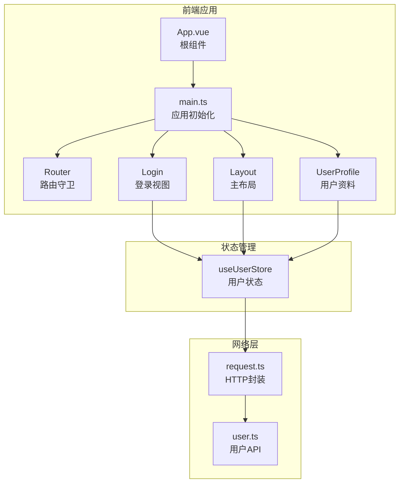
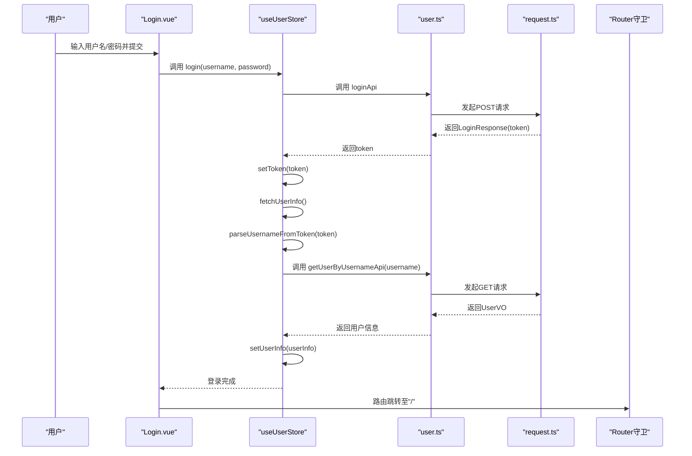
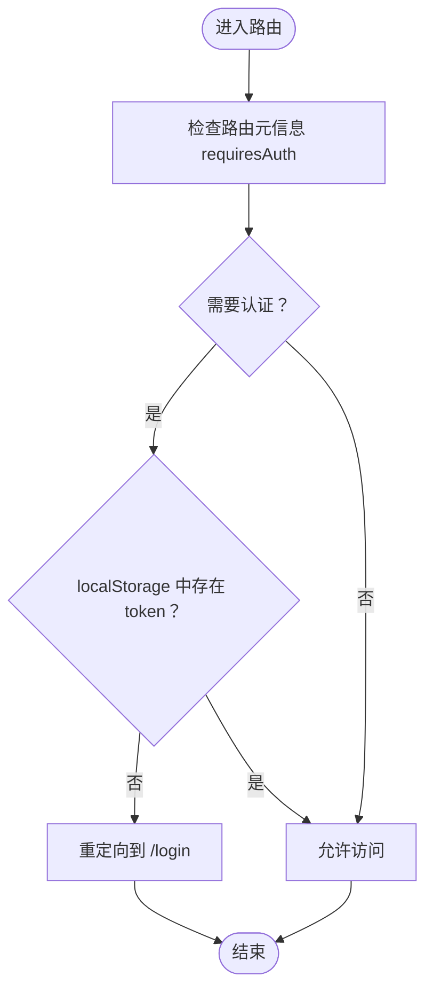
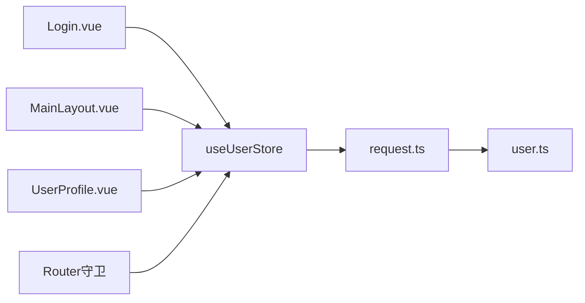

# 用户状态管理

<cite>
**本文档引用的文件**
- [useUserStore.ts](file://src/stores/useUserStore.ts)
- [user.ts](file://src/api/user.ts)
- [Login.vue](file://src/views/login/Login.vue)
- [request.ts](file://src/utils/request.ts)
- [index.ts](file://src/router/index.ts)
- [MainLayout.vue](file://src/layouts/MainLayout.vue)
- [UserProfile.vue](file://src/views/user/UserProfile.vue)
- [main.ts](file://src/main.ts)
- [index.ts](file://src/types/index.ts)
</cite>

## 目录
1. [简介](#简介)
2. [项目结构](#项目结构)
3. [核心组件](#核心组件)
4. [架构总览](#架构总览)
5. [详细组件分析](#详细组件分析)
6. [依赖关系分析](#依赖关系分析)
7. [性能考虑](#性能考虑)
8. [故障排除指南](#故障排除指南)
9. [结论](#结论)
10. [附录](#附录)

## 简介
本文件面向水文监测管理系统中的用户状态管理，深入解析 useUserStore 的实现原理，涵盖：
- 用户认证状态管理与 Token 处理机制
- 用户信息缓存策略与会话持久化
- 登录流程、登出处理、JWT Token 解析与用户信息获取
- 用户角色权限判断、状态恢复机制
- 响应式更新、computed 属性使用与 Actions 实现模式
- 错误处理策略、默认用户信息设置与调试技巧
- 最佳实践与扩展方案

## 项目结构
用户状态管理涉及的核心文件分布如下：
- 状态管理：src/stores/useUserStore.ts
- API 定义：src/api/user.ts
- 登录视图：src/views/login/Login.vue
- 请求封装：src/utils/request.ts
- 路由守卫：src/router/index.ts
- 主布局：src/layouts/MainLayout.vue
- 用户资料：src/views/user/UserProfile.vue
- 应用入口：src/main.ts
- 类型定义：src/types/index.ts

图表来源
- [main.ts:1-26](file://src/main.ts#L1-L26)
- [index.ts:116-129](file://src/router/index.ts#L116-L129)
- [useUserStore.ts:18-199](file://src/stores/useUserStore.ts#L18-L199)
- [request.ts:154-179](file://src/utils/request.ts#L154-L179)
- [user.ts:106-128](file://src/api/user.ts#L106-L128)

章节来源
- [main.ts:1-26](file://src/main.ts#L1-L26)
- [index.ts:1-136](file://src/router/index.ts#L1-L136)

## 核心组件
useUserStore 是基于 Pinia 的组合式 Store，负责：
- 状态：token、userInfo
- 计算属性：isLoggedIn、userRole、userName、isAdmin
- 动作：setToken、setUserInfo、login、logout、fetchUserInfo、parseUsernameFromToken、setDefaultUserInfo、initUserInfo

关键特性：
- Token 持久化：localStorage 存储 token；同时在 sessionStorage 缓存 userInfo，实现刷新后恢复
- JWT 解析：从 token payload 中提取用户名字段（支持 sub、username、preferred_username）
- 用户信息获取：通过用户名查询接口获取用户详细信息
- 默认用户信息：当解析失败或获取失败时，回退到默认管理员信息
- 错误处理：统一错误提示与降级策略

章节来源
- [useUserStore.ts:18-199](file://src/stores/useUserStore.ts#L18-L199)

## 架构总览
用户状态管理的整体交互流程如下：

图表来源
- [Login.vue:117-134](file://src/views/login/Login.vue#L117-L134)
- [useUserStore.ts:61-83](file://src/stores/useUserStore.ts#L61-L83)
- [useUserStore.ts:100-125](file://src/stores/useUserStore.ts#L100-L125)
- [user.ts:106-128](file://src/api/user.ts#L106-L128)
- [request.ts:154-179](file://src/utils/request.ts#L154-L179)
- [index.ts:116-129](file://src/router/index.ts#L116-L129)

## 详细组件分析

### useUserStore 实现详解
- 状态与计算属性
  - token：来自 localStorage 的 JWT Token
  - userInfo：本地缓存的用户信息（不含敏感字段）
  - 计算属性：isLoggedIn、userRole、userName、isAdmin

- 动作（Actions）实现模式
  - setToken/newToken：更新 token 并持久化到 localStorage
  - setUserInfo：标准化用户信息并缓存到 sessionStorage
  - login：调用登录 API，设置 token，并获取用户信息
  - logout：清空 token 与 userInfo，移除本地存储
  - fetchUserInfo：从 token 解析用户名，调用用户查询接口，失败时回退默认信息
  - parseUsernameFromToken：解析 JWT payload 中的用户名字段
  - setDefaultUserInfo：设置默认管理员信息
  - initUserInfo：从 sessionStorage 恢复用户信息

- 错误处理与降级
  - 登录失败：显示错误消息并拒绝 Promise
  - 获取用户信息失败：记录错误并设置默认信息，保证功能可用
  - Token 解析失败：记录错误并设置默认信息

- 会话持久化与状态恢复
  - localStorage：存储 token，实现跨会话持久化
  - sessionStorage：存储 userInfo，实现页面刷新后恢复
  - initUserInfo：应用挂载时从 sessionStorage 恢复用户信息

章节来源
- [useUserStore.ts:18-199](file://src/stores/useUserStore.ts#L18-L199)

### 登录流程与路由守卫
- 登录视图 Login.vue
  - 表单校验与加载状态控制
  - 调用 useUserStore.login 执行登录
  - 成功后提示并跳转首页

- 路由守卫
  - requiresAuth 元信息控制访问权限
  - 未登录访问受保护路由时重定向到登录页
  - 已登录访问登录页时重定向到首页

图表来源
- [index.ts:116-129](file://src/router/index.ts#L116-L129)

章节来源
- [Login.vue:117-134](file://src/views/login/Login.vue#L117-L134)
- [index.ts:116-129](file://src/router/index.ts#L116-L129)

### JWT Token 解析与用户信息获取
- Token 解析
  - 将 token 按点分割为 header.payload.signature
  - 对 payload 部分进行 base64 解码
  - 支持多种用户名字段：sub、username、preferred_username

- 用户信息获取
  - 通过用户名查询接口获取用户详细信息（UserVO）
  - 将返回的用户信息标准化后缓存到 sessionStorage

- 默认用户信息
  - 当解析失败或获取失败时，设置默认管理员信息
  - 便于开发调试与降级场景

章节来源
- [useUserStore.ts:132-150](file://src/stores/useUserStore.ts#L132-L150)
- [useUserStore.ts:100-125](file://src/stores/useUserStore.ts#L100-L125)
- [useUserStore.ts:155-167](file://src/stores/useUserStore.ts#L155-L167)
- [user.ts:126-128](file://src/api/user.ts#L126-L128)

### 权限判断与角色管理
- 角色枚举与状态枚举
  - Role：admin、user、guest
  - UserStatus：ACTIVE、INACTIVE、DISABLED

- 权限判断
  - isAdmin：基于 userInfo.role === 'admin'
  - userRole：直接暴露 userInfo.role
  - 在布局与视图中通过 computed 属性动态渲染权限相关内容

章节来源
- [index.ts:22-34](file://src/types/index.ts#L22-L34)
- [useUserStore.ts:24-27](file://src/stores/useUserStore.ts#L24-L27)
- [MainLayout.vue:86-101](file://src/layouts/MainLayout.vue#L86-L101)

### 响应式更新与 Actions 模式
- 响应式更新
  - token 与 userInfo 作为 ref，触发依赖组件的自动更新
  - computed 属性 userName、userRole、isAdmin 基于 userInfo 动态计算

- Actions 模式
  - login：异步动作，包含错误处理与状态更新
  - logout：同步动作，清理本地存储与状态
  - fetchUserInfo：异步动作，包含降级逻辑

- 在布局中的使用
  - MainLayout.vue 通过 computed 动态显示用户名、头像颜色与权限菜单

章节来源
- [useUserStore.ts:24-27](file://src/stores/useUserStore.ts#L24-L27)
- [MainLayout.vue:86-162](file://src/layouts/MainLayout.vue#L86-L162)

### 登出处理与会话清理
- 登出动作
  - 清空 token 与 userInfo
  - 移除 localStorage 中的 token
  - 移除 sessionStorage 中的 userInfo
  - 显示成功消息

- 路由跳转
  - 登出后跳转到登录页

- 修改密码后的登出
  - UserProfile.vue 中修改密码成功后延迟登出并跳转登录页

章节来源
- [useUserStore.ts:88-94](file://src/stores/useUserStore.ts#L88-L94)
- [MainLayout.vue:191-204](file://src/layouts/MainLayout.vue#L191-L204)
- [UserProfile.vue:298-303](file://src/views/user/UserProfile.vue#L298-L303)

## 依赖关系分析
- 组件耦合
  - Login.vue 依赖 useUserStore 执行登录
  - MainLayout.vue 依赖 useUserStore 渲染用户信息与权限菜单
  - UserProfile.vue 依赖 useUserStore 获取用户信息并处理登出
  - 路由守卫依赖 localStorage 判断登录状态

- 外部依赖
  - request.ts 提供统一的 HTTP 封装与拦截器
  - user.ts 定义用户相关的 API 接口
  - Element Plus 提供消息提示与 UI 组件

图表来源
- [Login.vue:85-88](file://src/views/login/Login.vue#L85-L88)
- [MainLayout.vue:122-129](file://src/layouts/MainLayout.vue#L122-L129)
- [UserProfile.vue:298-303](file://src/views/user/UserProfile.vue#L298-L303)
- [useUserStore.ts:18-199](file://src/stores/useUserStore.ts#L18-L199)
- [request.ts:154-179](file://src/utils/request.ts#L154-L179)
- [user.ts:106-128](file://src/api/user.ts#L106-L128)

章节来源
- [Login.vue:85-88](file://src/views/login/Login.vue#L85-L88)
- [MainLayout.vue:122-129](file://src/layouts/MainLayout.vue#L122-L129)
- [UserProfile.vue:298-303](file://src/views/user/UserProfile.vue#L298-L303)
- [useUserStore.ts:18-199](file://src/stores/useUserStore.ts#L18-L199)
- [request.ts:154-179](file://src/utils/request.ts#L154-L179)
- [user.ts:106-128](file://src/api/user.ts#L106-L128)

## 性能考虑
- Token 与用户信息的本地存储策略
  - localStorage 存储 token，减少每次请求的重复登录
  - sessionStorage 缓存 userInfo，避免刷新后重复请求用户信息

- 大整数处理
  - request.ts 的响应转换器对超过安全范围的整数进行字符串化处理，避免精度丢失

- 计算属性优化
  - computed 属性按需计算，避免不必要的重渲染

- 错误降级
  - 获取用户信息失败时使用默认信息，保证界面可用性

章节来源
- [useUserStore.ts:20-21](file://src/stores/useUserStore.ts#L20-L21)
- [useUserStore.ts:51-52](file://src/stores/useUserStore.ts#L51-L52)
- [request.ts:22-50](file://src/utils/request.ts#L22-L50)
- [useUserStore.ts:119-124](file://src/stores/useUserStore.ts#L119-L124)

## 故障排除指南
- 登录失败
  - 检查用户名/密码是否正确
  - 查看控制台错误信息与 Element Plus 消息提示
  - 确认后端接口返回的 token 字段是否存在

- Token 解析失败
  - 确认 token 格式是否为标准 JWT（三段式）
  - 检查 payload 是否包含支持的用户名字段（sub、username、preferred_username）

- 用户信息获取失败
  - 确认 token 是否有效且未过期
  - 检查 getUserByUsernameApi 接口是否正常
  - 查看控制台错误日志

- 页面刷新后用户信息丢失
  - 检查 sessionStorage 中是否存在 userInfo 缓存
  - 确认 useUserStore.initUserInfo 是否在应用挂载时被调用

- 权限判断异常
  - 检查 userInfo.role 是否正确设置
  - 确认 isAdmin 计算属性的判断逻辑

- 默认用户信息不生效
  - 检查 setDefaultUserInfo 的调用时机
  - 确认默认信息字段是否完整

章节来源
- [useUserStore.ts:77-82](file://src/stores/useUserStore.ts#L77-L82)
- [useUserStore.ts:132-150](file://src/stores/useUserStore.ts#L132-L150)
- [useUserStore.ts:100-125](file://src/stores/useUserStore.ts#L100-L125)
- [useUserStore.ts:172-182](file://src/stores/useUserStore.ts#L172-L182)
- [useUserStore.ts:155-167](file://src/stores/useUserStore.ts#L155-L167)

## 结论
useUserStore 通过 Pinia 的响应式状态管理，结合 localStorage 与 sessionStorage 的双层缓存策略，实现了可靠的用户认证与会话管理。其 JWT Token 解析、用户信息获取与默认信息降级机制，确保了在异常场景下的用户体验。配合路由守卫与布局组件的权限渲染，形成了完整的用户状态管理体系。建议在后续迭代中进一步增强 Token 刷新与过期检测、完善权限路由配置以及增加更细粒度的错误处理与监控埋点。

## 附录
- 最佳实践
  - 在应用入口统一初始化用户状态（如 MainLayout.vue 中的 initUserInfo）
  - 在路由守卫中严格控制访问权限
  - 使用 computed 属性集中处理权限判断与显示逻辑
  - 在 Actions 中统一处理错误与降级策略
  - 对大整数字段进行字符串化处理，避免精度丢失

- 扩展方案
  - Token 刷新：在 request.ts 中增加 Token 刷新拦截器
  - 权限细化：引入更细粒度的权限模型与菜单动态渲染
  - 安全加固：增加 CSRF 防护与更严格的输入校验
  - 监控埋点：在登录、登出、权限变更等关键事件中添加埋点