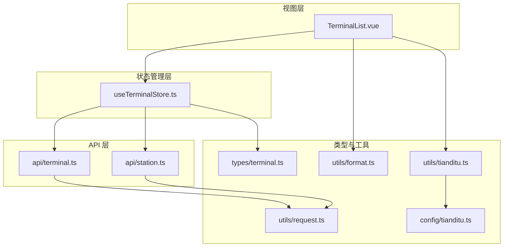
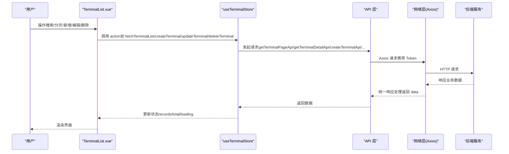
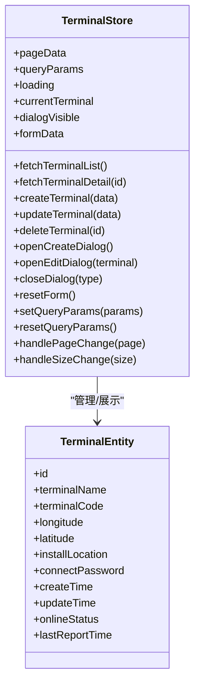
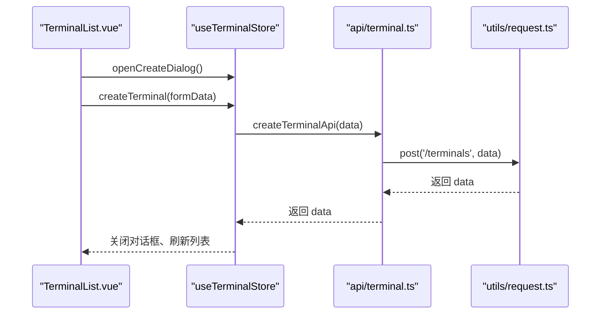
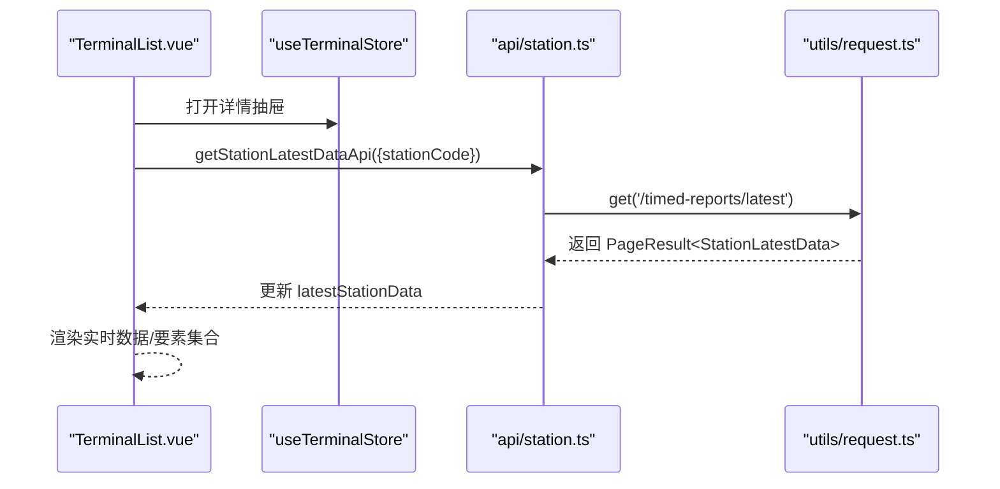
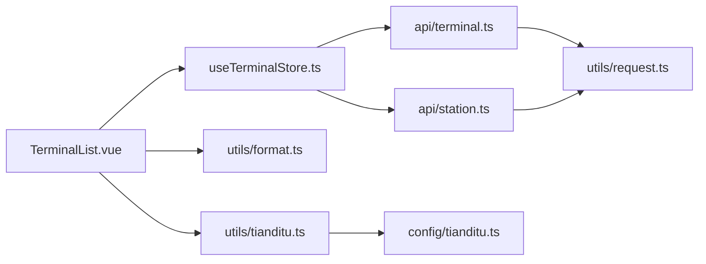

# 终端状态管理

<cite>
**本文档引用的文件**
- [useTerminalStore.ts](file://src/stores/useTerminalStore.ts)
- [terminal.ts](file://src/types/terminal.ts)
- [terminal.ts](file://src/api/terminal.ts)
- [TerminalList.vue](file://src/views/terminal/TerminalList.vue)
- [request.ts](file://src/utils/request.ts)
- [station.ts](file://src/api/station.ts)
- [format.ts](file://src/utils/format.ts)
- [tianditu.ts](file://src/utils/tianditu.ts)
- [tianditu.ts](file://src/config/tianditu.ts)
</cite>

## 目录
1. [简介](#简介)
2. [项目结构](#项目结构)
3. [核心组件](#核心组件)
4. [架构总览](#架构总览)
5. [详细组件分析](#详细组件分析)
6. [依赖关系分析](#依赖关系分析)
7. [性能考虑](#性能考虑)
8. [故障排除指南](#故障排除指南)
9. [结论](#结论)
10. [附录](#附录)

## 简介
本文件面向水文监测管理系统中的“终端状态管理”模块，系统性阐述 useTerminalStore 的实现原理与使用方法。重点覆盖：
- 终端设备的 CRUD 操作（增删改查）
- 设备列表管理与分页
- 设备状态监控与实时数据处理
- 响应式状态、过滤与排序机制
- 缓存策略、批量操作与异步加载
- 同步机制、错误处理与性能优化
- 开发者使用指南与扩展建议

## 项目结构
终端状态管理涉及以下关键文件与职责划分：
- 状态管理：useTerminalStore.ts（Pinia Store）
- 类型定义：terminal.ts（终端实体、查询与分页类型）
- API 层：terminal.ts（终端 CRUD）、station.ts（遥测站实时/历史数据）
- 视图层：TerminalList.vue（终端列表、详情、对话框、图表）
- 网络层：request.ts（Axios 封装、统一响应处理）
- 工具与配置：format.ts（格式化）、tianditu.ts/tianditu.ts（地图集成）

**图表来源**
- [useTerminalStore.ts:1-294](file://src/stores/useTerminalStore.ts#L1-L294)
- [terminal.ts:1-59](file://src/api/terminal.ts#L1-L59)
- [station.ts:1-115](file://src/api/station.ts#L1-L115)
- [terminal.ts:1-84](file://src/types/terminal.ts#L1-L84)
- [request.ts:1-180](file://src/utils/request.ts#L1-L180)
- [TerminalList.vue:1-1540](file://src/views/terminal/TerminalList.vue#L1-L1540)
- [format.ts:1-102](file://src/utils/format.ts#L1-L102)
- [tianditu.ts:1-68](file://src/utils/tianditu.ts#L1-L68)
- [tianditu.ts:1-28](file://src/config/tianditu.ts#L1-L28)

**章节来源**
- [useTerminalStore.ts:1-294](file://src/stores/useTerminalStore.ts#L1-L294)
- [terminal.ts:1-59](file://src/api/terminal.ts#L1-L59)
- [station.ts:1-115](file://src/api/station.ts#L1-L115)
- [terminal.ts:1-84](file://src/types/terminal.ts#L1-L84)
- [request.ts:1-180](file://src/utils/request.ts#L1-L180)
- [TerminalList.vue:1-1540](file://src/views/terminal/TerminalList.vue#L1-L1540)
- [format.ts:1-102](file://src/utils/format.ts#L1-L102)
- [tianditu.ts:1-68](file://src/utils/tianditu.ts#L1-L68)
- [tianditu.ts:1-28](file://src/config/tianditu.ts#L1-L28)

## 核心组件
- useTerminalStore：集中管理终端列表、查询参数、加载状态、当前详情、对话框状态与表单数据；提供 CRUD 与分页操作。
- TerminalList.vue：负责用户交互（搜索、分页、对话框、抽屉详情），并调用 store 的方法与 API。
- API 层：封装终端与遥测站数据的网络请求。
- 类型系统：严格定义终端实体、查询参数、分页结果与在线状态枚举。
- 网络层：统一处理响应、Token 注入、错误提示与大整数安全处理。

**章节来源**
- [useTerminalStore.ts:23-293](file://src/stores/useTerminalStore.ts#L23-L293)
- [TerminalList.vue:1-1540](file://src/views/terminal/TerminalList.vue#L1-L1540)
- [terminal.ts:1-59](file://src/api/terminal.ts#L1-L59)
- [station.ts:1-115](file://src/api/station.ts#L1-L115)
- [terminal.ts:1-84](file://src/types/terminal.ts#L1-L84)
- [request.ts:1-180](file://src/utils/request.ts#L1-L180)

## 架构总览
终端状态管理采用“视图-状态-API-网络”的分层架构：
- 视图层负责用户交互与数据展示
- 状态层负责数据状态与业务逻辑
- API 层负责与后端通信
- 网络层负责统一请求/响应处理

**图表来源**
- [TerminalList.vue:726-742](file://src/views/terminal/TerminalList.vue#L726-L742)
- [useTerminalStore.ts:72-180](file://src/stores/useTerminalStore.ts#L72-L180)
- [terminal.ts:16-58](file://src/api/terminal.ts#L16-L58)
- [request.ts:96-151](file://src/utils/request.ts#L96-L151)

## 详细组件分析

### useTerminalStore：终端状态管理核心
- 状态定义
  - 分页数据：current、size、total、pages、records
  - 查询参数：terminalName、terminalCode、onlineStatus、pageNum、pageSize
  - 加载状态：loading
  - 当前终端详情：currentTerminal
  - 对话框状态：dialogVisible（create/edit/detail）
  - 表单数据：formData（含经纬度、安装位置、连接密码等）
- 主要 Actions
  - 列表查询：fetchTerminalList（合并 queryParams，设置 pageData）
  - 详情查询：fetchTerminalDetail（设置 currentTerminal 并打开详情抽屉）
  - 新增：createTerminal（成功后关闭对话框、重置表单、刷新列表）
  - 修改：updateTerminal（成功后关闭对话框、重置表单、刷新列表）
  - 删除：deleteTerminal（成功后刷新列表）
  - 对话框控制：openCreateDialog、openEditDialog、closeDialog、resetForm
  - 查询参数控制：setQueryParams（重置页码并刷新）、resetQueryParams
  - 分页控制：handlePageChange、handleSizeChange
- 错误处理
  - try/catch 包裹异步请求
  - 控制台输出错误并弹出消息提示
  - finally 统一关闭 loading
- 响应式更新
  - 使用 ref/reactive 管理状态
  - 页面与表单双向绑定，自动响应变更

**图表来源**
- [useTerminalStore.ts:23-293](file://src/stores/useTerminalStore.ts#L23-L293)
- [terminal.ts:6-18](file://src/types/terminal.ts#L6-L18)

**章节来源**
- [useTerminalStore.ts:23-293](file://src/stores/useTerminalStore.ts#L23-L293)
- [terminal.ts:1-84](file://src/types/terminal.ts#L1-L84)

### 终端设备 CRUD 实现
- 新增终端
  - 触发 openCreateDialog，打开创建对话框
  - 表单校验通过后调用 createTerminal，内部调用 createTerminalApi
  - 成功后关闭对话框、重置表单、刷新列表
- 修改终端
  - 触发 openEditDialog，填充 formData
  - 表单校验通过后调用 updateTerminal，内部调用 updateTerminalApi
  - 成功后关闭对话框、重置表单、刷新列表
- 删除终端
  - 弹出确认框，确认后调用 deleteTerminal，内部调用 deleteTerminalApi
  - 成功后刷新列表
- 查询终端
  - 列表查询：setQueryParams 合并查询参数并触发 fetchTerminalList
  - 详情查询：fetchTerminalDetail 根据 ID 获取详情并打开抽屉

**图表来源**
- [TerminalList.vue:1097-1115](file://src/views/terminal/TerminalList.vue#L1097-L1115)
- [useTerminalStore.ts:119-136](file://src/stores/useTerminalStore.ts#L119-L136)
- [terminal.ts:36-38](file://src/api/terminal.ts#L36-L38)
- [request.ts:159-172](file://src/utils/request.ts#L159-L172)

**章节来源**
- [TerminalList.vue:1077-1137](file://src/views/terminal/TerminalList.vue#L1077-L1137)
- [useTerminalStore.ts:119-180](file://src/stores/useTerminalStore.ts#L119-L180)
- [terminal.ts:1-59](file://src/api/terminal.ts#L1-L59)

### 设备列表管理与分页
- 查询参数
  - 支持按终端名称、终端编码、在线状态过滤
  - pageNum/pageSize 控制分页
- 分页行为
  - handlePageChange：切换页码并刷新
  - handleSizeChange：切换每页数量并回到第一页
  - resetQueryParams：重置查询参数并刷新
- 列表渲染
  - v-loading 绑定 loading
  - :data 绑定 pageData.records
  - 在线状态通过 tag 展示（ONLINE/OFFLINE）

**章节来源**
- [useTerminalStore.ts:36-42](file://src/stores/useTerminalStore.ts#L36-L42)
- [useTerminalStore.ts:254-267](file://src/stores/useTerminalStore.ts#L254-L267)
- [TerminalList.vue:44-106](file://src/views/terminal/TerminalList.vue#L44-L106)

### 设备状态监控与实时数据处理
- 在线状态
  - TerminalEntity.onlineStatus：0 离线、1 在线
  - 列表与详情均展示在线状态标签
- 实时数据
  - TerminalList.vue 中的“实时数据”Tab
  - 通过 getStationLatestDataApi 获取最新遥测站数据
  - 支持要素集合展示与单位格式化
- 历史数据与图表
  - “要素分析”Tab 使用 ECharts 展示趋势图
  - 通过 getTimedReportPageApi 获取分页数据
  - 支持时间范围筛选与要素选择
- 原始报文
  - “原始报文”Tab 展示解析状态与查看原始报文

**图表来源**
- [TerminalList.vue:808-834](file://src/views/terminal/TerminalList.vue#L808-L834)
- [station.ts:74-80](file://src/api/station.ts#L74-L80)
- [request.ts:155-157](file://src/utils/request.ts#L155-L157)

**章节来源**
- [TerminalList.vue:359-505](file://src/views/terminal/TerminalList.vue#L359-L505)
- [station.ts:1-115](file://src/api/station.ts#L1-L115)

### 响应式更新、过滤与排序机制
- 响应式状态
  - 使用 ref/reactive 管理状态，自动驱动视图更新
- 过滤机制
  - 查询参数包含 terminalName、terminalCode、onlineStatus
  - setQueryParams 合并参数并重置到第一页
- 排序机制
  - 当前实现未显式提供排序字段
  - 如需排序，可在查询参数中扩展 orderBy/asc/desc 字段并在后端实现

**章节来源**
- [useTerminalStore.ts:36-42](file://src/stores/useTerminalStore.ts#L36-L42)
- [useTerminalStore.ts:232-236](file://src/stores/useTerminalStore.ts#L232-L236)

### 缓存策略、批量操作与异步加载
- 缓存策略
  - 当前未实现前端缓存
  - 可在 store 中增加缓存字段与失效策略（如基于查询参数的键）
- 批量操作
  - 当前未提供批量删除/导出等操作
  - 可扩展批量操作接口与状态管理
- 异步加载
  - loading 控制加载态
  - watch 监听抽屉与 Tab 切换，按需加载实时/历史/原始报文数据

**章节来源**
- [useTerminalStore.ts:45-48](file://src/stores/useTerminalStore.ts#L45-L48)
- [TerminalList.vue:1252-1282](file://src/views/terminal/TerminalList.vue#L1252-L1282)

### 同步机制、错误处理与性能优化
- 同步机制
  - 列表与详情通过 store 状态同步
  - 详情抽屉打开时根据 Tab 自动加载对应数据
- 错误处理
  - 网络层统一拦截错误并提示
  - store 中捕获异常并关闭 loading
- 性能优化
  - 使用 v-loading 控制局部加载
  - 图表仅在需要时初始化与 resize
  - 可引入防抖/节流优化频繁查询（如搜索框）

**章节来源**
- [request.ts:96-151](file://src/utils/request.ts#L96-L151)
- [useTerminalStore.ts:72-180](file://src/stores/useTerminalStore.ts#L72-L180)
- [TerminalList.vue:966-1062](file://src/views/terminal/TerminalList.vue#L966-L1062)

## 依赖关系分析
- 组件耦合
  - TerminalList.vue 依赖 useTerminalStore 与 API 层
  - useTerminalStore 依赖 API 层与类型定义
  - API 层依赖网络层 request.ts
- 外部依赖
  - Element Plus（UI 组件库）
  - Axios（HTTP 客户端）
  - ECharts（图表）
  - 天地图（地图集成）

**图表来源**
- [TerminalList.vue:1-1540](file://src/views/terminal/TerminalList.vue#L1-L1540)
- [useTerminalStore.ts:1-294](file://src/stores/useTerminalStore.ts#L1-L294)
- [terminal.ts:1-59](file://src/api/terminal.ts#L1-L59)
- [station.ts:1-115](file://src/api/station.ts#L1-L115)
- [request.ts:1-180](file://src/utils/request.ts#L1-L180)
- [format.ts:1-102](file://src/utils/format.ts#L1-L102)
- [tianditu.ts:1-68](file://src/utils/tianditu.ts#L1-L68)
- [tianditu.ts:1-28](file://src/config/tianditu.ts#L1-L28)

**章节来源**
- [TerminalList.vue:1-1540](file://src/views/terminal/TerminalList.vue#L1-L1540)
- [useTerminalStore.ts:1-294](file://src/stores/useTerminalStore.ts#L1-L294)
- [terminal.ts:1-59](file://src/api/terminal.ts#L1-L59)
- [station.ts:1-115](file://src/api/station.ts#L1-L115)
- [request.ts:1-180](file://src/utils/request.ts#L1-L180)

## 性能考虑
- 列表渲染
  - 使用 v-loading 与虚拟滚动（如需）减少重绘
- 图表性能
  - 图表仅在 Tab 切换时初始化，避免重复创建
  - resize 时延时处理，防止频繁重排
- 网络性能
  - 统一响应处理避免重复解析
  - 大整数安全处理避免精度丢失
- 交互体验
  - 表单校验前置，减少无效请求
  - 分页与搜索结合，降低一次性数据量

[本节为通用性能建议，无需特定文件来源]

## 故障排除指南
- 网络错误
  - 检查 baseURL 与 Token 注入
  - 查看响应拦截器中的错误提示
- 数据异常
  - 确认后端返回的数据结构与类型定义一致
  - 检查大整数处理逻辑
- 图表不显示
  - 确认容器尺寸与 resize 调用
  - 检查 ECharts 初始化时机
- 地图无法加载
  - 检查天地图 API Key 与网络连通性
  - 确认脚本加载完成再初始化地图

**章节来源**
- [request.ts:52-75](file://src/utils/request.ts#L52-L75)
- [request.ts:96-151](file://src/utils/request.ts#L96-L151)
- [TerminalList.vue:1190-1243](file://src/views/terminal/TerminalList.vue#L1190-L1243)
- [tianditu.ts:14-49](file://src/utils/tianditu.ts#L14-L49)

## 结论
useTerminalStore 提供了完整的终端设备 CRUD 与列表管理能力，配合 TerminalList.vue 的视图层，实现了从查询、编辑到详情与实时数据的全链路体验。通过统一的网络层与类型系统，保证了数据一致性与可维护性。后续可在缓存、批量操作、排序与图表性能等方面进一步优化。

[本节为总结性内容，无需特定文件来源]

## 附录

### 使用指南与最佳实践
- 在视图中通过 store 访问状态与方法
- 新增/编辑前进行表单校验
- 列表查询使用 setQueryParams 并重置页码
- 详情抽屉按需加载实时/历史/原始报文数据
- 错误处理统一通过 Element Plus 提示

**章节来源**
- [TerminalList.vue:726-742](file://src/views/terminal/TerminalList.vue#L726-L742)
- [useTerminalStore.ts:232-236](file://src/stores/useTerminalStore.ts#L232-L236)

### 扩展方案
- 缓存：为查询参数建立缓存键，命中则直接返回，未命中再请求
- 批量操作：新增批量删除/导出接口与状态管理
- 排序：在查询参数中加入排序字段，后端实现排序逻辑
- 图表：引入更丰富的图表类型与交互（如缩放、钻取）
- 地图：支持批量导入经纬度与区域绘制

[本节为扩展建议，无需特定文件来源]