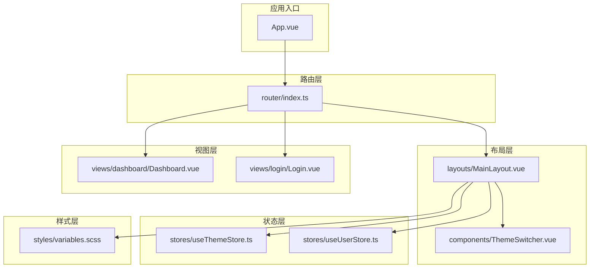
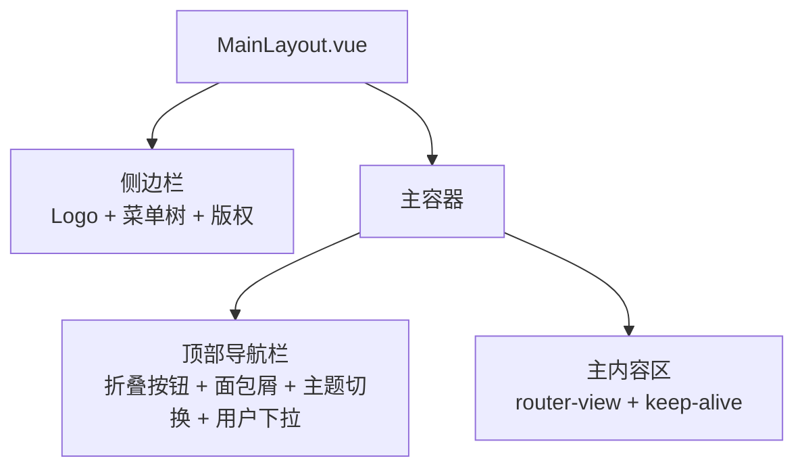
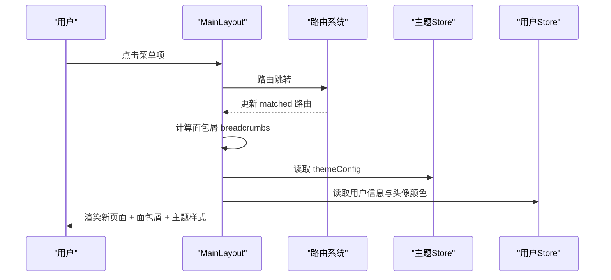
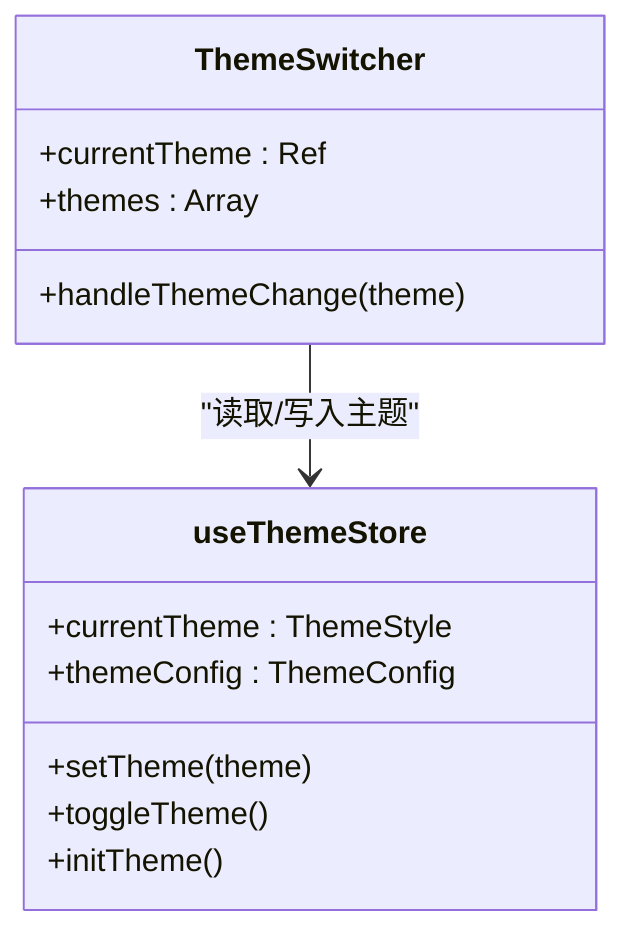
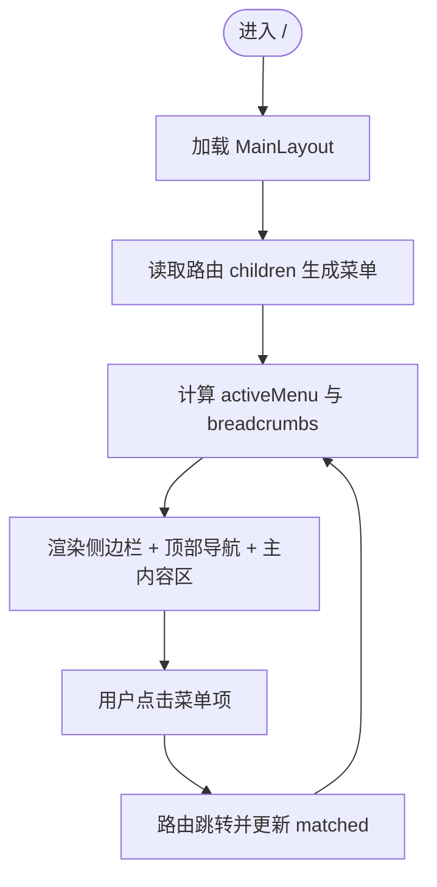
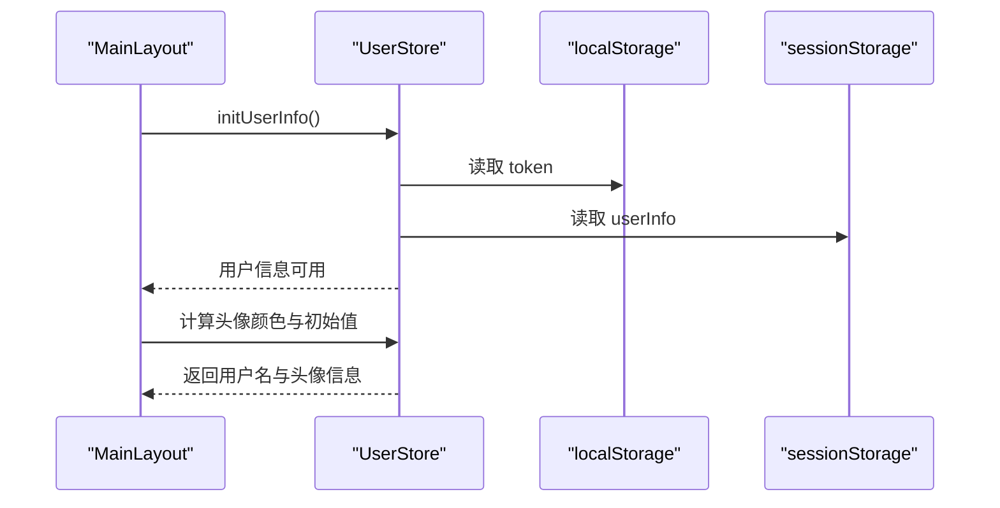
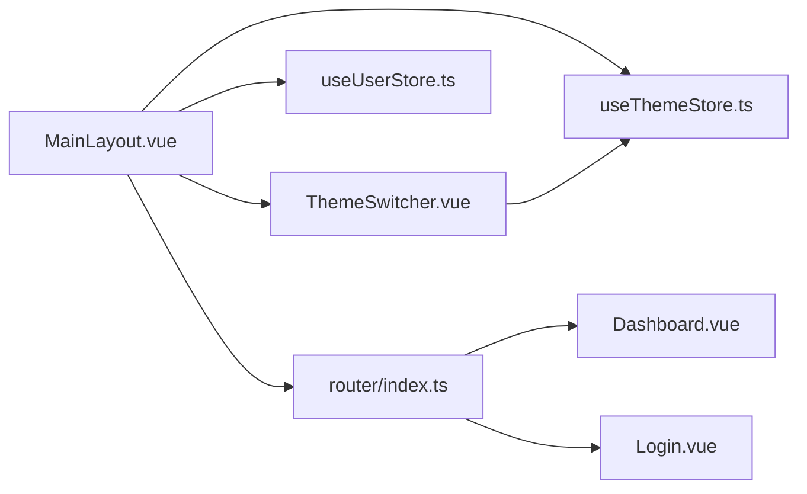

# 布局组件

<cite>
**本文档引用的文件**
- [MainLayout.vue](file://src/layouts/MainLayout.vue)
- [App.vue](file://src/App.vue)
- [index.ts](file://src/router/index.ts)
- [useThemeStore.ts](file://src/stores/useThemeStore.ts)
- [ThemeSwitcher.vue](file://src/components/ThemeSwitcher.vue)
- [useUserStore.ts](file://src/stores/useUserStore.ts)
- [variables.scss](file://src/styles/variables.scss)
- [index.ts](file://src/types/index.ts)
- [Dashboard.vue](file://src/views/dashboard/Dashboard.vue)
- [Login.vue](file://src/views/login/Login.vue)
- [package.json](file://package.json)
</cite>

## 目录
1. [简介](#简介)
2. [项目结构](#项目结构)
3. [核心组件](#核心组件)
4. [架构总览](#架构总览)
5. [详细组件分析](#详细组件分析)
6. [依赖关系分析](#依赖关系分析)
7. [性能考虑](#性能考虑)
8. [故障排除指南](#故障排除指南)
9. [结论](#结论)
10. [附录](#附录)

## 简介
本文件聚焦于项目中的主布局组件 MainLayout 的设计架构与实现原理，系统阐述其结构组成、导航菜单、面包屑导航、侧边栏与主内容区域的配置方法；解释响应式设计、主题适配与屏幕尺寸兼容性；提供属性配置、插槽使用与样式定制选项；给出嵌套使用示例与最佳实践，并说明与其他组件的集成方式与数据传递机制，最后提供定制指南与扩展方案。

## 项目结构
项目采用基于 Vue 3 + TypeScript + Vite 的前端架构，布局组件位于 src/layouts 目录，路由配置在 src/router，状态管理使用 Pinia，主题与用户状态通过独立 Store 管理，样式统一在 src/styles 下维护。

**图表来源**
- [App.vue:1-15](file://src/App.vue#L1-L15)
- [index.ts:1-136](file://src/router/index.ts#L1-L136)
- [MainLayout.vue:1-434](file://src/layouts/MainLayout.vue#L1-L434)
- [ThemeSwitcher.vue:1-132](file://src/components/ThemeSwitcher.vue#L1-L132)
- [useThemeStore.ts:1-69](file://src/stores/useThemeStore.ts#L1-L69)
- [useUserStore.ts:1-200](file://src/stores/useUserStore.ts#L1-L200)
- [variables.scss:1-44](file://src/styles/variables.scss#L1-L44)
- [Dashboard.vue:1-155](file://src/views/dashboard/Dashboard.vue#L1-L155)
- [Login.vue:1-408](file://src/views/login/Login.vue#L1-L408)

**章节来源**
- [App.vue:1-15](file://src/App.vue#L1-L15)
- [index.ts:1-136](file://src/router/index.ts#L1-L136)

## 核心组件
- MainLayout 主布局组件：负责整体布局容器、侧边栏菜单、顶部导航栏、面包屑导航、主内容区与用户信息展示。
- ThemeSwitcher 主题切换器：提供多主题预览与切换功能，联动主题 Store。
- 路由系统：定义菜单路由树，支持父子级菜单与面包屑生成。
- 主题 Store：管理主题风格与侧边栏配色，持久化存储。
- 用户 Store：管理登录状态、用户信息与头像生成逻辑。

**章节来源**
- [MainLayout.vue:1-434](file://src/layouts/MainLayout.vue#L1-L434)
- [ThemeSwitcher.vue:1-132](file://src/components/ThemeSwitcher.vue#L1-L132)
- [index.ts:1-136](file://src/router/index.ts#L1-L136)
- [useThemeStore.ts:1-69](file://src/stores/useThemeStore.ts#L1-L69)
- [useUserStore.ts:1-200](file://src/stores/useUserStore.ts#L1-L200)

## 架构总览
MainLayout 作为全局布局容器，内部包含：
- 侧边栏（el-aside）：Logo 区域、菜单树（el-menu + el-sub-menu）、版权说明。
- 主容器（el-container）：顶部导航栏（el-header）、主内容区（el-main）。
- 顶部导航栏：折叠按钮、面包屑导航、主题切换器、用户下拉菜单。
- 主内容区：通过 router-view + keep-alive 渲染当前路由组件。

**图表来源**
- [MainLayout.vue:1-434](file://src/layouts/MainLayout.vue#L1-L434)

## 详细组件分析

### MainLayout 主布局组件
- 结构组成
  - 布局容器：el-container，高度占满视窗，背景色统一。
  - 侧边栏：el-aside，宽度根据折叠状态动态切换，背景色来自主题 Store。
  - 顶部导航栏：el-header，包含折叠按钮、面包屑、主题切换器、用户信息下拉。
  - 主内容区：el-main，使用 keep-alive 缓存路由组件，提升切换性能。
- 导航菜单
  - 菜单数据来源于路由配置的 children，支持一级菜单与二级子菜单。
  - 菜单项与子菜单项均支持图标与标题，点击自动跳转至对应路由。
  - 菜单激活态与主题色联动，支持唯一展开与路由模式。
- 面包屑导航
  - 基于 route.matched 过滤 meta.title 的项生成，自动随路由变化更新。
- 侧边栏与主内容区域
  - 侧边栏包含 Logo 区域与菜单树，底部版权信息固定定位。
  - 主内容区提供滚动条自定义样式与渐变背景。
- 响应式设计
  - 侧边栏宽度在折叠与展开状态下切换，菜单项在折叠模式下仅显示图标。
  - 顶部导航栏在小屏设备上仍保持紧凑布局，菜单项在窄屏下可滚动。
- 主题适配
  - 侧边栏背景色、文字色、激活色均来自主题 Store 的 themeConfig。
  - 主题切换器 ThemeSwitcher 提供多种主题预览与切换。
- 屏幕尺寸兼容性
  - 侧边栏宽度与菜单项在不同屏幕宽度下保持一致的视觉比例。
  - 顶部导航栏在移动端仍可正常交互，菜单项支持横向滚动。
- 属性配置
  - 通过路由 meta 字段配置菜单标题与图标，支持嵌套子菜单。
  - 通过 themeStore.themeConfig 控制侧边栏配色。
- 插槽使用
  - 主内容区使用具名插槽 slot="default" 的 router-view，内部包裹 keep-alive。
- 样式定制
  - 侧边栏菜单 hover 效果、激活态左侧指示条、渐变背景与阴影。
  - 顶部导航栏用户信息悬停高亮、面包屑层级样式。
  - 主内容区滚动条自定义样式。
- 数据流
  - 菜单路由来源于 router.options.routes，匹配当前路由生成面包屑。
  - 用户信息与头像颜色通过 useUserStore 计算属性生成。
  - 主题切换通过 ThemeSwitcher 与 useThemeStore 协同完成。

**图表来源**
- [MainLayout.vue:138-144](file://src/layouts/MainLayout.vue#L138-L144)
- [MainLayout.vue:122-129](file://src/layouts/MainLayout.vue#L122-L129)
- [index.ts:1-136](file://src/router/index.ts#L1-L136)
- [useThemeStore.ts:39-41](file://src/stores/useThemeStore.ts#L39-L41)
- [useUserStore.ts:24-27](file://src/stores/useUserStore.ts#L24-L27)

**章节来源**
- [MainLayout.vue:1-434](file://src/layouts/MainLayout.vue#L1-L434)
- [index.ts:1-136](file://src/router/index.ts#L1-L136)
- [useThemeStore.ts:1-69](file://src/stores/useThemeStore.ts#L1-L69)
- [useUserStore.ts:1-200](file://src/stores/useUserStore.ts#L1-L200)

### ThemeSwitcher 主题切换器
- 功能概述
  - 提供主题下拉菜单，展示各主题的侧边栏预览与名称。
  - 点击后调用主题 Store 的 setTheme 方法切换主题。
- 主题配置
  - 支持默认深色、浅色、科技蓝、极客黑四种主题。
  - 主题配置包含侧边栏背景色、文字色、激活色。
- 交互行为
  - 当前选中主题高亮显示，预览区域突出激活色。
  - 点击任意主题即刻持久化到 localStorage 并触发 UI 更新。

**图表来源**
- [ThemeSwitcher.vue:1-132](file://src/components/ThemeSwitcher.vue#L1-L132)
- [useThemeStore.ts:1-69](file://src/stores/useThemeStore.ts#L1-L69)

**章节来源**
- [ThemeSwitcher.vue:1-132](file://src/components/ThemeSwitcher.vue#L1-L132)
- [useThemeStore.ts:1-69](file://src/stores/useThemeStore.ts#L1-L69)

### 路由与菜单配置
- 路由结构
  - 根路由 "/" 指向 MainLayout，子路由构成菜单树。
  - 子路由支持 meta.title、meta.icon、meta.requiresAuth 等元信息。
  - 支持重定向与嵌套路由，形成父子菜单结构。
- 面包屑生成
  - 基于 route.matched 过滤 meta.title 的项，自动构建面包屑路径。
- 登录与鉴权
  - 路由守卫检查 token，未登录跳转登录页，已登录禁止重复访问登录页。

**图表来源**
- [index.ts:1-136](file://src/router/index.ts#L1-L136)
- [MainLayout.vue:138-144](file://src/layouts/MainLayout.vue#L138-L144)

**章节来源**
- [index.ts:1-136](file://src/router/index.ts#L1-L136)
- [MainLayout.vue:138-144](file://src/layouts/MainLayout.vue#L138-L144)

### 用户信息与头像
- 用户信息来源
  - 从 localStorage 恢复 token，从 sessionStorage 恢复用户信息。
  - 登录成功后获取用户详情并缓存到 sessionStorage。
- 头像生成
  - 基于用户名生成哈希值，转换为 HSL 色相值，确保头像背景色柔和且唯一。
  - 显示用户名首字母作为头像文本。

**图表来源**
- [useUserStore.ts:172-183](file://src/stores/useUserStore.ts#L172-L183)
- [MainLayout.vue:146-162](file://src/layouts/MainLayout.vue#L146-L162)

**章节来源**
- [useUserStore.ts:1-200](file://src/stores/useUserStore.ts#L1-L200)
- [MainLayout.vue:146-162](file://src/layouts/MainLayout.vue#L146-L162)

### 响应式设计与屏幕兼容性
- 侧边栏宽度
  - 折叠状态：64px；展开状态：200px；过渡动画平滑。
- 菜单项显示
  - 折叠模式下仅显示图标，标题隐藏；展开模式显示图标与标题。
- 顶部导航
  - 顶部导航栏在窄屏下仍保持紧凑布局，菜单项支持横向滚动。
- 主内容区
  - 滚动条样式在不同主题下保持一致的视觉体验。

**章节来源**
- [MainLayout.vue:4-7](file://src/layouts/MainLayout.vue#L4-L7)
- [MainLayout.vue:20-55](file://src/layouts/MainLayout.vue#L20-L55)
- [MainLayout.vue:310-395](file://src/layouts/MainLayout.vue#L310-L395)

### 样式定制与主题适配
- 主题变量
  - 通过 variables.scss 定义主色调、文字色、边框色、背景色与圆角、阴影等基础变量。
- 组件样式
  - 侧边栏菜单 hover 效果、激活态左侧指示条、渐变背景与阴影。
  - 顶部导航栏用户信息悬停高亮、面包屑层级样式。
  - 主内容区滚动条自定义样式，支持 hover 变化。
- 主题 Store
  - 提供 DEFAULT/LIGHT/BLUE/DARK 四种主题配置，支持切换与持久化。

**章节来源**
- [variables.scss:1-44](file://src/styles/variables.scss#L1-L44)
- [MainLayout.vue:213-433](file://src/layouts/MainLayout.vue#L213-L433)
- [useThemeStore.ts:5-30](file://src/stores/useThemeStore.ts#L5-L30)

### 嵌套使用示例与最佳实践
- 嵌套使用
  - 在路由配置中为某模块添加 children，即可在侧边栏生成二级菜单。
  - 通过 meta.title 与 meta.icon 控制菜单显示与图标。
- 最佳实践
  - 将菜单项的 meta.requiresAuth 设为 true 以启用鉴权。
  - 对需要重定向的模块使用 redirect，避免空链接。
  - 保持菜单层级不超过两级，提升可读性与可用性。
  - 使用 keep-alive 缓存频繁切换的页面，减少重复渲染开销。

**章节来源**
- [index.ts:1-136](file://src/router/index.ts#L1-L136)
- [MainLayout.vue:106-112](file://src/layouts/MainLayout.vue#L106-L112)

### 与其他组件的集成与数据传递
- 与路由系统集成
  - 菜单数据来源于路由配置，面包屑基于 route.matched 动态生成。
- 与主题系统集成
  - 侧边栏配色、菜单文字色、激活色均来自主题 Store 的 themeConfig。
- 与用户系统集成
  - 用户头像颜色与初始值通过 useUserStore 计算属性生成。
- 与第三方库集成
  - Element Plus 提供布局容器、菜单、面包屑、下拉菜单等组件。
  - NProgress 提供路由切换进度条。

**章节来源**
- [index.ts:1-136](file://src/router/index.ts#L1-L136)
- [useThemeStore.ts:39-41](file://src/stores/useThemeStore.ts#L39-L41)
- [useUserStore.ts:24-27](file://src/stores/useUserStore.ts#L24-L27)
- [package.json:14-26](file://package.json#L14-L26)

## 依赖关系分析
- 组件依赖
  - MainLayout 依赖 ThemeSwitcher、useThemeStore、useUserStore。
  - 路由系统提供菜单数据与面包屑数据源。
- 外部依赖
  - Element Plus 提供布局与 UI 组件。
  - Pinia 提供状态管理。
  - Vue Router 提供路由与导航。
- 循环依赖
  - 未发现循环依赖，组件职责清晰，数据流向单向。

**图表来源**
- [MainLayout.vue:122-129](file://src/layouts/MainLayout.vue#L122-L129)
- [ThemeSwitcher.vue:39-41](file://src/components/ThemeSwitcher.vue#L39-L41)
- [useThemeStore.ts:1-69](file://src/stores/useThemeStore.ts#L1-L69)
- [useUserStore.ts:1-200](file://src/stores/useUserStore.ts#L1-L200)
- [index.ts:1-136](file://src/router/index.ts#L1-L136)
- [Dashboard.vue:1-155](file://src/views/dashboard/Dashboard.vue#L1-L155)
- [Login.vue:1-408](file://src/views/login/Login.vue#L1-L408)

**章节来源**
- [MainLayout.vue:122-129](file://src/layouts/MainLayout.vue#L122-L129)
- [ThemeSwitcher.vue:39-41](file://src/components/ThemeSwitcher.vue#L39-L41)
- [useThemeStore.ts:1-69](file://src/stores/useThemeStore.ts#L1-L69)
- [useUserStore.ts:1-200](file://src/stores/useUserStore.ts#L1-L200)
- [index.ts:1-136](file://src/router/index.ts#L1-L136)

## 性能考虑
- 路由组件缓存
  - 主内容区使用 keep-alive 缓存，减少重复渲染与网络请求。
- 主题切换
  - 主题切换通过 Store 管理，避免重复计算与 DOM 重绘。
- 菜单渲染
  - 菜单数据来源于路由配置，按需渲染，避免不必要的计算。
- 滚动优化
  - 主内容区滚动条样式自定义，提升滚动体验。

[本节为通用性能建议，无需特定文件引用]

## 故障排除指南
- 登录后无法进入主页面
  - 检查路由守卫是否正确处理 token，确认 / 路由指向 MainLayout。
- 菜单不显示或显示异常
  - 检查路由配置的 meta.title 与 meta.icon 是否正确设置。
  - 确认路由 children 是否正确嵌套。
- 面包屑不更新
  - 确认当前路由的 meta.title 是否存在，面包屑基于 route.matched 过滤生成。
- 主题切换无效
  - 检查 ThemeSwitcher 是否正确调用 setTheme，localStorage 是否可写。
- 用户头像颜色异常
  - 检查用户名是否为空，确保哈希计算逻辑正常执行。

**章节来源**
- [index.ts:116-133](file://src/router/index.ts#L116-L133)
- [MainLayout.vue:138-144](file://src/layouts/MainLayout.vue#L138-L144)
- [ThemeSwitcher.vue:80-82](file://src/components/ThemeSwitcher.vue#L80-L82)
- [useUserStore.ts:132-150](file://src/stores/useUserStore.ts#L132-L150)

## 结论
MainLayout 通过清晰的布局结构、灵活的主题适配与完善的路由集成，提供了稳定可靠的主界面框架。配合 ThemeSwitcher 与用户 Store，实现了良好的用户体验与可维护性。建议在后续迭代中进一步完善菜单权限控制与国际化支持，持续优化性能与可扩展性。

[本节为总结性内容，无需特定文件引用]

## 附录
- 类型定义
  - ThemeStyle：主题风格枚举（default/light/blue/dark）。
  - ThemeConfig：主题配置接口（包含侧边栏背景色、文字色、激活色）。
- 依赖版本
  - Vue 3、Element Plus、Pinia、Vue Router、NProgress 等。

**章节来源**
- [index.ts:36-50](file://src/types/index.ts#L36-L50)
- [package.json:14-26](file://package.json#L14-L26)