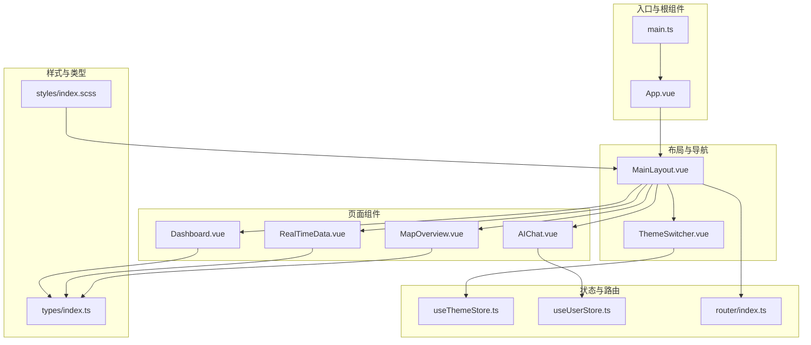
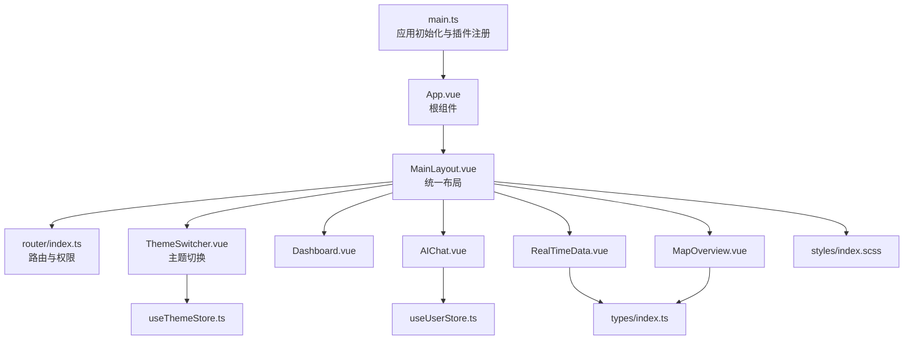
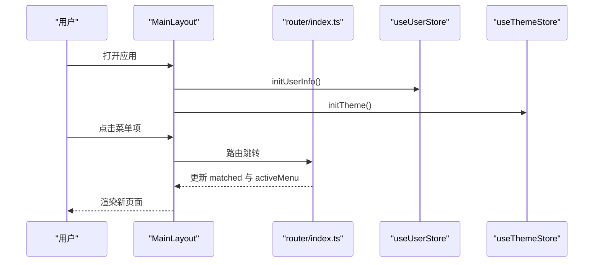
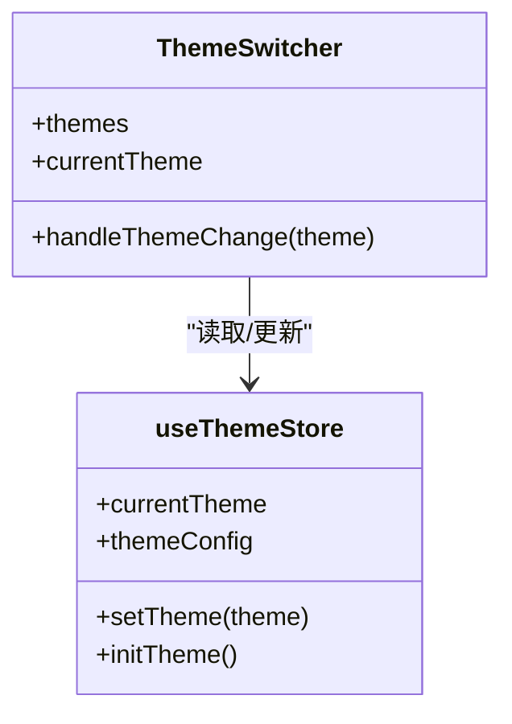
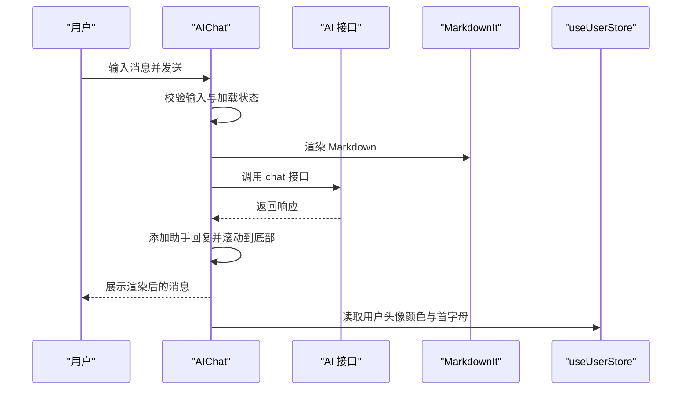
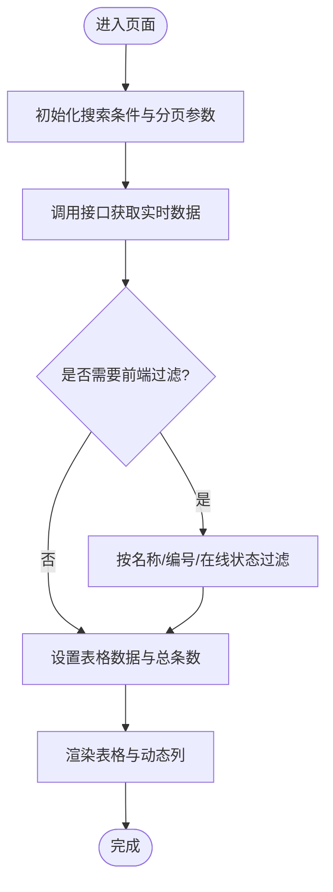
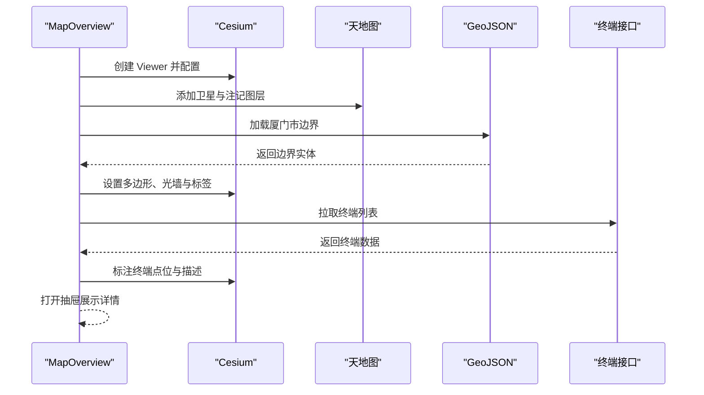
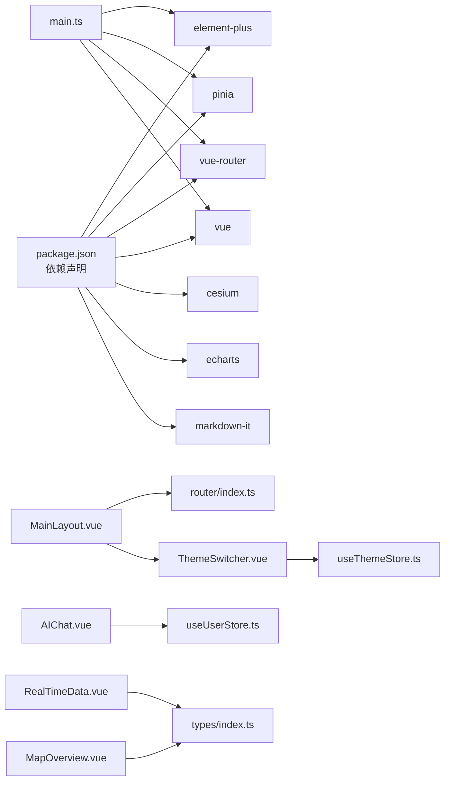

# 组件库文档

<cite>
**本文档引用的文件**
- [App.vue](file://src/App.vue)
- [main.ts](file://src/main.ts)
- [MainLayout.vue](file://src/layouts/MainLayout.vue)
- [ThemeSwitcher.vue](file://src/components/ThemeSwitcher.vue)
- [Dashboard.vue](file://src/views/dashboard/Dashboard.vue)
- [AIChat.vue](file://src/views/ai/AIChat.vue)
- [RealTimeData.vue](file://src/views/data/RealTimeData.vue)
- [MapOverview.vue](file://src/views/map/MapOverview.vue)
- [useThemeStore.ts](file://src/stores/useThemeStore.ts)
- [useUserStore.ts](file://src/stores/useUserStore.ts)
- [index.ts](file://src/router/index.ts)
- [index.scss](file://src/styles/index.scss)
- [index.ts](file://src/types/index.ts)
- [package.json](file://package.json)
- [README.md](file://README.md)
</cite>

## 目录
1. [简介](#简介)
2. [项目结构](#项目结构)
3. [核心组件](#核心组件)
4. [架构总览](#架构总览)
5. [组件详解](#组件详解)
6. [依赖关系分析](#依赖关系分析)
7. [性能考量](#性能考量)
8. [故障排查指南](#故障排查指南)
9. [结论](#结论)
10. [附录](#附录)

## 简介
本组件库文档面向水文监测管理系统，系统采用 Vue 3 + TypeScript + Element Plus 技术栈，结合 Pinia 状态管理与 Vue Router 路由体系，提供统一的主题切换、用户认证、布局导航与页面级业务组件。本文档旨在帮助开发者快速理解并高效使用通用组件、布局组件与页面组件，涵盖设计理念、属性配置、事件处理、插槽使用、样式定制、生命周期与状态管理、性能优化、组合使用示例与最佳实践，并给出测试策略与维护建议。

## 项目结构
项目采用按职责分层的组织方式：
- 布局层：MainLayout 提供统一的侧边栏、头部导航与主内容区骨架
- 通用组件层：ThemeSwitcher 提供主题切换能力
- 页面层：Dashboard、AIChat、RealTimeData、MapOverview 等业务页面
- 状态层：useThemeStore、useUserStore 管理主题与用户状态
- 路由层：index.ts 定义菜单路由与权限控制
- 样式层：index.scss 提供全局样式与工具类
- 类型层：index.ts 定义通用类型与枚举

**图表来源**
- [main.ts:1-26](file://src/main.ts#L1-L26)
- [App.vue:1-15](file://src/App.vue#L1-L15)
- [MainLayout.vue:1-434](file://src/layouts/MainLayout.vue#L1-L434)
- [ThemeSwitcher.vue:1-132](file://src/components/ThemeSwitcher.vue#L1-L132)
- [Dashboard.vue:1-155](file://src/views/dashboard/Dashboard.vue#L1-L155)
- [AIChat.vue:1-519](file://src/views/ai/AIChat.vue#L1-L519)
- [RealTimeData.vue:1-300](file://src/views/data/RealTimeData.vue#L1-L300)
- [MapOverview.vue:1-649](file://src/views/map/MapOverview.vue#L1-L649)
- [useThemeStore.ts:1-69](file://src/stores/useThemeStore.ts#L1-L69)
- [useUserStore.ts:1-200](file://src/stores/useUserStore.ts#L1-L200)
- [index.ts:1-136](file://src/router/index.ts#L1-L136)
- [index.scss:1-114](file://src/styles/index.scss#L1-L114)
- [index.ts:1-51](file://src/types/index.ts#L1-L51)

**章节来源**
- [README.md:17-34](file://README.md#L17-L34)
- [main.ts:1-26](file://src/main.ts#L1-L26)
- [App.vue:1-15](file://src/App.vue#L1-L15)

## 核心组件
- 布局组件：MainLayout 提供侧边栏菜单、面包屑导航、头部用户信息与主题切换入口，支持菜单路由自动生成、面包屑联动与侧边栏折叠
- 通用组件：ThemeSwitcher 提供主题切换下拉菜单，支持多种预设主题与侧边栏配色联动
- 页面组件：Dashboard 提供统计卡片与图表占位；AIChat 提供智能问答交互与 Markdown 渲染；RealTimeData 提供实时数据表格与搜索分页；MapOverview 集成 Cesium 地图与终端标注
- 状态管理：useThemeStore 管理主题风格与持久化；useUserStore 管理登录状态、用户信息与 Token
- 路由与导航：router/index.ts 定义菜单路由树、权限守卫与进度条

**章节来源**
- [MainLayout.vue:1-434](file://src/layouts/MainLayout.vue#L1-L434)
- [ThemeSwitcher.vue:1-132](file://src/components/ThemeSwitcher.vue#L1-L132)
- [Dashboard.vue:1-155](file://src/views/dashboard/Dashboard.vue#L1-L155)
- [AIChat.vue:1-519](file://src/views/ai/AIChat.vue#L1-L519)
- [RealTimeData.vue:1-300](file://src/views/data/RealTimeData.vue#L1-L300)
- [MapOverview.vue:1-649](file://src/views/map/MapOverview.vue#L1-L649)
- [useThemeStore.ts:1-69](file://src/stores/useThemeStore.ts#L1-L69)
- [useUserStore.ts:1-200](file://src/stores/useUserStore.ts#L1-L200)
- [index.ts:1-136](file://src/router/index.ts#L1-L136)

## 架构总览
系统采用“入口应用 -> 布局 -> 页面”的层次化架构，配合 Pinia 进行跨组件状态共享，Element Plus 提供 UI 基础能力，Cesium 与 ECharts 等第三方库按需集成。

**图表来源**
- [main.ts:1-26](file://src/main.ts#L1-L26)
- [App.vue:1-15](file://src/App.vue#L1-L15)
- [MainLayout.vue:1-434](file://src/layouts/MainLayout.vue#L1-L434)
- [ThemeSwitcher.vue:1-132](file://src/components/ThemeSwitcher.vue#L1-L132)
- [Dashboard.vue:1-155](file://src/views/dashboard/Dashboard.vue#L1-L155)
- [AIChat.vue:1-519](file://src/views/ai/AIChat.vue#L1-L519)
- [RealTimeData.vue:1-300](file://src/views/data/RealTimeData.vue#L1-L300)
- [MapOverview.vue:1-649](file://src/views/map/MapOverview.vue#L1-L649)
- [useThemeStore.ts:1-69](file://src/stores/useThemeStore.ts#L1-L69)
- [useUserStore.ts:1-200](file://src/stores/useUserStore.ts#L1-L200)
- [index.ts:1-136](file://src/router/index.ts#L1-L136)
- [index.scss:1-114](file://src/styles/index.scss#L1-L114)
- [index.ts:1-51](file://src/types/index.ts#L1-L51)

## 组件详解

### 布局组件：MainLayout
- 设计理念
  - 通过 Element Plus Container/Aside/Header/Main 结构化布局，提供统一的侧边栏菜单、面包屑导航与头部用户信息
  - 菜单路由自动生成，支持子菜单与图标组件动态绑定
  - 侧边栏折叠与主题色联动，提升可访问性与个性化体验
- 关键属性与行为
  - 菜单路由：从路由配置中提取 children 生成菜单树
  - 面包屑：根据 matched 路由元信息生成
  - 用户头像：基于用户名哈希生成颜色与首字母
  - 下拉菜单：支持退出登录与个人中心跳转
  - 侧边栏折叠：切换宽度与菜单图标
- 生命周期与状态管理
  - onMounted 初始化用户信息与主题
  - 通过 useUserStore 与 useThemeStore 管理状态
- 插槽与样式定制
  - 使用 :deep 作用域穿透 Element Plus 组件样式
  - 支持通过主题配置覆盖侧边栏背景、文本与激活色
- 性能优化
  - keep-alive 包裹 router-view，减少页面切换重渲染
  - 菜单与面包屑计算属性缓存

**图表来源**
- [MainLayout.vue:206-211](file://src/layouts/MainLayout.vue#L206-L211)
- [index.ts:116-133](file://src/router/index.ts#L116-L133)
- [useUserStore.ts:172-183](file://src/stores/useUserStore.ts#L172-L183)
- [useThemeStore.ts:44-50](file://src/stores/useThemeStore.ts#L44-L50)

**章节来源**
- [MainLayout.vue:1-434](file://src/layouts/MainLayout.vue#L1-L434)
- [index.ts:1-136](file://src/router/index.ts#L1-L136)
- [useUserStore.ts:1-200](file://src/stores/useUserStore.ts#L1-L200)
- [useThemeStore.ts:1-69](file://src/stores/useThemeStore.ts#L1-L69)

### 通用组件：ThemeSwitcher
- 设计理念
  - 提供主题切换下拉菜单，支持多种预设主题与侧边栏配色联动
  - 通过 Pinia 管理当前主题，持久化至 localStorage
- 关键属性与行为
  - themes 列表：包含默认深色、浅色、科技蓝、极客黑四种主题
  - handleThemeChange：切换主题并写入持久化存储
  - computed currentTheme：与当前主题状态同步
- 生命周期与状态管理
  - 组件挂载后与 store 状态保持一致
- 插槽与样式定制
  - 下拉项包含主题预览与激活态样式
- 性能优化
  - 预设主题配置集中管理，避免重复计算

**图表来源**
- [ThemeSwitcher.vue:35-82](file://src/components/ThemeSwitcher.vue#L35-L82)
- [useThemeStore.ts:34-68](file://src/stores/useThemeStore.ts#L34-L68)

**章节来源**
- [ThemeSwitcher.vue:1-132](file://src/components/ThemeSwitcher.vue#L1-L132)
- [useThemeStore.ts:1-69](file://src/stores/useThemeStore.ts#L1-L69)

### 页面组件：Dashboard
- 设计理念
  - 提供统计卡片、图表区域与快捷操作区，采用 Element Plus 卡片与栅格布局
  - 图表区域预留占位，便于集成 ECharts 等可视化库
- 关键属性与行为
  - 统计卡片：用户总数、文章数量、评论数量、访问量
  - 快捷操作：新建用户、导入数据、导出数据、系统设置
- 插槽与样式定制
  - 卡片 header 插槽用于自定义标题
  - 统一样式与间距通过 SCSS 工具类与局部样式控制

**章节来源**
- [Dashboard.vue:1-155](file://src/views/dashboard/Dashboard.vue#L1-L155)

### 页面组件：AIChat
- 设计理念
  - 提供智能问答交互，支持 Markdown 渲染、输入防抖与加载状态
  - 与用户状态 store 集成，保持头像与昵称一致性
- 关键属性与行为
  - messages：消息数组，支持用户与助手两类角色
  - Markdown 渲染：使用 markdown-it，支持标题、列表、代码块、表格、链接等
  - 输入控制：支持 Ctrl+Enter 发送，禁用状态下不可提交
  - 健康检查：调用健康检查接口并反馈状态
- 生命周期与状态管理
  - onMounted 初始化欢迎消息
  - 使用 useUserStore 生成头像颜色与首字母
- 插槽与样式定制
  - 消息内容支持 Markdown 容器样式定制
  - 输入区域包含提示与发送按钮
- 性能优化
  - 滚动到底部使用 nextTick 确保 DOM 更新完成
  - 错误捕获与消息提示，避免阻塞交互

**图表来源**
- [AIChat.vue:92-229](file://src/views/ai/AIChat.vue#L92-L229)
- [AIChat.vue:131-147](file://src/views/ai/AIChat.vue#L131-L147)
- [useUserStore.ts:112-129](file://src/stores/useUserStore.ts#L112-L129)

**章节来源**
- [AIChat.vue:1-519](file://src/views/ai/AIChat.vue#L1-L519)
- [useUserStore.ts:1-200](file://src/stores/useUserStore.ts#L1-L200)

### 页面组件：RealTimeData
- 设计理念
  - 提供实时数据表格展示，支持搜索过滤、分页与动态列渲染
  - 根据要素类型自动格式化数值精度
- 关键属性与行为
  - 搜索表单：遥测站名称、编号、在线状态
  - 表格列：动态从 elementSet 中提取指标并格式化显示
  - 分页：支持页码与每页条数变更
  - 操作：查看历史数据跳转
- 生命周期与状态管理
  - onMounted 初始化并拉取数据
  - 使用 API 封装与错误提示
- 性能优化
  - 前端过滤与格式化，避免重复请求
  - 动态列仅基于唯一要素生成，减少渲染开销

**图表来源**
- [RealTimeData.vue:108-279](file://src/views/data/RealTimeData.vue#L108-L279)

**章节来源**
- [RealTimeData.vue:1-300](file://src/views/data/RealTimeData.vue#L1-L300)

### 页面组件：MapOverview
- 设计理念
  - 集成 Cesium 地图，加载天地图影像与注记，绘制厦门市边界与终端标注
  - 支持终端抽屉详情、在线状态高亮与光墙效果
- 关键属性与行为
  - initMap：创建 Viewer、配置天地图、设置初始视角、加载边界与终端
  - loadXiamenBoundary：加载 GeoJSON、设置 3D 多边形与光墙效果
  - markTerminalsOnMap：根据在线状态绘制点位与标签
  - 抽屉：展示终端详情并跳转到终端管理页面
- 生命周期与状态管理
  - onMounted 初始化地图；onUnmounted 清理资源与销毁 Viewer
- 插槽与样式定制
  - 抽屉 footer 插槽用于操作按钮
  - Cesium 容器样式通过 :deep 作用域穿透
- 性能优化
  - 使用 ClippingPlane 进行精确裁剪（可选）
  - 控制光照与背景以突出区域效果

**图表来源**
- [MapOverview.vue:52-622](file://src/views/map/MapOverview.vue#L52-L622)

**章节来源**
- [MapOverview.vue:1-649](file://src/views/map/MapOverview.vue#L1-L649)

## 依赖关系分析
- 应用入口依赖 Element Plus、Pinia、Vue Router 与 SCSS 样式
- 布局组件依赖路由与状态 store，同时注入通用组件 ThemeSwitcher
- 页面组件按需引入第三方库（Cesium、ECharts）与 API 封装
- 类型定义集中于 types/index.ts，被各页面与 store 引用

**图表来源**
- [package.json:14-26](file://package.json#L14-L26)
- [main.ts:1-26](file://src/main.ts#L1-L26)
- [index.ts:1-136](file://src/router/index.ts#L1-L136)
- [useThemeStore.ts:1-69](file://src/stores/useThemeStore.ts#L1-L69)
- [useUserStore.ts:1-200](file://src/stores/useUserStore.ts#L1-L200)
- [index.ts:1-51](file://src/types/index.ts#L1-L51)

**章节来源**
- [package.json:1-48](file://package.json#L1-L48)
- [main.ts:1-26](file://src/main.ts#L1-L26)

## 性能考量
- 渲染优化
  - MainLayout 使用 keep-alive 缓存页面组件，减少重复渲染
  - RealTimeData 采用前端过滤与动态列，避免不必要的 API 调用
- 资源管理
  - MapOverview 在组件卸载时销毁 Cesium Viewer，防止内存泄漏
- 状态管理
  - useThemeStore 与 useUserStore 使用持久化存储，减少重复初始化
- 样式与体积
  - 全局样式集中管理，避免重复定义
  - 按需引入第三方库，避免打包体积膨胀

[本节为通用指导，无需特定文件引用]

## 故障排查指南
- 登录与权限
  - 路由守卫会拦截未登录访问，必要时检查 Token 与路由 meta.requiresAuth
- 主题切换无效
  - 确认 useThemeStore.setTheme 已正确写入 localStorage，且 MainLayout 读取到最新主题
- 地图加载失败
  - 检查天地图 Token 与网络连通性；确认 Cesium 资源加载路径
- 实时数据不更新
  - 检查接口返回结构与前端过滤逻辑；确认分页参数传递正确
- Markdown 渲染异常
  - 检查 markdown-it 配置与内容合法性；捕获渲染异常并降级显示

**章节来源**
- [index.ts:116-133](file://src/router/index.ts#L116-L133)
- [useThemeStore.ts:44-66](file://src/stores/useThemeStore.ts#L44-L66)
- [MapOverview.vue:129-162](file://src/views/map/MapOverview.vue#L129-L162)
- [RealTimeData.vue:187-229](file://src/views/data/RealTimeData.vue#L187-L229)
- [AIChat.vue:131-147](file://src/views/ai/AIChat.vue#L131-L147)

## 结论
本组件库以布局与通用组件为核心，结合页面级业务组件与状态管理，形成一套可复用、可扩展且易于维护的前端架构。通过统一的主题与导航设计、完善的路由与权限控制、以及按需集成的第三方库，能够满足水文监测管理系统的多样化需求。建议在二次开发中遵循现有命名规范与目录结构，充分利用 Pinia 与 Element Plus 的能力，确保组件的可维护性与性能表现。

[本节为总结性内容，无需特定文件引用]

## 附录
- 组件使用示例与最佳实践
  - 布局组件：在路由根组件中嵌套 MainLayout，确保菜单与面包屑联动
  - 通用组件：ThemeSwitcher 放置于头部导航右侧，与 useThemeStore 协同工作
  - 页面组件：AIChat 与 MapOverview 为重型组件，注意资源释放与错误处理
  - 状态管理：优先使用 Pinia，避免跨组件直接共享 DOM 或全局变量
- 测试策略
  - 单元测试：针对 store 的 actions 与 getters 进行快照与行为测试
  - 集成测试：模拟路由与权限，验证 MainLayout 的菜单生成与面包屑联动
  - 端到端测试：覆盖 AIChat 的消息发送、Markdown 渲染与健康检查流程
- 维护指南
  - 保持依赖版本更新与安全扫描
  - 统一代码风格与类型约束，避免 any 类型滥用
  - 对重型组件（Cesium）增加资源清理与异常降级逻辑

[本节为通用指导，无需特定文件引用]