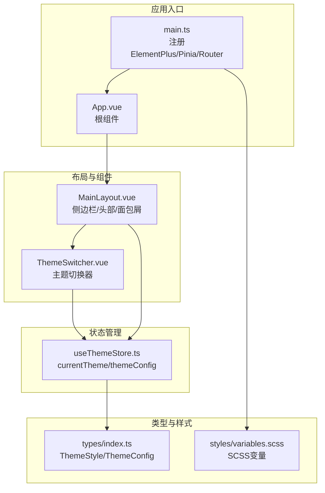
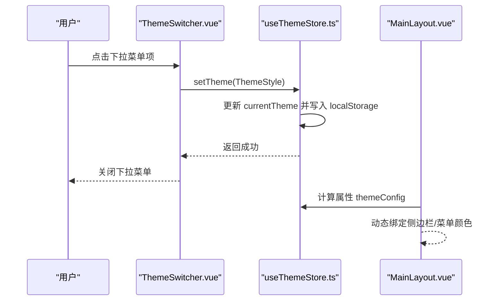
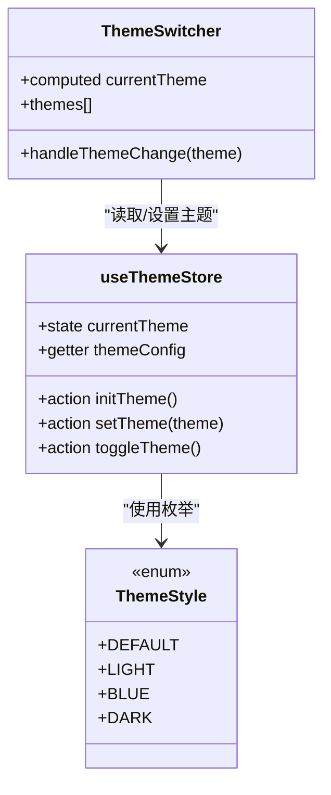
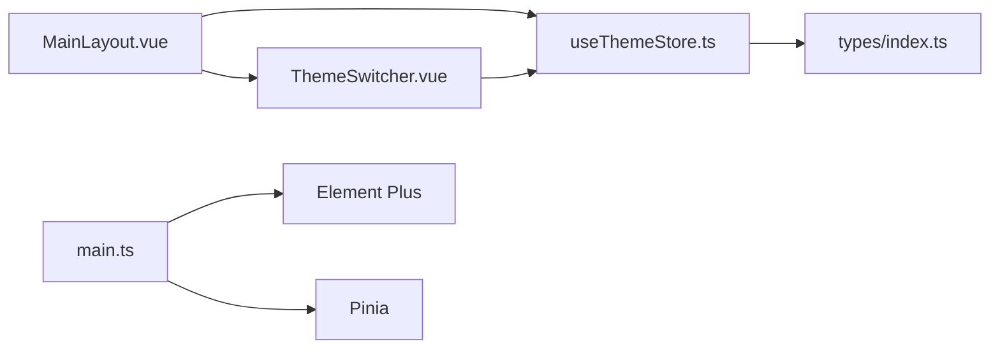

# 通用组件

<cite>
**本文引用的文件列表**
- [ThemeSwitcher.vue](file://src/components/ThemeSwitcher.vue)
- [useThemeStore.ts](file://src/stores/useThemeStore.ts)
- [MainLayout.vue](file://src/layouts/MainLayout.vue)
- [index.ts](file://src/types/index.ts)
- [variables.scss](file://src/styles/variables.scss)
- [main.ts](file://src/main.ts)
- [App.vue](file://src/App.vue)
- [index.ts](file://src/router/index.ts)
- [useUserStore.ts](file://src/stores/useUserStore.ts)
- [package.json](file://package.json)
</cite>

## 目录
1. [简介](#简介)
2. [项目结构](#项目结构)
3. [核心组件](#核心组件)
4. [架构总览](#架构总览)
5. [组件详解](#组件详解)
6. [依赖关系分析](#依赖关系分析)
7. [性能与可维护性](#性能与可维护性)
8. [故障排查指南](#故障排查指南)
9. [结论](#结论)
10. [附录](#附录)

## 简介
本文件聚焦于项目中的通用UI组件，尤其是主题切换器组件 ThemeSwitcher 的设计理念、实现细节与最佳实践。该组件通过 Pinia 状态管理驱动 Element Plus 下拉菜单，提供多主题切换能力，并与全局布局联动，实现侧边栏、菜单与头部的统一视觉风格。文档将从组件属性、事件、插槽、样式定制、状态管理、生命周期与性能优化等方面进行系统化说明，并给出组合使用示例与扩展建议。

## 项目结构
项目采用基于功能分层的组织方式：
- 组件层：通用组件集中于 src/components，ThemeSwitcher 即位于此处
- 布局层：主布局 MainLayout 负责页面骨架与主题联动
- 状态层：Pinia Store 提供主题与用户状态管理
- 类型层：统一的 ThemeStyle、ThemeConfig 枚举与接口定义
- 样式层：SCSS 变量与 Element Plus 样式集成
- 应用入口：main.ts 注册 Element Plus、Pinia、路由与全局样式

图表来源
- [main.ts:1-26](file://src/main.ts#L1-L26)
- [App.vue:1-15](file://src/App.vue#L1-L15)
- [MainLayout.vue:1-115](file://src/layouts/MainLayout.vue#L1-L115)
- [ThemeSwitcher.vue:1-33](file://src/components/ThemeSwitcher.vue#L1-L33)
- [useThemeStore.ts:1-69](file://src/stores/useThemeStore.ts#L1-L69)
- [index.ts:36-51](file://src/types/index.ts#L36-L51)
- [variables.scss:1-44](file://src/styles/variables.scss#L1-L44)

章节来源
- [main.ts:1-26](file://src/main.ts#L1-L26)
- [App.vue:1-15](file://src/App.vue#L1-L15)
- [MainLayout.vue:1-115](file://src/layouts/MainLayout.vue#L1-L115)
- [ThemeSwitcher.vue:1-33](file://src/components/ThemeSwitcher.vue#L1-L33)
- [useThemeStore.ts:1-69](file://src/stores/useThemeStore.ts#L1-L69)
- [index.ts:36-51](file://src/types/index.ts#L36-L51)
- [variables.scss:1-44](file://src/styles/variables.scss#L1-L44)

## 核心组件
- ThemeSwitcher 主题切换器：提供下拉菜单选择不同主题，支持预览与选中态高亮
- useThemeStore 主题状态：集中管理当前主题与主题配置，持久化至 localStorage
- MainLayout 主布局：与主题联动，动态绑定侧边栏背景、文字与激活色

章节来源
- [ThemeSwitcher.vue:1-132](file://src/components/ThemeSwitcher.vue#L1-L132)
- [useThemeStore.ts:1-69](file://src/stores/useThemeStore.ts#L1-L69)
- [MainLayout.vue:1-115](file://src/layouts/MainLayout.vue#L1-L115)

## 架构总览
ThemeSwitcher 通过 Pinia 的 useThemeStore 读取当前主题，并在用户选择时调用 setTheme 更新主题与持久化。MainLayout 在渲染侧边栏与菜单时，直接使用 themeStore.themeConfig 的颜色值，从而实现主题切换的全局生效。

图表来源
- [ThemeSwitcher.vue:80-82](file://src/components/ThemeSwitcher.vue#L80-L82)
- [useThemeStore.ts:52-66](file://src/stores/useThemeStore.ts#L52-L66)
- [MainLayout.vue:20-28](file://src/layouts/MainLayout.vue#L20-L28)

## 组件详解

### ThemeSwitcher 主题切换器
- 功能特性
  - 下拉菜单展示多种主题预览与名称
  - 选中态高亮与边框强调
  - 点击即触发主题切换
  - 与 Element Plus 下拉组件深度集成
- 使用方法
  - 在需要的主题切换位置引入组件，例如 MainLayout 的头部区域
  - 组件内部自动读取当前主题并渲染下拉项
- 配置选项
  - 无外部 props；主题列表与标签在组件内定义
  - 通过 ThemeStyle 枚举与 ThemeConfig 接口控制主题值与颜色配置
- 事件处理
  - 通过 Element Plus 下拉的 command 事件回调 handleThemeChange
  - handleThemeChange 调用 useThemeStore.setTheme 完成切换
- 插槽使用
  - 使用 #dropdown 插槽自定义下拉菜单项
  - 通过 el-dropdown-item 的 command 绑定主题值
- 样式定制
  - 支持通过 scoped 样式覆盖 .theme-switcher、.theme-option、.theme-preview 等类名
  - 预览区域的背景色与激活色由主题配置决定
- 状态管理
  - 通过 computed 读取 currentTheme，保持与 Pinia 同步
  - themes 数组中包含默认深色、浅色、科技蓝、极客黑四种主题
- 生命周期钩子
  - 组件初始化时无需额外逻辑，主题初始化在 App 挂载时完成
- 性能优化策略
  - 下拉项使用 v-for 渲染，key 为 theme.value，避免重复渲染
  - 主题切换仅更新 Pinia 状态与 localStorage，不触发全量重渲染
  - 预览区域使用内联样式，按需计算，避免额外计算开销

图表来源
- [ThemeSwitcher.vue:35-82](file://src/components/ThemeSwitcher.vue#L35-L82)
- [useThemeStore.ts:34-68](file://src/stores/useThemeStore.ts#L34-L68)
- [index.ts:36-42](file://src/types/index.ts#L36-L42)

章节来源
- [ThemeSwitcher.vue:1-132](file://src/components/ThemeSwitcher.vue#L1-L132)
- [useThemeStore.ts:1-69](file://src/stores/useThemeStore.ts#L1-L69)
- [index.ts:36-51](file://src/types/index.ts#L36-L51)

### 主题状态管理 useThemeStore
- 设计要点
  - 使用 Pinia defineStore 管理主题状态
  - themeConfigs 映射 ThemeStyle 到 ThemeConfig
  - 支持从 localStorage 恢复主题
  - 提供 setTheme 与 toggleTheme 两种切换方式
- 数据结构
  - state: currentTheme
  - getters: themeConfig
  - actions: initTheme、setTheme、toggleTheme
- 生命周期
  - 在 MainLayout 挂载时调用 initTheme，从 localStorage 恢复上次主题
- 性能与可靠性
  - localStorage 读写为同步操作，影响极小
  - setTheme 前进行有效性校验，避免无效主题写入

章节来源
- [useThemeStore.ts:1-69](file://src/stores/useThemeStore.ts#L1-L69)
- [MainLayout.vue:206-210](file://src/layouts/MainLayout.vue#L206-L210)

### 主布局 MainLayout 与主题联动
- 设计原则
  - 将主题配置注入到侧边栏背景色、文字色与激活色
  - 通过 computed 读取 themeConfig，实现响应式更新
- 实现细节
  - 侧边栏背景色绑定 themeConfig.sidebarBgColor
  - 菜单文字色与激活色绑定 themeConfig.sidebarTextColor 与 themeConfig.sidebarActiveColor
  - 头部右侧包含 ThemeSwitcher 组件
- 可复用性
  - 通过 Pinia 状态与 Element Plus 组件解耦，便于在其他布局中复用

章节来源
- [MainLayout.vue:1-115](file://src/layouts/MainLayout.vue#L1-L115)
- [MainLayout.vue:20-28](file://src/layouts/MainLayout.vue#L20-L28)
- [MainLayout.vue:78-81](file://src/layouts/MainLayout.vue#L78-L81)

### 类型与样式支撑
- 类型定义
  - ThemeStyle 枚举定义四种主题风格
  - ThemeConfig 接口定义主题配置字段
- 样式变量
  - SCSS 变量集中定义主色、文字色、边框色与背景色
  - Element Plus 全局样式已注册，组件样式通过 scoped 作用域隔离

章节来源
- [index.ts:36-51](file://src/types/index.ts#L36-L51)
- [variables.scss:1-44](file://src/styles/variables.scss#L1-L44)
- [main.ts:1-26](file://src/main.ts#L1-L26)

## 依赖关系分析
- 组件依赖
  - ThemeSwitcher 依赖 useThemeStore 与 Element Plus 下拉组件
  - MainLayout 依赖 useThemeStore 与 ThemeSwitcher
- 外部依赖
  - Vue 3、Element Plus、Pinia、SCSS
- 潜在循环依赖
  - 无直接循环依赖；ThemeSwitcher 与 MainLayout 通过 Pinia 单向依赖 useThemeStore

图表来源
- [ThemeSwitcher.vue:35-43](file://src/components/ThemeSwitcher.vue#L35-L43)
- [useThemeStore.ts:1-69](file://src/stores/useThemeStore.ts#L1-L69)
- [MainLayout.vue:117-129](file://src/layouts/MainLayout.vue#L117-L129)
- [index.ts:36-51](file://src/types/index.ts#L36-L51)
- [main.ts:1-26](file://src/main.ts#L1-L26)

章节来源
- [ThemeSwitcher.vue:35-43](file://src/components/ThemeSwitcher.vue#L35-L43)
- [useThemeStore.ts:1-69](file://src/stores/useThemeStore.ts#L1-L69)
- [MainLayout.vue:117-129](file://src/layouts/MainLayout.vue#L117-L129)
- [index.ts:36-51](file://src/types/index.ts#L36-L51)
- [main.ts:1-26](file://src/main.ts#L1-L26)

## 性能与可维护性
- 性能优化
  - 下拉项渲染使用 v-for + key，避免不必要的重排
  - 主题切换仅更新 Pinia 与 localStorage，不触发全量渲染
  - 预览区域样式按需计算，减少复杂计算
- 可维护性
  - 主题配置集中在 useThemeStore 与 types 中，便于扩展新主题
  - 组件样式 scoped，避免全局污染
  - Element Plus 图标与组件按需注册，减少打包体积

章节来源
- [ThemeSwitcher.vue:8-32](file://src/components/ThemeSwitcher.vue#L8-L32)
- [useThemeStore.ts:52-66](file://src/stores/useThemeStore.ts#L52-L66)
- [main.ts:14-17](file://src/main.ts#L14-L17)

## 故障排查指南
- 主题未生效
  - 检查 useThemeStore.initTheme 是否在挂载时调用
  - 确认 localStorage 中是否存在有效的主题键值
- 下拉菜单无响应
  - 检查 handleThemeChange 是否被正确绑定到下拉的 command 事件
  - 确认 ThemeStyle 枚举值与 themes 数组中的 value 一致
- 样式冲突
  - 确认组件样式为 scoped，避免与全局样式冲突
  - 检查 Element Plus 样式是否正确加载

章节来源
- [MainLayout.vue:206-210](file://src/layouts/MainLayout.vue#L206-L210)
- [ThemeSwitcher.vue:2-32](file://src/components/ThemeSwitcher.vue#L2-L32)
- [useThemeStore.ts:45-58](file://src/stores/useThemeStore.ts#L45-L58)
- [main.ts:1-26](file://src/main.ts#L1-L26)

## 结论
ThemeSwitcher 作为通用组件，通过 Pinia 与 Element Plus 的结合，实现了简洁而强大的主题切换能力。其设计遵循“状态集中、样式隔离、组件解耦”的原则，具备良好的可复用性与扩展性。配合 MainLayout 的主题联动，可在不修改业务逻辑的情况下实现全局主题切换，满足多样化的界面需求。

## 附录

### 组合使用示例
- 在头部工具区放置 ThemeSwitcher，实现一键切换
- 在设置页中扩展更多主题选项，通过 themes 数组新增条目
- 与其他用户信息组件组合，形成统一的右上角控制面板

章节来源
- [MainLayout.vue:78-103](file://src/layouts/MainLayout.vue#L78-L103)
- [ThemeSwitcher.vue:45-78](file://src/components/ThemeSwitcher.vue#L45-L78)

### 扩展与二次开发建议
- 新增主题
  - 在 useThemeStore 的 themeConfigs 中添加新的 ThemeStyle 映射
  - 在 ThemeSwitcher 的 themes 数组中新增对应项
- 自定义预览
  - 修改 .theme-preview 与 .theme-preview-active 的样式，适配品牌色
- 与路由/权限集成
  - 可在路由守卫中根据主题偏好调整页面渲染策略
- 国际化支持
  - 将主题标签文案国际化，通过 i18n 替换

章节来源
- [useThemeStore.ts:5-30](file://src/stores/useThemeStore.ts#L5-L30)
- [ThemeSwitcher.vue:45-78](file://src/components/ThemeSwitcher.vue#L45-L78)
- [index.ts:36-42](file://src/types/index.ts#L36-L42)