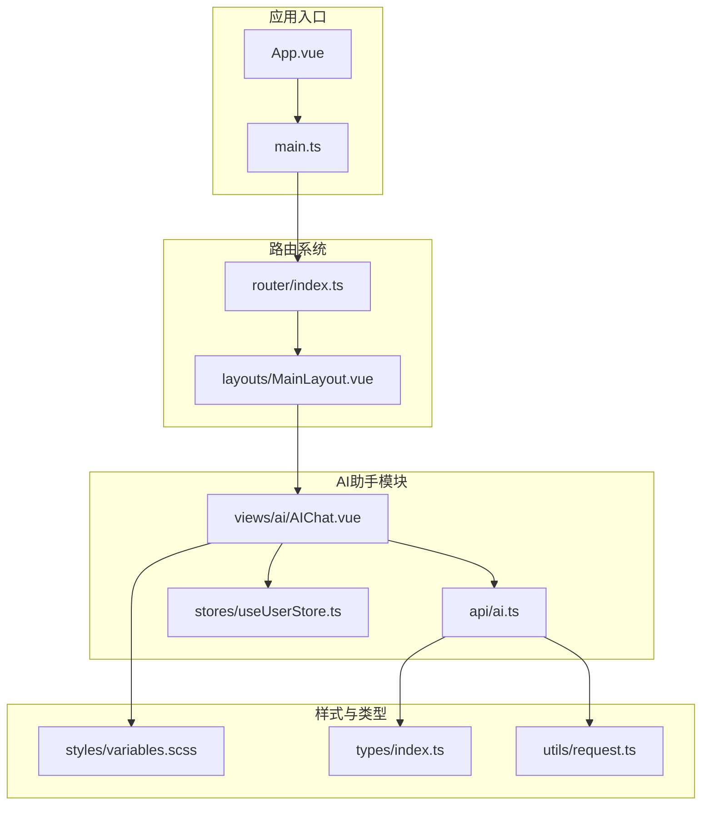
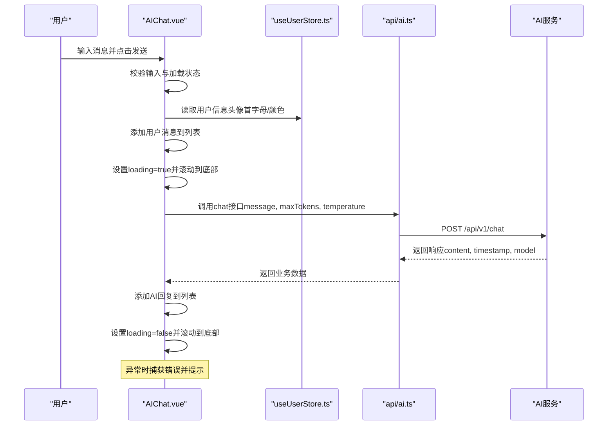
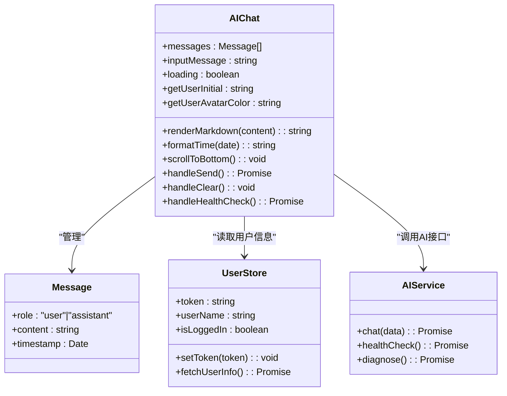

# AI智能助手页面

<cite>
**本文档引用的文件**
- [AIChat.vue](file://src/views/ai/AIChat.vue)
- [ai.ts](file://src/api/ai.ts)
- [useUserStore.ts](file://src/stores/useUserStore.ts)
- [index.ts](file://src/router/index.ts)
- [main.ts](file://src/main.ts)
- [variables.scss](file://src/styles/variables.scss)
- [index.ts](file://src/types/index.ts)
- [request.ts](file://src/utils/request.ts)
- [AI_CHAT_GUIDE.md](file://docs/AI_CHAT_GUIDE.md)
</cite>

## 目录
1. [简介](#简介)
2. [项目结构](#项目结构)
3. [核心组件](#核心组件)
4. [架构总览](#架构总览)
5. [详细组件分析](#详细组件分析)
6. [依赖关系分析](#依赖关系分析)
7. [性能考虑](#性能考虑)
8. [故障排除指南](#故障排除指南)
9. [结论](#结论)
10. [附录](#附录)

## 简介
本文件面向AI智能助手页面的开发者与维护者，系统性阐述AIChat.vue页面的设计架构与实现原理。内容涵盖聊天界面布局、消息列表渲染、输入框交互、发送按钮功能、AI对话实现机制、消息状态管理、实时响应处理、错误处理策略、用户交互逻辑、消息格式化、滚动行为与加载状态，并提供API集成方法、用户体验优化建议以及扩展AI功能的实践指导。

## 项目结构
AI智能助手页面位于views/ai目录下，通过路由集成到主布局中，采用Vue 3 Composition API + TypeScript + Element Plus + markdown-it技术栈构建。

**图表来源**
- [AIChat.vue:1-519](file://src/views/ai/AIChat.vue#L1-L519)
- [ai.ts:1-113](file://src/api/ai.ts#L1-L113)
- [useUserStore.ts:1-200](file://src/stores/useUserStore.ts#L1-L200)
- [index.ts:1-136](file://src/router/index.ts#L1-L136)
- [main.ts:1-26](file://src/main.ts#L1-L26)
- [variables.scss:1-44](file://src/styles/variables.scss#L1-L44)
- [index.ts:1-51](file://src/types/index.ts#L1-L51)
- [request.ts:1-180](file://src/utils/request.ts#L1-L180)

**章节来源**
- [AIChat.vue:1-519](file://src/views/ai/AIChat.vue#L1-L519)
- [index.ts:1-136](file://src/router/index.ts#L1-L136)
- [main.ts:1-26](file://src/main.ts#L1-L26)

## 核心组件
- 页面容器与布局：卡片式布局，包含头部标题、操作按钮、消息列表、输入区域。
- 消息列表：支持用户消息与AI助手消息两类，具备空状态展示、Markdown渲染、时间戳显示、滚动到底部。
- 输入交互：多行文本输入、快捷键发送、禁用状态控制、发送按钮与加载状态。
- 工具栏：清空对话、健康检查。
- 状态管理：消息数组、加载状态、滚动控制、用户头像与颜色计算。
- 错误处理：统一的API拦截器错误提示与业务状态码处理。

**章节来源**
- [AIChat.vue:1-519](file://src/views/ai/AIChat.vue#L1-L519)

## 架构总览
AIChat页面采用“视图组件 + API封装 + 状态管理 + 路由集成”的分层架构。Element Plus提供UI基础能力，markdown-it负责消息内容的Markdown渲染，Axios封装AI服务请求，Pinia提供用户状态管理，路由系统完成导航与权限控制。

**图表来源**
- [AIChat.vue:164-202](file://src/views/ai/AIChat.vue#L164-L202)
- [ai.ts:96-98](file://src/api/ai.ts#L96-L98)
- [useUserStore.ts:18-27](file://src/stores/useUserStore.ts#L18-L27)

## 详细组件分析

### 页面布局与样式
- 容器高度自适应：占满视口减去固定高度，保证在不同屏幕尺寸下保持良好体验。
- 卡片布局：头部区域包含标题与操作按钮；消息区域支持滚动；输入区域包含提示与发送按钮。
- 消息样式：用户消息与AI消息分别设置不同的背景色与对齐方式；Markdown内容通过深度选择器覆盖默认样式。
- 动画与交互：消息进入动画、打字指示器动画、按钮禁用态与加载态。

**章节来源**
- [AIChat.vue:231-519](file://src/views/ai/AIChat.vue#L231-L519)

### 消息列表渲染
- 数据结构：每条消息包含角色（user/assistant）、内容、时间戳。
- 渲染策略：
  - 用户消息：纯文本，头像使用用户首字母与动态生成的背景色。
  - AI消息：Markdown渲染，支持标题、列表、代码块、表格、链接、图片等。
- 空状态：当消息列表为空时显示“开始与AI助手对话”提示。
- 时间戳：格式化为HH:mm显示。

**章节来源**
- [AIChat.vue:100-154](file://src/views/ai/AIChat.vue#L100-L154)
- [AIChat.vue:28-63](file://src/views/ai/AIChat.vue#L28-L63)

### 输入框与发送交互
- 输入框：多行文本，支持Ctrl+Enter快捷键发送。
- 发送流程：
  - 校验输入非空且未处于加载状态。
  - 将用户消息加入列表，清空输入，设置loading并滚动到底部。
  - 调用chat接口，接收响应后添加AI回复，再次滚动到底部。
  - finally中重置loading状态。
- 加载状态：发送按钮与输入框在loading期间禁用，提升交互一致性。

**章节来源**
- [AIChat.vue:164-202](file://src/views/ai/AIChat.vue#L164-L202)

### Markdown渲染机制
- 渲染器初始化：使用markdown-it，启用HTML、链接识别、排版、换行等选项。
- 渲染函数：对AI返回的content进行渲染，异常时回退为原文本。
- 样式覆盖：通过深度选择器重置并定制标题、列表、代码块、表格、引用等元素的样式，确保与整体UI风格一致。

**章节来源**
- [AIChat.vue:131-147](file://src/views/ai/AIChat.vue#L131-L147)
- [AIChat.vue:332-438](file://src/views/ai/AIChat.vue#L332-L438)

### 用户头像与颜色
- 首字母：根据用户名或真实姓名取首字母并大写。
- 颜色生成：对用户名进行哈希计算，生成HSL颜色，避免过亮或过暗，与右上角头像风格保持一致。

**章节来源**
- [AIChat.vue:113-129](file://src/views/ai/AIChat.vue#L113-L129)

### 滚动行为与加载状态
- 滚动到底部：使用nextTick确保DOM更新后滚动，保证新消息可见。
- 打字指示器：AI回复前显示三点动画，增强实时反馈。
- 加载状态：loading控制按钮与输入框的禁用态，避免重复提交。

**章节来源**
- [AIChat.vue:156-162](file://src/views/ai/AIChat.vue#L156-L162)
- [AIChat.vue:449-472](file://src/views/ai/AIChat.vue#L449-L472)

### 工具栏功能
- 清空对话：清空消息列表并提示成功。
- 健康检查：调用healthCheck接口，成功时提示服务状态，失败时提示连接失败。

**章节来源**
- [AIChat.vue:204-219](file://src/views/ai/AIChat.vue#L204-L219)
- [ai.ts:103-105](file://src/api/ai.ts#L103-L105)

### API集成与错误处理
- AI服务封装：基于Axios创建独立实例，支持开发环境与生产环境的baseURL切换。
- 请求拦截：自动注入Authorization头（Bearer token）。
- 响应拦截：统一处理业务状态码（code），错误时弹出提示并抛出异常；成功时返回data。
- 接口定义：chat与healthCheck两个核心接口，分别对应消息发送与健康检查。

**章节来源**
- [ai.ts:8-113](file://src/api/ai.ts#L8-L113)

### 用户状态管理
- 用户信息：通过Pinia store提供token、用户信息、登录状态等。
- 头像与颜色：在AIChat中直接使用store计算属性，保证与全局头像风格一致。
- 初始化：页面挂载时插入欢迎消息，提升首次体验。

**章节来源**
- [useUserStore.ts:18-27](file://src/stores/useUserStore.ts#L18-L27)
- [AIChat.vue:222-228](file://src/views/ai/AIChat.vue#L222-L228)

### 路由与导航集成
- 路由配置：AI助手作为一级菜单，包含智能问答子路由。
- 权限控制：requiresAuth元信息配合全局路由守卫，未登录跳转至登录页。
- 进度条：NProgress提供页面切换进度反馈。

**章节来源**
- [index.ts:27-41](file://src/router/index.ts#L27-L41)
- [index.ts:116-133](file://src/router/index.ts#L116-L133)

## 依赖关系分析

**图表来源**
- [AIChat.vue:100-228](file://src/views/ai/AIChat.vue#L100-L228)
- [useUserStore.ts:18-199](file://src/stores/useUserStore.ts#L18-L199)
- [ai.ts:96-112](file://src/api/ai.ts#L96-L112)

**章节来源**
- [AIChat.vue:100-228](file://src/views/ai/AIChat.vue#L100-L228)
- [useUserStore.ts:18-199](file://src/stores/useUserStore.ts#L18-L199)
- [ai.ts:96-112](file://src/api/ai.ts#L96-L112)

## 性能考虑
- 渲染性能：Markdown渲染在消息量较大时可能产生开销，建议：
  - 控制单次回复长度，避免超长文本。
  - 对重复内容进行缓存（如相同消息的渲染结果）。
  - 图片懒加载，减少首屏压力。
- 滚动性能：使用nextTick确保DOM更新后滚动，避免频繁强制重排。
- 网络性能：合理设置超时与重试策略，结合加载状态避免重复请求。
- 样式性能：深度选择器仅作用于Markdown容器，避免影响全局样式。

[本节为通用性能建议，无需特定文件引用]

## 故障排除指南
- 无法发送消息
  - 检查loading状态与输入框禁用态。
  - 确认网络连接与后端服务可用。
- Markdown渲染异常
  - 确认markdown-it依赖已安装。
  - 检查控制台错误与CSS样式是否加载。
- 健康检查失败
  - 检查AI服务地址配置与跨域设置。
  - 查看响应拦截器返回的错误信息。
- 菜单不显示
  - 确认路由配置与权限校验逻辑。
  - 清除浏览器缓存后重试。

**章节来源**
- [AI_CHAT_GUIDE.md:318-345](file://docs/AI_CHAT_GUIDE.md#L318-L345)
- [ai.ts:32-77](file://src/api/ai.ts#L32-L77)

## 结论
AI智能助手页面通过清晰的组件划分、完善的错误处理与良好的用户体验设计，实现了稳定可靠的AI对话功能。其基于Element Plus与markdown-it的UI与渲染方案，结合Axios封装与Pinia状态管理，形成了可扩展、易维护的技术架构。后续可在Markdown渲染优化、消息类型扩展、样式定制等方面持续迭代。

[本节为总结性内容，无需特定文件引用]

## 附录

### 开发指南与最佳实践
- 组件开发
  - 使用Composition API组织逻辑，保持单一职责。
  - 在模板中尽量减少复杂表达式，将逻辑移至计算属性或方法。
  - 为关键交互添加aria标签与键盘快捷键支持。
- API集成
  - 统一使用api/ai.ts封装请求，避免分散的HTTP调用。
  - 在响应拦截器中集中处理业务错误，保持页面逻辑简洁。
- 用户体验
  - 保持loading状态与交互反馈一致，避免用户误操作。
  - 提供明确的错误提示与重试路径。
  - 优化滚动行为，确保新消息始终可见。
- 样式与主题
  - 使用variables.scss统一颜色与间距，保证主题一致性。
  - Markdown样式通过深度选择器隔离，避免污染其他组件。

**章节来源**
- [AIChat.vue:164-202](file://src/views/ai/AIChat.vue#L164-L202)
- [ai.ts:96-112](file://src/api/ai.ts#L96-L112)
- [variables.scss:1-44](file://src/styles/variables.scss#L1-L44)

### 扩展与定制建议
- 扩展消息类型
  - 在Message接口中增加类型字段，如“image”、“file”等。
  - 在消息渲染区增加对应的渲染组件与样式。
- 自定义聊天界面
  - 通过SCSS变量与深度选择器定制消息气泡、头像与时间戳样式。
  - 支持夜间模式切换，动态调整颜色变量。
- AI功能增强
  - 增加上下文管理与会话历史持久化。
  - 支持流式响应（WebSocket或Server-Sent Events）以提升实时性。
  - 集成代码高亮（highlight.js）与数学公式渲染（KaTeX）。

**章节来源**
- [AIChat.vue:100-154](file://src/views/ai/AIChat.vue#L100-L154)
- [AIChat.vue:332-438](file://src/views/ai/AIChat.vue#L332-L438)