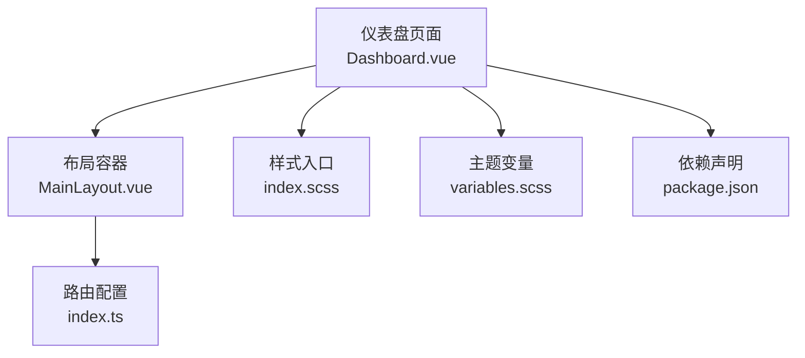
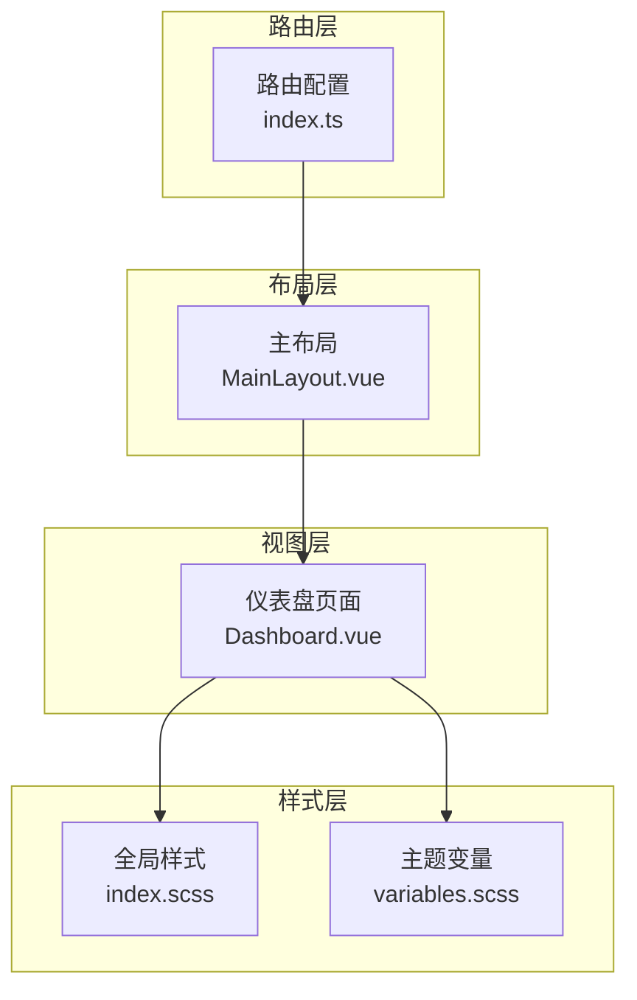
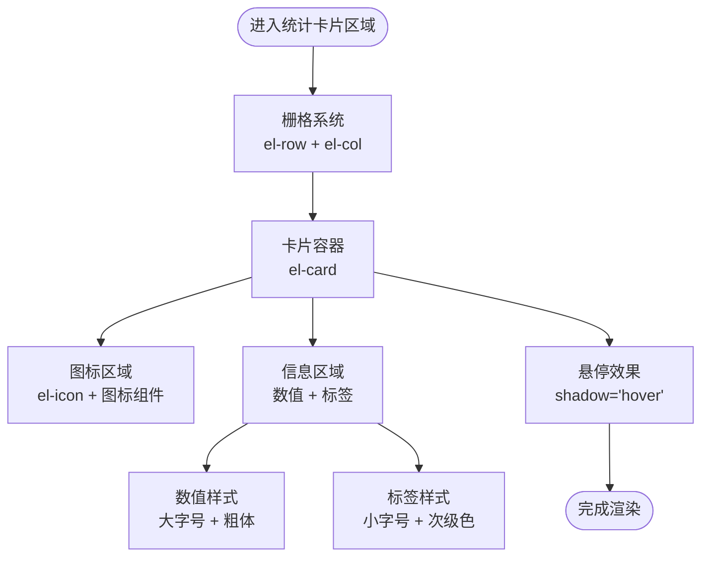
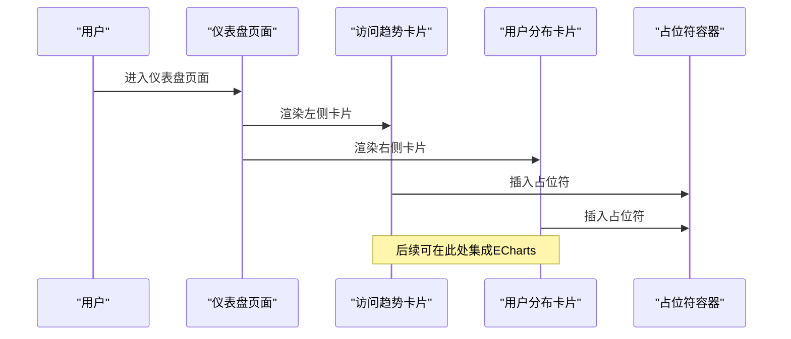
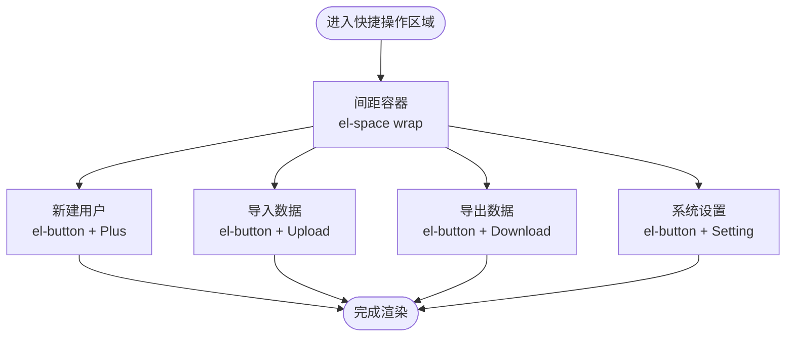
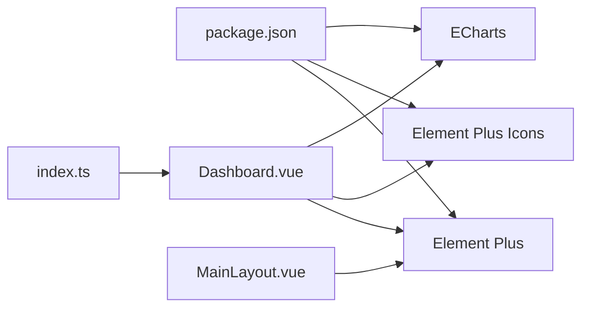

# 仪表盘页面

<cite>
**本文档引用的文件**
- [Dashboard.vue](file://src/views/dashboard/Dashboard.vue)
- [index.scss](file://src/styles/index.scss)
- [variables.scss](file://src/styles/variables.scss)
- [MainLayout.vue](file://src/layouts/MainLayout.vue)
- [index.ts](file://src/router/index.ts)
- [package.json](file://package.json)
</cite>

## 目录
1. [简介](#简介)
2. [项目结构](#项目结构)
3. [核心组件](#核心组件)
4. [架构总览](#架构总览)
5. [详细组件分析](#详细组件分析)
6. [依赖关系分析](#依赖关系分析)
7. [性能考虑](#性能考虑)
8. [故障排除指南](#故障排除指南)
9. [结论](#结论)
10. [附录](#附录)

## 简介
本文件面向仪表盘页面（Dashboard.vue）的开发者与维护者，系统性阐述其设计架构、实现原理与最佳实践。文档覆盖统计卡片组件、图表区域布局、快捷操作按钮等核心功能模块；解释响应式设计实现、Element Plus组件的使用方法、图标与样式的定制方案；说明数据展示逻辑、布局配置与用户交互设计；并提供组件开发指南、样式定制方法与性能优化建议，以及如何集成ECharts图表库、添加新的统计指标与自定义快捷操作按钮的具体步骤。

## 项目结构
仪表盘页面位于视图层的仪表盘目录中，采用Vue 3 Composition API与TypeScript编写，并通过Element Plus组件库构建UI。全局样式通过SCSS变量与工具类统一管理，路由配置将仪表盘作为主布局下的子路由，默认进入。

**图表来源**
- [Dashboard.vue:1-155](file://src/views/dashboard/Dashboard.vue#L1-L155)
- [MainLayout.vue:1-434](file://src/layouts/MainLayout.vue#L1-L434)
- [index.scss:1-114](file://src/styles/index.scss#L1-L114)
- [variables.scss:1-44](file://src/styles/variables.scss#L1-L44)
- [index.ts:1-136](file://src/router/index.ts#L1-L136)
- [package.json:1-48](file://package.json#L1-L48)

**章节来源**
- [Dashboard.vue:1-155](file://src/views/dashboard/Dashboard.vue#L1-L155)
- [index.ts:16-26](file://src/router/index.ts#L16-L26)

## 核心组件
仪表盘页面由三大核心区域构成：
- 统计卡片区域：展示关键指标（用户总数、文章数量、评论数量、访问量），采用栅格系统实现响应式布局。
- 图表区域：两个卡片内含占位符，预留集成ECharts等图表库的空间。
- 快捷操作区域：提供常用操作按钮（新建用户、导入数据、导出数据、系统设置），便于快速执行任务。

每个区域均使用Element Plus的卡片、栅格、按钮、图标等组件，配合SCSS样式实现统一视觉风格与交互体验。

**章节来源**
- [Dashboard.vue:3-52](file://src/views/dashboard/Dashboard.vue#L3-L52)
- [Dashboard.vue:54-81](file://src/views/dashboard/Dashboard.vue#L54-L81)
- [Dashboard.vue:83-96](file://src/views/dashboard/Dashboard.vue#L83-L96)

## 架构总览
仪表盘页面在应用中的位置与职责如下：
- 路由层：通过路由配置将仪表盘注册为主布局的子路由，默认跳转至仪表盘。
- 布局层：主布局负责侧边栏、面包屑、头部导航与主题切换，仪表盘作为主内容区渲染。
- 视图层：仪表盘页面负责统计卡片、图表区域与快捷操作的展示与交互。
- 样式层：全局样式与主题变量统一管理颜色、间距与阴影等视觉元素。

**图表来源**
- [index.ts:16-26](file://src/router/index.ts#L16-L26)
- [MainLayout.vue:106-112](file://src/layouts/MainLayout.vue#L106-L112)
- [Dashboard.vue:1-155](file://src/views/dashboard/Dashboard.vue#L1-L155)
- [index.scss:1-114](file://src/styles/index.scss#L1-L114)
- [variables.scss:1-44](file://src/styles/variables.scss#L1-L44)

## 详细组件分析

### 统计卡片组件
统计卡片用于直观展示关键业务指标，采用四列栅格布局，支持不同屏幕尺寸的自适应显示。每个卡片包含图标、数值与标签三部分，整体采用悬停阴影增强交互反馈。

- 响应式断点：在超小屏（xs）下每行一列，在小屏（sm）下两列，在中屏（md）及以上为四列。
- 内容结构：图标使用Element Plus图标库，数值与标签分别对应大号加粗数字与辅助说明文字。
- 样式要点：卡片底部留白、图标尺寸与信息区弹性布局、数值与标签颜色层次分明。

**图表来源**
- [Dashboard.vue:4-52](file://src/views/dashboard/Dashboard.vue#L4-L52)
- [Dashboard.vue:108-136](file://src/views/dashboard/Dashboard.vue#L108-L136)

**章节来源**
- [Dashboard.vue:4-52](file://src/views/dashboard/Dashboard.vue#L4-L52)
- [Dashboard.vue:108-136](file://src/views/dashboard/Dashboard.vue#L108-L136)

### 图表区域布局
图表区域由两个等宽卡片组成，左侧展示“访问趋势”，右侧展示“用户分布”。每个卡片顶部提供标题，内部为占位符区域，便于后续集成ECharts或其他可视化库。

- 布局策略：使用栅格系统实现左右分栏，移动端自动堆叠。
- 占位符设计：统一的占位样式与高度，便于后续替换为实际图表容器。
- 扩展性：卡片头部模板与占位符结构清晰，便于插入图表实例与事件处理。

**图表来源**
- [Dashboard.vue:54-81](file://src/views/dashboard/Dashboard.vue#L54-L81)
- [Dashboard.vue:145-153](file://src/views/dashboard/Dashboard.vue#L145-L153)

**章节来源**
- [Dashboard.vue:54-81](file://src/views/dashboard/Dashboard.vue#L54-L81)
- [Dashboard.vue:145-153](file://src/views/dashboard/Dashboard.vue#L145-L153)

### 快捷操作按钮
快捷操作区域提供四个常用操作按钮，分别对应新建用户、导入数据、导出数据与系统设置。按钮类型与图标按功能语义进行区分，整体采用可换行的间距容器以适配不同屏幕宽度。

- 按钮类型：primary、success、warning、info，分别对应不同操作的重要程度。
- 图标语义：使用Element Plus内置图标，提升识别度。
- 响应式：使用可换行间距容器，保证在窄屏设备上的良好显示。

**图表来源**
- [Dashboard.vue:83-96](file://src/views/dashboard/Dashboard.vue#L83-L96)

**章节来源**
- [Dashboard.vue:83-96](file://src/views/dashboard/Dashboard.vue#L83-L96)

### 响应式设计实现
仪表盘页面通过Element Plus栅格系统的断点属性实现响应式布局：
- xs：超小屏，每行一列，适合移动设备。
- sm：小屏，两列，兼顾桌面与平板。
- md及以上：四列，充分利用大屏空间。

同时，全局样式提供了常用的间距工具类（如 mb-lg），用于控制卡片之间的垂直间距，确保在不同断点下的一致体验。

**章节来源**
- [Dashboard.vue:5-51](file://src/views/dashboard/Dashboard.vue#L5-L51)
- [Dashboard.vue:69-80](file://src/views/dashboard/Dashboard.vue#L69-L80)
- [index.scss:79-101](file://src/styles/index.scss#L79-L101)

### Element Plus组件使用方法
- 卡片与栅格：使用el-card、el-row、el-col构建布局与内容容器。
- 图标：通过el-icon包裹具体图标组件，支持颜色与尺寸控制。
- 按钮与间距：使用el-button与el-space实现操作按钮与间距控制。
- 头部模板：卡片头部使用具名插槽#header实现自定义标题。

这些组件的组合使用确保了界面的一致性与可维护性。

**章节来源**
- [Dashboard.vue:4-96](file://src/views/dashboard/Dashboard.vue#L4-L96)

### 图标与样式的定制方案
- 图标库：项目已引入Element Plus图标库，可在组件中直接使用图标组件。
- 主题变量：通过variables.scss集中管理主题色、文字色、背景色与圆角、阴影等变量，便于统一风格。
- 全局样式：index.scss提供通用工具类与全局重置，确保组件样式的一致性。
- 卡片头部：使用flex布局实现标题与操作的对齐，增强可读性与一致性。

**章节来源**
- [package.json:14-25](file://package.json#L14-L25)
- [variables.scss:1-44](file://src/styles/variables.scss#L1-L44)
- [index.scss:1-114](file://src/styles/index.scss#L1-L114)
- [Dashboard.vue:138-143](file://src/views/dashboard/Dashboard.vue#L138-L143)

### 数据展示逻辑与用户交互设计
- 数据展示：当前仪表盘为静态占位展示，统计卡片与图表区域均以占位符呈现。实际业务中，可通过请求接口获取数据后绑定到相应区域。
- 用户交互：快捷操作按钮提供直接的操作入口；卡片悬停阴影增强点击反馈；图表区域预留交互事件（如点击、缩放等）以便后续扩展。
- 可访问性：使用语义化标签与合适的颜色对比度，确保不同用户群体的可用性。

**章节来源**
- [Dashboard.vue:100-102](file://src/views/dashboard/Dashboard.vue#L100-L102)

## 依赖关系分析
仪表盘页面与项目其他模块的依赖关系如下：
- 路由依赖：通过路由配置注册为主布局的子路由，确保页面在正确布局中渲染。
- 布局依赖：依赖主布局提供的侧边栏、面包屑与头部导航，形成统一的导航体系。
- 样式依赖：依赖全局样式与主题变量，确保视觉风格一致。
- 组件依赖：依赖Element Plus组件库，包括卡片、栅格、按钮、图标等。

**图表来源**
- [package.json:14-25](file://package.json#L14-L25)
- [Dashboard.vue:1-155](file://src/views/dashboard/Dashboard.vue#L1-L155)
- [MainLayout.vue:1-434](file://src/layouts/MainLayout.vue#L1-L434)
- [index.ts:16-26](file://src/router/index.ts#L16-L26)

**章节来源**
- [package.json:14-25](file://package.json#L14-L25)
- [Dashboard.vue:1-155](file://src/views/dashboard/Dashboard.vue#L1-L155)
- [MainLayout.vue:1-434](file://src/layouts/MainLayout.vue#L1-L434)
- [index.ts:16-26](file://src/router/index.ts#L16-L26)

## 性能考虑
- 组件懒加载：路由层采用动态导入，减少初始包体积。
- 样式按需：通过SCSS变量与工具类减少重复样式，降低CSS体积。
- 图表性能：图表区域采用占位符，避免在首屏渲染时加载重型图表库；后续按需引入ECharts并进行初始化与销毁管理。
- 响应式优化：合理使用栅格断点，避免在小屏设备上出现过多重排与重绘。
- 交互优化：卡片悬停阴影与按钮状态切换均为轻量级DOM操作，不影响整体性能。

[本节为通用性能指导，不直接分析特定文件，故无章节来源]

## 故障排除指南
- 图标不显示：检查是否正确引入Element Plus图标库并在组件中使用el-icon包裹图标组件。
- 样式异常：确认全局样式与主题变量已正确引入，且组件样式未被外部样式覆盖。
- 布局错位：检查栅格断点设置与容器高度，确保在不同屏幕尺寸下正常显示。
- 路由无法进入：确认路由配置中仪表盘路径与组件导入正确，且主布局已正确嵌套。

**章节来源**
- [package.json:14-25](file://package.json#L14-L25)
- [Dashboard.vue:1-155](file://src/views/dashboard/Dashboard.vue#L1-L155)
- [index.ts:16-26](file://src/router/index.ts#L16-L26)

## 结论
仪表盘页面通过清晰的区域划分与响应式布局，结合Element Plus组件与统一的样式体系，实现了简洁而高效的可视化展示。当前版本以静态占位为主，后续可按需集成ECharts图表库、接入数据接口与完善交互逻辑，以满足更复杂的业务需求。

[本节为总结性内容，不直接分析特定文件，故无章节来源]

## 附录

### 开发指南
- 统计卡片扩展：在现有统计卡片基础上，增加数据绑定与格式化函数，实现动态数值更新。
- 图表集成：在图表占位符区域内引入ECharts，初始化图表实例并监听窗口变化进行自适应调整。
- 快捷操作扩展：根据业务需要新增操作按钮，确保图标与类型与功能语义一致。
- 响应式优化：根据目标设备特性调整栅格断点与卡片尺寸，提升移动端体验。

[本节为通用开发指导，不直接分析特定文件，故无章节来源]

### 样式定制方法
- 主题变量：通过修改variables.scss中的颜色、间距与圆角等变量，统一调整整体风格。
- 卡片样式：在组件内使用scoped样式覆盖默认样式，注意与全局样式的协调。
- 工具类：利用index.scss中的通用工具类简化布局与间距控制。

**章节来源**
- [variables.scss:1-44](file://src/styles/variables.scss#L1-L44)
- [index.scss:1-114](file://src/styles/index.scss#L1-L114)
- [Dashboard.vue:104-153](file://src/views/dashboard/Dashboard.vue#L104-L153)

### 性能优化建议
- 按需加载：仅在需要时引入图表库与第三方组件，减少首屏资源消耗。
- 虚拟滚动：对于大量数据的表格或列表，考虑使用虚拟滚动提升渲染性能。
- 缓存策略：对静态资源与接口数据实施合理的缓存策略，减少重复请求。
- 动画优化：控制动画频率与复杂度，避免影响页面流畅度。

[本节为通用性能指导，不直接分析特定文件，故无章节来源]

### 集成ECharts图表库
- 安装依赖：在package.json中确保已安装ECharts。
- 引入图表：在图表占位符区域内引入ECharts并初始化实例。
- 数据绑定：将后端返回的数据映射到图表配置中，实现动态渲染。
- 事件处理：为图表绑定点击、缩放等事件，增强交互体验。
- 销毁清理：在组件卸载时销毁图表实例，释放内存资源。

**章节来源**
- [package.json:19](file://package.json#L19)
- [Dashboard.vue:63-78](file://src/views/dashboard/Dashboard.vue#L63-L78)

### 添加新的统计指标
- 数据准备：从后端接口获取新的指标数据，确保数据格式与现有卡片一致。
- 模板扩展：复制现有统计卡片结构，替换图标、数值与标签内容。
- 样式适配：根据新指标的视觉需求调整字体大小与颜色，保持整体风格一致。

**章节来源**
- [Dashboard.vue:5-51](file://src/views/dashboard/Dashboard.vue#L5-L51)

### 自定义快捷操作按钮
- 按钮类型：根据操作重要程度选择合适的类型（primary、success、warning、info）。
- 图标选择：选择与功能匹配的图标，提升识别度。
- 事件绑定：为按钮绑定相应的事件处理函数，实现业务逻辑。

**章节来源**
- [Dashboard.vue:90-95](file://src/views/dashboard/Dashboard.vue#L90-L95)