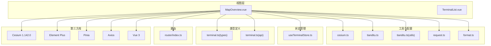
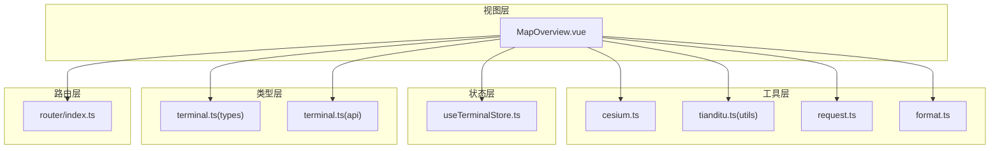
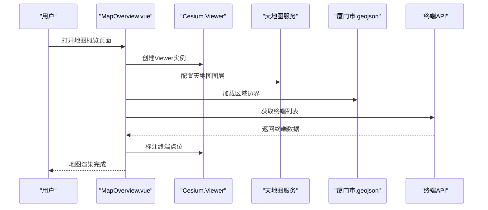
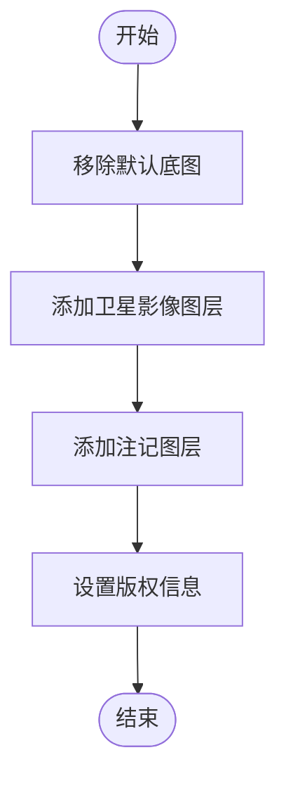
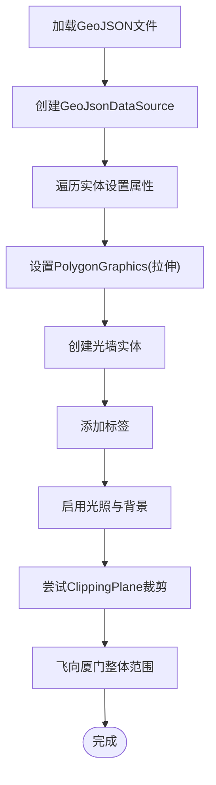
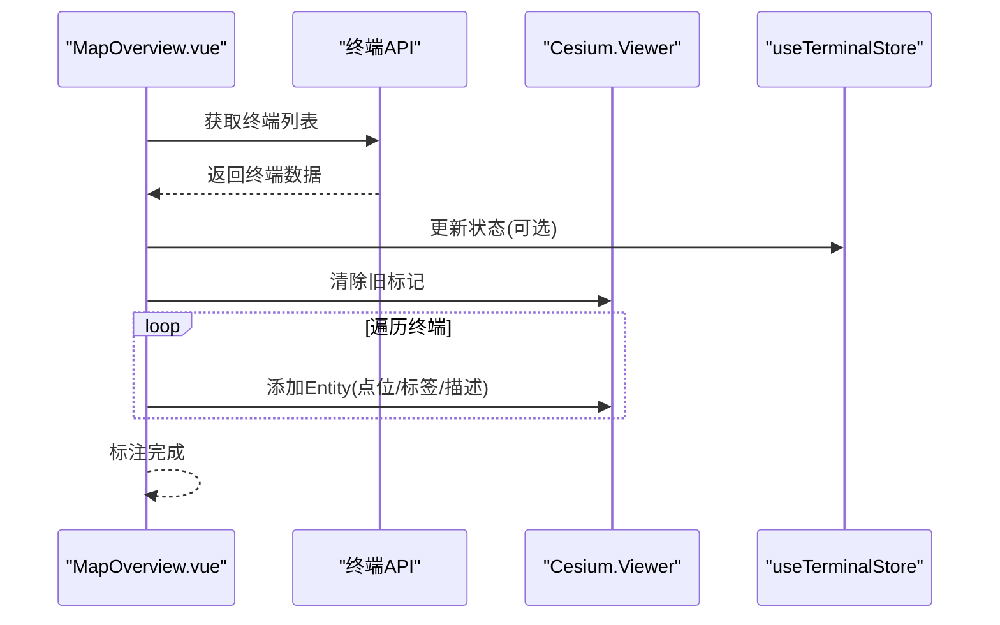
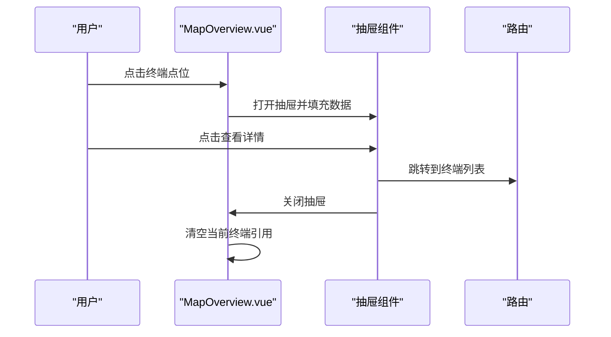
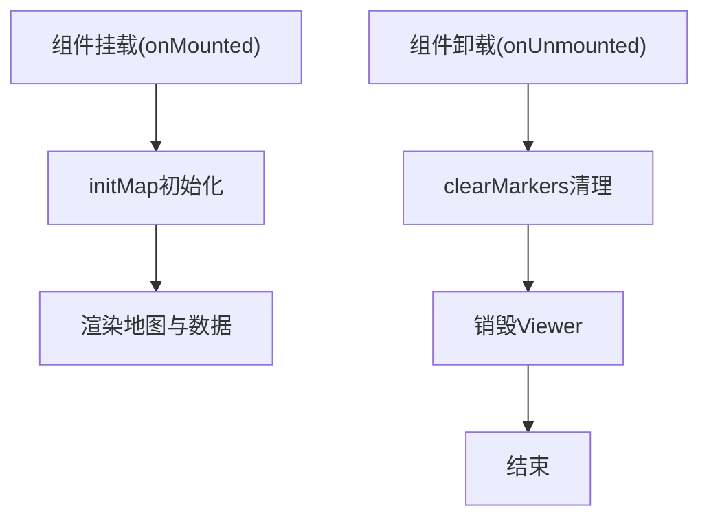
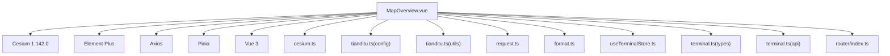

# 地图展示页面

<cite>
**本文档引用的文件**
- [MapOverview.vue](file://src/views/map/MapOverview.vue)
- [cesium.ts](file://src/utils/cesium.ts)
- [tianditu.ts](file://src/config/tianditu.ts)
- [useTerminalStore.ts](file://src/stores/useTerminalStore.ts)
- [terminal.ts](file://src/types/terminal.ts)
- [terminal.ts](file://src/api/terminal.ts)
- [format.ts](file://src/utils/format.ts)
- [request.ts](file://src/utils/request.ts)
- [tianditu.ts](file://src/utils/tianditu.ts)
- [index.ts](file://src/router/index.ts)
- [package.json](file://package.json)
- [厦门市.geojson](file://厦门市.geojson)
</cite>

## 目录
1. [简介](#简介)
2. [项目结构](#项目结构)
3. [核心组件](#核心组件)
4. [架构总览](#架构总览)
5. [详细组件分析](#详细组件分析)
6. [依赖关系分析](#依赖关系分析)
7. [性能考虑](#性能考虑)
8. [故障排除指南](#故障排除指南)
9. [结论](#结论)
10. [附录](#附录)

## 简介
本文件面向地图展示页面的开发者与维护者，系统性阐述 MapOverview.vue 页面的设计架构与实现原理。重点覆盖 Cesium 3D 地图集成方式、天地图服务配置、终端设备标注显示、区域边界绘制等核心功能；同时解释地图初始化配置、视角控制、交互操作与性能优化策略，并给出组件生命周期管理、事件处理、数据更新机制与错误处理的最佳实践。文档还提供页面组件开发指南、地图 API 使用方法以及可视化效果定制建议，涵盖如何添加新图层、自定义终端图标与实现地图搜索功能的扩展思路。

## 项目结构
MapOverview.vue 位于前端工程的视图层，采用 Vue 3 Composition API 与 TypeScript 开发，结合 Cesium 1.142.0 实现 3D 地图渲染。项目通过 Vite 构建，使用 Element Plus 作为 UI 组件库，Pinia 管理全局状态，Axios 封装网络请求。

**图表来源**
- [MapOverview.vue:52-623](file://src/views/map/MapOverview.vue#L52-L623)
- [cesium.ts:1-19](file://src/utils/cesium.ts#L1-L19)
- [tianditu.ts:1-28](file://src/config/tianditu.ts#L1-L28)
- [tianditu.ts:1-68](file://src/utils/tianditu.ts#L1-L68)
- [request.ts:1-180](file://src/utils/request.ts#L1-L180)
- [format.ts:1-102](file://src/utils/format.ts#L1-L102)
- [useTerminalStore.ts:1-294](file://src/stores/useTerminalStore.ts#L1-L294)
- [terminal.ts:1-84](file://src/types/terminal.ts#L1-L84)
- [terminal.ts:1-59](file://src/api/terminal.ts#L1-L59)
- [index.ts:1-136](file://src/router/index.ts#L1-L136)
- [package.json:1-48](file://package.json#L1-L48)

**章节来源**
- [MapOverview.vue:1-649](file://src/views/map/MapOverview.vue#L1-L649)
- [package.json:1-48](file://package.json#L1-L48)

## 核心组件
- MapOverview.vue：地图主页面，负责 Cesium 初始化、天地图图层配置、区域边界加载、终端标注、抽屉详情展示与生命周期管理。
- cesium.ts：Cesium 初始化与资源路径配置，解决 Vite + Cesium 的兼容性问题。
- tianditu.ts（config）：天地图配置常量，包含 API 密钥、默认中心点与缩放级别。
- tianditu.ts（utils）：天地图 JS SDK 动态加载工具类，提供可用性检查与实例获取。
- useTerminalStore.ts：终端状态管理，封装分页查询、详情、创建、更新、删除等动作。
- terminal.ts（types）：终端实体与查询参数类型定义。
- terminal.ts（api）：终端 API 封装，提供分页查询、详情、增删改等接口。
- request.ts：Axios 实例封装，统一处理响应数据、大整数精度、Token 注入与错误提示。
- format.ts：通用格式化工具，包括日期时间格式化、防抖节流等。
- index.ts（router）：路由配置，包含地图概览页面的路由定义与鉴权守卫。

**章节来源**
- [MapOverview.vue:52-623](file://src/views/map/MapOverview.vue#L52-L623)
- [cesium.ts:1-19](file://src/utils/cesium.ts#L1-L19)
- [tianditu.ts:1-28](file://src/config/tianditu.ts#L1-L28)
- [tianditu.ts:1-68](file://src/utils/tianditu.ts#L1-L68)
- [useTerminalStore.ts:1-294](file://src/stores/useTerminalStore.ts#L1-L294)
- [terminal.ts:1-84](file://src/types/terminal.ts#L1-L84)
- [terminal.ts:1-59](file://src/api/terminal.ts#L1-L59)
- [request.ts:1-180](file://src/utils/request.ts#L1-L180)
- [format.ts:1-102](file://src/utils/format.ts#L1-L102)
- [index.ts:1-136](file://src/router/index.ts#L1-L136)

## 架构总览
MapOverview.vue 采用“视图层 + 工具层 + 状态层 + 类型层 + 路由层”的分层架构：
- 视图层：MapOverview.vue 负责地图渲染、交互与 UI 展示。
- 工具层：cesium.ts、tianditu.ts(utils)、request.ts、format.ts 提供基础设施能力。
- 状态层：useTerminalStore.ts 管理终端数据与交互状态。
- 类型层：terminal.ts(types) 定义数据模型与查询参数。
- 路由层：index.ts(router) 控制页面跳转与权限校验。

**图表来源**
- [MapOverview.vue:52-623](file://src/views/map/MapOverview.vue#L52-L623)
- [cesium.ts:1-19](file://src/utils/cesium.ts#L1-L19)
- [tianditu.ts:1-68](file://src/utils/tianditu.ts#L1-L68)
- [request.ts:1-180](file://src/utils/request.ts#L1-L180)
- [format.ts:1-102](file://src/utils/format.ts#L1-L102)
- [useTerminalStore.ts:1-294](file://src/stores/useTerminalStore.ts#L1-L294)
- [terminal.ts:1-84](file://src/types/terminal.ts#L1-L84)
- [terminal.ts:1-59](file://src/api/terminal.ts#L1-L59)
- [index.ts:1-136](file://src/router/index.ts#L1-L136)

## 详细组件分析

### 地图初始化与 Cesium 集成
- 初始化流程：在组件挂载时调用 initMap，创建 Cesium.Viewer 实例，配置控件与场景参数，设置初始视角，加载天地图图层与区域边界，最后加载终端数据并标注。
- 资源路径：通过 cesium.ts 设置 Cesium 资源路径，确保 Vite 构建后静态资源正确加载。
- 视角控制：使用 camera.setView 设置厦门市中心坐标与倾斜角度，配合 flyTo 实现缩放与飞行过渡。

**图表来源**
- [MapOverview.vue:77-124](file://src/views/map/MapOverview.vue#L77-L124)
- [MapOverview.vue:129-162](file://src/views/map/MapOverview.vue#L129-L162)
- [MapOverview.vue:302-462](file://src/views/map/MapOverview.vue#L302-L462)
- [MapOverview.vue:467-557](file://src/views/map/MapOverview.vue#L467-L557)

**章节来源**
- [MapOverview.vue:77-124](file://src/views/map/MapOverview.vue#L77-L124)
- [MapOverview.vue:129-162](file://src/views/map/MapOverview.vue#L129-L162)
- [MapOverview.vue:302-462](file://src/views/map/MapOverview.vue#L302-L462)
- [MapOverview.vue:467-557](file://src/views/map/MapOverview.vue#L467-L557)
- [cesium.ts:1-19](file://src/utils/cesium.ts#L1-L19)

### 天地图服务配置
- 图层配置：移除默认底图，添加天地图卫星影像与注记图层，设置瓦片服务地址、图层标识、样式与最大缩放级别。
- Token 管理：使用配置文件中的 API 密钥，确保服务可用性与配额控制。
- 动态加载：tianditu.ts(utils) 提供天地图 JS SDK 的动态加载与可用性检测，便于扩展其他天地图能力。

**图表来源**
- [MapOverview.vue:129-162](file://src/views/map/MapOverview.vue#L129-L162)
- [tianditu.ts:1-28](file://src/config/tianditu.ts#L1-L28)
- [tianditu.ts:1-68](file://src/utils/tianditu.ts#L1-L68)

**章节来源**
- [MapOverview.vue:129-162](file://src/views/map/MapOverview.vue#L129-L162)
- [tianditu.ts:1-28](file://src/config/tianditu.ts#L1-L28)
- [tianditu.ts:1-68](file://src/utils/tianditu.ts#L1-L68)

### 区域边界绘制与裁剪效果
- GeoJSON 加载：通过 fetch 读取本地 geojson 文件，使用 Cesium.GeoJsonDataSource 加载边界数据。
- 3D 立体效果：为每个行政区实体设置 PolygonGraphics，启用 extrudedHeight 实现拉伸，classificationType 使效果同时作用于地形与 3D Tiles。
- 光墙效果：基于边界坐标创建垂直墙体，使用 ImageMaterialProperty 与自定义发光纹理实现青色光墙。
- 裁剪效果：尝试使用 ClippingPlaneCollection 对边界进行精确裁剪，保留多边形内部区域，外部区域隐藏为黑色背景。
- 标签与光照：为每个行政区添加标签，设置字体、描边与缩放条件；启用 Globe 光照与方向光源增强立体感。

**图表来源**
- [MapOverview.vue:302-462](file://src/views/map/MapOverview.vue#L302-L462)
- [MapOverview.vue:206-297](file://src/views/map/MapOverview.vue#L206-L297)

**章节来源**
- [MapOverview.vue:302-462](file://src/views/map/MapOverview.vue#L302-L462)
- [MapOverview.vue:206-297](file://src/views/map/MapOverview.vue#L206-L297)
- [厦门市.geojson:1-1](file://厦门市.geojson#L1-L1)

### 终端设备标注显示
- 数据获取：通过 getTerminalPageApi 获取终端列表，支持大页码与足够大的 pageSize。
- 标注逻辑：遍历终端列表，根据经纬度创建 Cesium Entity，设置点状与标签样式，贴地显示；根据在线状态设置不同颜色。
- 描述信息：为每个实体设置 description，点击弹出详情；使用 createMarkerSvg 生成 SVG 图标，支持颜色动态变化。
- 清理机制：clearMarkers 在重新加载或销毁时移除旧标记，避免重复叠加。

**图表来源**
- [MapOverview.vue:467-557](file://src/views/map/MapOverview.vue#L467-L557)
- [terminal.ts:16-18](file://src/api/terminal.ts#L16-L18)
- [useTerminalStore.ts:69-93](file://src/stores/useTerminalStore.ts#L69-L93)

**章节来源**
- [MapOverview.vue:467-557](file://src/views/map/MapOverview.vue#L467-L557)
- [terminal.ts:16-18](file://src/api/terminal.ts#L16-L18)
- [useTerminalStore.ts:69-93](file://src/stores/useTerminalStore.ts#L69-L93)

### 抽屉详情与交互
- 抽屉组件：右侧滑出式抽屉展示当前选中终端的详细信息，包含在线状态、经纬度、安装位置与最后上报时间。
- 详情跳转：点击“查看详情”按钮跳转至终端列表页面并携带 viewId 参数，便于定位到对应记录。
- 关闭处理：抽屉关闭时清空当前终端引用，避免内存泄漏。

**图表来源**
- [MapOverview.vue:7-48](file://src/views/map/MapOverview.vue#L7-L48)
- [MapOverview.vue:588-604](file://src/views/map/MapOverview.vue#L588-L604)
- [index.ts:44-48](file://src/router/index.ts#L44-L48)

**章节来源**
- [MapOverview.vue:7-48](file://src/views/map/MapOverview.vue#L7-L48)
- [MapOverview.vue:588-604](file://src/views/map/MapOverview.vue#L588-L604)
- [index.ts:44-48](file://src/router/index.ts#L44-L48)

### 生命周期管理与资源清理
- 挂载阶段：initMap 初始化地图、图层与数据。
- 卸载阶段：clearMarkers 清理所有实体，销毁 Cesium.Viewer，防止内存泄漏与资源占用。

**图表来源**
- [MapOverview.vue:606-622](file://src/views/map/MapOverview.vue#L606-L622)

**章节来源**
- [MapOverview.vue:606-622](file://src/views/map/MapOverview.vue#L606-L622)

### 错误处理与消息提示
- 地图初始化：捕获异常并提示失败，避免页面崩溃。
- 区域边界：加载失败时提示文件缺失，保证用户体验。
- 终端数据：获取失败时提示错误，避免阻塞主流程。
- 网络请求：Axios 封装统一处理业务状态码与网络错误，Token 过期时自动登出并跳转登录页。

**章节来源**
- [MapOverview.vue:120-123](file://src/views/map/MapOverview.vue#L120-L123)
- [MapOverview.vue:458-461](file://src/views/map/MapOverview.vue#L458-L461)
- [MapOverview.vue:481-484](file://src/views/map/MapOverview.vue#L481-L484)
- [request.ts:96-151](file://src/utils/request.ts#L96-L151)

## 依赖关系分析
- 外部依赖：Cesium 1.142.0、Element Plus、Axios、Pinia、Vue 3、Vite。
- 内部依赖：MapOverview.vue 依赖 cesium.ts、tianditu.ts(config)、tianditu.ts(utils)、request.ts、format.ts、useTerminalStore.ts、terminal.ts(types)、terminal.ts(api)、router/index.ts。
- 第三方插件：vite-plugin-cesium 用于 Cesium 资源处理。

**图表来源**
- [MapOverview.vue:52-623](file://src/views/map/MapOverview.vue#L52-L623)
- [package.json:14-46](file://package.json#L14-L46)

**章节来源**
- [MapOverview.vue:52-623](file://src/views/map/MapOverview.vue#L52-L623)
- [package.json:14-46](file://package.json#L14-L46)

## 性能考虑
- 资源路径：通过 cesium.ts 配置资源路径，避免 Vite 构建后静态资源 404。
- 数据规模：终端数据一次性加载，建议在大数据场景下采用分页或按需加载策略。
- 视觉效果：ClippingPlane 数量较多可能影响性能，可根据需求调整裁剪精度或禁用。
- 光墙纹理：createGlowTexture 生成的 Canvas 可缓存复用，减少重复创建。
- 标签与显示条件：合理设置标签的 scaleByDistance 与 distanceDisplayCondition，避免远距离标签渲染造成性能损耗。
- 背景与光照：黑色背景与光照设置会增加 GPU 负担，建议在低端设备上适当简化。

[本节为通用性能建议，无需特定文件来源]

## 故障排除指南
- Cesium 资源 404：确认 cesium.ts 中资源路径配置正确，确保构建产物中包含 Cesium 静态资源。
- 天地图服务失败：检查 tianditu.ts(config) 中 API 密钥是否有效，网络是否可达；必要时使用 tianditu.ts(utils) 的 isAvailable 检查 SDK 是否加载成功。
- 区域边界加载失败：确认厦门市.geojson 文件存在且格式正确，浏览器控制台查看网络请求与解析错误。
- 终端数据为空：检查 getTerminalPageApi 的请求参数与后端接口，确保 Token 注入与响应拦截器正常工作。
- 地图渲染卡顿：减少实体数量、关闭 ClippingPlane 或降低光墙复杂度；优化标签显示条件。

**章节来源**
- [cesium.ts:1-19](file://src/utils/cesium.ts#L1-L19)
- [tianditu.ts:1-28](file://src/config/tianditu.ts#L1-L28)
- [tianditu.ts:54-56](file://src/utils/tianditu.ts#L54-L56)
- [MapOverview.vue:307-308](file://src/views/map/MapOverview.vue#L307-L308)
- [MapOverview.vue:470-473](file://src/views/map/MapOverview.vue#L470-L473)
- [request.ts:53-75](file://src/utils/request.ts#L53-L75)

## 结论
MapOverview.vue 通过清晰的分层架构与完善的错误处理机制，实现了 Cesium 3D 地图与天地图服务的无缝集成，提供了区域边界绘制、终端标注与详情抽屉等核心功能。借助 Pinia 状态管理与 Axios 封装，页面具备良好的可维护性与扩展性。建议在生产环境中进一步优化大数据场景下的渲染性能，并完善地图搜索与图层切换等高级功能。

[本节为总结性内容，无需特定文件来源]

## 附录

### 开发指南与最佳实践
- 组件开发：遵循 Composition API 与 TypeScript 规范，合理拆分初始化、加载与清理逻辑。
- 地图 API 使用：优先使用 Cesium 提供的官方 API，注意坐标系与投影差异。
- 可视化定制：通过 PolygonGraphics、Wall、ImageMaterialProperty 等实现丰富的视觉效果；注意性能与兼容性。
- 数据更新：使用 useTerminalStore 管理终端状态，结合分页查询与防抖节流优化交互体验。
- 错误处理：统一在 request.ts 中处理业务状态码与网络错误，确保用户反馈一致。

**章节来源**
- [MapOverview.vue:52-623](file://src/views/map/MapOverview.vue#L52-L623)
- [useTerminalStore.ts:1-294](file://src/stores/useTerminalStore.ts#L1-L294)
- [request.ts:1-180](file://src/utils/request.ts#L1-L180)

### 地图 API 使用方法
- 初始化：调用 initMap 创建 Viewer，配置控件与场景参数。
- 图层：configureTiandituLayers 添加天地图图层，支持卫星与注记。
- 数据：loadTerminalsAndMark 获取终端数据并标注，clearMarkers 清理旧标记。
- 视角：camera.setView 与 flyTo 控制初始视角与缩放。

**章节来源**
- [MapOverview.vue:77-124](file://src/views/map/MapOverview.vue#L77-L124)
- [MapOverview.vue:129-162](file://src/views/map/MapOverview.vue#L129-L162)
- [MapOverview.vue:467-557](file://src/views/map/MapOverview.vue#L467-L557)

### 可视化效果定制建议
- 光墙纹理：createGlowTexture 可自定义渐变与透明度，适配不同主题色。
- 标签样式：调整字体、描边、缩放与显示距离，提升可读性。
- 裁剪效果：根据需求启用 ClippingPlane，平衡视觉与性能。
- 贴地显示：统一使用 HeightReference.CLAMP_TO_GROUND，避免漂浮。

**章节来源**
- [MapOverview.vue:168-199](file://src/views/map/MapOverview.vue#L168-L199)
- [MapOverview.vue:390-404](file://src/views/map/MapOverview.vue#L390-L404)
- [MapOverview.vue:206-297](file://src/views/map/MapOverview.vue#L206-L297)
- [MapOverview.vue:518-538](file://src/views/map/MapOverview.vue#L518-L538)

### 如何添加新的地图图层
- 新图层类型：支持 WebMapTileServiceImageryProvider、WebMapServiceImageryProvider 等。
- 配置步骤：在 configureTiandituLayers 中添加新的 Provider，设置 URL、图层、样式与最大缩放级别。
- 版权与信用：为新图层设置 Credit，尊重版权信息。

**章节来源**
- [MapOverview.vue:129-162](file://src/views/map/MapOverview.vue#L129-L162)

### 如何自定义终端图标
- SVG 生成：createMarkerSvg 根据颜色生成 SVG，支持动态颜色。
- 实体样式：在 markTerminalsOnMap 中设置 billboard.image 为 SVG 数据 URI。
- 状态区分：根据在线状态动态选择颜色，提升信息密度。

**章节来源**
- [MapOverview.vue:562-571](file://src/views/map/MapOverview.vue#L562-L571)
- [MapOverview.vue:532-538](file://src/views/map/MapOverview.vue#L532-L538)
- [MapOverview.vue:499-502](file://src/views/map/MapOverview.vue#L499-L502)

### 如何实现地图搜索功能
- 天地图搜索：利用 tianditu.ts(utils) 的 SDK，调用搜索接口实现地理编码与地点检索。
- 本地搜索：结合 useTerminalStore 的查询参数，对终端列表进行筛选与高亮。
- 视角定位：通过 flyTo 或 camera.setView 将视角移动到搜索结果位置。

**章节来源**
- [tianditu.ts:1-68](file://src/utils/tianditu.ts#L1-L68)
- [useTerminalStore.ts:232-236](file://src/stores/useTerminalStore.ts#L232-L236)