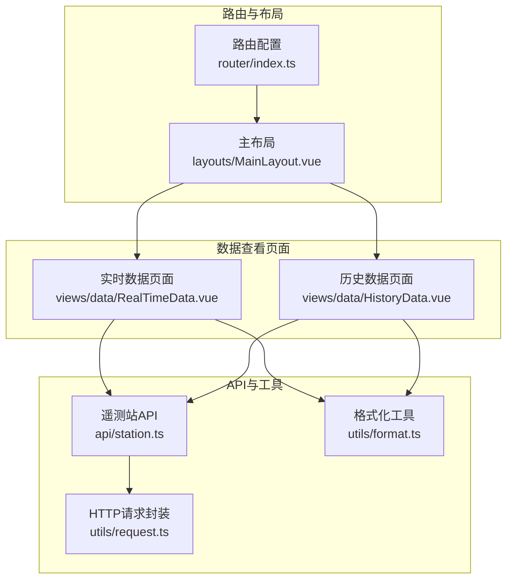
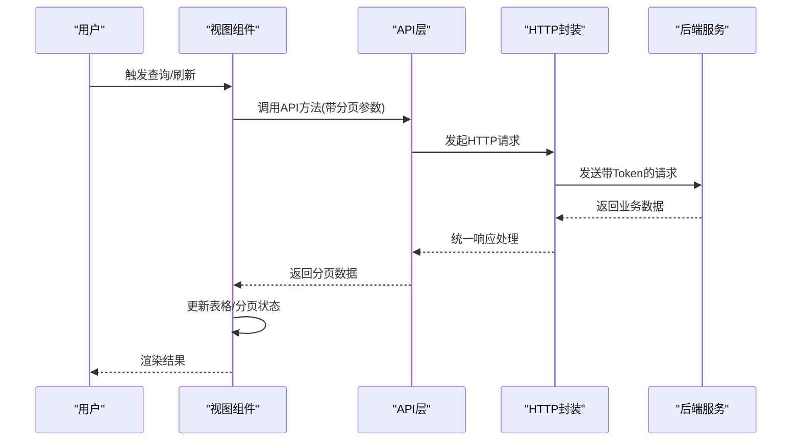
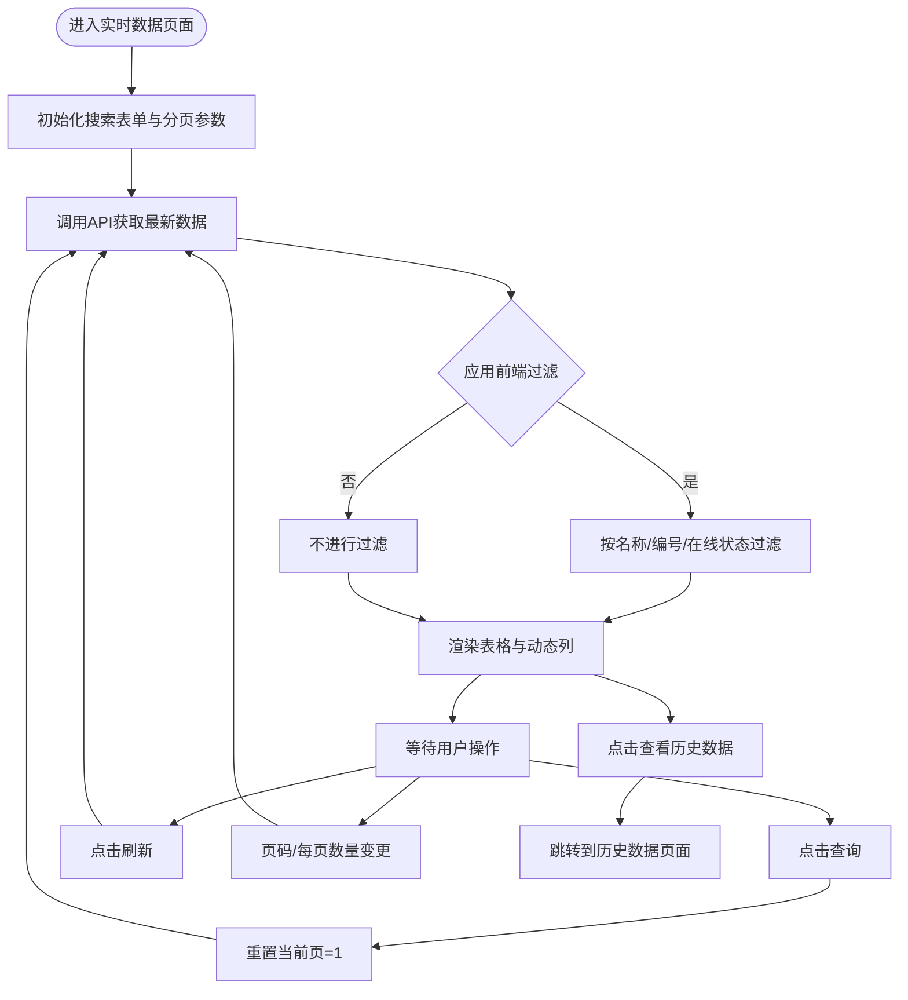
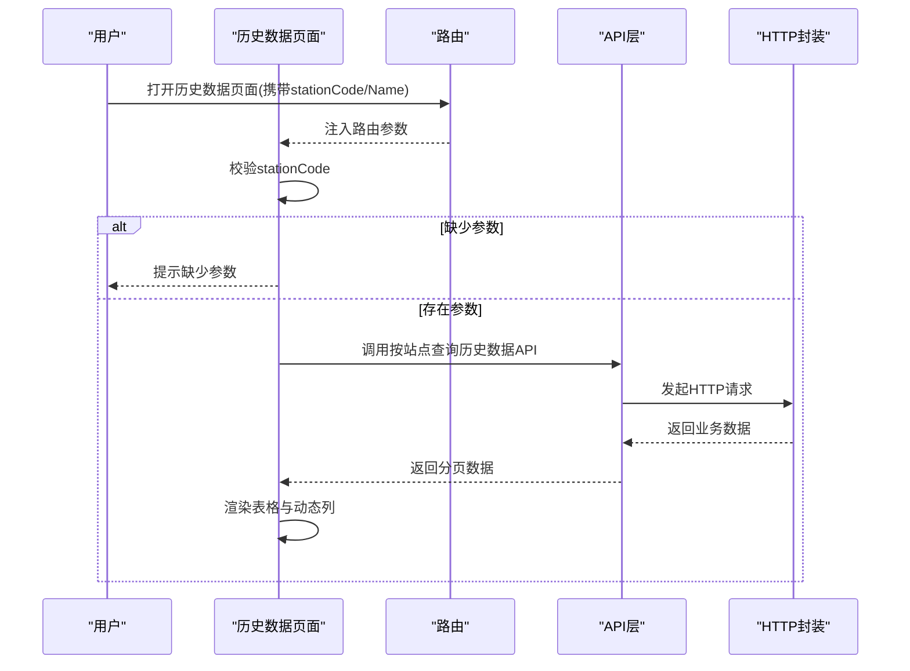
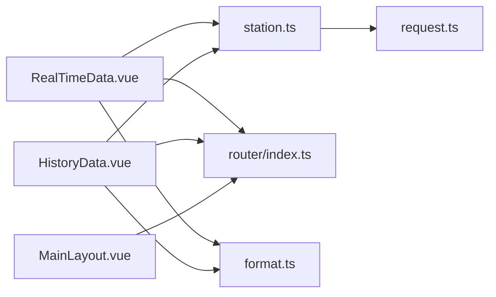

# 数据查看页面

<cite>
**本文档引用的文件**
- [RealTimeData.vue](file://src/views/data/RealTimeData.vue)
- [HistoryData.vue](file://src/views/data/HistoryData.vue)
- [station.ts](file://src/api/station.ts)
- [request.ts](file://src/utils/request.ts)
- [index.ts](file://src/router/index.ts)
- [index.ts](file://src/types/index.ts)
- [terminal.ts](file://src/types/terminal.ts)
- [format.ts](file://src/utils/format.ts)
- [MainLayout.vue](file://src/layouts/MainLayout.vue)
- [variables.scss](file://src/styles/variables.scss)
</cite>

## 目录
1. [简介](#简介)
2. [项目结构](#项目结构)
3. [核心组件](#核心组件)
4. [架构总览](#架构总览)
5. [详细组件分析](#详细组件分析)
6. [依赖关系分析](#依赖关系分析)
7. [性能考虑](#性能考虑)
8. [故障排除指南](#故障排除指南)
9. [结论](#结论)
10. [附录](#附录)

## 简介
本文件面向数据查看页面的开发者与维护者，系统性阐述实时数据页面（RealTimeData.vue）与历史数据页面（HistoryData.vue）的设计架构与实现原理。重点覆盖以下方面：
- 实时数据展示与历史数据查询的数据流与交互逻辑
- 动态数据表格渲染、筛选条件设置与分页处理
- 数据获取机制、API调用方式、错误处理与加载状态管理
- 数据格式化策略（数值精度、单位显示、空值占位）
- 页面组件的开发指南、可扩展性与性能优化建议
- 如何扩展新的数据类型、自定义查询条件以及集成可视化图表

## 项目结构
数据查看页面位于 views/data 目录，采用基于路由的页面组织方式，通过 Vue Router 的嵌套路由实现“查看数据”主菜单下的“实时数据”和“历史数据”两个子页面。页面使用 Element Plus 组件库构建 UI，并通过统一的 HTTP 工具进行 API 调用。

**图表来源**
- [index.ts:49-69](file://src/router/index.ts#L49-L69)
- [RealTimeData.vue:108-279](file://src/views/data/RealTimeData.vue#L108-L279)
- [HistoryData.vue:99-249](file://src/views/data/HistoryData.vue#L99-L249)
- [station.ts:1-115](file://src/api/station.ts#L1-L115)
- [request.ts:1-180](file://src/utils/request.ts#L1-L180)

**章节来源**
- [index.ts:49-69](file://src/router/index.ts#L49-L69)
- [RealTimeData.vue:1-300](file://src/views/data/RealTimeData.vue#L1-L300)
- [HistoryData.vue:1-271](file://src/views/data/HistoryData.vue#L1-L271)

## 核心组件
- 实时数据页面（RealTimeData.vue）
  - 提供实时数据的查询、筛选、分页与查看历史数据跳转
  - 支持按遥测站名称、编号、在线状态进行前端过滤
  - 动态渲染要素指标列，按要素类型进行数值格式化
- 历史数据页面（HistoryData.vue）
  - 基于路由参数（stationCode、stationName）查询指定站点的历史数据
  - 支持按时间段查询，动态渲染要素指标列
  - 提供分页与刷新功能

**章节来源**
- [RealTimeData.vue:108-279](file://src/views/data/RealTimeData.vue#L108-L279)
- [HistoryData.vue:99-249](file://src/views/data/HistoryData.vue#L99-L249)

## 架构总览
数据查看页面遵循“视图组件 + API 层 + HTTP 封装”的分层架构：
- 视图组件负责用户交互、状态管理与模板渲染
- API 层定义数据模型与接口契约，封装具体请求方法
- HTTP 封装统一处理请求/响应拦截、Token 注入、错误提示与大整数安全处理

**图表来源**
- [RealTimeData.vue:187-229](file://src/views/data/RealTimeData.vue#L187-L229)
- [HistoryData.vue:182-208](file://src/views/data/HistoryData.vue#L182-L208)
- [station.ts:74-104](file://src/api/station.ts#L74-L104)
- [request.ts:77-151](file://src/utils/request.ts#L77-L151)

## 详细组件分析

### 实时数据页面（RealTimeData.vue）

#### 设计要点
- 搜索表单：支持遥测站名称、编号、在线状态三类条件，使用 Element Plus 表单组件
- 数据表格：固定列（编号、名称、在线状态、观测时间、接收时间），动态列根据 elementSet 自动生成
- 数值格式化：依据要素编码特征（如 Level、Rain、Flow、Velocity、Voltage）进行不同精度的小数位处理
- 分页与刷新：内置分页参数，支持页码与每页数量变更，提供手动刷新按钮
- 历史数据跳转：点击“查看历史数据”按钮，携带站点编号与名称跳转至历史数据页面

#### 关键流程
- 初始化加载：组件挂载时自动触发一次数据获取
- 查询流程：点击查询后重置当前页为第一页，重新获取数据并应用前端过滤
- 刷新流程：直接重新获取当前页数据
- 分页流程：页码或每页数量变化时，更新分页参数并重新获取数据

**图表来源**
- [RealTimeData.vue:118-279](file://src/views/data/RealTimeData.vue#L118-L279)

**章节来源**
- [RealTimeData.vue:1-300](file://src/views/data/RealTimeData.vue#L1-L300)

#### 数据模型与API契约
- 实时数据模型（StationLatestData）包含站点基本信息、在线状态、观测时间、接收时间、要素集合等
- API 方法：分页查询所有站点最新数据，支持传入 pageNum、pageSize 参数

**章节来源**
- [station.ts:13-23](file://src/api/station.ts#L13-L23)
- [station.ts:74-80](file://src/api/station.ts#L74-L80)

#### 数据格式化策略
- 空值处理：当要素值为空时显示占位符
- 数值格式化：根据要素编码特征决定小数位数，保证数据可读性
- 单位显示：ElementItem 中包含单位字段，可在表格中按需展示

**章节来源**
- [RealTimeData.vue:155-185](file://src/views/data/RealTimeData.vue#L155-L185)
- [station.ts:5-10](file://src/api/station.ts#L5-L10)

### 历史数据页面（HistoryData.vue）

#### 设计要点
- 路由参数：从路由 query 中读取 stationCode 与 stationName，作为默认查询条件
- 时间段筛选：支持开始时间与结束时间的选择，value-format 为标准时间格式
- 数据表格：与实时页面一致的动态列渲染策略
- 分页与刷新：与实时页面相同的分页控制与刷新逻辑

#### 关键流程
- 初始化：若缺少 stationCode 参数，提示用户；否则发起数据请求
- 查询流程：点击查询后重置当前页为第一页，重新获取数据
- 刷新流程：直接重新获取当前页数据
- 分页流程：页码或每页数量变化时，更新分页参数并重新获取数据

**图表来源**
- [HistoryData.vue:107-249](file://src/views/data/HistoryData.vue#L107-L249)
- [station.ts:99-104](file://src/api/station.ts#L99-L104)

**章节来源**
- [HistoryData.vue:1-271](file://src/views/data/HistoryData.vue#L1-L271)

#### 数据模型与API契约
- 历史数据模型（TimedReportEntity）与实时数据模型类似，但支持在线状态与站点名称的可选字段
- API 方法：按站点编号查询定时数据，支持传入 pageNum、pageSize 参数

**章节来源**
- [station.ts:35-45](file://src/api/station.ts#L35-L45)
- [station.ts:99-104](file://src/api/station.ts#L99-L104)

### 公共数据格式化工具（format.ts）
- 提供日期时间格式化、文件大小格式化、防抖与节流等通用工具
- 为数据查看页面提供可复用的格式化能力，便于扩展更多数据类型的展示需求

**章节来源**
- [format.ts:1-102](file://src/utils/format.ts#L1-L102)

## 依赖关系分析

**图表来源**
- [RealTimeData.vue:113-114](file://src/views/data/RealTimeData.vue#L113-L114)
- [HistoryData.vue:104-105](file://src/views/data/HistoryData.vue#L104-L105)
- [station.ts:1-115](file://src/api/station.ts#L1-L115)
- [request.ts:1-180](file://src/utils/request.ts#L1-L180)
- [index.ts:1-136](file://src/router/index.ts#L1-L136)
- [format.ts:1-102](file://src/utils/format.ts#L1-L102)
- [MainLayout.vue:1-434](file://src/layouts/MainLayout.vue#L1-L434)

**章节来源**
- [RealTimeData.vue:108-279](file://src/views/data/RealTimeData.vue#L108-L279)
- [HistoryData.vue:99-249](file://src/views/data/HistoryData.vue#L99-L249)
- [station.ts:1-115](file://src/api/station.ts#L1-L115)
- [request.ts:1-180](file://src/utils/request.ts#L1-L180)
- [index.ts:1-136](file://src/router/index.ts#L1-L136)
- [format.ts:1-102](file://src/utils/format.ts#L1-L102)
- [MainLayout.vue:1-434](file://src/layouts/MainLayout.vue#L1-L434)

## 性能考虑
- 前端过滤策略：实时页面对获取到的 records 进行前端过滤，适合中小规模数据集；对于大规模数据，建议后端支持更丰富的查询条件以减少传输量
- 动态列渲染：通过遍历 elementSet 构建动态列，避免硬编码列定义，提升灵活性；注意 elementSet 结构一致性，避免渲染异常
- 分页参数：合理设置每页数量，避免一次性渲染过多数据导致页面卡顿
- 加载状态：使用 v-loading 控制表格加载状态，提升用户体验
- 错误处理：统一的响应拦截器与消息提示，确保异常情况及时反馈给用户

[本节为通用性能建议，无需特定文件引用]

## 故障排除指南
- 网络错误与状态码处理
  - HTTP 封装在响应拦截器中根据状态码返回对应提示，如 401、403、404、500 等
  - 对于 401，自动清除用户状态并跳转登录页
- 数据为空或格式异常
  - 空值处理：要素值为空时显示占位符，避免渲染异常
  - 大整数安全：预处理响应中的大整数，防止精度丢失
- 路由参数缺失
  - 历史数据页面在缺少 stationCode 时给出明确提示
- 表单输入校验
  - 使用 Element Plus 表单组件的校验能力，结合业务规则进行约束

**章节来源**
- [request.ts:95-151](file://src/utils/request.ts#L95-L151)
- [RealTimeData.vue:155-185](file://src/views/data/RealTimeData.vue#L155-L185)
- [HistoryData.vue:182-208](file://src/views/data/HistoryData.vue#L182-L208)

## 结论
数据查看页面通过清晰的分层架构与统一的 API 约定，实现了实时数据与历史数据的高效展示与查询。页面具备良好的扩展性：动态列渲染、灵活的筛选条件、完善的分页与刷新机制，以及统一的错误处理与加载状态管理。建议在后续迭代中进一步优化大数据场景下的查询性能，并增强数据可视化能力以满足更复杂的分析需求。

[本节为总结性内容，无需特定文件引用]

## 附录

### 开发指南与最佳实践
- 组件开发
  - 使用 Composition API（setup 语法）保持逻辑清晰
  - 合理拆分计算属性与方法，提升可维护性
  - 使用 v-loading 管理加载状态，提升用户体验
- 数据处理
  - 统一在 API 层定义数据模型，避免跨组件重复定义
  - 在视图组件中仅做展示逻辑，复杂处理下沉到工具层
- 性能优化
  - 对于大规模数据，优先在后端实现过滤与排序
  - 合理设置分页大小，避免一次性渲染过多数据
  - 使用防抖/节流优化频繁触发的操作（如搜索）
- 可扩展性
  - 新增数据类型：在 API 层新增接口与数据模型，视图组件通过动态列渲染即可适配
  - 自定义查询条件：在搜索表单中添加新字段，并在 API 层支持相应参数
  - 数据可视化：引入 ECharts 等图表库，在现有数据结构基础上绘制趋势图或对比图

**章节来源**
- [RealTimeData.vue:108-279](file://src/views/data/RealTimeData.vue#L108-L279)
- [HistoryData.vue:99-249](file://src/views/data/HistoryData.vue#L99-L249)
- [station.ts:1-115](file://src/api/station.ts#L1-L115)
- [format.ts:47-79](file://src/utils/format.ts#L47-L79)

### 样式与主题
- 主题变量：通过 SCSS 变量集中管理主色调、文字颜色、边框与阴影等
- 布局组件：主布局提供侧边栏、头部导航与面包屑导航，保证页面一致性

**章节来源**
- [variables.scss:1-44](file://src/styles/variables.scss#L1-L44)
- [MainLayout.vue:213-434](file://src/layouts/MainLayout.vue#L213-L434)