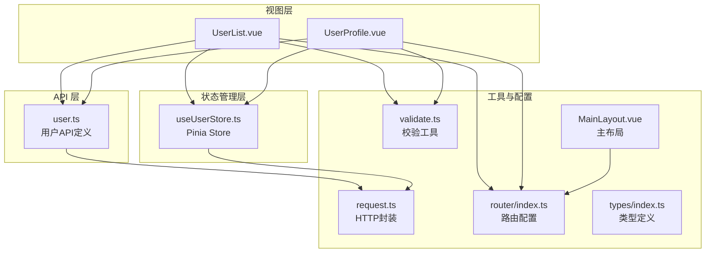
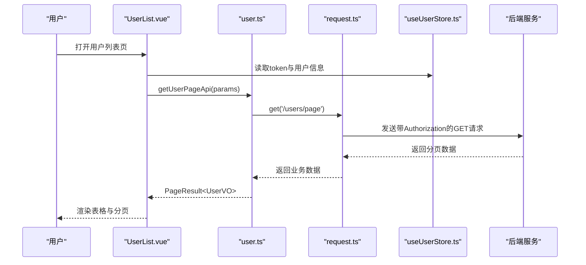
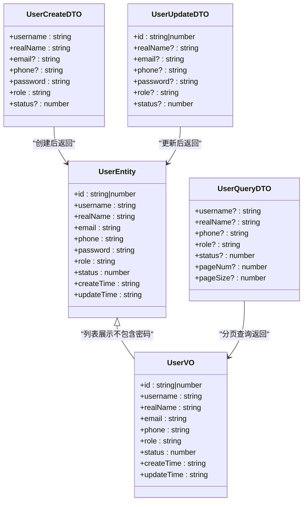
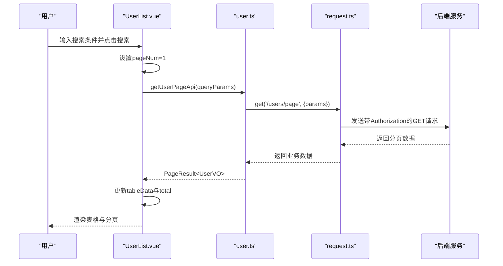
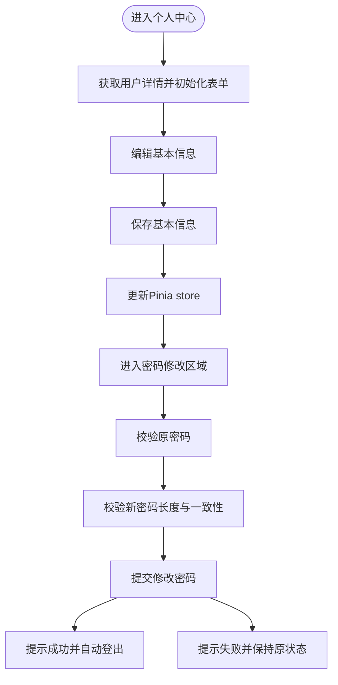
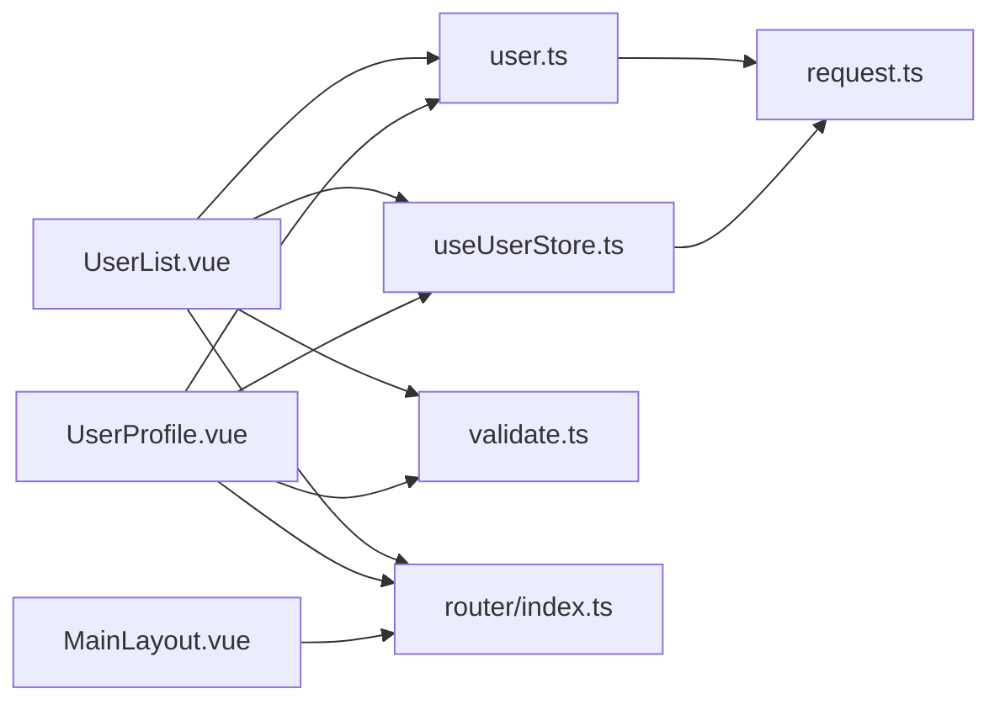

# 用户管理页面

<cite>
**本文档引用的文件**
- [UserList.vue](file://src/views/user/UserList.vue)
- [UserProfile.vue](file://src/views/user/UserProfile.vue)
- [user.ts](file://src/api/user.ts)
- [useUserStore.ts](file://src/stores/useUserStore.ts)
- [index.ts](file://src/router/index.ts)
- [index.ts](file://src/types/index.ts)
- [request.ts](file://src/utils/request.ts)
- [MainLayout.vue](file://src/layouts/MainLayout.vue)
- [validate.ts](file://src/utils/validate.ts)
</cite>

## 目录
1. [简介](#简介)
2. [项目结构](#项目结构)
3. [核心组件](#核心组件)
4. [架构总览](#架构总览)
5. [详细组件分析](#详细组件分析)
6. [依赖关系分析](#依赖关系分析)
7. [性能考虑](#性能考虑)
8. [故障排除指南](#故障排除指南)
9. [结论](#结论)
10. [附录](#附录)

## 简介
本文件面向前端开发者与产品人员，系统性阐述用户管理页面的设计架构与实现原理，重点覆盖以下两个页面：
- 用户列表页：UserList.vue，负责用户数据的分页查询、筛选、批量操作与新增/编辑弹窗。
- 个人资料页：UserProfile.vue，负责当前用户的个人信息查看与编辑、密码修改流程。

文档将深入解释数据获取方式、列表渲染逻辑、搜索过滤、表单验证机制、用户交互设计、数据同步、权限控制与安全考虑，并提供扩展指南（如扩展用户字段、自定义权限配置、用户行为审计）。

## 项目结构
用户管理相关的核心文件组织如下：
- 页面组件：src/views/user/UserList.vue、src/views/user/UserProfile.vue
- API 定义：src/api/user.ts
- 状态管理：src/stores/useUserStore.ts
- 路由配置：src/router/index.ts
- 工具类：src/utils/request.ts、src/utils/validate.ts
- 类型定义：src/types/index.ts
- 布局与导航：src/layouts/MainLayout.vue

图表来源
- [UserList.vue:1-617](file://src/views/user/UserList.vue#L1-L617)
- [UserProfile.vue:1-376](file://src/views/user/UserProfile.vue#L1-L376)
- [user.ts:1-179](file://src/api/user.ts#L1-L179)
- [useUserStore.ts:1-200](file://src/stores/useUserStore.ts#L1-L200)
- [request.ts:1-180](file://src/utils/request.ts#L1-L180)
- [validate.ts:1-36](file://src/utils/validate.ts#L1-L36)
- [index.ts:1-136](file://src/router/index.ts#L1-L136)
- [index.ts:1-51](file://src/types/index.ts#L1-L51)
- [MainLayout.vue:1-434](file://src/layouts/MainLayout.vue#L1-L434)

章节来源
- [UserList.vue:1-617](file://src/views/user/UserList.vue#L1-L617)
- [UserProfile.vue:1-376](file://src/views/user/UserProfile.vue#L1-L376)
- [user.ts:1-179](file://src/api/user.ts#L1-L179)
- [useUserStore.ts:1-200](file://src/stores/useUserStore.ts#L1-L200)
- [request.ts:1-180](file://src/utils/request.ts#L1-L180)
- [validate.ts:1-36](file://src/utils/validate.ts#L1-L36)
- [index.ts:1-136](file://src/router/index.ts#L1-L136)
- [index.ts:1-51](file://src/types/index.ts#L1-L51)
- [MainLayout.vue:1-434](file://src/layouts/MainLayout.vue#L1-L434)

## 核心组件
本节概述两个用户管理页面的功能职责与关键特性。

- 用户列表页（UserList.vue）
  - 搜索与筛选：支持按用户名、真实姓名、手机号、角色、状态进行组合查询。
  - 列表展示：分页表格，包含ID、用户名、真实姓名、邮箱、手机号、角色、状态、创建时间等列。
  - 操作能力：新增用户、批量删除、单个删除、行内状态开关、编辑弹窗。
  - 表单验证：用户名、真实姓名、邮箱、手机号、密码、角色等字段的前端校验。
  - 数据同步：通过API获取分页数据并更新表格；提交后刷新列表。

- 个人资料页（UserProfile.vue）
  - 个人信息查看与编辑：用户名只读，其他字段可编辑并提交更新。
  - 密码修改：包含原密码、新密码、确认密码的表单与校验。
  - 数据同步：从后端获取用户详情，更新 Pinia store；保存成功后同步 store。
  - 权限控制：根据用户角色显示不同信息与按钮。

章节来源
- [UserList.vue:1-617](file://src/views/user/UserList.vue#L1-L617)
- [UserProfile.vue:1-376](file://src/views/user/UserProfile.vue#L1-L376)

## 架构总览
用户管理页面采用“视图组件 + API 层 + 状态管理 + 工具库”的分层架构，结合 Element Plus 组件库与 Vue 3 Composition API 实现。

图表来源
- [UserList.vue:302-315](file://src/views/user/UserList.vue#L302-L315)
- [user.ts:136-138](file://src/api/user.ts#L136-L138)
- [request.ts:96-116](file://src/utils/request.ts#L96-L116)
- [useUserStore.ts:1-200](file://src/stores/useUserStore.ts#L1-L200)

章节来源
- [UserList.vue:302-315](file://src/views/user/UserList.vue#L302-L315)
- [user.ts:136-138](file://src/api/user.ts#L136-L138)
- [request.ts:96-116](file://src/utils/request.ts#L96-L116)
- [useUserStore.ts:1-200](file://src/stores/useUserStore.ts#L1-L200)

## 详细组件分析

### 用户列表页（UserList.vue）

#### 数据模型与类型
- UserVO：用于列表展示的用户视图对象，包含基本字段与时间戳，不含密码。
- UserQueryDTO：分页查询参数，支持用户名、真实姓名、手机号、角色、状态、分页。
- UserCreateDTO/UserUpdateDTO：新增与更新请求体，字段严格对应后端接口。

章节来源
- [user.ts:34-96](file://src/api/user.ts#L34-L96)

#### 列表渲染与分页
- 查询参数：pageNum、pageSize、username、realName、phone、role、status。
- 分页组件：监听页码与页大小变化，触发列表刷新。
- 表格列：ID、用户名、真实姓名、邮箱、手机号、角色（标签）、状态（开关）、操作列。

章节来源
- [UserList.vue:215-224](file://src/views/user/UserList.vue#L215-L224)
- [UserList.vue:120-129](file://src/views/user/UserList.vue#L120-L129)
- [UserList.vue:67-116](file://src/views/user/UserList.vue#L67-L116)

#### 搜索与筛选
- 支持多条件组合查询，回车触发搜索，重置按钮清空条件并刷新。
- 状态使用数字枚举（1 启用，0 禁用），角色使用字符串枚举（admin/operator/user）。

章节来源
- [UserList.vue:4-47](file://src/views/user/UserList.vue#L4-L47)
- [UserList.vue:320-335](file://src/views/user/UserList.vue#L320-L335)

#### 表单验证与提交
- 新增/编辑表单：用户名、真实姓名、邮箱、手机号、密码、角色、状态。
- 密码规则：新增必填且长度≥6；编辑时留空则不更新密码。
- 提交流程：先校验，再根据 isCreate 决定新增或更新，最后刷新列表。

章节来源
- [UserList.vue:262-297](file://src/views/user/UserList.vue#L262-L297)
- [UserList.vue:456-503](file://src/views/user/UserList.vue#L456-L503)

#### 用户状态切换与批量删除
- 行内状态开关：切换后立即调用更新接口并提示成功/失败。
- 批量删除：勾选多行后统一确认，逐个删除并刷新。

章节来源
- [UserList.vue:437-451](file://src/views/user/UserList.vue#L437-L451)
- [UserList.vue:403-432](file://src/views/user/UserList.vue#L403-L432)

#### ID 显示与角色映射
- ID 格式化：将大整数ID转换为字符串显示，避免精度丢失。
- 角色标签：根据角色映射不同标签类型与文本。

章节来源
- [UserList.vue:526-529](file://src/views/user/UserList.vue#L526-L529)
- [UserList.vue:534-553](file://src/views/user/UserList.vue#L534-L553)

#### 用户交互设计
- 搜索栏、工具栏、表格、分页、对话框的布局与交互。
- 加载态与提交态：表格加载、对话框提交按钮 loading。
- 成功/失败消息提示：Element Plus Message。

章节来源
- [UserList.vue:67-130](file://src/views/user/UserList.vue#L67-L130)
- [UserList.vue:212-214](file://src/views/user/UserList.vue#L212-L214)

#### API 调用方法
- 获取分页列表：getUserPageApi
- 新增用户：createUserApi
- 更新用户：updateUserApi
- 删除用户：deleteUserApi

章节来源
- [UserList.vue:306-308](file://src/views/user/UserList.vue#L306-L308)
- [UserList.vue:463-494](file://src/views/user/UserList.vue#L463-L494)
- [user.ts:136-178](file://src/api/user.ts#L136-L178)

#### 安全与权限控制
- 路由守卫：requiresAuth 控制访问权限。
- 请求拦截：自动附加 Authorization 头。
- 响应拦截：统一处理业务状态码与错误提示，401 自动登出。

章节来源
- [index.ts:116-129](file://src/router/index.ts#L116-L129)
- [request.ts:78-93](file://src/utils/request.ts#L78-L93)
- [request.ts:96-116](file://src/utils/request.ts#L96-L116)

#### 性能与可用性
- 分页加载：避免一次性加载大量数据。
- 表单防抖：Element Plus 表单校验在 blur/enter 触发。
- 大整数处理：后端返回的ID统一为字符串，避免精度丢失。

章节来源
- [request.ts:22-50](file://src/utils/request.ts#L22-L50)
- [user.ts:21-32](file://src/api/user.ts#L21-L32)

### 个人资料页（UserProfile.vue）

#### 数据流与状态同步
- 初始化：组件挂载时获取用户详情，更新 Pinia store 并初始化表单。
- 信息更新：提交后调用更新接口，同步更新 store 中的用户信息。
- 密码修改：预留接口调用位置，当前演示为提示并自动登出。

章节来源
- [UserProfile.vue:204-226](file://src/views/user/UserProfile.vue#L204-L226)
- [UserProfile.vue:238-264](file://src/views/user/UserProfile.vue#L238-L264)
- [UserProfile.vue:277-310](file://src/views/user/UserProfile.vue#L277-L310)

#### 表单验证与规则
- 基本信息：真实姓名、邮箱、手机号的必填与格式校验。
- 密码修改：原密码必填，新密码长度与一致性校验。

章节来源
- [UserProfile.vue:143-155](file://src/views/user/UserProfile.vue#L143-L155)
- [UserProfile.vue:176-187](file://src/views/user/UserProfile.vue#L176-L187)

#### 权限控制与角色展示
- 角色标签：根据用户角色显示不同标签类型与文案。
- 状态标签：根据状态显示正常/禁用。

章节来源
- [UserProfile.vue:48-57](file://src/views/user/UserProfile.vue#L48-L57)

#### 用户交互与反馈
- 保存修改：提交后提示成功并更新 store。
- 重置表单：恢复初始值并清除校验。
- 密码修改：成功后提示并延迟登出。

章节来源
- [UserProfile.vue:231-264](file://src/views/user/UserProfile.vue#L231-L264)
- [UserProfile.vue:269-272](file://src/views/user/UserProfile.vue#L269-L272)
- [UserProfile.vue:299-302](file://src/views/user/UserProfile.vue#L299-L302)

#### API 调用方法
- 获取用户详情：getUserDetailApi
- 更新用户信息：updateUserApi

章节来源
- [UserProfile.vue:213-213](file://src/views/user/UserProfile.vue#L213-L213)
- [UserProfile.vue:238-243](file://src/views/user/UserProfile.vue#L238-L243)
- [user.ts:146-148](file://src/api/user.ts#L146-L148)
- [user.ts:166-168](file://src/api/user.ts#L166-L168)

### 类图：用户相关类型与关系

图表来源
- [user.ts:19-96](file://src/api/user.ts#L19-L96)

章节来源
- [user.ts:19-96](file://src/api/user.ts#L19-L96)

### 序列图：用户列表搜索与分页

图表来源
- [UserList.vue:320-323](file://src/views/user/UserList.vue#L320-L323)
- [UserList.vue:306-308](file://src/views/user/UserList.vue#L306-L308)
- [user.ts:136-138](file://src/api/user.ts#L136-L138)
- [request.ts:96-116](file://src/utils/request.ts#L96-L116)

章节来源
- [UserList.vue:320-323](file://src/views/user/UserList.vue#L320-L323)
- [UserList.vue:306-308](file://src/views/user/UserList.vue#L306-L308)
- [user.ts:136-138](file://src/api/user.ts#L136-L138)
- [request.ts:96-116](file://src/utils/request.ts#L96-L116)

### 流程图：密码修改流程（UserProfile.vue）

图表来源
- [UserProfile.vue:204-226](file://src/views/user/UserProfile.vue#L204-L226)
- [UserProfile.vue:231-264](file://src/views/user/UserProfile.vue#L231-L264)
- [UserProfile.vue:277-310](file://src/views/user/UserProfile.vue#L277-L310)

章节来源
- [UserProfile.vue:204-226](file://src/views/user/UserProfile.vue#L204-L226)
- [UserProfile.vue:231-264](file://src/views/user/UserProfile.vue#L231-L264)
- [UserProfile.vue:277-310](file://src/views/user/UserProfile.vue#L277-L310)

## 依赖关系分析
- 组件依赖：UserList.vue 与 UserProfile.vue 均依赖 user.ts 的 API 方法与类型定义。
- 状态依赖：两者均依赖 useUserStore.ts 提供的 token、userInfo、登录/登出能力。
- 工具依赖：request.ts 提供统一的 HTTP 封装与拦截器；validate.ts 提供常用校验工具。
- 路由依赖：index.ts 定义了用户管理与个人中心的路由入口与权限控制。

图表来源
- [UserList.vue:1-617](file://src/views/user/UserList.vue#L1-L617)
- [UserProfile.vue:1-376](file://src/views/user/UserProfile.vue#L1-L376)
- [user.ts:1-179](file://src/api/user.ts#L1-L179)
- [useUserStore.ts:1-200](file://src/stores/useUserStore.ts#L1-L200)
- [request.ts:1-180](file://src/utils/request.ts#L1-L180)
- [validate.ts:1-36](file://src/utils/validate.ts#L1-L36)
- [index.ts:1-136](file://src/router/index.ts#L1-L136)
- [MainLayout.vue:1-434](file://src/layouts/MainLayout.vue#L1-L434)

章节来源
- [UserList.vue:1-617](file://src/views/user/UserList.vue#L1-L617)
- [UserProfile.vue:1-376](file://src/views/user/UserProfile.vue#L1-L376)
- [user.ts:1-179](file://src/api/user.ts#L1-L179)
- [useUserStore.ts:1-200](file://src/stores/useUserStore.ts#L1-L200)
- [request.ts:1-180](file://src/utils/request.ts#L1-L180)
- [validate.ts:1-36](file://src/utils/validate.ts#L1-L36)
- [index.ts:1-136](file://src/router/index.ts#L1-L136)
- [MainLayout.vue:1-434](file://src/layouts/MainLayout.vue#L1-L434)

## 性能考虑
- 分页加载：列表页使用分页查询，避免一次性加载全部数据，降低内存占用与网络压力。
- 大整数处理：响应拦截器预处理大整数为字符串，避免 JS 精度丢失导致的 ID 错误。
- 表单校验：在 blur/enter 触发，减少不必要的校验开销。
- 缓存与恢复：Pinia store 在刷新后可从 sessionStorage 恢复用户信息，提升体验。

章节来源
- [request.ts:22-50](file://src/utils/request.ts#L22-L50)
- [useUserStore.ts:172-183](file://src/stores/useUserStore.ts#L172-L183)

## 故障排除指南
- 登录失败/401：检查 token 是否存在与有效；响应拦截器会自动登出并跳转登录页。
- 网络错误：根据响应拦截器的错误映射，检查网络连通性与后端服务状态。
- 表单校验失败：确认必填字段与格式要求，如邮箱、手机号、密码长度等。
- 列表不刷新：确认提交后调用了列表刷新函数；检查 API 返回与错误提示。

章节来源
- [request.ts:96-151](file://src/utils/request.ts#L96-L151)
- [UserList.vue:456-503](file://src/views/user/UserList.vue#L456-L503)
- [UserProfile.vue:231-264](file://src/views/user/UserProfile.vue#L231-L264)

## 结论
用户管理页面通过清晰的分层架构与完善的交互设计，实现了用户列表的高效管理与个人资料的安全维护。其核心优势包括：
- 明确的数据模型与严格的 API 类型约束，便于前后端协作与扩展。
- 完善的表单校验与错误处理，保障用户体验与数据质量。
- 统一的 HTTP 封装与权限控制，确保安全性与可维护性。
建议在后续迭代中继续完善密码修改接口、增加审计日志与更细粒度的权限控制。

## 附录

### 开发指南与最佳实践
- 扩展用户字段：在 UserCreateDTO/UserUpdateDTO 与 UserVO 中添加字段定义，同时在页面表单与校验规则中同步更新。
- 自定义权限配置：在 useUserStore.ts 中扩展角色判断逻辑与权限标识，结合路由 meta 字段实现菜单与页面级权限控制。
- 用户行为审计：在 request.ts 中记录请求日志（含时间、URL、参数摘要、响应状态），并在 store 中持久化关键操作记录。

章节来源
- [user.ts:75-96](file://src/api/user.ts#L75-L96)
- [useUserStore.ts:24-27](file://src/stores/useUserStore.ts#L24-L27)
- [request.ts:78-93](file://src/utils/request.ts#L78-L93)

### API 调用方法速查
- 获取用户分页列表：getUserPageApi(params)
- 获取用户详情：getUserDetailApi(id)
- 创建用户：createUserApi(data)
- 更新用户：updateUserApi(data)
- 删除用户：deleteUserApi(id)

章节来源
- [user.ts:136-178](file://src/api/user.ts#L136-L178)