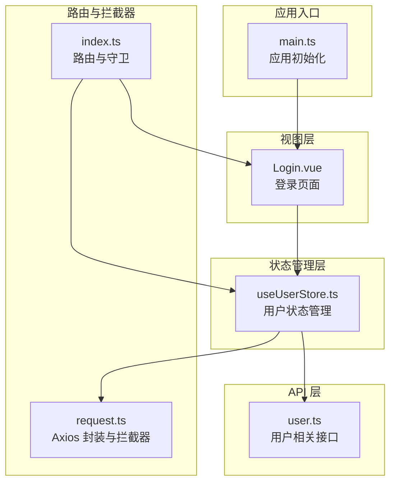
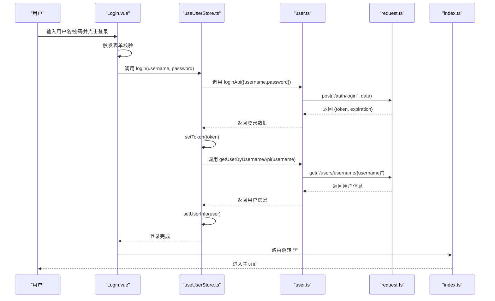
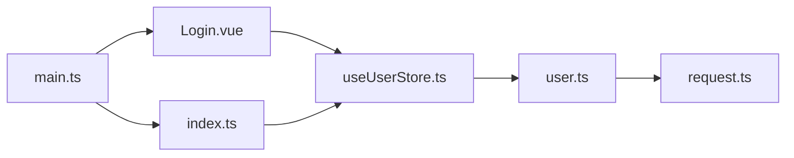

# 登录页面

<cite>
**本文档引用的文件**
- [Login.vue](file://src/views/login/Login.vue)
- [useUserStore.ts](file://src/stores/useUserStore.ts)
- [user.ts](file://src/api/user.ts)
- [validate.ts](file://src/utils/validate.ts)
- [index.ts](file://src/router/index.ts)
- [request.ts](file://src/utils/request.ts)
- [main.ts](file://src/main.ts)
- [README.md](file://README.md)
</cite>

## 目录
1. [简介](#简介)
2. [项目结构](#项目结构)
3. [核心组件](#核心组件)
4. [架构总览](#架构总览)
5. [详细组件分析](#详细组件分析)
6. [依赖关系分析](#依赖关系分析)
7. [性能考量](#性能考量)
8. [故障排查指南](#故障排查指南)
9. [结论](#结论)
10. [附录](#附录)

## 简介
本文件面向前端开发者与产品/测试人员，系统性阐述登录页面的设计架构与实现原理，覆盖登录表单设计、表单验证规则、提交处理逻辑、错误提示、用户认证流程、登录状态管理、密码加密传输与会话管理机制，并提供可扩展的开发指南、安全注意事项与用户体验优化建议。读者无需深入源码即可理解登录页面的整体工作方式。

## 项目结构
登录页面位于视图层，采用 Vue 3 + TypeScript + Element Plus 架构，结合 Pinia 状态管理与 Axios 封装的请求拦截器，形成完整的认证与会话生命周期。

图表来源
- [Login.vue:1-408](file://src/views/login/Login.vue#L1-L408)
- [useUserStore.ts:1-200](file://src/stores/useUserStore.ts#L1-L200)
- [user.ts:1-179](file://src/api/user.ts#L1-L179)
- [index.ts:1-136](file://src/router/index.ts#L1-L136)
- [request.ts:1-180](file://src/utils/request.ts#L1-L180)
- [main.ts:1-26](file://src/main.ts#L1-L26)

章节来源
- [README.md:17-34](file://README.md#L17-L34)
- [main.ts:12-25](file://src/main.ts#L12-L25)

## 核心组件
- 登录页面组件：负责表单渲染、输入校验、提交处理与动画效果。
- 用户状态管理：集中管理 Token、用户信息、登录/登出、用户信息获取与初始化。
- API 接口：封装登录与用户信息查询接口。
- 路由与守卫：控制登录/登出跳转与权限访问。
- 请求封装：统一处理 Authorization 头、响应数据转换与错误处理。

章节来源
- [Login.vue:80-152](file://src/views/login/Login.vue#L80-L152)
- [useUserStore.ts:18-199](file://src/stores/useUserStore.ts#L18-L199)
- [user.ts:106-128](file://src/api/user.ts#L106-L128)
- [index.ts:116-129](file://src/router/index.ts#L116-L129)
- [request.ts:77-151](file://src/utils/request.ts#L77-L151)

## 架构总览
登录流程涉及前端组件、状态管理、API 接口与路由守卫的协同工作，形成“表单校验 -> 发起登录 -> 保存 Token -> 获取用户信息 -> 路由跳转”的闭环。

图表来源
- [Login.vue:117-134](file://src/views/login/Login.vue#L117-L134)
- [useUserStore.ts:61-83](file://src/stores/useUserStore.ts#L61-L83)
- [user.ts:106-128](file://src/api/user.ts#L106-L128)
- [request.ts:155-177](file://src/utils/request.ts#L155-L177)
- [index.ts:120-128](file://src/router/index.ts#L120-L128)

## 详细组件分析

### 登录页面组件（Login.vue）
- 表单设计
  - 用户名输入框：支持清空、前缀图标、大尺寸输入。
  - 密码输入框：支持显示/隐藏密码、前缀图标、大尺寸输入。
  - 登录按钮：加载态、渐变背景、悬停动画。
- 表单验证规则
  - 用户名：必填、长度 3-20 字符。
  - 密码：必填、长度 6-20 字符。
- 提交处理逻辑
  - 触发表单校验；通过后设置加载态，调用用户状态管理的登录方法，成功后提示并跳转首页。
- 错误提示
  - 使用 Element Plus 的消息提示组件进行错误展示。
- 动画与视觉
  - 动态背景：三重水波纹与粒子浮动动画。
  - 登录卡片：毛玻璃背景、阴影、滑入动画。
  - 响应式适配：移动端宽度自适应与字号调整。
- 交互设计
  - 支持回车键触发登录。
  - 输入框聚焦态与悬停态的阴影变化。

章节来源
- [Login.vue:28-70](file://src/views/login/Login.vue#L28-L70)
- [Login.vue:103-112](file://src/views/login/Login.vue#L103-L112)
- [Login.vue:117-134](file://src/views/login/Login.vue#L117-L134)
- [Login.vue:139-151](file://src/views/login/Login.vue#L139-L151)
- [Login.vue:154-407](file://src/views/login/Login.vue#L154-L407)

### 用户状态管理（useUserStore.ts）
- 状态
  - token：本地存储的认证令牌。
  - userInfo：用户信息（不含敏感字段）。
  - 计算属性：登录态、角色、用户名、是否管理员。
- 登录流程
  - 调用登录接口获取 token，校验 token 存在后保存至本地存储。
  - 从 token 中解析用户名，调用用户信息接口获取用户详情并缓存到 sessionStorage。
  - 若解析失败或获取失败，使用默认管理员信息兜底。
- 退出登录
  - 清空 token 与用户信息，移除本地存储，提示成功消息。
- 初始化
  - 应用启动时从 sessionStorage 恢复用户信息。

章节来源
- [useUserStore.ts:18-53](file://src/stores/useUserStore.ts#L18-L53)
- [useUserStore.ts:61-83](file://src/stores/useUserStore.ts#L61-L83)
- [useUserStore.ts:88-94](file://src/stores/useUserStore.ts#L88-L94)
- [useUserStore.ts:100-125](file://src/stores/useUserStore.ts#L100-L125)
- [useUserStore.ts:132-150](file://src/stores/useUserStore.ts#L132-L150)
- [useUserStore.ts:155-167](file://src/stores/useUserStore.ts#L155-L167)
- [useUserStore.ts:172-183](file://src/stores/useUserStore.ts#L172-L183)

### API 接口（user.ts）
- 登录接口
  - 请求路径：POST /auth/login
  - 参数：用户名、密码
  - 返回：token、过期时间
- 用户信息接口
  - 请求路径：GET /users/username/{username}
  - 返回：用户 VO（不包含密码）

章节来源
- [user.ts:106-128](file://src/api/user.ts#L106-L128)

### 路由与守卫（index.ts）
- 登录页路由
  - 路径：/login
  - 组件：懒加载登录页面
  - 元信息：requiresAuth=false
- 权限守卫
  - 访问受保护路由且无 token 时跳转登录页。
  - 已登录状态下访问登录页时跳转首页。
- 进度条
  - 使用 NProgress 显示路由切换进度。

章节来源
- [index.ts:8-14](file://src/router/index.ts#L8-L14)
- [index.ts:116-129](file://src/router/index.ts#L116-L129)

### 请求封装与拦截器（request.ts）
- 基础配置
  - 开发环境代理前缀：/api/v1
  - 超时：15 秒
  - Content-Type：application/json
- 响应转换
  - 自定义 transformResponse 在默认 JSON 解析前处理大整数，避免精度丢失。
- 请求拦截器
  - 自动注入 Authorization: Bearer token。
- 响应拦截器
  - 根据业务状态码处理错误，401 时触发登出并跳转登录页。
  - 成功时直接返回业务数据 data，简化上层调用。

章节来源
- [request.ts:52-75](file://src/utils/request.ts#L52-L75)
- [request.ts:96-116](file://src/utils/request.ts#L96-L116)
- [request.ts:77-93](file://src/utils/request.ts#L77-L93)

### 表单验证工具（validate.ts）
- 提供邮箱、手机号、密码强度与空值判断等通用校验方法，可用于扩展登录表单的自定义规则。

章节来源
- [validate.ts:1-36](file://src/utils/validate.ts#L1-L36)

## 依赖关系分析
- 组件耦合
  - Login.vue 依赖 useUserStore 与 Element Plus 组件。
  - useUserStore 依赖 user.ts 接口与 request.ts 封装。
  - 路由守卫依赖 useUserStore 的 token 状态。
- 外部依赖
  - Vue 3、Element Plus、Pinia、Axios、Vue Router、NProgress。

图表来源
- [Login.vue:80-88](file://src/views/login/Login.vue#L80-L88)
- [useUserStore.ts:3-4](file://src/stores/useUserStore.ts#L3-L4)
- [user.ts:106-128](file://src/api/user.ts#L106-L128)
- [request.ts:155-177](file://src/utils/request.ts#L155-L177)
- [index.ts:116-129](file://src/router/index.ts#L116-L129)
- [main.ts:12-25](file://src/main.ts#L12-L25)

## 性能考量
- 资源加载
  - 登录页组件按需懒加载，减少首屏体积。
- 动画性能
  - CSS 动画使用 transform 与 opacity，避免频繁重排。
- 网络请求
  - Axios 超时设置合理，避免长时间阻塞。
- 数据持久化
  - Token 与用户信息分别存储于 localStorage 与 sessionStorage，兼顾安全性与可用性。

章节来源
- [index.ts:12-12](file://src/router/index.ts#L12-L12)
- [request.ts:54-55](file://src/utils/request.ts#L54-L55)
- [useUserStore.ts:20-53](file://src/stores/useUserStore.ts#L20-L53)

## 故障排查指南
- 登录失败
  - 检查用户名/密码是否满足长度要求。
  - 查看网络面板确认 /auth/login 是否返回 200。
  - 关注响应拦截器对 401 的处理与登出行为。
- 无法跳转首页
  - 确认路由守卫逻辑与 token 状态一致。
- 用户信息缺失
  - 检查 token 是否正确解析用户名，以及 /users/username/{username} 接口是否正常。
- 动画异常
  - 检查浏览器对 CSS 动画的支持与 GPU 加速情况。

章节来源
- [Login.vue:117-134](file://src/views/login/Login.vue#L117-L134)
- [useUserStore.ts:61-83](file://src/stores/useUserStore.ts#L61-L83)
- [index.ts:120-128](file://src/router/index.ts#L120-L128)
- [request.ts:96-116](file://src/utils/request.ts#L96-L116)

## 结论
登录页面通过清晰的职责划分与完善的拦截器机制，实现了简洁可靠的认证流程。其响应式设计与动画效果提升了用户体验，同时具备良好的扩展性，便于后续接入多因素认证与自定义验证规则。

## 附录

### 用户认证流程与会话管理
- 认证流程
  - 用户输入凭据 -> 表单校验 -> 调用登录接口 -> 保存 token -> 获取用户信息 -> 路由跳转。
- 会话管理
  - token 存储于 localStorage，用户信息缓存于 sessionStorage，应用启动时可恢复。
  - 401 时自动登出并跳转登录页。

章节来源
- [Login.vue:117-134](file://src/views/login/Login.vue#L117-L134)
- [useUserStore.ts:20-53](file://src/stores/useUserStore.ts#L20-L53)
- [index.ts:120-128](file://src/router/index.ts#L120-L128)
- [request.ts:104-109](file://src/utils/request.ts#L104-L109)

### 表单验证规则与扩展
- 内置规则
  - 用户名：必填、3-20 字符。
  - 密码：必填、6-20 字符。
- 扩展建议
  - 可引入 validate.ts 中的邮箱/手机/密码强度校验，作为附加规则。
  - 对于复杂场景，可在表单规则中组合多个校验器。

章节来源
- [Login.vue:103-112](file://src/views/login/Login.vue#L103-L112)
- [validate.ts:1-36](file://src/utils/validate.ts#L1-L36)

### 多因素认证（MFA）扩展指南
- 令牌与用户信息
  - 当前登录成功后保存 token 并获取用户信息；若后端支持 MFA，可在登录成功后根据返回的 MFA 状态决定是否引导进入二次验证流程。
- 二次验证流程
  - 登录成功后，若返回需要 MFA，则跳转至二次验证页面，输入验证码或执行生物识别等步骤。
  - 验证通过后继续完成会话建立，否则提示错误并允许重新登录。
- 安全建议
  - 二次验证页面应独立于登录页面，避免跨站脚本攻击。
  - 二次验证成功后，可延长 token 有效期或增加额外的安全头。

章节来源
- [useUserStore.ts:61-83](file://src/stores/useUserStore.ts#L61-L83)
- [user.ts:106-128](file://src/api/user.ts#L106-L128)

### 用户体验优化建议
- 输入反馈
  - 在输入框获得焦点时提供即时的视觉反馈（阴影与高亮）。
  - 密码强度可视化提示（如已有 validate.ts 的强度校验可配合使用）。
- 动效与过渡
  - 保持现有滑入与脉冲动画风格一致，确保在低端设备上仍流畅。
- 响应式细节
  - 移动端输入框增大触摸目标，避免误触。
  - 适当调整卡片内间距与字体大小，提升可读性。

章节来源
- [Login.vue:284-326](file://src/views/login/Login.vue#L284-L326)
- [Login.vue:390-406](file://src/views/login/Login.vue#L390-L406)

### 开发指南与最佳实践
- 组件拆分
  - 将登录表单抽象为可复用组件，便于在不同页面复用。
- 类型安全
  - 严格使用 TypeScript 接口定义请求/响应数据，避免 any 类型。
- 错误处理
  - 在登录页与状态管理中统一错误提示，避免泄露敏感信息。
- 安全加固
  - 仅在 HTTPS 环境下启用 token 存储；生产环境禁用明文日志输出。
  - 对关键接口增加 CSRF 与速率限制防护（后端配合）。

章节来源
- [user.ts:5-46](file://src/api/user.ts#L5-L46)
- [request.ts:117-150](file://src/utils/request.ts#L117-L150)