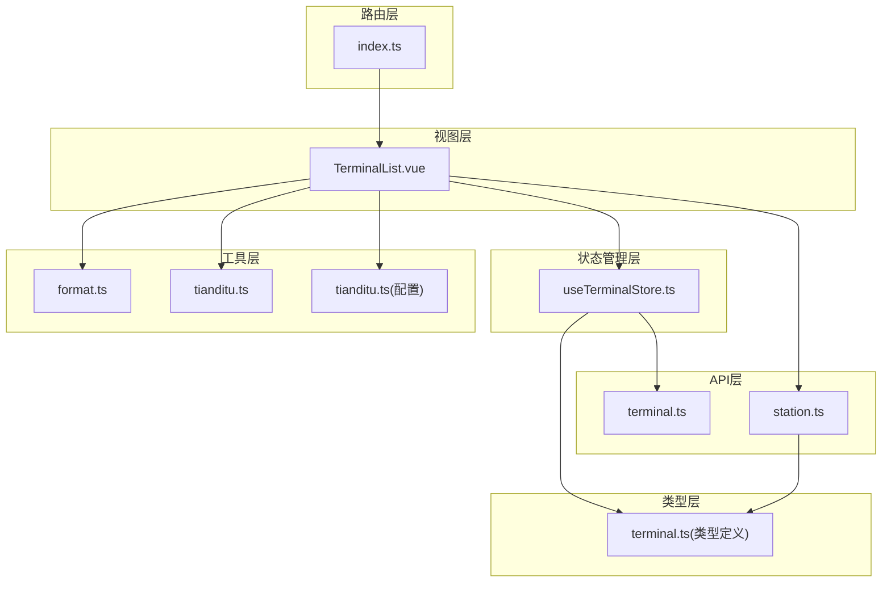
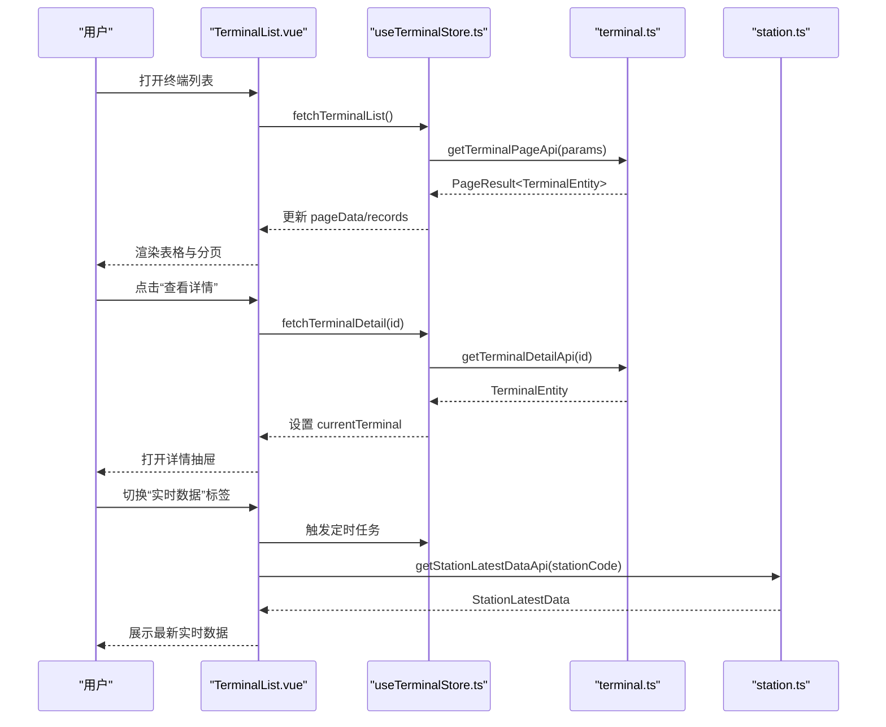
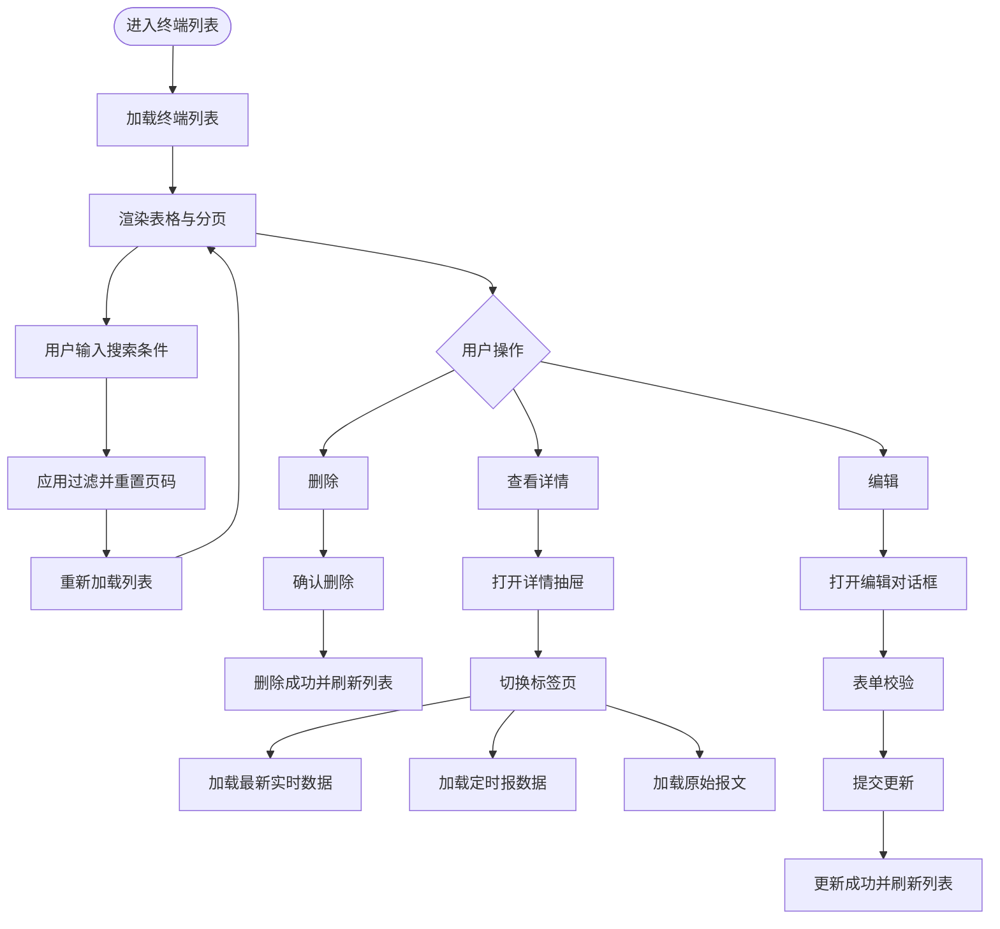
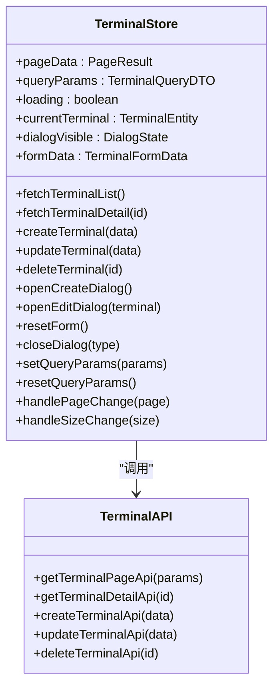
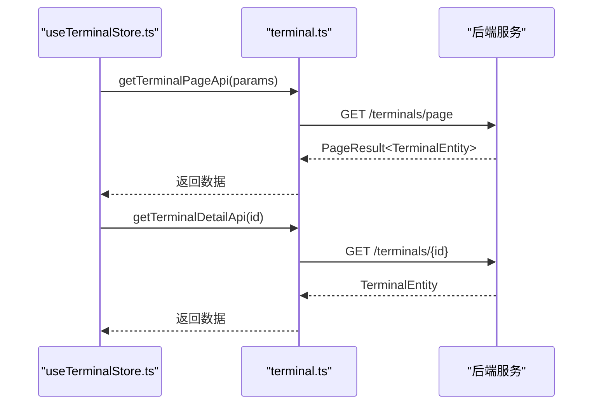
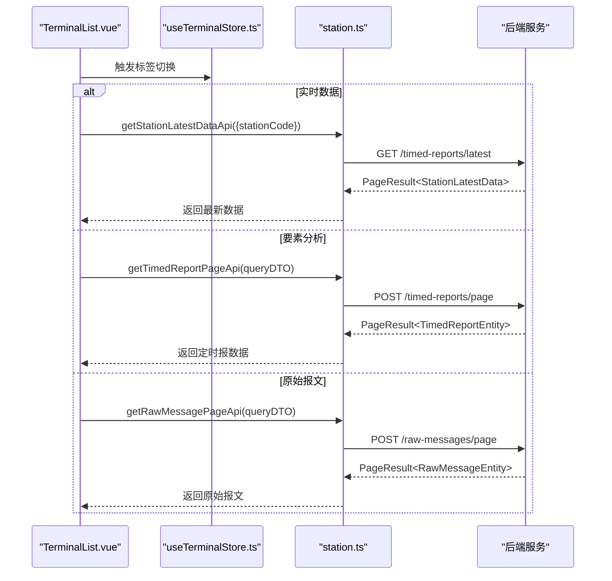
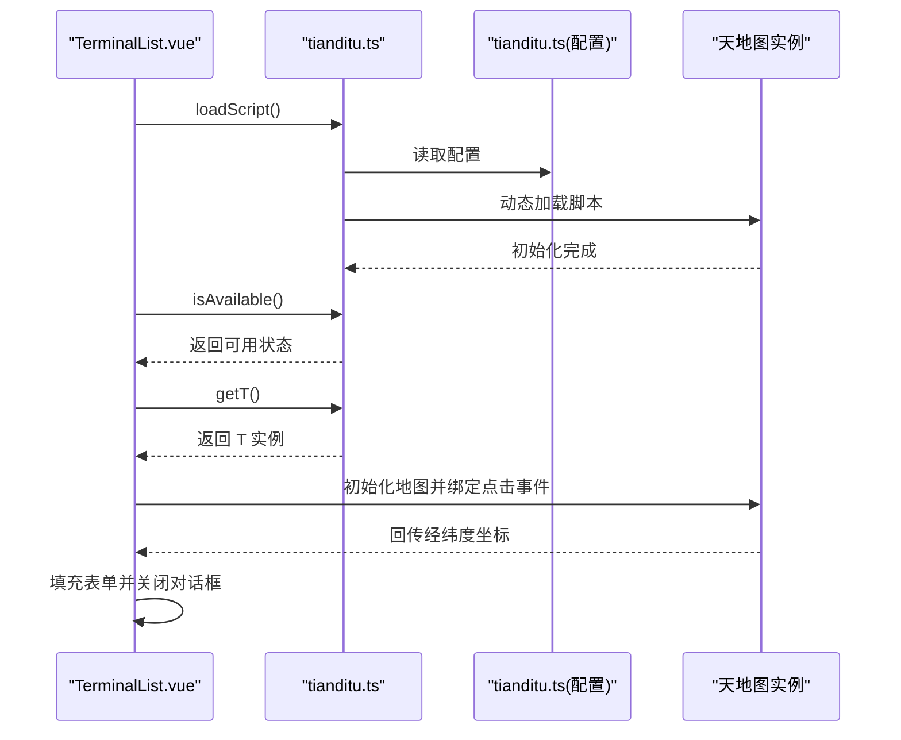
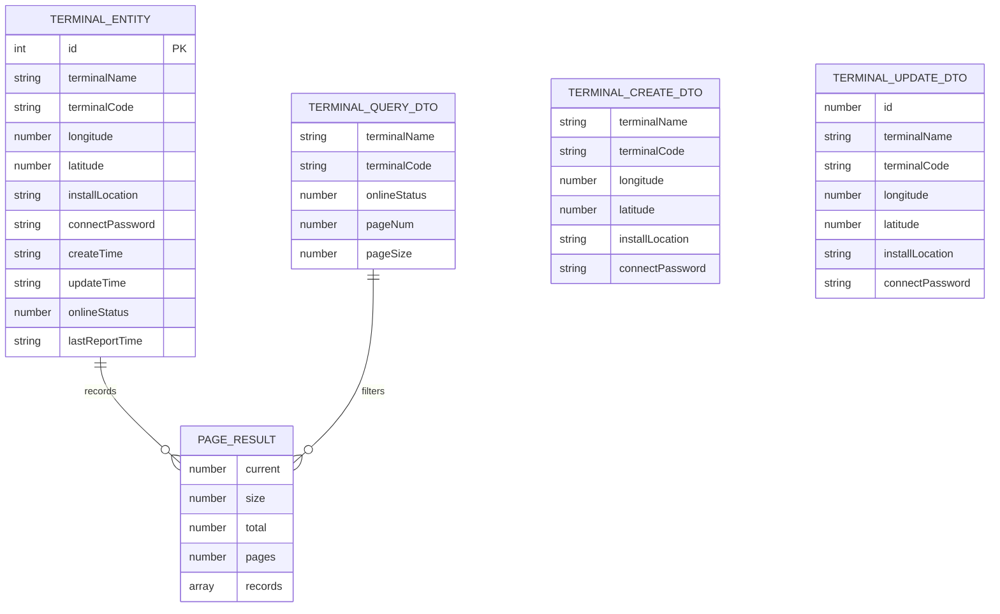
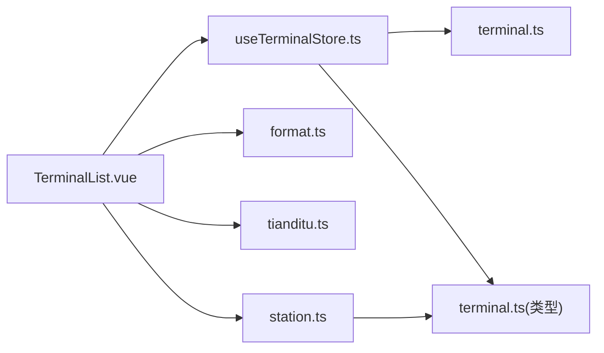

# 终端管理页面

<cite>
**本文档引用的文件**
- [TerminalList.vue](file://src/views/terminal/TerminalList.vue)
- [useTerminalStore.ts](file://src/stores/useTerminalStore.ts)
- [terminal.ts](file://src/api/terminal.ts)
- [station.ts](file://src/api/station.ts)
- [terminal.ts](file://src/types/terminal.ts)
- [format.ts](file://src/utils/format.ts)
- [tianditu.ts](file://src/utils/tianditu.ts)
- [tianditu.ts](file://src/config/tianditu.ts)
- [index.ts](file://src/router/index.ts)
</cite>

## 目录
1. [简介](#简介)
2. [项目结构](#项目结构)
3. [核心组件](#核心组件)
4. [架构总览](#架构总览)
5. [详细组件分析](#详细组件分析)
6. [依赖关系分析](#依赖关系分析)
7. [性能考虑](#性能考虑)
8. [故障排除指南](#故障排除指南)
9. [结论](#结论)
10. [附录](#附录)

## 简介
本文件面向终端管理页面的开发者与维护者，系统性阐述 TerminalList.vue 页面的设计架构与实现原理。内容涵盖终端设备列表展示、设备信息管理、增删改查操作、状态监控、数据获取方式、列表渲染逻辑、搜索过滤功能、批量操作实现、用户交互设计、表单验证、确认对话框与错误处理机制，并提供页面组件的开发指南、API 集成方法与数据管理策略。同时说明如何扩展终端类型支持、自定义字段显示与实现终端配置管理功能。

## 项目结构
终端管理页面位于 views/terminal 目录，采用“视图 + 状态管理 + API + 类型 + 工具”的分层组织：
- 视图层：TerminalList.vue 负责界面渲染、用户交互与业务流程编排
- 状态管理层：useTerminalStore.ts 提供终端列表、详情、表单数据与分页状态的集中管理
- API 层：terminal.ts 提供终端 CRUD 与分页查询接口封装；station.ts 提供实时数据、定时报与原始报文查询接口
- 类型层：terminal.ts 定义终端实体、查询参数、分页结果与创建/更新 DTO
- 工具层：format.ts 提供日期格式化等通用工具；tianditu.ts/tianditu.ts 提供天地图集成能力
- 路由层：index.ts 定义终端管理模块的路由与导航

**图表来源**
- [TerminalList.vue:1-1540](file://src/views/terminal/TerminalList.vue#L1-L1540)
- [useTerminalStore.ts:1-294](file://src/stores/useTerminalStore.ts#L1-L294)
- [terminal.ts:1-59](file://src/api/terminal.ts#L1-L59)
- [station.ts:1-115](file://src/api/station.ts#L1-L115)
- [terminal.ts:1-84](file://src/types/terminal.ts#L1-L84)
- [format.ts:1-102](file://src/utils/format.ts#L1-L102)
- [tianditu.ts:1-68](file://src/utils/tianditu.ts#L1-L68)
- [tianditu.ts:1-28](file://src/config/tianditu.ts#L1-L28)
- [index.ts:1-136](file://src/router/index.ts#L1-L136)

**章节来源**
- [TerminalList.vue:1-1540](file://src/views/terminal/TerminalList.vue#L1-L1540)
- [useTerminalStore.ts:1-294](file://src/stores/useTerminalStore.ts#L1-L294)
- [terminal.ts:1-59](file://src/api/terminal.ts#L1-L59)
- [station.ts:1-115](file://src/api/station.ts#L1-L115)
- [terminal.ts:1-84](file://src/types/terminal.ts#L1-L84)
- [format.ts:1-102](file://src/utils/format.ts#L1-L102)
- [tianditu.ts:1-68](file://src/utils/tianditu.ts#L1-L68)
- [tianditu.ts:1-28](file://src/config/tianditu.ts#L1-L28)
- [index.ts:1-136](file://src/router/index.ts#L1-L136)

## 核心组件
- 终端列表视图：负责搜索、分页、表格渲染、操作按钮与详情抽屉
- 终端状态管理：集中管理分页数据、查询参数、加载状态、当前选中终端与表单数据
- 终端 API 封装：提供分页查询、详情查询、创建、更新、删除接口
- 实时数据与报表：提供最新实时数据、定时报与原始报文的查询与展示
- 地图选择器：基于天地图实现经纬度选择与预览
- 工具函数：日期格式化、防抖节流等

**章节来源**
- [TerminalList.vue:1-1540](file://src/views/terminal/TerminalList.vue#L1-L1540)
- [useTerminalStore.ts:1-294](file://src/stores/useTerminalStore.ts#L1-L294)
- [terminal.ts:1-59](file://src/api/terminal.ts#L1-L59)
- [station.ts:1-115](file://src/api/station.ts#L1-L115)
- [format.ts:1-102](file://src/utils/format.ts#L1-L102)
- [tianditu.ts:1-68](file://src/utils/tianditu.ts#L1-L68)

## 架构总览
终端管理页面采用“视图 + Pinia Store + API + 类型 + 工具”的分层架构，数据流向清晰：视图通过 Store 触发 API 请求，Store 负责状态同步与错误处理，视图根据状态进行渲染与交互。

**图表来源**
- [TerminalList.vue:725-834](file://src/views/terminal/TerminalList.vue#L725-L834)
- [useTerminalStore.ts:69-113](file://src/stores/useTerminalStore.ts#L69-L113)
- [terminal.ts:16-28](file://src/api/terminal.ts#L16-L28)
- [station.ts:74-80](file://src/api/station.ts#L74-L80)

**章节来源**
- [TerminalList.vue:725-834](file://src/views/terminal/TerminalList.vue#L725-L834)
- [useTerminalStore.ts:69-113](file://src/stores/useTerminalStore.ts#L69-L113)
- [terminal.ts:16-28](file://src/api/terminal.ts#L16-L28)
- [station.ts:74-80](file://src/api/station.ts#L74-L80)

## 详细组件分析

### 终端列表视图（TerminalList.vue）
- 搜索与过滤：支持按终端名称、终端编码与在线状态筛选，回车触发搜索，重置按钮清空条件
- 表格渲染：展示终端 ID、名称、编码、经纬度、安装位置、在线状态、最后上报时间、创建时间与操作列
- 分页控制：支持页码与每页条数变更，自动刷新列表
- 操作交互：查看详情、编辑、删除按钮，删除前弹出确认对话框
- 详情抽屉：支持基础信息、实时数据、要素分析、原始报文四个标签页
- 地图选择器：支持从天地图选择经纬度并回填表单
- 表单验证：对必填字段进行校验，提交前统一校验
- 错误处理：统一使用消息提示与错误捕获，保证用户体验

**图表来源**
- [TerminalList.vue:725-1291](file://src/views/terminal/TerminalList.vue#L725-L1291)

**章节来源**
- [TerminalList.vue:1-1540](file://src/views/terminal/TerminalList.vue#L1-L1540)

### 终端状态管理（useTerminalStore.ts）
- 状态定义：pageData、queryParams、loading、currentTerminal、dialogVisible、formData
- 列表查询：fetchTerminalList，合并分页参数并更新响应数据
- 详情查询：fetchTerminalDetail，设置当前终端并打开详情抽屉
- 新增/更新/删除：createTerminal/updateTerminal/deleteTerminal，统一处理加载状态与消息提示
- 表单管理：openCreateDialog/openEditDialog/resetForm/closeDialog
- 分页控制：setQueryParams/resetQueryParams/handlePageChange/handleSizeChange

**图表来源**
- [useTerminalStore.ts:23-293](file://src/stores/useTerminalStore.ts#L23-L293)
- [terminal.ts:1-59](file://src/api/terminal.ts#L1-L59)

**章节来源**
- [useTerminalStore.ts:1-294](file://src/stores/useTerminalStore.ts#L1-L294)
- [terminal.ts:1-59](file://src/api/terminal.ts#L1-L59)

### 终端 API 封装（terminal.ts）
- 分页查询终端列表：GET /terminals/page
- 查询终端详情：GET /terminals/{id}
- 创建终端：POST /terminals
- 更新终端：PUT /terminals
- 删除终端：DELETE /terminals/{id}

**图表来源**
- [terminal.ts:16-28](file://src/api/terminal.ts#L16-L28)

**章节来源**
- [terminal.ts:1-59](file://src/api/terminal.ts#L1-L59)

### 实时数据与报表（station.ts）
- 最新实时数据：GET /timed-reports/latest，支持按 stationCode 过滤
- 定时报分页：POST /timed-reports/page，支持时间范围与分页
- 原始报文分页：POST /raw-messages/page，支持 stationCode 与功能码过滤

**图表来源**
- [station.ts:74-114](file://src/api/station.ts#L74-L114)
- [TerminalList.vue:744-937](file://src/views/terminal/TerminalList.vue#L744-L937)

**章节来源**
- [station.ts:1-115](file://src/api/station.ts#L1-L115)
- [TerminalList.vue:744-937](file://src/views/terminal/TerminalList.vue#L744-L937)

### 地图选择器与天地图集成（tianditu.ts + tianditu.ts）
- 天地图工具：封装脚本加载、可用性检测与实例获取
- 地图初始化：设置中心点、缩放级别、控件与标记
- 交互逻辑：点击地图获取经纬度，回填表单并关闭对话框

**图表来源**
- [tianditu.ts:14-63](file://src/utils/tianditu.ts#L14-L63)
- [tianditu.ts:4-27](file://src/config/tianditu.ts#L4-L27)
- [TerminalList.vue:1190-1243](file://src/views/terminal/TerminalList.vue#L1190-L1243)

**章节来源**
- [tianditu.ts:1-68](file://src/utils/tianditu.ts#L1-L68)
- [tianditu.ts:1-28](file://src/config/tianditu.ts#L1-L28)
- [TerminalList.vue:1190-1243](file://src/views/terminal/TerminalList.vue#L1190-L1243)

### 类型定义与数据模型（terminal.ts）
- 终端实体：包含 ID、名称、编码、经纬度、安装位置、连接密码、时间戳与在线状态
- 查询参数：支持名称、编码、在线状态、分页参数
- 分页结果：包含 current、size、total、pages、records
- 创建/更新 DTO：定义必填与可选字段

**图表来源**
- [terminal.ts:6-84](file://src/types/terminal.ts#L6-L84)

**章节来源**
- [terminal.ts:1-84](file://src/types/terminal.ts#L1-L84)

### 用户交互与表单验证
- 搜索与重置：支持回车触发搜索，重置按钮清空查询条件
- 表单验证：终端名称与终端编码必填，长度限制；经纬度输入带精度与范围限制
- 确认对话框：删除操作使用确认框防止误操作
- 错误处理：统一使用消息提示，捕获异常并提示用户

**章节来源**
- [TerminalList.vue:662-737](file://src/views/terminal/TerminalList.vue#L662-L737)
- [TerminalList.vue:1083-1094](file://src/views/terminal/TerminalList.vue#L1083-L1094)

### 数据获取与列表渲染逻辑
- 列表加载：组件挂载时自动加载终端列表
- 分页参数：pageNum/pageSize 与 queryParams 同步，变更后重新查询
- 渲染逻辑：表格列按需展示，状态列使用标签样式区分在线/离线
- 时间格式化：统一使用 formatDateTime 格式化时间字段

**章节来源**
- [TerminalList.vue:1245-1250](file://src/views/terminal/TerminalList.vue#L1245-L1250)
- [useTerminalStore.ts:254-267](file://src/stores/useTerminalStore.ts#L254-L267)
- [format.ts:6-26](file://src/utils/format.ts#L6-L26)

### 搜索过滤与批量操作
- 搜索过滤：支持名称、编码、在线状态三类条件，回车触发搜索
- 批量操作：当前页面仅支持单条删除，如需批量删除可在后端与前端扩展

**章节来源**
- [TerminalList.vue:725-737](file://src/views/terminal/TerminalList.vue#L725-L737)
- [TerminalList.vue:1083-1094](file://src/views/terminal/TerminalList.vue#L1083-L1094)

### 详情抽屉与标签页
- 基础信息：展示终端基本信息与时间戳
- 实时数据：展示最新遥测站数据与要素集合卡片
- 要素分析：展示定时报数据趋势图与列表，支持时间范围查询与分页
- 原始报文：展示原始报文列表，支持查看报文详情

**章节来源**
- [TerminalList.vue:298-590](file://src/views/terminal/TerminalList.vue#L298-L590)
- [station.ts:13-66](file://src/api/station.ts#L13-L66)

## 依赖关系分析
- 组件耦合：TerminalList.vue 与 useTerminalStore.ts 强耦合，通过 Store 管理状态与副作用
- 外部依赖：Element Plus 组件库、ECharts 图表库、天地图 SDK
- 类型约束：所有 API 请求与响应均通过类型定义约束，保证数据一致性

**图表来源**
- [TerminalList.vue:594-605](file://src/views/terminal/TerminalList.vue#L594-L605)
- [useTerminalStore.ts:1-17](file://src/stores/useTerminalStore.ts#L1-L17)
- [terminal.ts:1-8](file://src/api/terminal.ts#L1-L8)
- [station.ts:1-2](file://src/api/station.ts#L1-L2)
- [terminal.ts:1-84](file://src/types/terminal.ts#L1-L84)
- [format.ts:1-102](file://src/utils/format.ts#L1-L102)
- [tianditu.ts:1-68](file://src/utils/tianditu.ts#L1-L68)

**章节来源**
- [TerminalList.vue:594-605](file://src/views/terminal/TerminalList.vue#L594-L605)
- [useTerminalStore.ts:1-17](file://src/stores/useTerminalStore.ts#L1-L17)
- [terminal.ts:1-8](file://src/api/terminal.ts#L1-L8)
- [station.ts:1-2](file://src/api/station.ts#L1-L2)
- [terminal.ts:1-84](file://src/types/terminal.ts#L1-L84)
- [format.ts:1-102](file://src/utils/format.ts#L1-L102)
- [tianditu.ts:1-68](file://src/utils/tianditu.ts#L1-L68)

## 性能考虑
- 列表分页：通过 pageNum/pageSize 控制数据量，避免一次性加载过多数据
- 图表渲染：ECharts 实例复用与 resize 优化，抽屉最大化时延迟重绘
- 地图加载：天地图脚本懒加载，避免阻塞首屏
- 表单校验：提交前统一校验，减少无效请求
- 空数据处理：使用空状态组件提升用户体验

[本节为通用指导，无需特定文件来源]

## 故障排除指南
- 天地图加载失败：检查配置中的 API_KEY 与 API_URL，确认网络连通性
- 删除失败：确认后端返回状态码与消息，Store 中已捕获异常并提示
- 图表不显示：确认抽屉可见且容器尺寸有效，必要时手动触发 resize
- 表单校验失败：检查必填字段与长度限制，确保输入符合要求

**章节来源**
- [tianditu.ts:27-49](file://src/utils/tianditu.ts#L27-L49)
- [useTerminalStore.ts:165-180](file://src/stores/useTerminalStore.ts#L165-L180)
- [TerminalList.vue:943-958](file://src/views/terminal/TerminalList.vue#L943-L958)

## 结论
TerminalList.vue 页面通过清晰的分层架构与完善的交互设计，实现了终端设备的全生命周期管理。借助 Pinia Store 的状态管理与 API 封装，页面具备良好的可维护性与扩展性。建议后续在批量操作、字段自定义与配置管理方面进一步增强，以满足更复杂的业务场景。

[本节为总结性内容，无需特定文件来源]

## 附录

### 开发指南
- 新增字段：在类型定义中扩展 TerminalEntity 与 DTO，并在 Store 与表单中同步更新
- 自定义字段显示：在表格列与详情抽屉中增加对应展示逻辑
- 终端类型扩展：在 API 层增加对应接口与类型定义，Store 中扩展相应动作
- 配置管理：在 Store 中增加配置项状态与持久化逻辑

**章节来源**
- [terminal.ts:6-84](file://src/types/terminal.ts#L6-L84)
- [useTerminalStore.ts:58-65](file://src/stores/useTerminalStore.ts#L58-L65)
- [TerminalList.vue:110-192](file://src/views/terminal/TerminalList.vue#L110-L192)

### API 集成方法
- 终端列表：GET /terminals/page，参数包括名称、编码、在线状态与分页
- 终端详情：GET /terminals/{id}
- 创建终端：POST /terminals
- 更新终端：PUT /terminals
- 删除终端：DELETE /terminals/{id}
- 最新实时数据：GET /timed-reports/latest
- 定时报：POST /timed-reports/page
- 原始报文：POST /raw-messages/page

**章节来源**
- [terminal.ts:16-58](file://src/api/terminal.ts#L16-L58)
- [station.ts:74-114](file://src/api/station.ts#L74-L114)

### 数据管理策略
- 状态集中管理：Store 负责分页、查询参数与加载状态
- 响应拦截：API 层统一处理响应数据，Store 直接消费
- 错误处理：统一使用消息提示，避免异常冒泡
- 缓存策略：当前未实现缓存，可根据需要引入本地缓存或请求去重

**章节来源**
- [useTerminalStore.ts:72-93](file://src/stores/useTerminalStore.ts#L72-L93)
- [terminal.ts:16-28](file://src/api/terminal.ts#L16-L28)