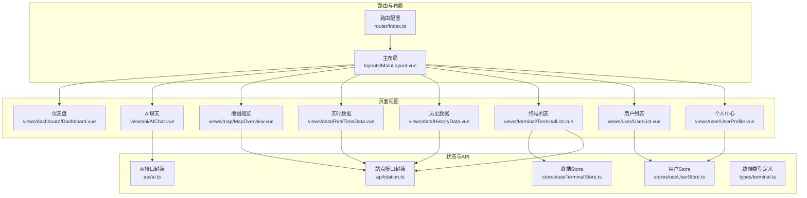
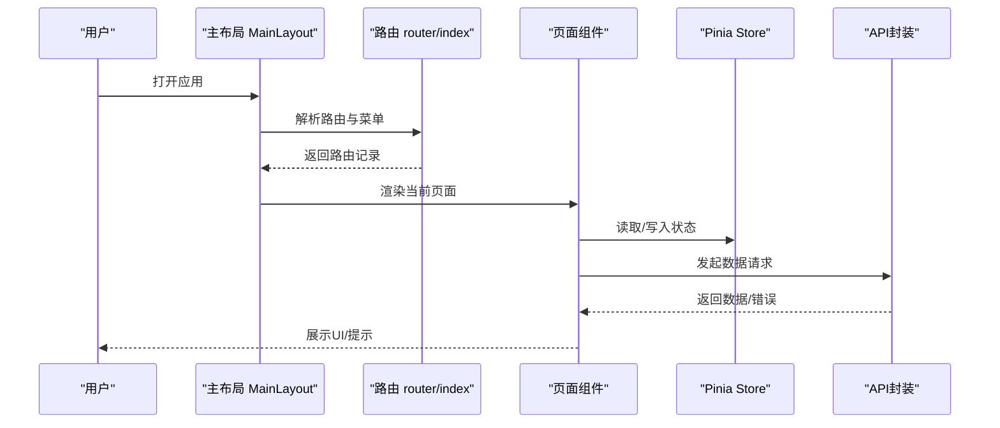
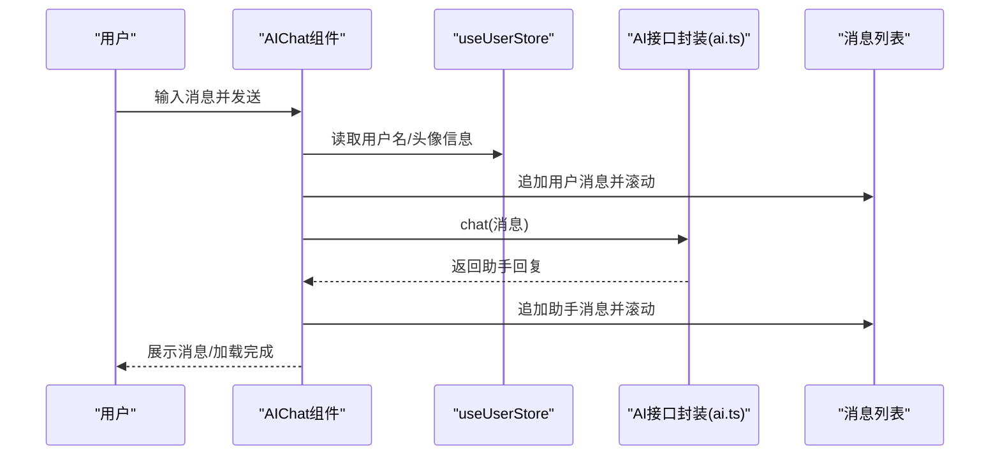
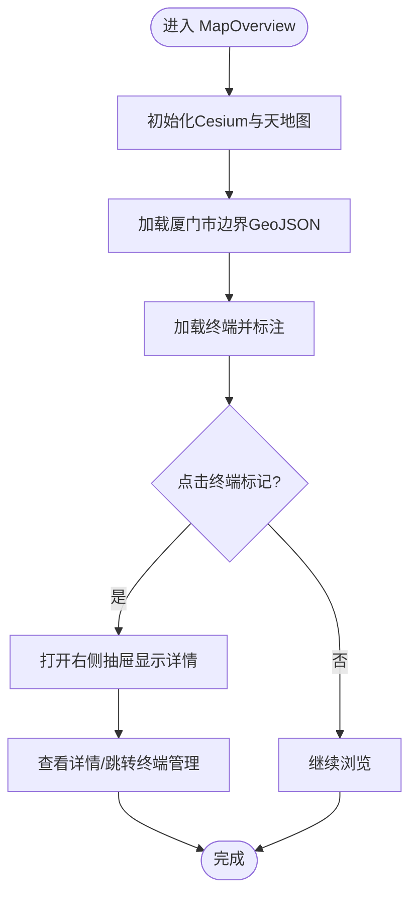
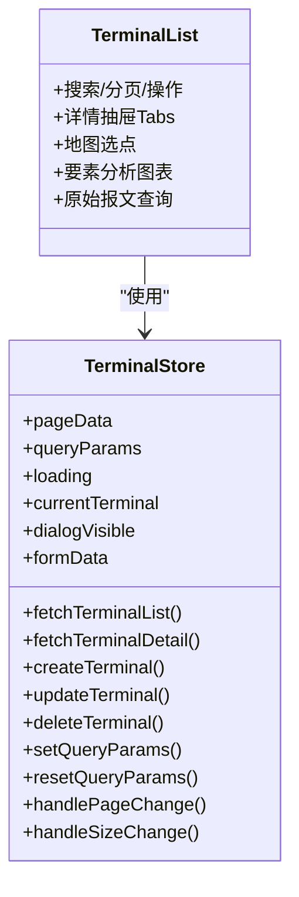
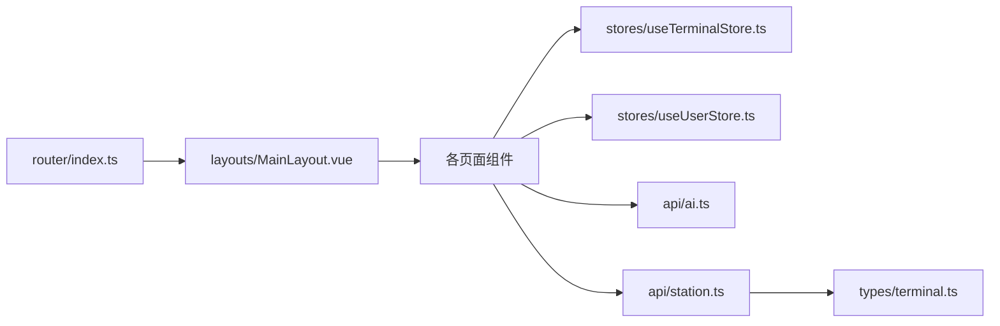

# 页面组件

<cite>
**本文档引用的文件**
- [路由配置 index.ts](file://src/router/index.ts)
- [主布局 MainLayout.vue](file://src/layouts/MainLayout.vue)
- [仪表盘 Dashboard.vue](file://src/views/dashboard/Dashboard.vue)
- [AI聊天 AIChat.vue](file://src/views/ai/AIChat.vue)
- [地图概览 MapOverview.vue](file://src/views/map/MapOverview.vue)
- [实时数据 RealTimeData.vue](file://src/views/data/RealTimeData.vue)
- [历史数据 HistoryData.vue](file://src/views/data/HistoryData.vue)
- [终端列表 TerminalList.vue](file://src/views/terminal/TerminalList.vue)
- [用户列表 UserList.vue](file://src/views/user/UserList.vue)
- [个人中心 UserProfile.vue](file://src/views/user/UserProfile.vue)
- [终端管理 Pinia Store useTerminalStore.ts](file://src/stores/useTerminalStore.ts)
- [用户管理 Pinia Store useUserStore.ts](file://src/stores/useUserStore.ts)
- [AI 接口封装 ai.ts](file://src/api/ai.ts)
- [站点与数据接口封装 station.ts](file://src/api/station.ts)
- [终端类型定义 terminal.ts](file://src/types/terminal.ts)
</cite>

## 目录
1. [简介](#简介)
2. [项目结构](#项目结构)
3. [核心组件](#核心组件)
4. [架构总览](#架构总览)
5. [详细组件分析](#详细组件分析)
6. [依赖分析](#依赖分析)
7. [性能考量](#性能考量)
8. [故障排查指南](#故障排查指南)
9. [结论](#结论)
10. [附录](#附录)

## 简介
本文件面向开发者与产品人员，系统梳理水文监测前端项目中的页面组件，覆盖仪表盘、AI智能助手、地图展示、数据查看、终端管理、用户管理等核心页面。内容包括路由配置、数据获取、状态管理、用户交互、生命周期管理、错误处理与性能优化策略，并给出页面间导航关系与数据流转示例，以及响应式、国际化与可访问性方面的建议。

## 项目结构
项目采用 Vue 3 + TypeScript + Element Plus + Pinia + Vue Router 的现代前端架构，页面按功能域组织在 views 下，路由集中配置在 router/index.ts，全局布局在 layouts/MainLayout.vue，状态通过 Pinia Store 管理，API 通过统一封装模块调用。

**图表来源**
- [路由配置 index.ts:1-136](file://src/router/index.ts#L1-L136)
- [主布局 MainLayout.vue:1-434](file://src/layouts/MainLayout.vue#L1-L434)
- [终端管理 Pinia Store useTerminalStore.ts:1-294](file://src/stores/useTerminalStore.ts#L1-L294)
- [用户管理 Pinia Store useUserStore.ts:1-200](file://src/stores/useUserStore.ts#L1-L200)
- [AI 接口封装 ai.ts:1-113](file://src/api/ai.ts#L1-L113)
- [站点与数据接口封装 station.ts:1-115](file://src/api/station.ts#L1-L115)
- [终端类型定义 terminal.ts:1-84](file://src/types/terminal.ts#L1-L84)

**章节来源**
- [路由配置 index.ts:1-136](file://src/router/index.ts#L1-L136)
- [主布局 MainLayout.vue:1-434](file://src/layouts/MainLayout.vue#L1-L434)

## 核心组件
- 仪表盘：统计卡片、趋势图表占位、快捷操作入口，采用 Element Plus 卡片与栅格布局，预留 ECharts 集成空间。
- AI聊天：基于 Element Plus 的消息列表、Markdown 渲染、输入控制、加载动画与健康检查。
- 地图概览：基于 Cesium 的三维地图、天地图底图、厦门市边界与终端标注、抽屉详情与导航跳转。
- 实时数据：分页表格、动态要素列、在线状态标签、刷新与查询。
- 历史数据：按遥测站编号查询定时报，动态列展示要素值，分页与刷新。
- 终端列表：分页表格、创建/编辑/详情抽屉、地图选点、实时数据与要素分析、原始报文查询。
- 用户列表：分页表格、批量删除、状态开关、新增/编辑对话框。
- 个人中心：用户信息表单、密码修改、登出。

**章节来源**
- [仪表盘 Dashboard.vue:1-155](file://src/views/dashboard/Dashboard.vue#L1-L155)
- [AI聊天 AIChat.vue:1-519](file://src/views/ai/AIChat.vue#L1-L519)
- [地图概览 MapOverview.vue:1-649](file://src/views/map/MapOverview.vue#L1-L649)
- [实时数据 RealTimeData.vue:1-300](file://src/views/data/RealTimeData.vue#L1-L300)
- [历史数据 HistoryData.vue:1-271](file://src/views/data/HistoryData.vue#L1-L271)
- [终端列表 TerminalList.vue:1-800](file://src/views/terminal/TerminalList.vue#L1-L800)
- [用户列表 UserList.vue:1-617](file://src/views/user/UserList.vue#L1-L617)
- [个人中心 UserProfile.vue:1-376](file://src/views/user/UserProfile.vue#L1-L376)

## 架构总览
页面组件通过路由嵌套与主布局组合，左侧菜单根据路由配置动态生成；页面内通过 Pinia Store 管理复杂状态（如终端列表、详情、创建/编辑对话框），并通过 API 封装模块与后端交互。AI 聊天独立使用专用 axios 实例，带鉴权与统一错误处理；数据类页面通过通用请求工具与类型定义对接后端分页与数据模型。

**图表来源**
- [主布局 MainLayout.vue:117-211](file://src/layouts/MainLayout.vue#L117-L211)
- [路由配置 index.ts:8-109](file://src/router/index.ts#L8-L109)
- [终端管理 Pinia Store useTerminalStore.ts:69-93](file://src/stores/useTerminalStore.ts#L69-L93)
- [AI 接口封装 ai.ts:17-77](file://src/api/ai.ts#L17-L77)

## 详细组件分析

### 仪表盘 Dashboard
- 功能特性
  - 四象限统计卡片（用户总数、文章数量、评论数量、访问量）
  - 可扩展的趋势图表与用户分布图表区域
  - 快捷操作按钮（新建用户、导入数据、导出数据、系统设置）
- 数据与状态
  - 采用静态占位数据，便于后续接入真实接口
  - 响应式布局，移动端适配良好
- 生命周期与交互
  - setup 语法糖，无复杂生命周期钩子
- 错误处理与性能
  - 无网络请求，无需错误处理
  - 建议后续集成 ECharts 时开启懒加载与防抖

**章节来源**
- [仪表盘 Dashboard.vue:1-155](file://src/views/dashboard/Dashboard.vue#L1-L155)

### AI聊天 AIChat
- 功能特性
  - 消息列表（用户/助手双端）、Markdown 渲染、时间戳、打字机加载动画
  - 输入框（支持 Ctrl+Enter 发送）、清空对话、健康检查
  - 用户头像首字母与颜色（基于用户名哈希）
- 数据与状态
  - 消息数组、输入内容、加载状态、滚动到底部
  - 使用 useUserStore 注入用户信息，生成头像
- 生命周期与交互
  - onMounted 初始化欢迎消息
  - handleSend 调用 chat 接口，异常时提示
  - handleHealthCheck 调用健康检查接口
- 错误处理与性能
  - Markdown 渲染异常保护
  - 加载状态与禁用发送按钮，避免重复请求
  - 建议对输入进行防抖与最大长度限制

**图表来源**
- [AI聊天 AIChat.vue:92-229](file://src/views/ai/AIChat.vue#L92-L229)
- [AI 接口封装 ai.ts:96-105](file://src/api/ai.ts#L96-L105)
- [用户管理 Pinia Store useUserStore.ts:18-53](file://src/stores/useUserStore.ts#L18-L53)

**章节来源**
- [AI聊天 AIChat.vue:1-519](file://src/views/ai/AIChat.vue#L1-L519)
- [AI 接口封装 ai.ts:1-113](file://src/api/ai.ts#L1-L113)
- [用户管理 Pinia Store useUserStore.ts:1-200](file://src/stores/useUserStore.ts#L1-L200)

### 地图概览 MapOverview
- 功能特性
  - Cesium 三维地图、天地图底图、厦门市边界与3D拉伸、光墙效果
  - 终端标注（在线/离线不同颜色）、点击弹出描述、抽屉详情
  - 飞行动画缩放至厦门整体范围
- 数据与状态
  - viewer 实例、边界实体、标记点映射、终端列表、抽屉可见性
- 生命周期与交互
  - onMounted 初始化地图、onUnmounted 销毁资源
  - loadTerminalsAndMark 标注终端、clearMarkers 清理
  - handleViewDetail 跳转终端管理并携带参数
- 错误处理与性能
  - try/catch 包裹初始化与加载，失败提示
  - 裁剪平面数量较多可能影响性能，注意优化
  - 建议延迟加载 Cesium 与天地图资源

**图表来源**
- [地图概览 MapOverview.vue:77-124](file://src/views/map/MapOverview.vue#L77-L124)
- [地图概览 MapOverview.vue:467-557](file://src/views/map/MapOverview.vue#L467-L557)
- [地图概览 MapOverview.vue:588-622](file://src/views/map/MapOverview.vue#L588-L622)

**章节来源**
- [地图概览 MapOverview.vue:1-649](file://src/views/map/MapOverview.vue#L1-L649)

### 实时数据 RealTimeData
- 功能特性
  - 搜索条件（站名、编号、在线状态）、分页表格、动态要素列
  - 在线状态标签、观测时间、接收时间、查看历史数据
- 数据与状态
  - searchForm、pagination、tableData、displayedElements（动态列）
  - getElementValue 格式化数值（按要素类型保留小数位）
- 生命周期与交互
  - onMounted 初始化加载
  - handleSearch/handleReset/handleRefresh/handleSizeChange/handleCurrentChange
  - handleViewHistory 跳转历史数据并传参
- 错误处理与性能
  - 前端过滤与分页，避免一次性加载过多
  - 建议对搜索输入做防抖

**章节来源**
- [实时数据 RealTimeData.vue:1-300](file://src/views/data/RealTimeData.vue#L1-L300)
- [站点与数据接口封装 station.ts:74-80](file://src/api/station.ts#L74-L80)

### 历史数据 HistoryData
- 功能特性
  - 从路由参数获取遥测站编号与名称，查询定时报
  - 动态要素列、分页、刷新
- 数据与状态
  - route.query 读取 stationCode/stationName
  - displayedElements 动态列、getElementValue 格式化
- 生命周期与交互
  - onMounted 校验参数并加载
  - handleSearch/handleReset/handleRefresh/handleSizeChange/handleCurrentChange
- 错误处理与性能
  - 参数缺失时提示，避免无效请求

**章节来源**
- [历史数据 HistoryData.vue:1-271](file://src/views/data/HistoryData.vue#L1-L271)
- [站点与数据接口封装 station.ts:99-104](file://src/api/station.ts#L99-L104)

### 终端列表 TerminalList
- 功能特性
  - 搜索（名称/编码/在线状态）、分页表格、操作列（查看/编辑/删除）
  - 创建/编辑对话框（含经纬度与地图选点）、详情抽屉（基础信息/实时数据/要素分析/原始报文）
  - 要素分析（折线图+列表）、原始报文查询与分页
- 数据与状态
  - useTerminalStore 管理分页、查询参数、加载状态、当前详情、对话框与表单
  - displayedTimedElements 动态列、getTimedElementValue 格式化
  - ECharts 实例与图表更新
- 生命周期与交互
  - onMounted 初始化加载
  - handleSearch/reset、分页回调、抽屉详情、地图选点
  - fetchTimedReportData 更新图表、handleQueryTimedReport/handleResetQuery
- 错误处理与性能
  - 加载状态与空数据提示
  - 图表渲染建议节流与懒加载

**图表来源**
- [终端列表 TerminalList.vue:594-800](file://src/views/terminal/TerminalList.vue#L594-L800)
- [终端管理 Pinia Store useTerminalStore.ts:23-293](file://src/stores/useTerminalStore.ts#L23-L293)

**章节来源**
- [终端列表 TerminalList.vue:1-800](file://src/views/terminal/TerminalList.vue#L1-L800)
- [终端管理 Pinia Store useTerminalStore.ts:1-294](file://src/stores/useTerminalStore.ts#L1-L294)
- [终端类型定义 terminal.ts:1-84](file://src/types/terminal.ts#L1-L84)

### 用户列表 UserList
- 功能特性
  - 搜索（用户名/真实姓名/手机号/角色/状态）、分页表格、批量删除
  - 新增/编辑对话框、状态开关、表单校验
- 数据与状态
  - queryParams、tableData、total、selectedRows
  - userForm 表单与校验规则
- 生命周期与交互
  - onMounted 初始化加载
  - handleSearch/handleReset/handleSelectionChange/handleStatusChange
  - handleAdd/handleEdit/handleDelete/handleBatchDelete/handleSubmit
- 错误处理与性能
  - ElMessageBox 确认删除，Promise.all 批量删除

**章节来源**
- [用户列表 UserList.vue:1-617](file://src/views/user/UserList.vue#L1-L617)

### 个人中心 UserProfile
- 功能特性
  - 用户基本信息展示、表单修改、修改密码、登出
- 数据与状态
  - useUserStore 注入用户信息，表单双向绑定
- 生命周期与交互
  - onMounted 获取用户详情
  - handleUpdate/handleReset/handleChangePassword
- 错误处理与性能
  - 密码修改成功后自动登出并跳转登录页

**章节来源**
- [个人中心 UserProfile.vue:1-376](file://src/views/user/UserProfile.vue#L1-L376)
- [用户管理 Pinia Store useUserStore.ts:1-200](file://src/stores/useUserStore.ts#L1-L200)

## 依赖分析
- 路由与布局
  - 路由配置集中声明页面与权限元信息，主布局根据路由动态生成菜单与面包屑
- 状态管理
  - useTerminalStore 管理终端 CRUD 与分页状态，useUserStore 管理用户登录态与信息
- API 封装
  - AI 接口封装独立实例，带鉴权与统一错误处理
  - 站点接口封装基于通用请求工具，返回分页与数据模型
- 类型定义
  - 终端类型定义涵盖实体、查询、分页与在线状态枚举

**图表来源**
- [路由配置 index.ts:8-109](file://src/router/index.ts#L8-L109)
- [主布局 MainLayout.vue:138-144](file://src/layouts/MainLayout.vue#L138-L144)
- [终端管理 Pinia Store useTerminalStore.ts:1-294](file://src/stores/useTerminalStore.ts#L1-L294)
- [用户管理 Pinia Store useUserStore.ts:1-200](file://src/stores/useUserStore.ts#L1-L200)
- [AI 接口封装 ai.ts:1-113](file://src/api/ai.ts#L1-L113)
- [站点与数据接口封装 station.ts:1-115](file://src/api/station.ts#L1-L115)
- [终端类型定义 terminal.ts:1-84](file://src/types/terminal.ts#L1-L84)

**章节来源**
- [路由配置 index.ts:1-136](file://src/router/index.ts#L1-L136)
- [主布局 MainLayout.vue:1-434](file://src/layouts/MainLayout.vue#L1-L434)
- [终端管理 Pinia Store useTerminalStore.ts:1-294](file://src/stores/useTerminalStore.ts#L1-L294)
- [用户管理 Pinia Store useUserStore.ts:1-200](file://src/stores/useUserStore.ts#L1-L200)
- [AI 接口封装 ai.ts:1-113](file://src/api/ai.ts#L1-L113)
- [站点与数据接口封装 station.ts:1-115](file://src/api/station.ts#L1-L115)
- [终端类型定义 terminal.ts:1-84](file://src/types/terminal.ts#L1-L84)

## 性能考量
- 资源懒加载
  - Cesium 与 ECharts 建议按需引入与延迟初始化
  - 天地图资源与 GeoJSON 文件建议 CDN 或预加载
- 渲染优化
  - 大表格分页与虚拟滚动（可选）
  - 动态列仅渲染必要列，减少 DOM 数量
- 网络优化
  - 搜索防抖、请求合并与缓存策略
  - 统一错误拦截与降级提示
- 内存管理
  - 组件卸载时销毁 Cesium Viewer、ECharts 实例与事件监听
  - 清理定时器与订阅

## 故障排查指南
- 路由与权限
  - 未登录访问受保护页面将被重定向至登录页；检查本地 token 是否存在
- 地图初始化失败
  - 检查天地图 token 与网络连通性；确认 Cesium 资源加载成功
- AI 聊天失败
  - 检查 AI 接口封装的 baseURL 与鉴权头；查看响应拦截器错误提示
- 数据加载异常
  - 实时/历史数据页面检查 stationCode 参数与分页参数；确认接口返回结构
- 终端管理
  - 创建/编辑/删除失败查看 Store 的错误提示与回退逻辑
- 用户信息
  - 登录后无法获取用户详情时，检查 token 解析与默认用户信息设置

**章节来源**
- [路由配置 index.ts:117-133](file://src/router/index.ts#L117-L133)
- [地图概览 MapOverview.vue:120-123](file://src/views/map/MapOverview.vue#L120-L123)
- [AI 接口封装 ai.ts:46-77](file://src/api/ai.ts#L46-L77)
- [实时数据 RealTimeData.vue:223-228](file://src/views/data/RealTimeData.vue#L223-L228)
- [终端管理 Pinia Store useTerminalStore.ts:87-93](file://src/stores/useTerminalStore.ts#L87-L93)
- [用户管理 Pinia Store useUserStore.ts:100-125](file://src/stores/useUserStore.ts#L100-L125)

## 结论
本项目页面组件围绕“路由驱动 + 布局统一 + 状态集中 + 接口封装”的架构设计，实现了从仪表盘到终端管理的完整业务闭环。建议后续重点在性能优化（懒加载、虚拟滚动、缓存）、可访问性（键盘导航、ARIA 标签）与国际化（多语言资源）方面持续改进，以提升用户体验与可维护性。

## 附录
- 页面间导航关系
  - 仪表盘 → 实时数据（查看历史数据）→ 历史数据
  - 地图概览 → 终端管理（抽屉详情/跳转）
  - 终端管理 → 要素分析/原始报文
  - 个人中心 → 退出登录
- 数据流转示例
  - 实时数据 → 历史数据：传递 stationCode 与 stationName
  - 地图概览 → 终端管理：传递 viewId
  - 终端详情抽屉 → 要素分析：根据当前终端 terminalCode 查询定时报