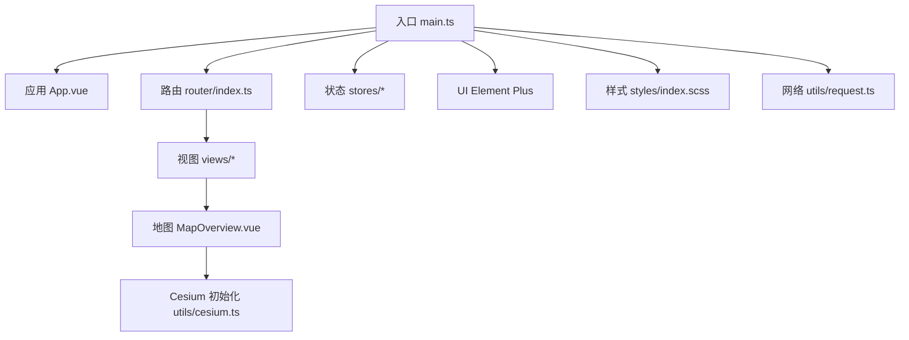
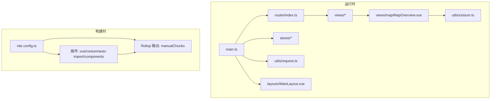
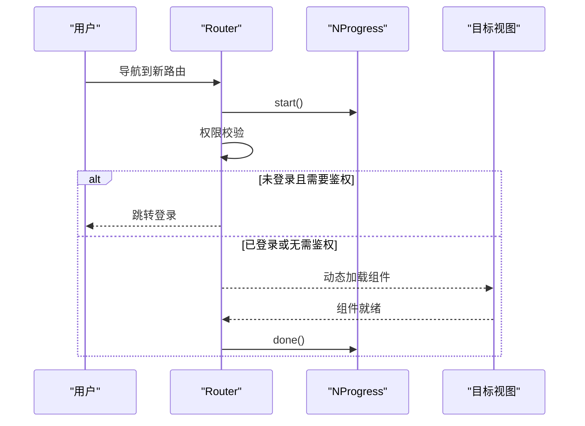
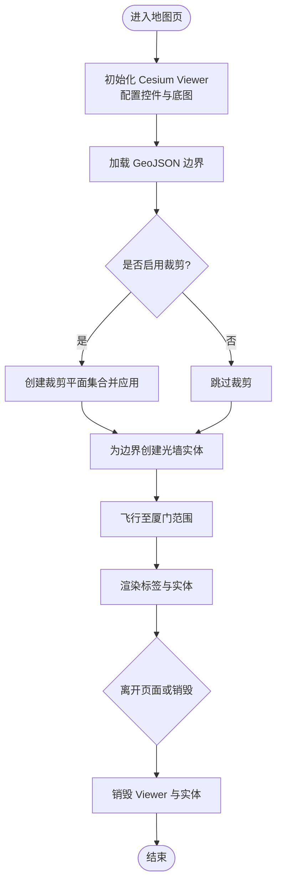
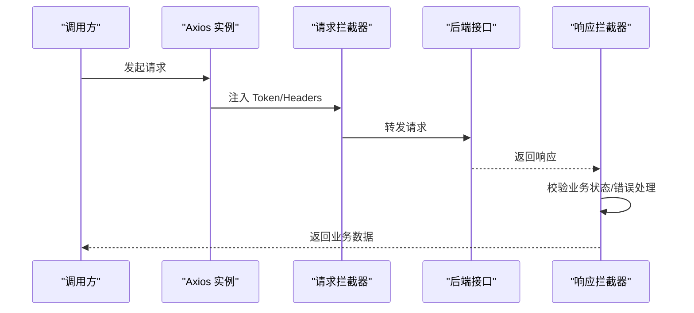
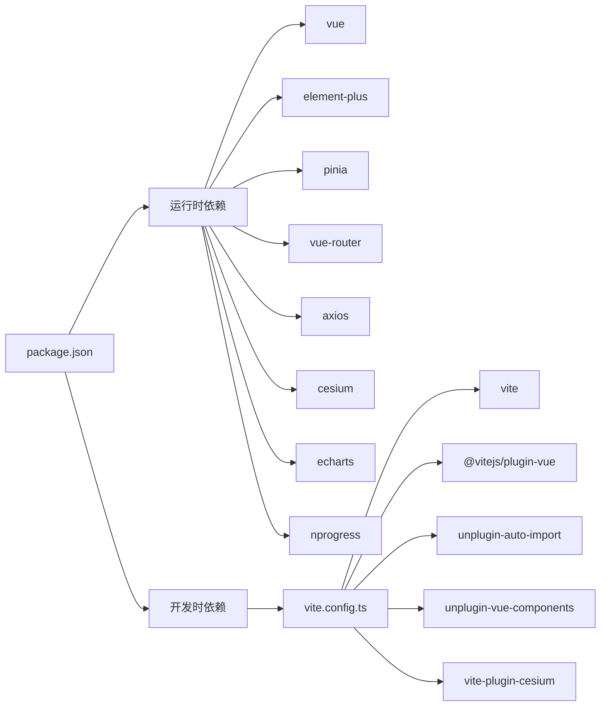

# 性能优化

<cite>
**本文引用的文件**
- [package.json](file://package.json)
- [vite.config.ts](file://vite.config.ts)
- [src/main.ts](file://src/main.ts)
- [src/router/index.ts](file://src/router/index.ts)
- [src/utils/cesium.ts](file://src/utils/cesium.ts)
- [src/views/map/MapOverview.vue](file://src/views/map/MapOverview.vue)
- [src/stores/useTerminalStore.ts](file://src/stores/useTerminalStore.ts)
- [src/stores/useThemeStore.ts](file://src/stores/useThemeStore.ts)
- [src/stores/useUserStore.ts](file://src/stores/useUserStore.ts)
- [src/layouts/MainLayout.vue](file://src/layouts/MainLayout.vue)
- [src/utils/request.ts](file://src/utils/request.ts)
- [src/styles/index.scss](file://src/styles/index.scss)
- [README.md](file://README.md)
- [docs/CESIUM_GUIDE.md](file://docs/CESIUM_GUIDE.md)
</cite>

## 目录
1. [简介](#简介)
2. [项目结构](#项目结构)
3. [核心组件](#核心组件)
4. [架构总览](#架构总览)
5. [详细组件分析](#详细组件分析)
6. [依赖分析](#依赖分析)
7. [性能考量](#性能考量)
8. [故障排查指南](#故障排查指南)
9. [结论](#结论)
10. [附录](#附录)

## 简介
本文件面向水文监测前端项目，聚焦于前端性能优化策略与落地实践，涵盖代码分割与懒加载、Cesium 地图与 3D 渲染优化、内存管理、Bundle 分析与资源压缩、缓存与网络优化、CDN 与静态资源处理、性能监控指标、用户体验优化与移动端适配、构建优化与 Tree Shaking、依赖精简、性能测试与基准测试工具及优化建议。

## 项目结构
项目采用 Vue 3 + TypeScript + Vite 架构，结合 Element Plus、Pinia、Vue Router、Axios 等生态组件。核心入口在 main.ts，路由懒加载通过动态 import 实现；地图模块位于 MapOverview.vue，使用 Cesium 进行 3D 地图渲染；状态管理通过 Pinia Store 管理用户、主题与终端数据；网络请求统一通过 Axios 封装与拦截器处理。

**图表来源**
- [src/main.ts:1-26](file://src/main.ts#L1-L26)
- [src/router/index.ts:1-136](file://src/router/index.ts#L1-L136)
- [src/views/map/MapOverview.vue:1-649](file://src/views/map/MapOverview.vue#L1-L649)
- [src/utils/cesium.ts:1-19](file://src/utils/cesium.ts#L1-L19)
- [src/utils/request.ts:1-180](file://src/utils/request.ts#L1-L180)
- [src/styles/index.scss:1-114](file://src/styles/index.scss#L1-L114)

**章节来源**
- [README.md:1-128](file://README.md#L1-L128)
- [src/main.ts:1-26](file://src/main.ts#L1-L26)
- [src/router/index.ts:1-136](file://src/router/index.ts#L1-L136)

## 核心组件
- 应用入口与插件注册：在入口文件中注册 Element Plus、Pinia、Router，并引入全局样式，确保按需与懒加载生效。
- 路由懒加载：通过动态 import 实现页面级懒加载，减少首屏体积与加载时间。
- 状态管理：用户、主题、终端等状态通过 Pinia Store 管理，避免重复请求与跨组件重复计算。
- 网络请求：Axios 封装统一处理响应数据、鉴权头注入、错误提示与 Token 过期处理。
- 地图渲染：Cesium 初始化与天地图底图配置，配合裁剪、光照与光墙等特效，兼顾视觉与性能。

**章节来源**
- [src/main.ts:1-26](file://src/main.ts#L1-L26)
- [src/router/index.ts:12-129](file://src/router/index.ts#L12-L129)
- [src/stores/useUserStore.ts:1-200](file://src/stores/useUserStore.ts#L1-L200)
- [src/stores/useThemeStore.ts:1-69](file://src/stores/useThemeStore.ts#L1-L69)
- [src/stores/useTerminalStore.ts:1-294](file://src/stores/useTerminalStore.ts#L1-L294)
- [src/utils/request.ts:1-180](file://src/utils/request.ts#L1-L180)
- [src/utils/cesium.ts:1-19](file://src/utils/cesium.ts#L1-L19)
- [src/views/map/MapOverview.vue:77-124](file://src/views/map/MapOverview.vue#L77-L124)

## 架构总览
前端采用“入口注册 + 路由懒加载 + 状态管理 + 网络层 + 地图渲染”的分层架构。构建阶段通过 Vite 与 Rollup 进行代码分割与打包优化，运行时通过懒加载与按需渲染降低首屏压力。

**图表来源**
- [src/main.ts:1-26](file://src/main.ts#L1-L26)
- [src/router/index.ts:1-136](file://src/router/index.ts#L1-L136)
- [src/layouts/MainLayout.vue:1-434](file://src/layouts/MainLayout.vue#L1-L434)
- [src/views/map/MapOverview.vue:1-649](file://src/views/map/MapOverview.vue#L1-L649)
- [src/utils/cesium.ts:1-19](file://src/utils/cesium.ts#L1-L19)
- [src/utils/request.ts:1-180](file://src/utils/request.ts#L1-L180)
- [vite.config.ts:10-67](file://vite.config.ts#L10-L67)

## 详细组件分析

### 路由懒加载与导航性能
- 路由守卫中集成进度条 NProgress，提升导航感知。
- 页面级懒加载通过动态 import 实现，减少非关键路径的初始下载。
- keep-alive 包裹 router-view，缓存页面状态，避免重复渲染。

**图表来源**
- [src/router/index.ts:111-133](file://src/router/index.ts#L111-L133)

**章节来源**
- [src/router/index.ts:12-129](file://src/router/index.ts#L12-L129)
- [src/layouts/MainLayout.vue:107-111](file://src/layouts/MainLayout.vue#L107-L111)

### Cesium 地图渲染与内存管理
- 初始化 Viewer 时按需开启/关闭控件，降低渲染开销。
- 天地图底图按需加载，移除默认底图后仅保留所需图层。
- 通过裁剪平面实现“悬浮岛”效果，必要时可动态启停以平衡视觉与性能。
- 标签与实体的显示条件通过距离显示条件与深度测试控制，避免过度绘制。
- 组件卸载时销毁 Viewer 与清理实体，防止内存泄漏。

**图表来源**
- [src/views/map/MapOverview.vue:77-124](file://src/views/map/MapOverview.vue#L77-L124)
- [src/views/map/MapOverview.vue:302-462](file://src/views/map/MapOverview.vue#L302-L462)
- [src/views/map/MapOverview.vue:467-557](file://src/views/map/MapOverview.vue#L467-L557)
- [src/views/map/MapOverview.vue:611-622](file://src/views/map/MapOverview.vue#L611-L622)

**章节来源**
- [src/views/map/MapOverview.vue:77-124](file://src/views/map/MapOverview.vue#L77-L124)
- [src/views/map/MapOverview.vue:302-462](file://src/views/map/MapOverview.vue#L302-L462)
- [src/views/map/MapOverview.vue:467-557](file://src/views/map/MapOverview.vue#L467-L557)
- [src/views/map/MapOverview.vue:611-622](file://src/views/map/MapOverview.vue#L611-L622)
- [src/utils/cesium.ts:10-15](file://src/utils/cesium.ts#L10-L15)

### 网络层与缓存策略
- Axios 统一注入 Authorization 头，响应拦截器统一处理业务状态与错误提示。
- 响应数据预处理大整数，避免 JS 精度丢失。
- 开发与生产环境通过环境变量区分 baseURL，便于代理与跨域调试。

**图表来源**
- [src/utils/request.ts:53-75](file://src/utils/request.ts#L53-L75)
- [src/utils/request.ts:78-93](file://src/utils/request.ts#L78-L93)
- [src/utils/request.ts:96-151](file://src/utils/request.ts#L96-L151)

**章节来源**
- [src/utils/request.ts:1-180](file://src/utils/request.ts#L1-L180)

### 状态管理与数据缓存
- 用户信息与 Token 本地持久化，刷新后从 sessionStorage 恢复，避免重复登录。
- 终端 Store 管理分页与查询参数，避免重复请求与重复渲染。
- 主题 Store 支持主题切换与持久化，减少样式重绘成本。

**章节来源**
- [src/stores/useUserStore.ts:18-200](file://src/stores/useUserStore.ts#L18-L200)
- [src/stores/useTerminalStore.ts:23-294](file://src/stores/useTerminalStore.ts#L23-L294)
- [src/stores/useThemeStore.ts:34-69](file://src/stores/useThemeStore.ts#L34-L69)

## 依赖分析
- 运行时依赖：Vue 3、Element Plus、Pinia、Vue Router、Axios、Cesium、ECharts、NProgress。
- 开发时依赖：Vite、@vitejs/plugin-vue、unplugin-auto-import、unplugin-vue-components、vite-plugin-cesium、TypeScript、ESLint、Prettier 等。
- 构建配置：通过 Vite 与 Rollup 的 manualChunks 将 element-plus 与 vendor（vue、router、pinia、axios）拆分为独立 chunk，提升缓存命中率。

**图表来源**
- [package.json:14-46](file://package.json#L14-L46)
- [vite.config.ts:14-27](file://vite.config.ts#L14-L27)

**章节来源**
- [package.json:14-46](file://package.json#L14-L46)
- [vite.config.ts:53-65](file://vite.config.ts#L53-L65)

## 性能考量

### 代码分割与懒加载
- 页面级懒加载：路由中对 Login、Dashboard、AI、MapOverview、Data、Terminal、System、Profile 等视图均使用动态 import，减少首屏 JS 体积。
- 组件级懒加载：Element Plus 与 Vue API 通过 unplugin-auto-import 与 unplugin-vue-components 自动按需导入，避免全量引入。
- 第三方库拆分：通过 manualChunks 将 element-plus 与 vendor 拆分，提升缓存复用。

**章节来源**
- [src/router/index.ts:12-129](file://src/router/index.ts#L12-L129)
- [vite.config.ts:59-63](file://vite.config.ts#L59-L63)

### Cesium 地图性能优化
- 控件裁剪：关闭动画、时间线、信息框等非必要控件，降低渲染负担。
- 底图优化：仅加载卫星影像与注记图层，限制最大层级，避免超清瓦片带来的带宽与内存压力。
- 裁剪与光照：按需启用裁剪平面与光照，必要时动态关闭以提升帧率。
- 标签与实体：通过距离显示条件、深度测试与缩放策略控制标签渲染范围与频率。
- 内存管理：组件卸载时销毁 Viewer 与实体，避免泄漏。

**章节来源**
- [src/views/map/MapOverview.vue:83-98](file://src/views/map/MapOverview.vue#L83-L98)
- [src/views/map/MapOverview.vue:129-162](file://src/views/map/MapOverview.vue#L129-L162)
- [src/views/map/MapOverview.vue:206-297](file://src/views/map/MapOverview.vue#L206-L297)
- [src/views/map/MapOverview.vue:430-446](file://src/views/map/MapOverview.vue#L430-L446)
- [src/views/map/MapOverview.vue:611-622](file://src/views/map/MapOverview.vue#L611-L622)

### Bundle 分析、资源压缩与缓存策略
- 构建产物：生产构建默认生成 dist，可通过可视化分析工具（如 webpack-bundle-analyzer 或 Vite 自带分析）查看体积构成。
- 压缩与混淆：Vite 默认启用压缩，建议在 CI 中开启 gzip/brotli 压缩与长期缓存策略。
- 缓存：manualChunks 将 element-plus 与 vendor 独立拆分，结合浏览器缓存与 CDN，提升二次加载速度。

**章节来源**
- [vite.config.ts:53-65](file://vite.config.ts#L53-L65)

### 网络优化、CDN 与静态资源
- 代理与跨域：开发环境通过 Vite 代理将 /api 与 /ai-api 转发到后端，避免跨域问题。
- CDN：建议将 element-plus、Cesium、ECharts 等第三方库托管至 CDN，结合缓存头与版本号，提升加载速度。
- 静态资源：将 GeoJSON、图片等静态资源放置于 CDN 或与站点同源，减少跨域与额外握手。

**章节来源**
- [vite.config.ts:37-51](file://vite.config.ts#L37-L51)

### 性能监控指标与用户体验
- 帧率监控：Cesium 提供 debugShowFramesPerSecond，可在开发阶段观察帧率波动。
- 导航体验：NProgress 提升路由切换感知；keep-alive 缓存页面状态，减少重复渲染。
- 移动端适配：布局组件与样式具备响应式能力，建议在地图页增加移动端手势与缩放限制，避免过度渲染。

**章节来源**
- [src/router/index.ts:5-6](file://src/router/index.ts#L5-L6)
- [src/layouts/MainLayout.vue:107-111](file://src/layouts/MainLayout.vue#L107-L111)
- [docs/CESIUM_GUIDE.md:574-579](file://docs/CESIUM_GUIDE.md#L574-L579)

### 构建优化、Tree Shaking 与依赖精简
- Tree Shaking：配合 ES Module 与按需导入，确保未使用的代码被剔除。
- 依赖精简：定期审计 package.json，移除未使用依赖；对 Cesium、ECharts 等大体积库按需引入其子模块。
- 类型检查：TypeScript 严格模式与 ESLint/Prettier 规范有助于早期发现冗余与潜在性能问题。

**章节来源**
- [package.json:14-46](file://package.json#L14-L46)
- [README.md:106-117](file://README.md#L106-L117)

### 性能测试工具、基准测试与优化建议
- 性能测试工具：Lighthouse、WebPageTest、Chrome DevTools Performance/Network/Rendering 面板。
- 基准测试：对关键页面（如地图页）进行多次冷启动与热启动测量，记录首屏时间、交互延迟与帧率。
- 优化建议：
  - 优先保障首屏关键路径，将非关键资源 defer/lazy。
  - 对 Cesium 渲染进行分级降采样（降低光照质量、阴影、大气等特效）。
  - 对大量实体采用聚合或简化几何，减少绘制批次。
  - 使用 IntersectionObserver 控制可视区域内的实体渲染。

[本节为通用指导，不直接分析具体文件，故无“章节来源”]

## 故障排查指南
- Cesium 模块导入错误：确认已安装并启用 vite-plugin-cesium。
- 天地图图层加载失败：检查 Token 配置与跨域设置。
- 地图边界不显示：确认 GeoJSON 文件存在、格式正确且无跨域问题。
- 性能抖动：检查裁剪平面数量、标签显示范围与实体数量，必要时关闭光照或裁剪。
- 登录失效：响应拦截器会自动处理 401 并跳转登录，检查 Token 注入逻辑。

**章节来源**
- [docs/CESIUM_GUIDE.md:397-440](file://docs/CESIUM_GUIDE.md#L397-L440)
- [src/utils/request.ts:96-151](file://src/utils/request.ts#L96-L151)

## 结论
本项目在架构层面已具备良好的性能基础：路由懒加载、按需 UI 组件、状态管理与网络层封装。针对 Cesium 地图，建议在保证视觉效果的前提下，通过控件裁剪、裁剪平面与光照的动态启停、标签渲染策略与实体数量控制进一步优化性能。构建阶段通过 manualChunks 与 CDN 缓存提升加载效率。建议建立持续的性能监控与回归测试流程，确保在功能演进中维持稳定体验。

[本节为总结，不直接分析具体文件，故无“章节来源”]

## 附录
- 环境变量与代理配置：参考 Vite 代理规则与环境变量使用。
- 样式与工具类：全局样式与工具类有助于统一布局与减少重复样式。

**章节来源**
- [vite.config.ts:10-67](file://vite.config.ts#L10-L67)
- [src/styles/index.scss:1-114](file://src/styles/index.scss#L1-L114)