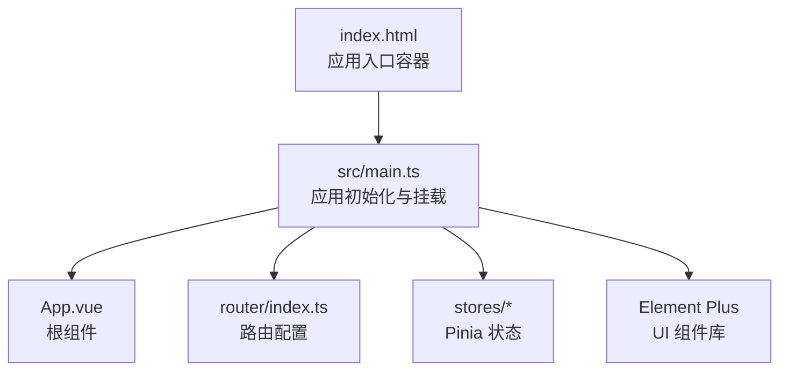
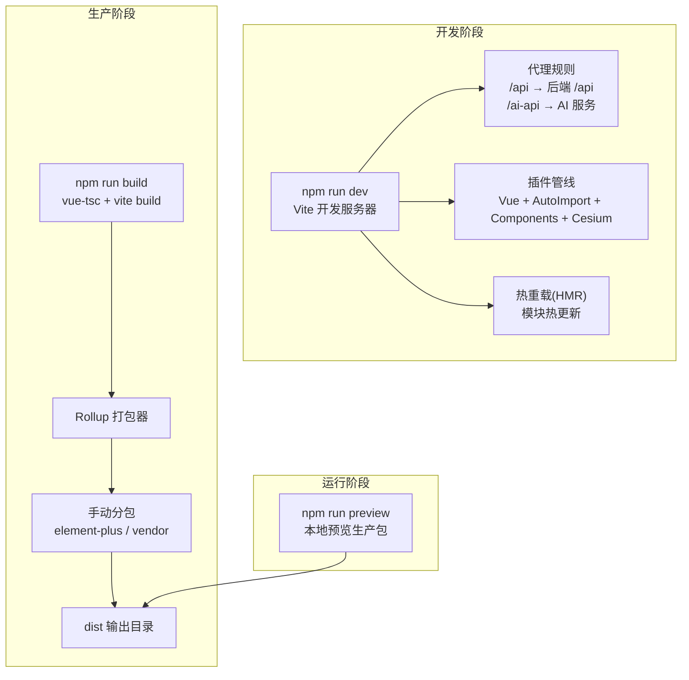
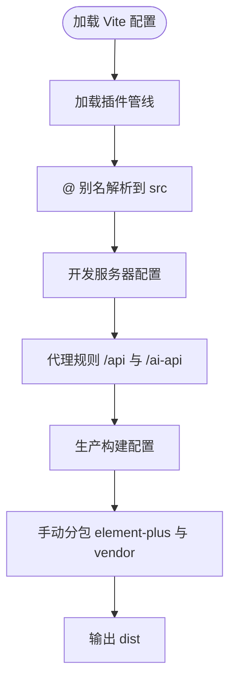
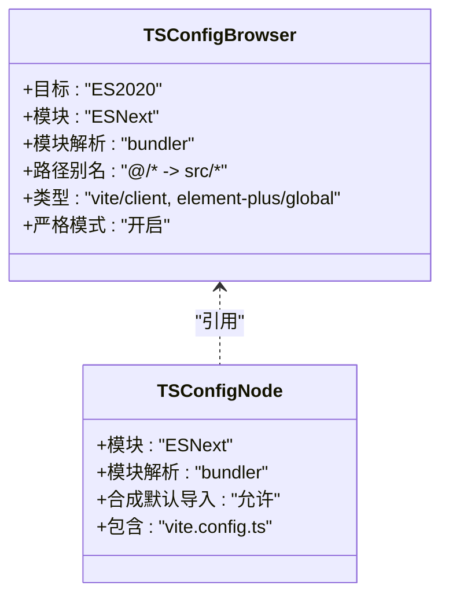
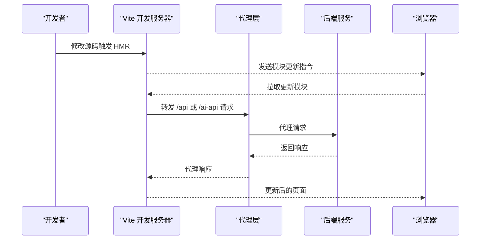
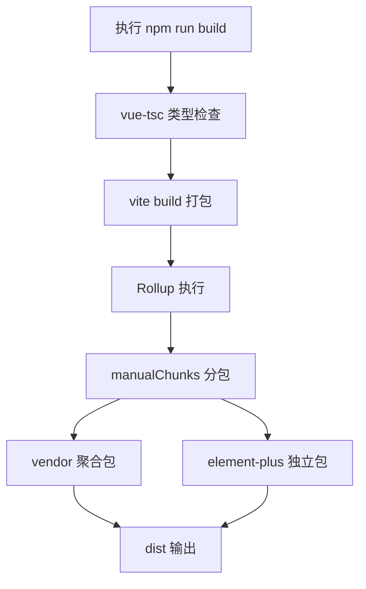
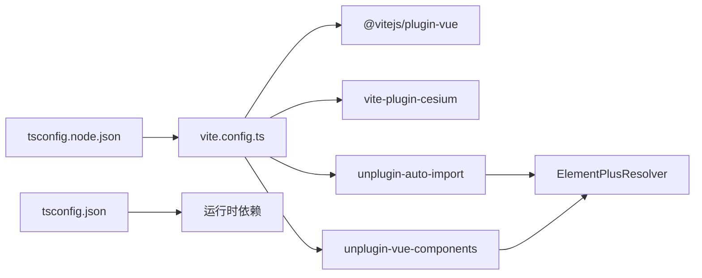

# 构建配置

<cite>
**本文引用的文件**
- [vite.config.ts](file://vite.config.ts)
- [package.json](file://package.json)
- [tsconfig.json](file://tsconfig.json)
- [tsconfig.node.json](file://tsconfig.node.json)
- [index.html](file://index.html)
- [src/main.ts](file://src/main.ts)
- [README.md](file://README.md)
- [start.bat](file://start.bat)
- [start.ps1](file://start.ps1)
- [start.sh](file://start.sh)
</cite>

## 目录
1. [简介](#简介)
2. [项目结构与入口](#项目结构与入口)
3. [核心构建配置](#核心构建配置)
4. [架构总览](#架构总览)
5. [组件级配置详解](#组件级配置详解)
6. [依赖关系分析](#依赖关系分析)
7. [性能与体积优化](#性能与体积优化)
8. [故障排除指南](#故障排除指南)
9. [结论](#结论)
10. [附录](#附录)

## 简介
本文件面向水文监测前端项目的构建配置，围绕 Vite 5.x 的配置参数、插件体系、开发服务器与代理、热重载机制、生产构建优化、代码分割策略、资源与缓存策略、TypeScript 编译与路径别名、以及构建性能与故障排除进行系统化说明。文档同时结合项目实际脚本与环境变量，帮助开发者快速理解并高效维护构建流程。

## 项目结构与入口
- 应用入口位于 src/main.ts，通过 Vue 应用初始化、注册 Element Plus 及其图标、挂载路由与状态管理，并最终挂载到 index.html 中的 #app 容器。
- HTML 入口 index.html 仅包含基础 meta 与一个模块化脚本引入 src/main.ts，确保最小化模板开销。
- TypeScript 编译配置分为两部分：tsconfig.json 面向浏览器端源码，tsconfig.node.json 面向 Vite 配置文件等 Node 环境脚本。

**图表来源**
- [index.html:1-14](file://index.html#L1-L14)
- [src/main.ts:1-26](file://src/main.ts#L1-L26)

**章节来源**
- [index.html:1-14](file://index.html#L1-L14)
- [src/main.ts:1-26](file://src/main.ts#L1-L26)
- [tsconfig.json:1-40](file://tsconfig.json#L1-L40)
- [tsconfig.node.json:1-12](file://tsconfig.node.json#L1-L12)

## 核心构建配置
- 构建工具：Vite 5.x
- 框架与语言：Vue 3 + TypeScript
- UI 框架：Element Plus
- 状态管理：Pinia
- 路由：Vue Router
- HTTP 客户端：Axios
- 样式：SCSS
- 代码规范：ESLint + Prettier

上述技术栈与脚本命令均来自 package.json 的 scripts 字段，其中包含开发、构建、预览、类型检查与代码格式化等常用任务。

**章节来源**
- [package.json:1-48](file://package.json#L1-L48)
- [README.md:1-128](file://README.md#L1-L128)

## 架构总览
下图展示了从开发到生产的整体构建与运行链路，包括开发服务器、代理转发、插件注入、Rollup 打包与产物输出。

**图表来源**
- [vite.config.ts:10-67](file://vite.config.ts#L10-L67)
- [package.json:6-12](file://package.json#L6-L12)

## 组件级配置详解

### Vite 主配置（vite.config.ts）
- 插件体系
  - @vitejs/plugin-vue：解析 .vue 单文件组件与模板编译。
  - vite-plugin-cesium：自动处理 Cesium 的打包与运行兼容问题。
  - unplugin-auto-import：自动导入 Vue、Vue Router、Pinia 与 Element Plus 组件，减少样板代码。
  - unplugin-vue-components：按需自动注册 Element Plus 组件，配合解析器生成类型声明。
- 路径别名
  - 将 @ 解析到 src 目录，便于统一导入路径。
- 开发服务器
  - host：允许外部设备访问（0.0.0.0）。
  - port：优先读取环境变量 VITE_PORT，否则默认 3000。
  - open：启动后自动打开浏览器。
  - 代理：
    - /api → 后端服务地址（changeOrigin=true，保留路径前缀）。
    - /ai-api → AI 服务地址（changeOrigin=true，rewrite 去除前缀）。
- 生产构建
  - outDir：输出目录 dist。
  - sourcemap：关闭以减小产物体积。
  - chunkSizeWarningLimit：提升警告阈值至 1500KB，避免大依赖误报。
  - Rollup 输出配置：
    - manualChunks：
      - element-plus：独立拆分，利于 CDN 缓存与复用。
      - vendor：将 vue、vue-router、pinia、axios 等第三方库聚合，减少碎片化。

**图表来源**
- [vite.config.ts:10-67](file://vite.config.ts#L10-L67)

**章节来源**
- [vite.config.ts:1-68](file://vite.config.ts#L1-L68)

### TypeScript 编译配置（tsconfig.json 与 tsconfig.node.json）
- tsconfig.json（浏览器端）
  - 模块解析：bundler，适配 Vite/ESBuild。
  - 路径别名：@/* → src/*。
  - 类型声明：包含 vite/client 与 element-plus/global。
  - 严格模式：开启严格校验，禁用隐式 any。
- tsconfig.node.json（Vite 配置）
  - 仅包含 vite.config.ts，采用 ESNext 模块解析，启用合成默认导入。

**图表来源**
- [tsconfig.json:1-40](file://tsconfig.json#L1-L40)
- [tsconfig.node.json:1-12](file://tsconfig.node.json#L1-L12)

**章节来源**
- [tsconfig.json:1-40](file://tsconfig.json#L1-L40)
- [tsconfig.node.json:1-12](file://tsconfig.node.json#L1-L12)

### 开发服务器与代理（含热重载）
- 开发服务器
  - host：0.0.0.0，便于局域网联调。
  - port：优先读取 VITE_PORT，若未设置则 3000。
  - open：启动即打开浏览器。
- 代理
  - /api：转发到后端服务，保留路径前缀，适合后端统一前缀场景。
  - /ai-api：转发到 AI 服务，rewrite 去除前缀，适合不同服务前缀不一致的场景。
- 热重载（HMR）
  - Vite 默认启用模块热更新，无需额外配置；修改组件、样式或脚本会按模块粒度刷新页面。

**图表来源**
- [vite.config.ts:33-52](file://vite.config.ts#L33-L52)

**章节来源**
- [vite.config.ts:33-52](file://vite.config.ts#L33-L52)
- [start.bat:50-65](file://start.bat#L50-L65)
- [start.ps1:51-85](file://start.ps1#L51-L85)
- [start.sh:45-64](file://start.sh#L45-L64)

### 生产构建与代码分割
- 构建命令
  - 先执行 vue-tsc 进行类型检查，再执行 vite build 产出生产包。
- 产物输出
  - outDir：dist。
  - sourcemap：关闭，降低产物体积与泄露风险。
- 代码分割
  - manualChunks：
    - element-plus：独立 chunk，利于 CDN 缓存与跨站点复用。
    - vendor：将核心三方库聚合为 vendor，减少碎片化与请求数量。
- 体积预警
  - chunkSizeWarningLimit 提升至 1500KB，避免因单个 chunk 过大频繁告警。

**图表来源**
- [package.json](file://package.json#L8)
- [vite.config.ts:53-65](file://vite.config.ts#L53-L65)

**章节来源**
- [package.json](file://package.json#L8)
- [vite.config.ts:53-65](file://vite.config.ts#L53-L65)

### 静态资源与缓存策略
- 静态资源处理
  - Vite 默认对静态资源进行哈希命名与 base64 内联策略（如小文件），具体行为由 Vite 默认规则决定。
- 缓存策略建议
  - 对于独立的 element-plus 包，可结合 CDN 与浏览器缓存策略实现长效缓存。
  - vendor 包名含哈希，可实现“变更才失效”的缓存策略。
  - HTML 与入口 JS 通常不设长效缓存，以保证更新即时生效。

**章节来源**
- [vite.config.ts:57-64](file://vite.config.ts#L57-L64)

## 依赖关系分析
- 依赖与开发依赖
  - 运行时依赖：Vue 3、Element Plus、Pinia、Vue Router、Axios、Cesium、ECharts、NProgress、Markdown-It 等。
  - 开发依赖：Vite、@vitejs/plugin-vue、unplugin-auto-import、unplugin-vue-components、vite-plugin-cesium、TypeScript、ESLint、Prettier 等。
- 关键耦合点
  - vite.config.ts 与各插件之间为直接耦合；Element Plus 与 auto-import/components 插件形成类型与组件注册的间接耦合。
  - tsconfig.json 与 tsconfig.node.json 分别服务于浏览器端与 Vite 配置文件，避免相互干扰。

**图表来源**
- [vite.config.ts:14-27](file://vite.config.ts#L14-L27)
- [package.json:14-46](file://package.json#L14-L46)

**章节来源**
- [package.json:14-46](file://package.json#L14-L46)
- [vite.config.ts:14-27](file://vite.config.ts#L14-L27)

## 性能与体积优化
- 构建性能
  - 关闭 sourcemap：减少构建时间与产物体积。
  - 提升 chunkSizeWarningLimit：避免大依赖误报干扰。
  - 使用手动分包：将稳定不变的库（element-plus）独立，提升缓存命中率。
- 依赖优化
  - 将核心三方库聚合到 vendor，减少碎片化与请求数量。
  - 仅在必要时引入重型库（如 Cesium/ECharts），并在路由或视图层面按需加载。
- 资源优化
  - 合理利用 CDN 加速 element-plus 等公共库。
  - 对图片与媒体资源进行压缩与格式优化。
- 开发体验
  - 代理 rewrite 与 changeOrigin：确保开发时请求路径与后端一致，减少跨域与路径重写成本。
  - host=0.0.0.0：便于多设备联调与演示。

**章节来源**
- [vite.config.ts:55-64](file://vite.config.ts#L55-L64)
- [package.json:14-26](file://package.json#L14-L26)

## 故障排除指南
- 端口占用
  - Windows：启动脚本会提示端口占用并尝试终止占用进程，随后启动开发服务器。
  - Linux/macOS：脚本会检测端口占用并尝试杀死占用进程，避免冲突。
- 环境变量未生效
  - 确认 .env.development 中设置了 VITE_PORT 与后端地址，Vite 会按模式加载对应环境变量。
  - 若代理未生效，检查 /api 与 /ai-api 的 target 地址与 rewrite 规则。
- 类型检查失败
  - 在构建前执行 vue-tsc，定位类型错误后再进行生产构建。
- 插件冲突
  - 若 Element Plus 组件无法自动注册，确认 auto-import 与 components 插件均已正确配置解析器，并生成了类型声明文件。
- Cesium 运行异常
  - 确保已安装 vite-plugin-cesium 并在插件列表中启用，该插件负责处理 Cesium 的打包与运行兼容问题。

**章节来源**
- [start.bat:34-65](file://start.bat#L34-L65)
- [start.ps1:34-85](file://start.ps1#L34-L85)
- [start.sh:30-64](file://start.sh#L30-L64)
- [vite.config.ts:14-27](file://vite.config.ts#L14-L27)
- [package.json](file://package.json#L8)

## 结论
本项目以 Vite 为核心，结合 Vue 3 + TypeScript + Element Plus 的现代前端技术栈，实现了简洁高效的开发与生产构建流程。通过合理的插件配置、路径别名、代理与手动分包策略，兼顾了开发体验与产物性能。建议在后续迭代中持续关注依赖体积、CDN 缓存与按需加载策略，进一步优化首屏性能与长期缓存效果。

## 附录
- 常用脚本
  - 开发：npm run dev
  - 构建：npm run build
  - 预览：npm run preview
  - 类型检查：npm run type-check
  - 代码格式化：npm run format
  - 代码检查：npm run lint
- 启动脚本
  - Windows：start.bat
  - PowerShell：start.ps1
  - Linux/macOS：start.sh

**章节来源**
- [package.json:6-12](file://package.json#L6-L12)
- [README.md:60-84](file://README.md#L60-L84)
- [start.bat:1-66](file://start.bat#L1-L66)
- [start.ps1:1-161](file://start.ps1#L1-L161)
- [start.sh:1-65](file://start.sh#L1-L65)