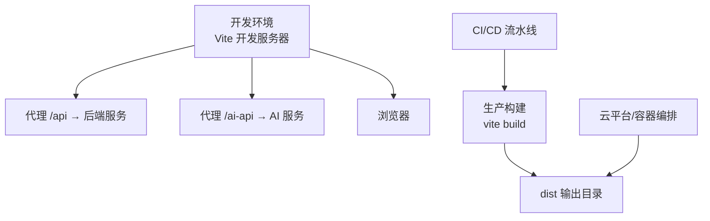
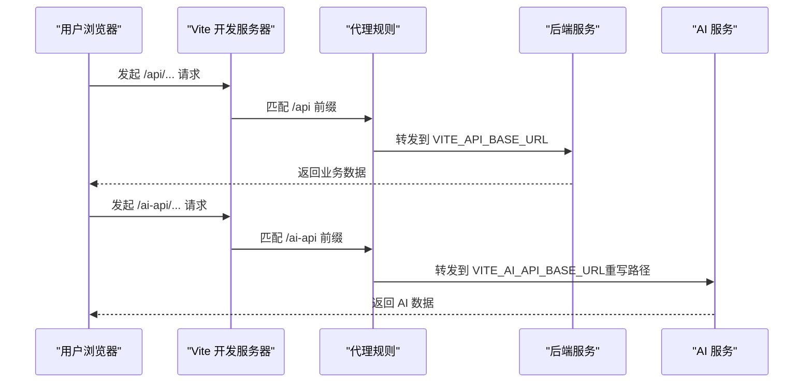
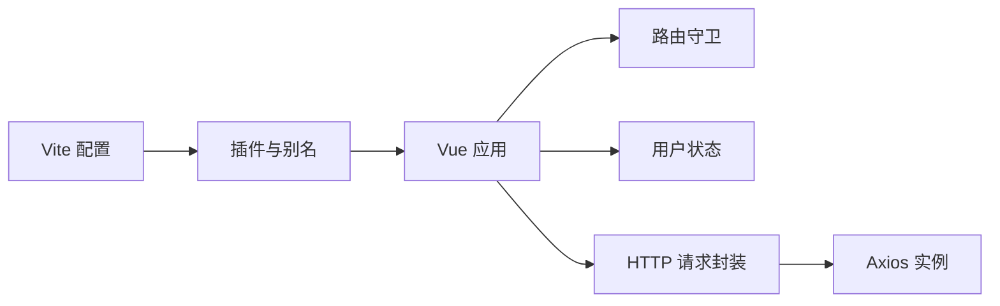

# 环境配置

<cite>
**本文引用的文件**
- [package.json](file://package.json)
- [vite.config.ts](file://vite.config.ts)
- [README.md](file://README.md)
- [src/main.ts](file://src/main.ts)
- [src/utils/request.ts](file://src/utils/request.ts)
- [src/router/index.ts](file://src/router/index.ts)
- [src/stores/useUserStore.ts](file://src/stores/useUserStore.ts)
- [src/api/user.ts](file://src/api/user.ts)
- [src/api/station.ts](file://src/api/station.ts)
- [start.bat](file://start.bat)
- [start.ps1](file://start.ps1)
- [start.sh](file://start.sh)
- [check-status.bat](file://check-status.bat)
- [tsconfig.json](file://tsconfig.json)
</cite>

## 目录
1. [简介](#简介)
2. [项目结构](#项目结构)
3. [核心组件](#核心组件)
4. [架构总览](#架构总览)
5. [详细组件分析](#详细组件分析)
6. [依赖分析](#依赖分析)
7. [性能考虑](#性能考虑)
8. [故障排查指南](#故障排查指南)
9. [结论](#结论)
10. [附录](#附录)

## 简介
本文件面向水文监测前端项目的运维与开发团队，系统化说明开发、测试与生产环境的配置差异与设置方法；解释环境变量的作用、命名规范与安全策略；文档化 API 端点配置、代理设置与跨域处理；覆盖数据库连接（如需）、第三方服务密钥与认证参数；提供环境变量文件模板、默认值与敏感信息保护建议；并给出 Docker 环境配置、容器化部署与云平台适配思路，以及标准化流程与验证方法。

## 项目结构
本项目采用 Vite + Vue 3 + TypeScript 技术栈，通过 Vite 的环境变量加载机制实现多环境配置分离，并在开发服务器中内置代理以对接后端 API 与 AI 服务。

图表来源
- [vite.config.ts:33-52](file://vite.config.ts#L33-L52)
- [package.json:6-12](file://package.json#L6-L12)

章节来源
- [README.md:17-34](file://README.md#L17-L34)
- [package.json:6-12](file://package.json#L6-L12)
- [vite.config.ts:10-67](file://vite.config.ts#L10-L67)

## 核心组件
- 环境变量加载与注入
  - Vite 在不同模式下加载对应 .env.* 文件，变量名需以 VITE_ 前缀声明，运行时通过 import.meta.env 访问。
  - 开发模式默认端口与代理目标可通过环境变量覆盖。
- 请求封装与拦截器
  - Axios 实例根据运行模式选择 baseURL，统一添加 Authorization 头，集中处理业务状态码与错误消息。
- 路由与鉴权
  - 基于路由元信息与本地 Token 判断是否需要登录，未登录跳转登录页。
- 用户状态管理
  - 使用 Pinia Store 管理 Token 与用户信息，持久化至 localStorage/sessionStorage。

章节来源
- [vite.config.ts:10-11](file://vite.config.ts#L10-L11)
- [vite.config.ts:33-52](file://vite.config.ts#L33-L52)
- [src/utils/request.ts:53-75](file://src/utils/request.ts#L53-L75)
- [src/utils/request.ts:77-93](file://src/utils/request.ts#L77-L93)
- [src/utils/request.ts:95-151](file://src/utils/request.ts#L95-L151)
- [src/router/index.ts:116-129](file://src/router/index.ts#L116-L129)
- [src/stores/useUserStore.ts:18-94](file://src/stores/useUserStore.ts#L18-L94)

## 架构总览
下图展示了前端在不同环境下的请求链路与代理配置关系：

图表来源
- [vite.config.ts:37-50](file://vite.config.ts#L37-L50)
- [src/utils/request.ts:53-55](file://src/utils/request.ts#L53-L55)

章节来源
- [vite.config.ts:33-52](file://vite.config.ts#L33-L52)
- [src/utils/request.ts:53-75](file://src/utils/request.ts#L53-L75)

## 详细组件分析

### 环境变量与多环境配置
- 环境文件
  - 通用：.env
  - 开发：.env.development
  - 生产：.env.production
- 变量命名规范
  - 仅以 VITE_ 前缀的变量可在客户端代码中访问（import.meta.env）。
  - 未以 VITE_ 前缀声明的变量不会注入到客户端。
- 默认值与覆盖
  - 开发端口默认 3000，可通过 VITE_PORT 覆盖。
  - API 基础地址默认 http://localhost:8080，可通过 VITE_API_BASE_URL 覆盖。
  - AI API 基础地址默认 http://127.0.0.1:8180，可通过 VITE_AI_API_BASE_URL 覆盖。
- 安全建议
  - 不要在 .env 中存放任何后端敏感密钥或数据库凭据。
  - 若后端需要密钥，请通过后端接口或后端环境变量注入，前端仅传递令牌或公开密钥。

章节来源
- [README.md:100-105](file://README.md#L100-L105)
- [vite.config.ts:35-36](file://vite.config.ts#L35-L36)
- [vite.config.ts:38-40](file://vite.config.ts#L38-L40)
- [vite.config.ts:46-49](file://vite.config.ts#L46-L49)
- [src/utils/request.ts:53-55](file://src/utils/request.ts#L53-L55)

### API 端点与代理配置
- 代理规则
  - /api → VITE_API_BASE_URL（保留 /api 前缀）
  - /ai-api → VITE_AI_API_BASE_URL（重写为无 /ai-api 前缀）
- 路由与请求封装
  - 开发模式：baseURL 为 /api/v1
  - 生产模式：baseURL 为 VITE_API_BASE_URL + /v1
  - 统一添加 Authorization: Bearer <token> 头
- 跨域处理
  - 代理开启 changeOrigin，可缓解开发阶段跨域问题；生产环境由后端服务统一处理 CORS。

章节来源
- [vite.config.ts:37-50](file://vite.config.ts#L37-L50)
- [src/utils/request.ts:53-75](file://src/utils/request.ts#L53-L75)
- [src/utils/request.ts:82-85](file://src/utils/request.ts#L82-L85)

### 认证与用户状态
- 登录流程
  - 调用登录接口获取 token，保存至 localStorage 并同步至 Pinia Store。
  - 登录成功后拉取用户信息并缓存至 sessionStorage。
- Token 解析与降级
  - 从 JWT payload 中解析用户名字段（sub/username/preferred_username），若失败使用默认管理员信息。
- 路由守卫
  - 未登录访问受保护路由将跳转登录页；已登录访问登录页将跳转首页。

章节来源
- [src/api/user.ts:106-108](file://src/api/user.ts#L106-L108)
- [src/stores/useUserStore.ts:61-83](file://src/stores/useUserStore.ts#L61-L83)
- [src/stores/useUserStore.ts:100-125](file://src/stores/useUserStore.ts#L100-L125)
- [src/stores/useUserStore.ts:132-150](file://src/stores/useUserStore.ts#L132-L150)
- [src/stores/useUserStore.ts:155-167](file://src/stores/useUserStore.ts#L155-L167)
- [src/router/index.ts:116-129](file://src/router/index.ts#L116-L129)

### 数据模型与接口约定
- 用户相关
  - 登录请求/响应、用户实体与视图对象、分页查询参数与结果。
- 遥测站数据
  - 最新数据、定时报表、原始报文的查询参数与实体定义。
- 接口路径
  - 登录：POST /api/v1/auth/login
  - 用户详情：GET /api/v1/users/{id}
  - 用户分页：GET /api/v1/users/page
  - 遥测站最新数据：GET /api/v1/timed-reports/latest
  - 定时报分页：POST /api/v1/timed-reports/page
  - 原始报文分页：POST /api/v1/raw-messages/page

章节来源
- [src/api/user.ts:106-178](file://src/api/user.ts#L106-L178)
- [src/api/station.ts:74-114](file://src/api/station.ts#L74-L114)

### 启动脚本与环境验证
- Windows 批处理脚本
  - 自动检测 Node/npm、安装依赖、读取 VITE_PORT 并启动开发服务器。
- PowerShell 脚本
  - 提供菜单式操作：开发/构建/预览/检查/清理等。
- Shell 脚本
  - Linux/macOS 环境下的依赖检查与端口占用处理。
- 状态检查脚本
  - 检查 Node/npm、依赖、端口占用与 .env.development 文件是否存在。

章节来源
- [start.bat:50-65](file://start.bat#L50-L65)
- [start.ps1:73-86](file://start.ps1#L73-L86)
- [start.sh:45-64](file://start.sh#L45-L64)
- [check-status.bat:41-59](file://check-status.bat#L41-L59)

## 依赖分析
- 构建与运行
  - Vite 作为开发服务器与打包工具；Vue 3 + TypeScript；Element Plus + 自动导入组件。
- 请求与状态
  - Axios 封装与拦截器；Pinia 管理用户状态；路由守卫保障鉴权。
- 类型与路径别名
  - TypeScript 配置启用 bundler 模式与路径别名 @/*，便于模块导入。

图表来源
- [vite.config.ts:14-27](file://vite.config.ts#L14-L27)
- [src/main.ts:12-25](file://src/main.ts#L12-L25)
- [src/router/index.ts:111-114](file://src/router/index.ts#L111-L114)
- [src/stores/useUserStore.ts:18-94](file://src/stores/useUserStore.ts#L18-L94)
- [src/utils/request.ts:53-75](file://src/utils/request.ts#L53-L75)

章节来源
- [package.json:14-26](file://package.json#L14-L26)
- [tsconfig.json:24-27](file://tsconfig.json#L24-L27)

## 性能考虑
- 构建优化
  - 按需拆分 vendor 与 element-plus，减少首屏体积。
  - 关闭生产源码映射，降低包体大小。
- 运行时优化
  - 代理仅在开发环境启用，生产环境直连后端，避免额外转发开销。
  - 统一错误提示与进度条，提升用户体验。

章节来源
- [vite.config.ts:57-65](file://vite.config.ts#L57-L65)

## 故障排查指南
- 环境变量未生效
  - 确认变量名以 VITE_ 前缀声明；仅在客户端可访问。
- 代理不生效
  - 检查 /api 与 /ai-api 前缀是否匹配；确认 VITE_API_BASE_URL/VITE_AI_API_BASE_URL 正确。
- 登录后仍提示未登录
  - 检查 Token 是否写入 localStorage；确认路由守卫逻辑与登录接口返回。
- 端口占用
  - 使用状态检查脚本定位占用进程并释放。
- 依赖缺失
  - 优先运行启动脚本自动安装依赖，或手动执行安装命令。

章节来源
- [vite.config.ts:37-50](file://vite.config.ts#L37-L50)
- [src/router/index.ts:116-129](file://src/router/index.ts#L116-L129)
- [check-status.bat:41-52](file://check-status.bat#L41-L52)
- [start.bat:34-48](file://start.bat#L34-L48)

## 结论
本项目通过 Vite 的环境变量体系与代理机制，实现了开发、测试与生产的清晰分离。配合统一的请求封装与鉴权流程，确保了前后端交互的一致性与安全性。建议在生产环境中严格限制 .env 内容，仅暴露必要配置，并通过后端服务进行敏感信息的注入与管理。

## 附录

### 环境变量模板与默认值
- 通用
  - VITE_PORT=3000
  - VITE_API_BASE_URL=http://localhost:8080
  - VITE_AI_API_BASE_URL=http://127.0.0.1:8180
- 开发环境
  - 可覆盖上述变量以适配本地后端与 AI 服务地址
- 生产环境
  - 通过部署平台注入上述变量，确保与后端域名一致

章节来源
- [vite.config.ts:35-36](file://vite.config.ts#L35-L36)
- [vite.config.ts:38-40](file://vite.config.ts#L38-L40)
- [vite.config.ts:46-49](file://vite.config.ts#L46-L49)

### API 端点清单（按模块）
- 认证与用户
  - POST /api/v1/auth/login
  - GET /api/v1/users/{id}
  - GET /api/v1/users/username/{username}
  - GET /api/v1/users/page
  - POST /api/v1/users
  - PUT /api/v1/users
  - DELETE /api/v1/users/{id}
- 遥测站与报文
  - GET /api/v1/timed-reports/latest
  - POST /api/v1/timed-reports/page
  - GET /api/v1/timed-reports/station/{stationCode}
  - POST /api/v1/raw-messages/page

章节来源
- [src/api/user.ts:106-178](file://src/api/user.ts#L106-L178)
- [src/api/station.ts:74-114](file://src/api/station.ts#L74-L114)

### Docker 与容器化部署建议
- 构建产物
  - 使用生产构建生成 dist 目录
- 容器镜像
  - 使用轻量级静态资源服务器（如 nginx）提供 dist 目录
- 环境变量注入
  - 通过容器环境变量注入 VITE_API_BASE_URL/VITE_AI_API_BASE_URL
- 健康检查
  - 对根路径进行简单健康检查，确保静态资源可访问

章节来源
- [package.json:8](file://package.json#L8)
- [vite.config.ts:53-65](file://vite.config.ts#L53-L65)

### 云平台适配要点
- 静态资源托管
  - 将 dist 直接部署至 CDN 或对象存储
- 反向代理
  - 在云平台反向代理中配置 /api 与 /ai-api 的上游地址
- 环境变量管理
  - 使用平台的密钥管理服务注入非敏感配置

章节来源
- [vite.config.ts:37-50](file://vite.config.ts#L37-L50)