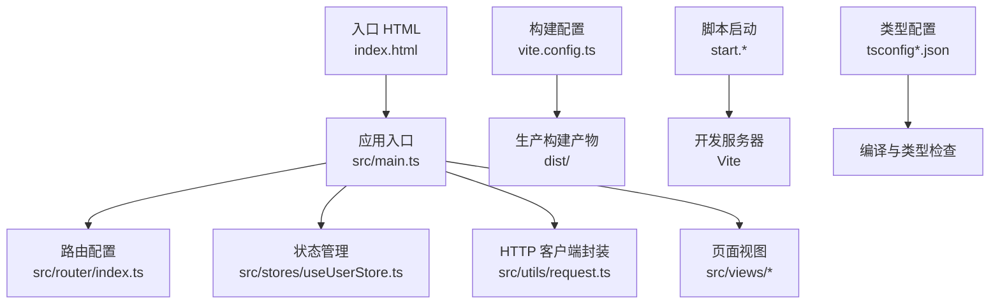
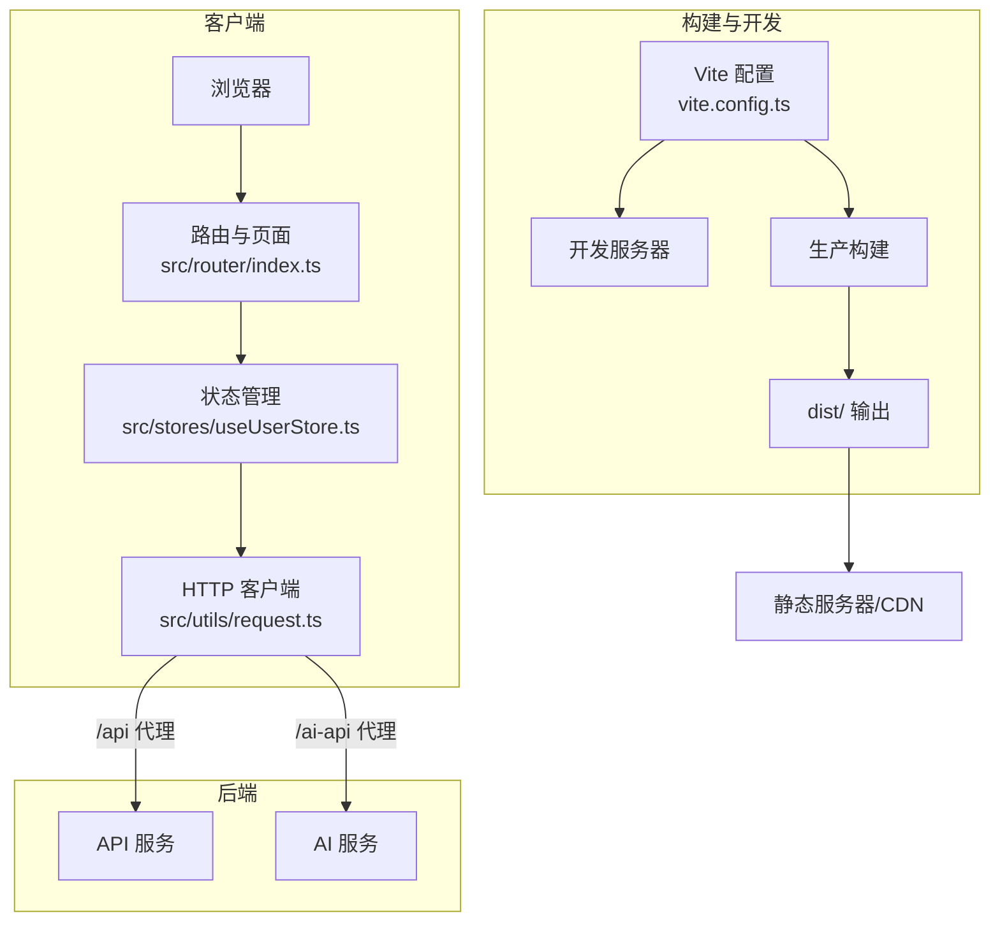
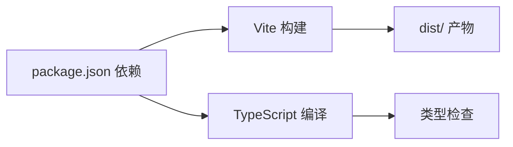

# 部署指南

<cite>
**本文引用的文件**
- [package.json](file://package.json)
- [vite.config.ts](file://vite.config.ts)
- [README.md](file://README.md)
- [index.html](file://index.html)
- [src/main.ts](file://src/main.ts)
- [src/utils/request.ts](file://src/utils/request.ts)
- [src/router/index.ts](file://src/router/index.ts)
- [src/stores/useUserStore.ts](file://src/stores/useUserStore.ts)
- [src/views/login/Login.vue](file://src/views/login/Login.vue)
- [start.sh](file://start.sh)
- [start.bat](file://start.bat)
- [start.ps1](file://start.ps1)
- [tsconfig.json](file://tsconfig.json)
- [tsconfig.node.json](file://tsconfig.node.json)
- [docs/GUIDE.md](file://docs/GUIDE.md)
</cite>

## 目录
1. [简介](#简介)
2. [项目结构](#项目结构)
3. [核心组件](#核心组件)
4. [架构总览](#架构总览)
5. [详细组件分析](#详细组件分析)
6. [依赖分析](#依赖分析)
7. [性能考虑](#性能考虑)
8. [故障排查指南](#故障排查指南)
9. [结论](#结论)
10. [附录](#附录)

## 简介
本指南面向运维与开发团队，提供水文监测管理系统前端的完整部署方案。内容覆盖生产环境构建配置、环境变量设置、静态资源优化与缓存策略、不同部署环境差异、服务器要求与性能调优、Docker 容器化与 CI/CD 流水线建议、SSL 证书与域名绑定、负载均衡、部署后监控与日志、故障恢复与容量规划等。

## 项目结构
该前端项目采用 Vue 3 + TypeScript + Vite 构建，使用 Element Plus 作为 UI 框架，Pinia 管理状态，Vue Router 管理路由。项目通过 Vite 提供开发服务器与生产构建能力，支持代理跨域、自动导入组件与插件、分包优化等。

图表来源
- [index.html:1-14](file://index.html#L1-L14)
- [src/main.ts:1-26](file://src/main.ts#L1-L26)
- [src/router/index.ts:1-136](file://src/router/index.ts#L1-L136)
- [src/stores/useUserStore.ts:1-200](file://src/stores/useUserStore.ts#L1-L200)
- [src/utils/request.ts:1-180](file://src/utils/request.ts#L1-L180)
- [vite.config.ts:1-68](file://vite.config.ts#L1-L68)
- [start.sh:1-65](file://start.sh#L1-L65)
- [start.bat:1-66](file://start.bat#L1-L66)
- [start.ps1:40-108](file://start.ps1#L40-L108)
- [tsconfig.json:1-40](file://tsconfig.json#L1-L40)
- [tsconfig.node.json:1-12](file://tsconfig.node.json#L1-L12)

章节来源
- [README.md:1-128](file://README.md#L1-L128)
- [vite.config.ts:1-68](file://vite.config.ts#L1-L68)
- [tsconfig.json:1-40](file://tsconfig.json#L1-L40)
- [tsconfig.node.json:1-12](file://tsconfig.node.json#L1-L12)

## 核心组件
- 构建与开发服务器：Vite 提供开发服务器与生产构建，支持代理、别名与插件生态。
- 路由与鉴权：基于 Vue Router 的路由守卫实现登录态校验与进度条。
- 状态管理：Pinia Store 管理用户登录态与会话信息。
- HTTP 客户端：Axios 封装统一处理响应数据、错误与 Token 注入。
- 启动脚本：跨平台启动脚本负责环境检查、依赖安装与端口占用处理。

章节来源
- [vite.config.ts:1-68](file://vite.config.ts#L1-L68)
- [src/router/index.ts:116-133](file://src/router/index.ts#L116-L133)
- [src/stores/useUserStore.ts:18-94](file://src/stores/useUserStore.ts#L18-L94)
- [src/utils/request.ts:52-75](file://src/utils/request.ts#L52-L75)
- [start.sh:1-65](file://start.sh#L1-L65)
- [start.bat:1-66](file://start.bat#L1-L66)
- [start.ps1:40-108](file://start.ps1#L40-L108)

## 架构总览
前端与后端通过 API 基础地址进行通信；开发阶段通过 Vite 代理转发至后端服务；生产构建产物部署于静态 Web 服务器或 CDN。

图表来源
- [vite.config.ts:33-52](file://vite.config.ts#L33-L52)
- [src/utils/request.ts:52-58](file://src/utils/request.ts#L52-L58)
- [src/router/index.ts:111-114](file://src/router/index.ts#L111-L114)

## 详细组件分析

### 构建与环境变量
- 环境变量文件
  - 通用：.env
  - 开发：.env.development（含端口与 API 基础地址）
  - 生产：.env.production（含 API 基础地址）
- Vite 配置要点
  - 代理：/api 转发至后端，/ai-api 转发至 AI 服务并重写路径
  - 别名：@ 指向 src
  - 分包：将 element-plus 与核心依赖拆分为独立 chunk
  - 输出：dist 目录，禁用 sourcemap
- 启动脚本
  - 自动检测 Node/npm 并安装依赖
  - Windows：start.bat
  - Linux/macOS：start.sh
  - PowerShell：start.ps1（提供菜单）

章节来源
- [docs/GUIDE.md:101-139](file://docs/GUIDE.md#L101-L139)
- [vite.config.ts:10-67](file://vite.config.ts#L10-L67)
- [start.sh:1-65](file://start.sh#L1-L65)
- [start.bat:1-66](file://start.bat#L1-L66)
- [start.ps1:40-108](file://start.ps1#L40-L108)

### 路由与鉴权
- 路由守卫：根据 meta.requiresAuth 与本地 token 控制跳转
- 进度条：NProgress 展示页面切换进度
- 基础路径：基于 import.meta.env.BASE_URL

章节来源
- [src/router/index.ts:116-133](file://src/router/index.ts#L116-L133)
- [src/router/index.ts:111-114](file://src/router/index.ts#L111-L114)

### 状态管理与登录
- 登录流程：调用登录接口，保存 token 与用户信息，初始化用户信息
- Token 解析：从 JWT payload 中提取用户名
- 会话持久化：localStorage 存储 token，sessionStorage 存储用户信息

章节来源
- [src/stores/useUserStore.ts:61-94](file://src/stores/useUserStore.ts#L61-L94)
- [src/stores/useUserStore.ts:132-150](file://src/stores/useUserStore.ts#L132-L150)
- [src/stores/useUserStore.ts:172-183](file://src/stores/useUserStore.ts#L172-L183)

### HTTP 客户端与错误处理
- 基础地址：开发环境使用 /api/v1，生产环境使用 VITE_API_BASE_URL + /v1
- 超时：15 秒
- 响应预处理：对大整数进行字符串化处理，避免精度丢失
- 错误拦截：根据状态码映射提示，401 时触发登出与跳转

章节来源
- [src/utils/request.ts:52-75](file://src/utils/request.ts#L52-L75)
- [src/utils/request.ts:95-151](file://src/utils/request.ts#L95-L151)

### 登录页与交互
- 登录表单：用户名、密码校验，提交后调用用户 store 登录
- 动画与样式：渐变背景、粒子动画、输入框聚焦效果

章节来源
- [src/views/login/Login.vue:117-134](file://src/views/login/Login.vue#L117-L134)

### 构建流程与产物
- 开发：npm run dev 启动 Vite 开发服务器
- 生产：npm run build 执行类型检查与打包，输出 dist
- 预览：npm run preview 在本地预览生产构建

章节来源
- [package.json:6-12](file://package.json#L6-L12)
- [README.md:68-84](file://README.md#L68-L84)

## 依赖分析
- 运行时依赖：Vue 3、Element Plus、Axios、Pinia、Vue Router、ECharts、Cesium 等
- 开发依赖：Vite、Vue 插件、TypeScript、ESLint、Prettier、Rollup 插件等
- 类型配置：tsconfig.json 与 tsconfig.node.json 支持 bundler 模式与路径别名

图表来源
- [package.json:14-46](file://package.json#L14-L46)
- [tsconfig.json:1-40](file://tsconfig.json#L1-L40)
- [tsconfig.node.json:1-12](file://tsconfig.node.json#L1-L12)

章节来源
- [package.json:14-46](file://package.json#L14-L46)
- [tsconfig.json:1-40](file://tsconfig.json#L1-L40)
- [tsconfig.node.json:1-12](file://tsconfig.node.json#L1-L12)

## 性能考虑
- 分包策略
  - 将 element-plus 单独拆分，减少首屏体积
  - 将 vue、vue-router、pinia、axios 等核心依赖拆分为 vendor chunk
- 资源体积预警阈值：chunkSizeWarningLimit 设为 1500KB
- 生产构建：禁用 sourcemap，降低体积与泄露风险
- 路由懒加载：路由组件使用动态导入，配合 NProgress 提升体验
- 静态资源优化与缓存
  - 使用 CDN 加速静态资源分发
  - 对 dist 目录启用强缓存（如一年），并使用内容指纹命名文件
  - 对 HTML 设置较短缓存（如 5 分钟），确保可及时更新
- 服务器要求
  - CPU：建议 2 核以上，内存 4GB+
  - 带宽：根据并发用户量评估，建议至少 100Mbps
  - 存储：dist 目录大小约数 MB 至数十 MB，按版本迭代增长
- 性能调优
  - 启用 Gzip/Brotli 压缩
  - 合理设置缓存头与 ETag
  - 使用 HTTP/2 或 HTTP/3 提升传输效率
  - 对第三方库（如 Cesium）按需加载与异步引入

章节来源
- [vite.config.ts:53-65](file://vite.config.ts#L53-L65)
- [src/router/index.ts:1-136](file://src/router/index.ts#L1-L136)

## 故障排查指南
- 端口占用
  - 启动脚本会检测端口占用并尝试终止占用进程
  - 建议优先使用默认端口，避免冲突
- 依赖安装失败
  - 检查网络与 npm 缓存，必要时清理缓存后重试
- 开发代理失效
  - 确认 .env.development 中 VITE_API_BASE_URL 与 VITE_AI_API_BASE_URL 配置正确
  - 确认 Vite 代理规则与后端实际端口一致
- 登录失败或 401
  - 检查后端接口可用性与 Token 有效性
  - 查看浏览器 Network 面板与控制台错误
- 构建失败
  - 执行类型检查与 ESLint 修复
  - 检查 dist 目录权限与磁盘空间

章节来源
- [start.sh:45-54](file://start.sh#L45-L54)
- [start.bat:50-58](file://start.bat#L50-L58)
- [docs/GUIDE.md:101-139](file://docs/GUIDE.md#L101-L139)
- [src/utils/request.ts:95-151](file://src/utils/request.ts#L95-L151)
- [package.json:10-12](file://package.json#L10-L12)

## 结论
本指南提供了从开发到生产的全流程部署方案，涵盖环境变量、构建配置、静态资源优化、缓存策略、服务器要求与性能调优、跨平台启动脚本以及常见问题排查。建议在生产环境中结合 CDN、负载均衡与 SSL 证书，确保高可用与高性能。

## 附录

### A. 环境变量与配置清单
- 通用环境变量
  - NODE_ENV：development/production
  - VITE_PORT：开发服务器端口（默认 3000）
  - VITE_API_BASE_URL：后端 API 基础地址（生产必填）
  - VITE_AI_API_BASE_URL：AI 服务基础地址（开发/生产可选）
- 开发环境示例
  - VITE_PORT=3000
  - VITE_API_BASE_URL=http://localhost:8080
- 生产环境示例
  - VITE_API_BASE_URL=https://api.example.com

章节来源
- [docs/GUIDE.md:101-113](file://docs/GUIDE.md#L101-L113)
- [vite.config.ts:33-52](file://vite.config.ts#L33-L52)

### B. 部署流程（生产）
- 准备工作
  - 安装 Node.js 与 npm
  - 准备静态服务器（Nginx/Apache/Caddy）或 CDN
- 构建与发布
  - 执行生产构建：npm run build
  - 将 dist 目录上传至静态服务器根目录或 CDN
- 服务器配置（Nginx 示例）
  - 静态资源：开启 gzip、缓存一年、强制 HTTPS
  - 反向代理：将 /api 与 /ai-api 转发至后端服务
- 域名与证书
  - 绑定域名并申请 SSL 证书（Let’s Encrypt 等）
  - 配置 301 重定向至 https
- 负载均衡
  - 多实例部署，使用 L7 负载均衡器（Nginx/HAProxy/云负载均衡）
  - 健康检查与自动扩缩容

章节来源
- [package.json:6-12](file://package.json#L6-L12)
- [vite.config.ts:33-52](file://vite.config.ts#L33-L52)
- [src/utils/request.ts:52-58](file://src/utils/request.ts#L52-L58)

### C. Docker 容器化部署（建议）
- Dockerfile 示例思路
  - 基础镜像：nginx:alpine
  - 构建阶段：使用 Node.js 构建 dist
  - 发布阶段：将 dist 复制到 nginx 默认站点目录
  - 端口：80（可加 443 + SSL）
- docker-compose 示例
  - 前端服务：暴露 80/443
  - 后端服务：与前端同网段，通过反向代理互通
- 建议
  - 使用只读文件系统与最小权限
  - 配置健康检查与重启策略
  - 使用环境变量注入 API 地址

[本节为概念性说明，不直接对应具体源文件，故无“章节来源”]

### D. CI/CD 流水线（建议）
- 触发条件：push 到 main 分支或打标签
- 步骤建议：
  - 安装依赖与缓存
  - 代码检查（ESLint/Prettier）
  - 类型检查（TypeScript）
  - 单元测试（如有）
  - 构建与产物压缩
  - 上传制品到对象存储或 CDN
  - 发送通知（可选）
- 安全建议
  - 保护分支与必需审查
  - 限制密钥权限与轮换
  - 构建产物签名与完整性校验

[本节为概念性说明，不直接对应具体源文件，故无“章节来源”]

### E. 部署后监控与日志
- 监控指标
  - 响应时间、错误率、吞吐量
  - 静态资源加载时间与缓存命中率
- 日志
  - 前端错误上报（如 Sentry）
  - 服务器访问日志与错误日志
- 告警
  - 配置阈值告警与自动恢复策略

[本节为概念性说明，不直接对应具体源文件，故无“章节来源”]

### F. 容量规划与扩展
- 用户规模与带宽
  - 估算并发用户与页面大小，计算带宽需求
- 缓存策略
  - 静态资源强缓存，HTML 短缓存
- CDN 与边缘节点
  - 选择就近节点，提升全球访问速度
- 数据库与后端
  - 前端仅读取，后端负责写入与聚合

[本节为概念性说明，不直接对应具体源文件，故无“章节来源”]