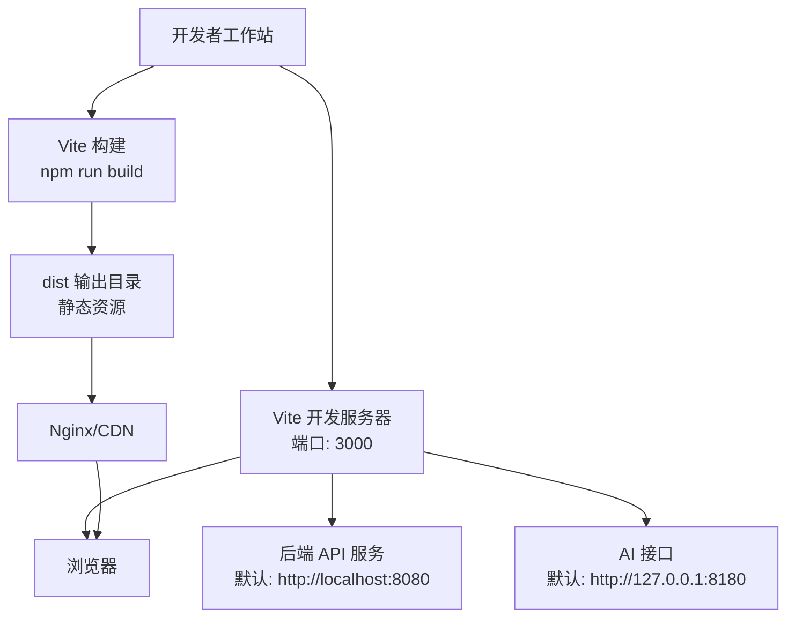
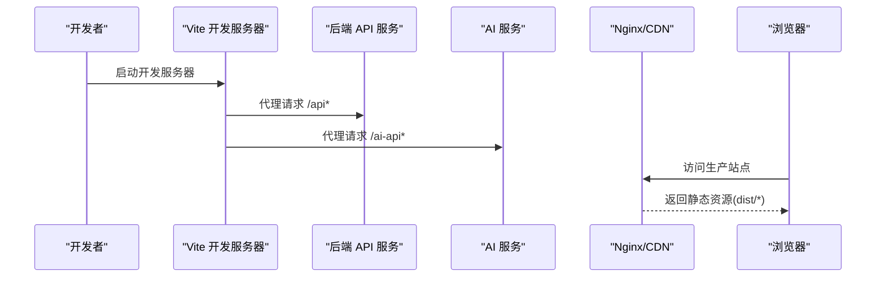
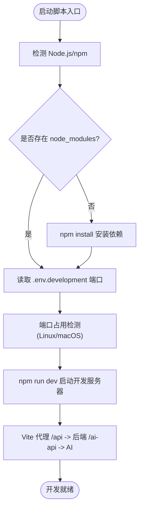
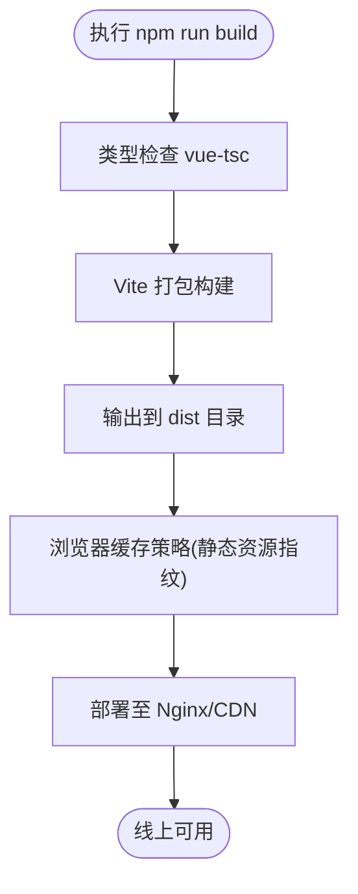
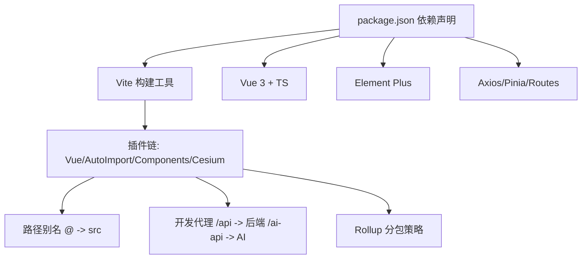

# 部署流程

<cite>
**本文引用的文件**
- [package.json](file://package.json)
- [vite.config.ts](file://vite.config.ts)
- [README.md](file://README.md)
- [docs/GUIDE.md](file://docs/GUIDE.md)
- [start.bat](file://start.bat)
- [start.sh](file://start.sh)
- [start.ps1](file://start.ps1)
- [check-status.bat](file://check-status.bat)
- [index.html](file://index.html)
- [-v3-api-docs.md](file://-v3-api-docs.md)
- [src/config/tianditu.ts](file://src/config/tianditu.ts)
</cite>

## 目录
1. [简介](#简介)
2. [项目结构](#项目结构)
3. [核心组件](#核心组件)
4. [架构总览](#架构总览)
5. [详细组件分析](#详细组件分析)
6. [依赖分析](#依赖分析)
7. [性能考虑](#性能考虑)
8. [故障排查指南](#故障排查指南)
9. [结论](#结论)
10. [附录](#附录)

## 简介
本文件面向运维与开发团队，系统化梳理水文监测前端项目的部署流程，覆盖从本地开发、构建打包到生产环境上线的完整链路。内容包括：
- 本地开发服务器启动与环境准备
- 构建命令与产物说明
- 静态资源部署与缓存策略
- Nginx 反向代理与 SSL 配置建议
- 自动化部署与 CI/CD 流水线思路
- 负载均衡、高可用与滚动更新策略
- 部署检查清单、回滚机制与应急处理

## 项目结构
该前端项目采用 Vue 3 + TypeScript + Vite 技术栈，通过 Vite 进行开发与构建，使用 Element Plus 作为 UI 框架，Pinia 管理状态，Axios 进行 HTTP 请求封装。项目入口为单页应用模板，构建后生成静态资源，可直接部署至 Web 服务器或 CDN。

图表来源
- [vite.config.ts:33-52](file://vite.config.ts#L33-L52)
- [README.md:68-84](file://README.md#L68-L84)

章节来源
- [README.md:17-34](file://README.md#L17-L34)
- [vite.config.ts:10-67](file://vite.config.ts#L10-L67)

## 核心组件
- 开发服务器与代理
  - Vite 开发服务器默认监听 0.0.0.0:3000，并通过代理将 /api 前缀转发至后端服务，/ai-api 前缀转发至 AI 服务。
- 构建与产物
  - 构建命令生成 dist 目录，包含打包后的静态资源；Rollup 分包策略将第三方库拆分为独立 chunk，提升缓存命中率。
- 入口与模板
  - index.html 作为 SPA 入口，挂载根组件并加载模块入口脚本。
- 环境变量
  - .env.development/.env.production 中配置 VITE_PORT、VITE_API_BASE_URL 等，影响开发与构建行为。

章节来源
- [vite.config.ts:33-67](file://vite.config.ts#L33-L67)
- [package.json:6-12](file://package.json#L6-L12)
- [index.html:1-14](file://index.html#L1-L14)
- [docs/GUIDE.md:101-114](file://docs/GUIDE.md#L101-L114)

## 架构总览
下图展示了从前端开发到生产部署的关键交互关系与数据流：

图表来源
- [vite.config.ts:37-51](file://vite.config.ts#L37-L51)
- [README.md:60-66](file://README.md#L60-L66)

## 详细组件分析

### 本地开发与启动脚本
- Windows 批处理脚本
  - 自动检测 Node.js/npm，首次运行自动安装依赖，随后启动开发服务器，默认端口来自 .env.development。
- Shell 脚本（Linux/macOS）
  - 功能类似，包含端口占用检测与进程终止逻辑，提升开发体验。
- PowerShell 脚本
  - 提供菜单式操作，支持开发、构建、预览、代码检查、类型检查与清理重装等常用动作。

图表来源
- [start.bat:8-65](file://start.bat#L8-L65)
- [start.sh:8-64](file://start.sh#L8-L64)
- [start.ps1:11-157](file://start.ps1#L11-L157)
- [vite.config.ts:33-51](file://vite.config.ts#L33-L51)

章节来源
- [start.bat:1-66](file://start.bat#L1-L66)
- [start.sh:1-65](file://start.sh#L1-L65)
- [start.ps1:1-161](file://start.ps1#L1-L161)
- [docs/GUIDE.md:174-269](file://docs/GUIDE.md#L174-L269)

### 构建与产物
- 构建命令
  - 通过 npm run build 执行类型检查与打包，输出目录为 dist。
- 产物说明
  - dist 目录包含打包后的静态资源，可直接部署至 Web 服务器或 CDN。
- 分包与缓存
  - Rollup 手动分包策略将 element-plus 与核心依赖拆分为独立 chunk，有利于长期缓存与增量更新。

图表来源
- [package.json:8](file://package.json#L8)
- [vite.config.ts:53-65](file://vite.config.ts#L53-L65)

章节来源
- [package.json:6-12](file://package.json#L6-L12)
- [README.md:68-84](file://README.md#L68-L84)
- [vite.config.ts:53-65](file://vite.config.ts#L53-L65)

### 静态资源部署与缓存策略
- 部署目标
  - 将 dist 目录全部内容部署至 Web 服务器根目录或子路径。
- 缓存策略建议
  - 对静态资源启用长期缓存（例如一年），结合文件指纹命名以实现“永不重复”缓存。
  - 对 HTML 文件启用短缓存或不缓存，确保用户能获取最新入口。
- CDN 配置
  - 通过 CDN 加速全球访问，结合边缘缓存与回源策略，降低延迟。

[本节为通用部署建议，不直接分析具体文件，故无章节来源]

### Nginx 反向代理与 SSL 配置
- 反向代理
  - 将 /api 前缀代理至后端服务，/ai-api 前缀代理至 AI 服务；生产环境可将这些代理逻辑迁移至 Nginx，前端仅暴露静态资源。
- SSL 证书
  - 建议为域名配置 HTTPS 证书，开启 HSTS 与现代加密套件，保障传输安全。
- 静态资源服务
  - Nginx 直接提供 dist 目录，设置合适的 MIME 类型与压缩（gzip/br）。

[本节为通用部署建议，不直接分析具体文件，故无章节来源]

### 自动化部署与 CI/CD 流水线
- 流水线阶段建议
  - 安装依赖 → 单元测试/类型检查 → Lint → 构建 → 产物上传 → 部署到目标环境 → 健康检查
- 部署策略
  - 使用蓝绿/金丝雀发布，逐步切换流量，降低风险。
  - 保留最近 N 个版本，便于快速回滚。
- 产物管理
  - 将 dist 产物上传至对象存储或 CDN，结合版本号与指纹命名，确保可追溯与可回滚。

[本节为通用部署建议，不直接分析具体文件，故无章节来源]

### 负载均衡、高可用与滚动更新
- 负载均衡
  - 多实例部署前端，通过负载均衡器分发请求，提升可用性与吞吐。
- 高可用
  - 多地域部署与健康检查，异常节点自动摘除。
- 滚动更新
  - 逐批替换实例，保证服务连续性；结合 CDN 缓存失效策略，确保用户获取最新资源。

[本节为通用部署建议，不直接分析具体文件，故无章节来源]

### 部署检查清单
- 开发与构建
  - 依赖安装完成、类型检查通过、构建产物生成且 dist 可用
- 服务器与代理
  - Nginx 正常运行、静态资源可访问、代理规则正确
- 环境变量
  - .env.development/.env.production 配置正确，端口与 API 地址符合预期
- 缓存与 CDN
  - 静态资源缓存策略生效，HTML 未被长期缓存
- 安全
  - HTTPS 证书有效，HSTS 等安全头配置到位
- 回滚
  - 存在上一版本备份，回滚脚本可用

[本节为通用部署建议，不直接分析具体文件，故无章节来源]

### 回滚机制与应急处理
- 回滚
  - 若新版本出现严重问题，立即回滚至上一稳定版本；确保回滚脚本与备份目录可用
- 应急处理
  - 降级策略：关闭非关键功能、切换至备用后端、禁用 AI 接口等
  - 快速修复：热修复后重新构建并部署，最小化停机时间

[本节为通用部署建议，不直接分析具体文件，故无章节来源]

## 依赖分析
- 开发与构建
  - Vite、Vue 3、TypeScript、ESLint、Prettier、Sass、unplugin-auto-import、unplugin-vue-components、vite-plugin-cesium 等
- 运行时依赖
  - axios、cesium、echarts、element-plus、nprogress、pinia、vue、vue-router 等
- 关键配置
  - Vite 插件链、别名、代理、分包策略、输出目录等

图表来源
- [package.json:14-46](file://package.json#L14-L46)
- [vite.config.ts:14-27](file://vite.config.ts#L14-L27)
- [vite.config.ts:28-32](file://vite.config.ts#L28-L32)
- [vite.config.ts:37-51](file://vite.config.ts#L37-L51)
- [vite.config.ts:57-64](file://vite.config.ts#L57-L64)

章节来源
- [package.json:14-46](file://package.json#L14-L46)
- [vite.config.ts:10-67](file://vite.config.ts#L10-L67)

## 性能考虑
- 资源体积与分包
  - 通过手动分包策略减少首屏 JS 体积，提升加载速度
- 缓存与指纹
  - 静态资源启用长期缓存，结合指纹命名避免缓存污染
- 压缩与传输
  - 启用 gzip/br 压缩，减少带宽占用
- 地图与可视化
  - Cesium 与 ECharts 等大体量库建议独立分包，按需加载

[本节为通用性能建议，不直接分析具体文件，故无章节来源]

## 故障排查指南
- 端口占用
  - Windows 使用 netstat 查找占用进程并结束；Linux/macOS 使用 lsof 并强制终止
- 环境变量未生效
  - 确认 .env.development/.env.production 文件存在且格式正确（无引号）
- 依赖安装失败
  - 清理 npm 缓存、删除 node_modules 与 lock 文件后重装
- 浏览器无法访问
  - 尝试 127.0.0.1 访问、检查防火墙、查看控制台错误
- TypeScript 类型错误
  - 运行类型检查修复后再进行构建

章节来源
- [docs/GUIDE.md:174-269](file://docs/GUIDE.md#L174-L269)
- [check-status.bat:41-52](file://check-status.bat#L41-L52)

## 结论
本部署文档围绕本地开发、构建与生产部署展开，明确了开发服务器启动、构建命令、代理配置、静态资源部署与缓存策略、Nginx 反向代理与 SSL 配置、自动化部署与 CI/CD 流水线、高可用与滚动更新策略以及运维检查清单与应急处理。建议在实际落地时结合团队流程与基础设施，制定标准化的部署规范与演练计划，确保交付稳定可靠。

## 附录
- 环境变量与 API 地址
  - 开发环境端口与后端地址可在 .env.development 中配置；生产环境后端地址可在 .env.production 中配置
- Cesium 与天地图
  - 天地图 API 密钥与默认中心点等配置位于配置文件中，部署前请替换为实际密钥
- API 文档
  - 后端 API 文档位于 -v3-api-docs.md，可据此核对代理与联调

章节来源
- [docs/GUIDE.md:101-114](file://docs/GUIDE.md#L101-L114)
- [src/config/tianditu.ts:4-27](file://src/config/tianditu.ts#L4-L27)
- [-v3-api-docs.md:1-20](file://-v3-api-docs.md#L1-L20)