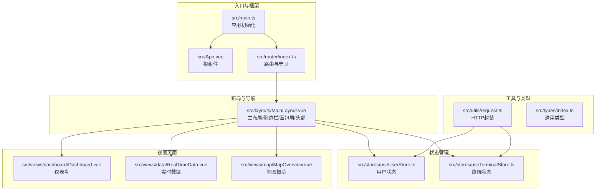
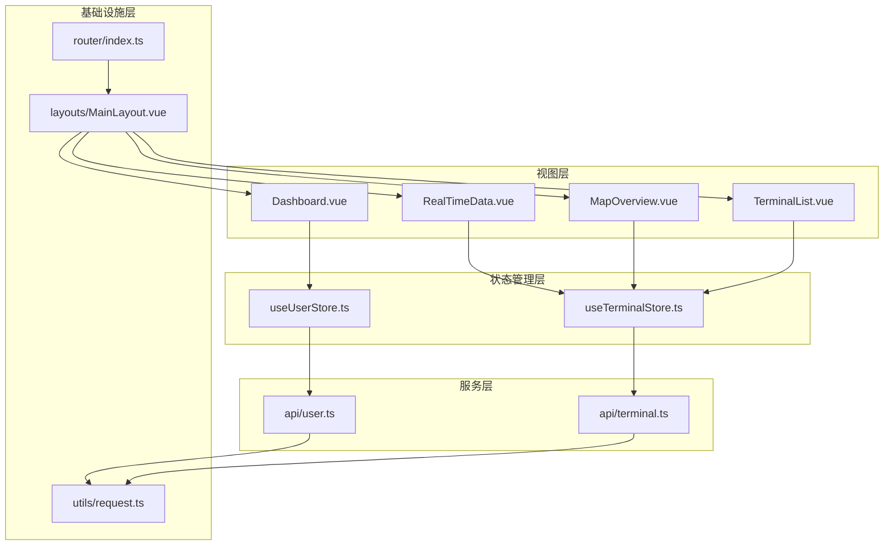
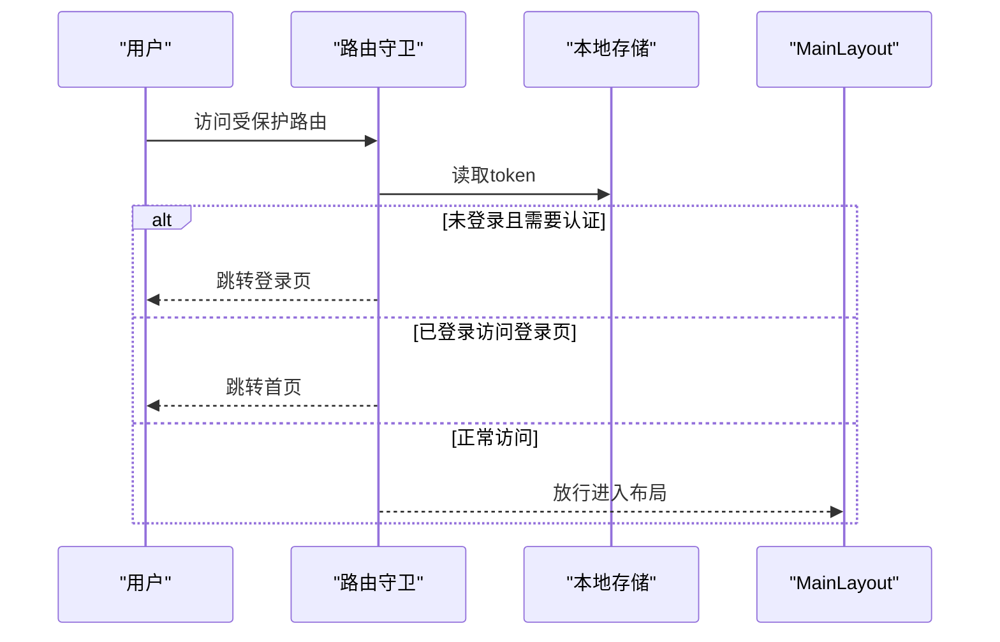
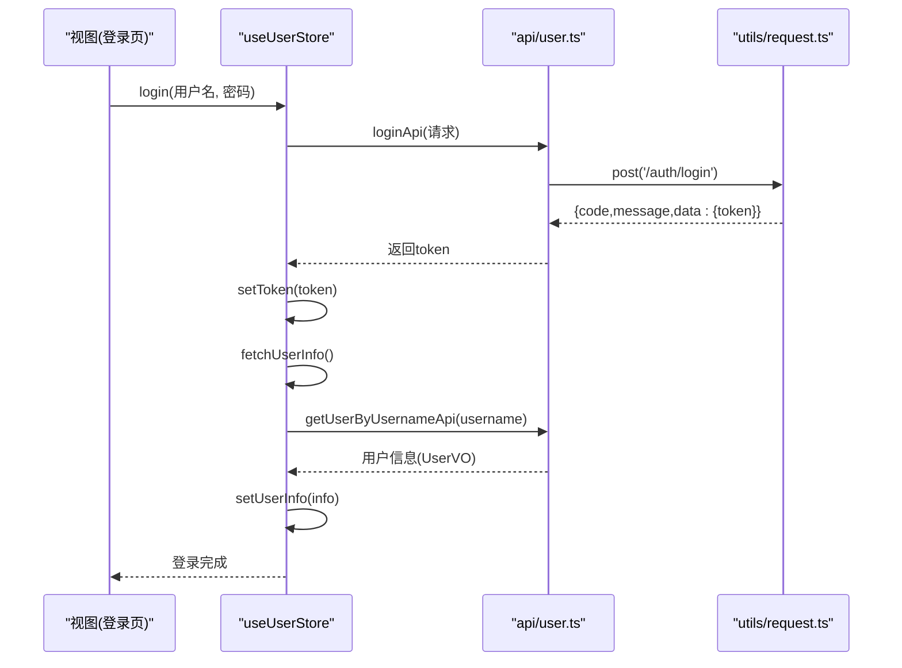
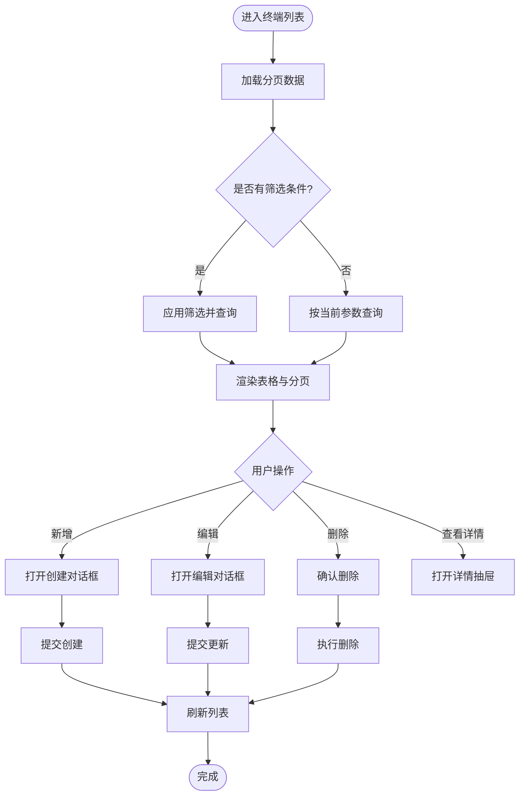
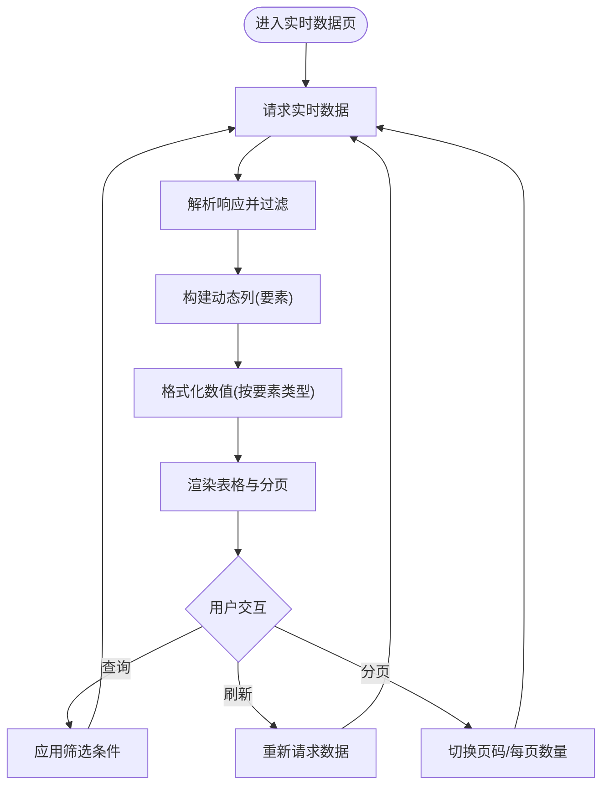
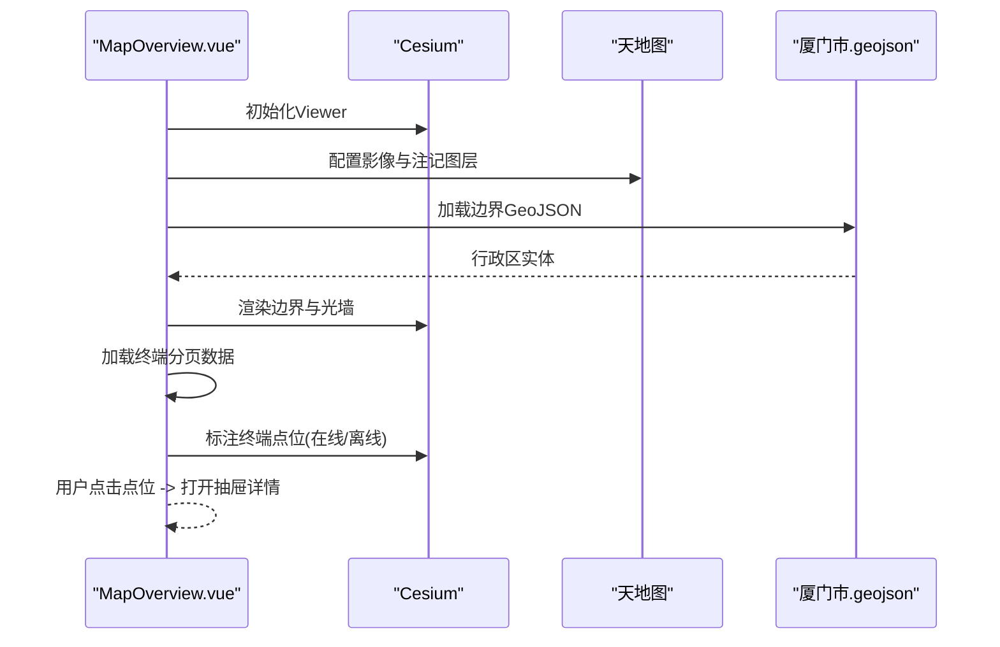
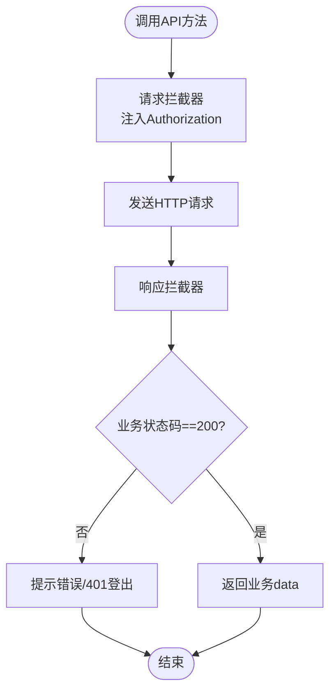
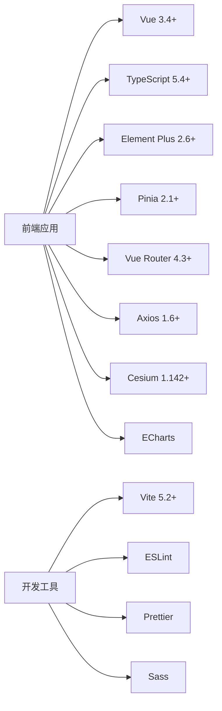

# 项目概述

<cite>
**本文档引用的文件**
- [README.md](file://README.md)
- [package.json](file://package.json)
- [src/main.ts](file://src/main.ts)
- [src/App.vue](file://src/App.vue)
- [src/router/index.ts](file://src/router/index.ts)
- [src/layouts/MainLayout.vue](file://src/layouts/MainLayout.vue)
- [src/stores/useUserStore.ts](file://src/stores/useUserStore.ts)
- [src/stores/useTerminalStore.ts](file://src/stores/useTerminalStore.ts)
- [src/utils/request.ts](file://src/utils/request.ts)
- [src/types/index.ts](file://src/types/index.ts)
- [src/views/dashboard/Dashboard.vue](file://src/views/dashboard/Dashboard.vue)
- [src/views/data/RealTimeData.vue](file://src/views/data/RealTimeData.vue)
- [src/views/map/MapOverview.vue](file://src/views/map/MapOverview.vue)
- [src/api/user.ts](file://src/api/user.ts)
- [src/api/terminal.ts](file://src/api/terminal.ts)
</cite>

## 目录
1. [简介](#简介)
2. [项目结构](#项目结构)
3. [核心组件](#核心组件)
4. [架构总览](#架构总览)
5. [详细组件分析](#详细组件分析)
6. [依赖分析](#依赖分析)
7. [性能考虑](#性能考虑)
8. [故障排查指南](#故障排查指南)
9. [结论](#结论)
10. [附录](#附录)

## 简介
本项目是面向水文监测领域的现代化管理后台前端工程，基于 Vue 3 + TypeScript + Element Plus 构建，提供登录认证、用户管理、终端设备管理、实时/历史数据查看以及基于 Cesium 的地图可视化能力。项目通过统一的 API 封装与 Pinia 状态管理，结合 Vue Router 实现模块化路由与权限控制，满足水利监测中心对终端设备、站点数据与地理信息的集中化管理需求。

项目在水文监测场景中的价值体现在：
- 实时掌握监测终端在线状态与上报数据，辅助调度与预警决策
- 通过地图可视化直观呈现终端分布与区域覆盖，提升运维效率
- 提供标准化的用户与权限体系，保障系统安全与合规

## 项目结构
项目采用“按功能域分层”的组织方式，核心目录与职责如下：
- src/api：封装后端接口调用，按领域拆分（用户、终端、AI、站点、终端）
- src/components：通用组件（如主题切换器）
- src/layouts：布局组件（主布局、侧边栏、面包屑、头部导航）
- src/router：路由配置与全局前置守卫
- src/stores：Pinia 状态管理（用户、主题、终端）
- src/styles：全局样式与变量
- src/types：通用类型定义（响应体、分页、枚举）
- src/utils：工具函数（HTTP 请求、格式化、Cesium 集成、天地图集成）
- src/views：页面组件（仪表盘、数据查看、地图、终端管理、用户管理）

**图表来源**
- [src/main.ts:1-26](file://src/main.ts#L1-L26)
- [src/App.vue:1-15](file://src/App.vue#L1-L15)
- [src/router/index.ts:1-136](file://src/router/index.ts#L1-L136)
- [src/layouts/MainLayout.vue:1-434](file://src/layouts/MainLayout.vue#L1-L434)
- [src/stores/useUserStore.ts:1-200](file://src/stores/useUserStore.ts#L1-L200)
- [src/stores/useTerminalStore.ts:1-294](file://src/stores/useTerminalStore.ts#L1-L294)
- [src/utils/request.ts:1-180](file://src/utils/request.ts#L1-L180)
- [src/types/index.ts:1-51](file://src/types/index.ts#L1-L51)

**章节来源**
- [README.md:17-34](file://README.md#L17-L34)
- [package.json:14-26](file://package.json#L14-L26)

## 核心组件
- 应用入口与框架
  - 应用初始化：注册 Element Plus、图标、Pinia、路由与全局样式
  - 根组件：承载路由视图
- 路由与权限
  - 路由配置：登录、仪表盘、AI助手、地图概览、数据查看、终端管理、系统管理、个人中心
  - 权限守卫：基于 token 控制访问，防止未登录访问受保护页面
- 布局与导航
  - 主布局：侧边栏菜单、面包屑导航、头部用户信息与主题切换
  - 菜单自动生成：根据路由配置动态渲染
- 状态管理
  - 用户状态：登录、登出、用户信息缓存与解析 token
  - 终端状态：分页查询、详情查看、增删改、表单与对话框状态
- 工具与类型
  - HTTP 封装：统一请求/响应拦截、错误处理、大整数安全处理
  - 通用类型：响应体、分页、枚举、主题配置

**章节来源**
- [src/main.ts:1-26](file://src/main.ts#L1-L26)
- [src/App.vue:1-15](file://src/App.vue#L1-L15)
- [src/router/index.ts:8-136](file://src/router/index.ts#L8-L136)
- [src/layouts/MainLayout.vue:1-434](file://src/layouts/MainLayout.vue#L1-L434)
- [src/stores/useUserStore.ts:18-200](file://src/stores/useUserStore.ts#L18-L200)
- [src/stores/useTerminalStore.ts:23-294](file://src/stores/useTerminalStore.ts#L23-L294)
- [src/utils/request.ts:52-180](file://src/utils/request.ts#L52-L180)
- [src/types/index.ts:1-51](file://src/types/index.ts#L1-L51)

## 架构总览
系统采用“视图层-状态管理层-服务层-基础设施层”的分层架构：
- 视图层：页面组件负责交互与展示（仪表盘、数据、地图、终端管理）
- 状态管理层：Pinia Store 管理用户与终端状态，提供响应式数据与动作
- 服务层：API 模块封装后端接口，统一调用工具层
- 基础设施层：HTTP 封装、路由守卫、Element Plus UI、Cesium 地图、天地图集成

**图表来源**
- [src/views/dashboard/Dashboard.vue:1-155](file://src/views/dashboard/Dashboard.vue#L1-L155)
- [src/views/data/RealTimeData.vue:1-300](file://src/views/data/RealTimeData.vue#L1-L300)
- [src/views/map/MapOverview.vue:1-649](file://src/views/map/MapOverview.vue#L1-L649)
- [src/stores/useUserStore.ts:18-200](file://src/stores/useUserStore.ts#L18-L200)
- [src/stores/useTerminalStore.ts:23-294](file://src/stores/useTerminalStore.ts#L23-L294)
- [src/api/user.ts:1-179](file://src/api/user.ts#L1-L179)
- [src/api/terminal.ts:1-59](file://src/api/terminal.ts#L1-L59)
- [src/utils/request.ts:52-180](file://src/utils/request.ts#L52-L180)
- [src/router/index.ts:1-136](file://src/router/index.ts#L1-L136)
- [src/layouts/MainLayout.vue:1-434](file://src/layouts/MainLayout.vue#L1-L434)

## 详细组件分析

### 路由与权限控制
- 路由结构：登录、仪表盘、AI助手、地图概览、数据查看（实时/历史）、终端管理、系统管理、个人中心
- 权限守卫：前置守卫校验 token，未登录跳转登录；已登录访问登录页跳转首页；全局进度条 NProgress
- 路由懒加载：页面组件按需加载，优化首屏性能

**图表来源**
- [src/router/index.ts:116-133](file://src/router/index.ts#L116-L133)

**章节来源**
- [src/router/index.ts:8-136](file://src/router/index.ts#L8-L136)

### 用户状态管理（登录/登出/用户信息）
- 登录流程：调用登录接口，保存 token，解析 token 获取用户名，拉取用户信息并缓存
- 登出流程：清除 token 与用户信息，提示成功并跳转登录
- 用户信息：支持从缓存恢复，解析失败使用默认管理员信息兜底

**图表来源**
- [src/stores/useUserStore.ts:61-125](file://src/stores/useUserStore.ts#L61-L125)
- [src/api/user.ts:106-128](file://src/api/user.ts#L106-L128)
- [src/utils/request.ts:154-179](file://src/utils/request.ts#L154-L179)

**章节来源**
- [src/stores/useUserStore.ts:18-200](file://src/stores/useUserStore.ts#L18-L200)
- [src/api/user.ts:1-179](file://src/api/user.ts#L1-L179)
- [src/utils/request.ts:52-180](file://src/utils/request.ts#L52-L180)

### 终端管理状态（分页/查询/增删改）
- 分页查询：支持按名称、编号、在线状态筛选，支持页码与每页数量变更
- 新增/编辑/删除：统一表单与对话框状态，成功后刷新列表
- 详情查看：弹出抽屉展示终端详情，支持跳转到终端管理页面

**图表来源**
- [src/stores/useTerminalStore.ts:72-180](file://src/stores/useTerminalStore.ts#L72-L180)
- [src/api/terminal.ts:16-58](file://src/api/terminal.ts#L16-L58)

**章节来源**
- [src/stores/useTerminalStore.ts:23-294](file://src/stores/useTerminalStore.ts#L23-L294)
- [src/api/terminal.ts:1-59](file://src/api/terminal.ts#L1-L59)

### 实时数据查看（动态列/格式化/分页）
- 动态列：根据数据中的要素集合动态生成列，展示不同要素的值
- 数值格式化：依据要素类型自动选择小数位数，空值显示占位符
- 前端过滤：支持按站点名称、编号、在线状态进行本地过滤
- 分页与刷新：支持页码与每页数量变更，一键刷新数据

**图表来源**
- [src/views/data/RealTimeData.vue:187-279](file://src/views/data/RealTimeData.vue#L187-L279)

**章节来源**
- [src/views/data/RealTimeData.vue:1-300](file://src/views/data/RealTimeData.vue#L1-L300)

### 地图概览（Cesium + 天地图）
- 地图初始化：创建 Cesium Viewer，配置天地图影像与注记图层，设置初始视角
- 区域边界：加载厦门市 GeoJSON，渲染行政区边界，启用 3D 拉伸与光墙效果
- 终端标注：根据经纬度在地图上绘制点位，区分在线/离线状态，支持点击查看详情
- 资源清理：组件卸载时销毁 Viewer 与实体，释放内存

**图表来源**
- [src/views/map/MapOverview.vue:77-124](file://src/views/map/MapOverview.vue#L77-L124)
- [src/views/map/MapOverview.vue:302-462](file://src/views/map/MapOverview.vue#L302-L462)
- [src/views/map/MapOverview.vue:467-557](file://src/views/map/MapOverview.vue#L467-L557)

**章节来源**
- [src/views/map/MapOverview.vue:1-649](file://src/views/map/MapOverview.vue#L1-L649)

### HTTP 请求封装与错误处理
- 统一基地址与超时：开发环境代理前缀，生产环境读取环境变量
- 响应预处理：大整数安全处理，避免 JS 精度丢失
- 请求拦截：自动注入 Authorization 头
- 响应拦截：业务状态码判断、错误消息提示、Token 失效自动登出
- 方法导出：get/post/put/del 直接返回业务数据，避免多层嵌套

**图表来源**
- [src/utils/request.ts:52-151](file://src/utils/request.ts#L52-L151)

**章节来源**
- [src/utils/request.ts:1-180](file://src/utils/request.ts#L1-L180)

## 依赖分析
- 核心依赖
  - Vue 3.4+：组合式 API 与 `<script setup>`
  - TypeScript 5.4+：强类型保障
  - Element Plus 2.6+：UI 组件库
  - Pinia 2.1+：状态管理
  - Vue Router 4.3+：路由与权限
  - Axios 1.6+：HTTP 客户端
  - Cesium 1.142+：三维地球引擎
  - ECharts：图表库（已在仪表盘占位）
- 开发依赖
  - Vite 5.2+：构建工具
  - ESLint/Prettier：代码规范
  - Sass：样式预处理

**图表来源**
- [package.json:14-46](file://package.json#L14-L46)

**章节来源**
- [package.json:1-48](file://package.json#L1-L48)

## 性能考虑
- 路由懒加载：页面组件按需加载，减少首屏体积
- 组件缓存：主内容区使用 keep-alive 缓存，避免重复渲染
- 请求优化：统一拦截器与错误处理，减少重复逻辑
- 地图性能：Cesium 渲染大量实体时注意裁剪与贴地显示，避免过度绘制
- 大整数处理：响应预处理确保 int64 安全，避免精度丢失导致的异常

## 故障排查指南
- 登录失败
  - 检查后端接口与环境变量配置
  - 查看响应拦截器返回的业务状态码与错误消息
- Token 失效
  - 响应拦截器会自动触发登出并跳转登录页
  - 检查本地存储 token 是否存在
- 地图初始化失败
  - 确认天地图 Token 配置正确
  - 检查 GeoJSON 文件是否存在与跨域访问
- 数据为空或异常
  - 检查分页参数与筛选条件
  - 确认后端接口返回格式与类型定义一致

**章节来源**
- [src/utils/request.ts:95-151](file://src/utils/request.ts#L95-L151)
- [src/stores/useUserStore.ts:77-83](file://src/stores/useUserStore.ts#L77-L83)
- [src/views/map/MapOverview.vue:120-124](file://src/views/map/MapOverview.vue#L120-L124)

## 结论
本项目以现代前端技术栈为基础，围绕水文监测业务场景构建了完整的管理后台前端解决方案。通过清晰的分层架构、完善的权限控制与状态管理、以及地图与数据可视化的集成，有效支撑了终端设备管理、实时/历史数据查看与区域地理信息展示等核心功能。项目具备良好的扩展性与可维护性，适合在水利监测中心等场景中持续演进与推广。

## 附录
- 快速开始与开发指南参见项目自述文件
- 环境变量与构建脚本位于 package.json scripts 字段
- 业务类型定义集中在 src/types/index.ts，便于前后端协同

**章节来源**
- [README.md:36-128](file://README.md#L36-L128)
- [package.json:6-12](file://package.json#L6-L12)
- [src/types/index.ts:1-51](file://src/types/index.ts#L1-L51)